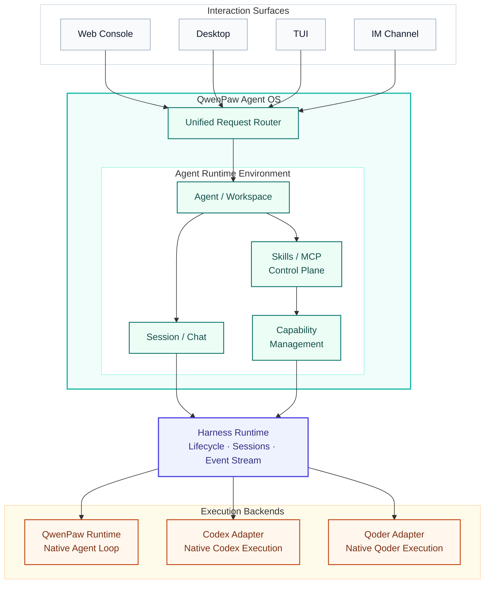
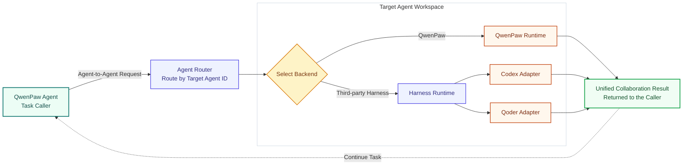
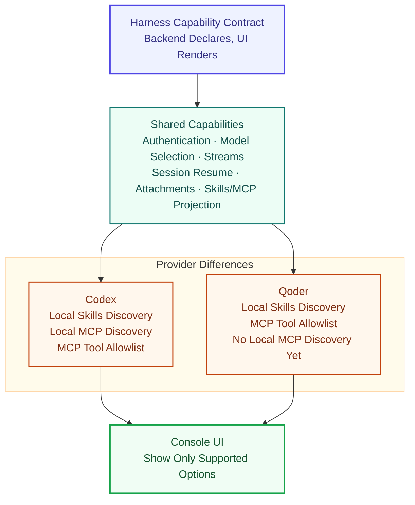
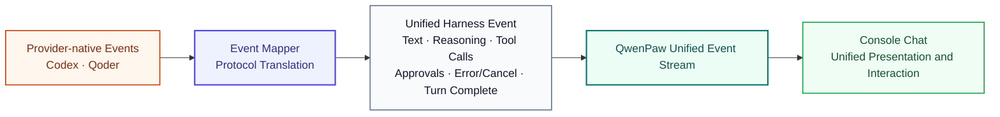
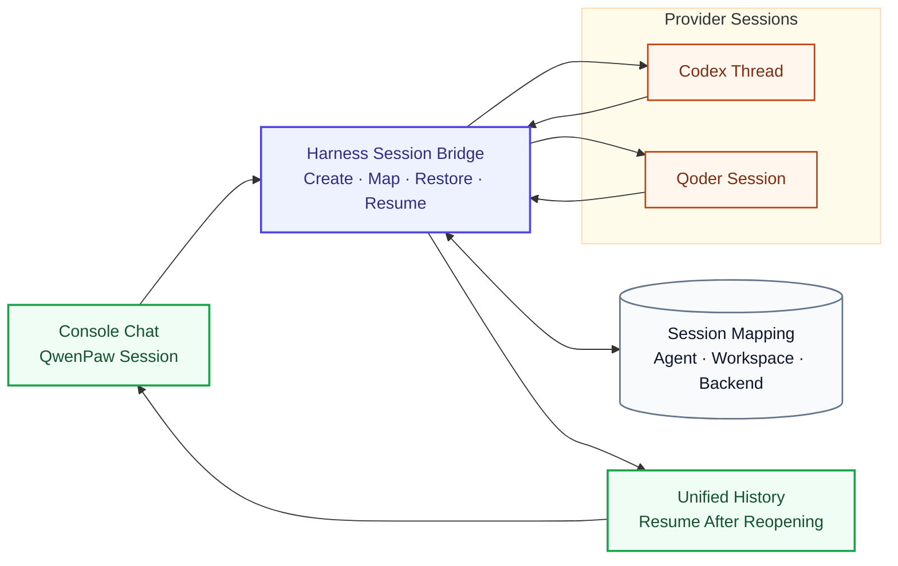
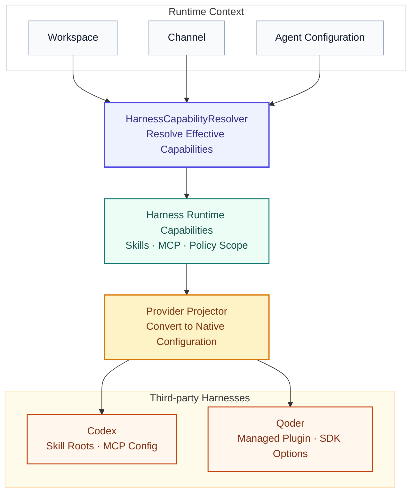
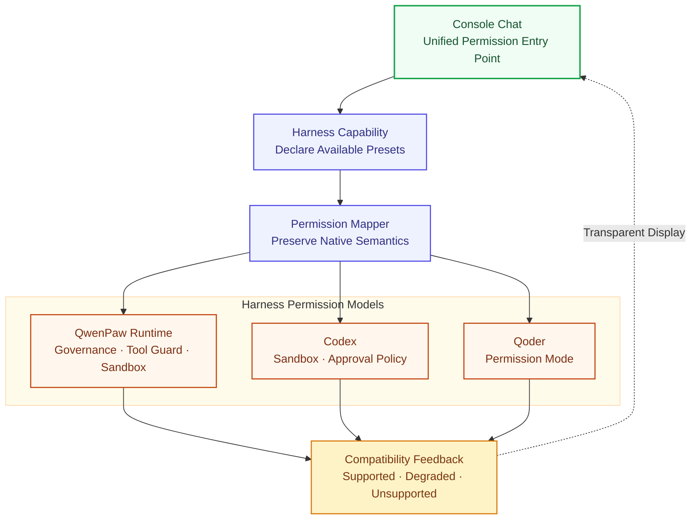
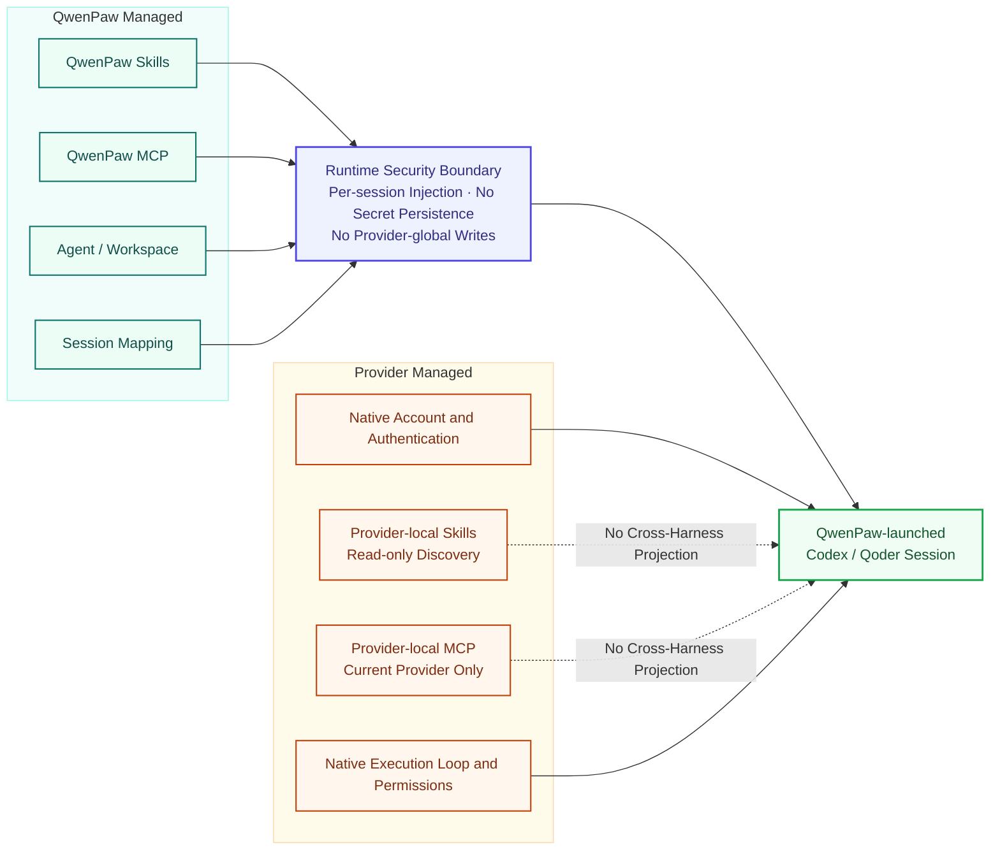

# Use Codex and Qoder in QwenPaw: Cross-Harness Agent OS

QwenPaw did not start out to build yet another chatbot. It set out to build an **Agent OS** that runs in your own environment.

A model determines how an agent thinks, but an agent that works over time also needs a workspace, files, sessions, Skills, external tools, permission boundaries, and interaction surfaces. QwenPaw organizes these pieces into a stable, transparent, and manageable environment so an agent can move beyond a single conversation and become part of a personal or team workflow.

But a real Agent OS should not run only one kind of agent.

Alongside the native QwenPaw agent runtime, you can now create **Codex** and **Qoder** agents in QwenPaw. They keep their native models, reasoning loops, tool execution, and permission systems while joining QwenPaw's agent management, workspace boundaries, chat interface, and Skills/MCP control plane.

You can talk to these third-party agents directly, or let a QwenPaw agent call them: send implementation work to Codex, ask Qoder for an independent review, then let the QwenPaw agent consolidate the results and keep the task moving.

This means you can select the right agent for each task without rebuilding the whole environment every time you switch harnesses.

---

## Part 1: What You Can Do

### Create a Codex or Qoder Agent in QwenPaw

When creating an agent from Agent Management, you can now choose between two execution backends:

- **QwenPaw native agent**: uses your configured model, Skills, tools, memory, and the QwenPaw Runtime;
- **Third-party agent**: uses an authorized external agent runtime, currently Codex or Qoder.

After you select a third-party agent, QwenPaw detects the runtime available on your machine. You can use the detected runtime or provide the full path to `codex`, `codex.exe`, `qodercli`, or `qodercli.exe`.

Codex supports ChatGPT OAuth, an API key, or an existing Codex CLI session. Qoder can use a Qoder account, PAT, or an existing CLI session. Authentication is shared on the device, while projects, workspaces, and conversations remain isolated per agent.


_Figure 1: Create a third-party agent, select Codex or Qoder, and complete runtime detection and account connection._

Once saved, the Codex or Qoder agent appears in the sidebar like any other QwenPaw agent. You do not need to open another terminal or leave the QwenPaw Console.

### Use Different Harnesses from the Same Chat Interface

Select a Codex or Qoder agent and send it a task directly from QwenPaw Chat.

For example, you can ask Codex:

```text
Read the current project, find the cause of intermittent login failures,
add regression tests, and fix the issue.
```

Or ask Qoder:

```text
Analyze this frontend project's build pipeline, identify why the initial
bundle is too large, and propose an optimization plan.
```

Even though different harnesses run underneath, the same interface lets you:

- read streamed text output;
- inspect reasoning exposed by the harness;
- follow tool calls and results;
- upload images and other attachments;
- respond to execution approvals;
- stop the current task;
- reopen and continue a previous session.


_Figure 2: A Codex agent calls Web Search in Console Chat while QwenPaw streams the execution process and result._

This is more than starting another process in the backend. It brings the execution of different agents back into the same Agent OS, with a shared agent model, session system, and interaction surface.

### Let a QwenPaw Agent Direct Codex and Qoder

Cross-harness support also enables another workflow: instead of switching agents manually, let a QwenPaw agent call third-party harness agents as the task requires.

After you enable multi-agent collaboration for a QwenPaw agent, it can discover available agents and send work to a target agent. The target may be another native QwenPaw agent or a third-party agent backed by Codex or Qoder.

For example, create three agents with distinct responsibilities:

| Agent        | Execution backend | Responsibility                                                  |
| ------------ | ----------------- | --------------------------------------------------------------- |
| Project lead | QwenPaw Runtime   | Understand requirements, delegate work, and consolidate results |
| Implementer  | Codex             | Read the project, modify code, and run tests                    |
| Reviewer     | Qoder             | Independently inspect the implementation, risks, and omissions  |

The user only needs to tell the project lead:

```text
Fix the concurrency issue in the login module, then ask the review agent
to inspect the final changes.
```

The QwenPaw agent can then:

1. discover the implementation and review agents;
2. send the problem context and acceptance criteria to the Codex agent;
3. collect the Codex result and collaboration session;
4. ask the Qoder agent for an independent review;
5. follow up or arrange fixes based on the review;
6. consolidate the implementation and review into a final response.

For a quick request, the project lead can wait for the target agent in real time. Longer implementation, analysis, or batch work can run in the background without blocking the current conversation. A later call can continue the existing collaboration session instead of explaining the task again.

The entire workflow stays inside QwenPaw. The user describes the goal, watches progress, and handles approvals in Console Chat—without entering a terminal. Codex and Qoder are no longer only agents a user can switch to manually; they become specialized execution units a QwenPaw agent can coordinate during a larger task.

### Choose the Model, Reasoning Effort, and Execution Permissions

Each harness exposes its own models and execution settings. QwenPaw does not hide these differences. It gives them a consistent place in the Chat toolbar.

For harnesses that support model discovery, you can select the model used by the current agent and adjust reasoning effort. The setting belongs to the agent and takes effect on the next turn.

Execution permissions are also presented according to native harness capabilities.

Typical Codex presets include:

| Permission mode    | Best for                                                           |
| ------------------ | ------------------------------------------------------------------ |
| Read only          | Analyze files without modifying them                               |
| Ask before changes | Allow workspace changes and ask before elevated operations         |
| Workspace access   | Modify the workspace without repeated prompts for ordinary actions |
| Full access        | Unrestricted local execution in a trusted workspace                |

Typical Qoder presets include:

| Permission mode    | Best for                                             |
| ------------------ | ---------------------------------------------------- |
| Plan only          | Analyze and plan without changing files              |
| Ask before actions | Ask before file changes and command execution        |
| Accept edits       | Allow file edits while preserving other safeguards   |
| Automatic          | Let Qoder decide which safe actions can run directly |
| Full access        | Skip permission checks in a trusted workspace        |


_Figure 3: Select the model and reasoning effort for a Codex agent in Console Chat; the settings apply on the next turn._

QwenPaw provides a unified management surface without inventing a false universal permission model. Users see the capabilities each harness actually supports.

### Third-Party Agents Can Inherit QwenPaw Skills

Working styles may differ, but common capabilities should not need to be rebuilt.

For QwenPaw-managed Skills, the system resolves the capabilities enabled for the current agent, workspace, and channel. When Codex or Qoder creates a new session, those Skills are injected through the harness's native mechanism.

For example, a team code-review Skill might require the agent to:

- prioritize security and data-consistency issues;
- attach a file and line number to every finding;
- separate blocking issues from improvement suggestions;
- run specified tests after making changes.

New Codex and Qoder sessions can both receive that QwenPaw-managed workflow without maintaining two copies of the Skill.

The Skills page separates capabilities by ownership:

- **QwenPaw managed**: create, edit, enable, disable, or delete Skills, then project them at runtime into supported third-party agents;
- **Third-party agent Skills**: discover names, descriptions, sources, and scopes from the current harness and display them as read-only.

Provider-native Skills remain owned by the provider. They are not automatically copied into another harness or presented as QwenPaw-managed capabilities.


_Figure 4: The Skills page separates editable QwenPaw-managed capabilities from read-only Skills exposed by the third-party agent._

### MCP Configuration Can Follow the Agent Too

MCP uses the same unified control plane.

An MCP server configured and enabled in QwenPaw can be converted into the native configuration for a new Codex or Qoder session. Users do not need to maintain several configuration files or copy the same credential into multiple global directories.

At the same time, QwenPaw clearly distinguishes capability ownership:

| MCP source                | Management                            | Scope                                       |
| ------------------------- | ------------------------------------- | ------------------------------------------- |
| QwenPaw managed           | Editable and configurable             | Projected into supported third-party agents |
| Codex local configuration | Read-only discovery                   | Codex only                                  |
| Qoder local configuration | Depends on provider discovery support | Qoder only                                  |

QwenPaw-managed MCP is shareable. Provider-local MCP remains private to that provider. Both can appear on one page without being treated as the same thing.


_Figure 5: The MCP page separates centrally managed QwenPaw configuration from read-only Codex-local MCP and makes their scopes explicit._

### Choose an Agent Without Rebuilding the Environment

The immediate result of cross-harness support is summarized below:

| Capability                        | QwenPaw native     | Codex               | Qoder               |
| --------------------------------- | ------------------ | ------------------- | ------------------- |
| QwenPaw Chat                      | Supported          | Supported           | Supported           |
| Isolated agent workspace          | Supported          | Supported           | Supported           |
| Model selection                   | Supported          | Supported           | Supported           |
| Reasoning stream                  | Supported          | Supported           | Supported           |
| Tool-event stream                 | Supported          | Supported           | Supported           |
| Session resume                    | Supported          | Supported           | Supported           |
| QwenPaw Skills                    | Native             | Runtime inheritance | Runtime inheritance |
| QwenPaw MCP                       | Native             | Runtime inheritance | Runtime inheritance |
| Execution permissions             | QwenPaw governance | Codex-native policy | Qoder-native policy |
| Callable by another QwenPaw agent | Supported          | Supported           | Supported           |

Users can choose a different agent for each task without finding another interface, creating another workspace, or rebuilding common capabilities.

---

## Part 2: Advanced—How Cross-Harness Support Works

### Why an Agent OS Must Support Multiple Harnesses

QwenPaw Agent OS manages the environment in which an agent runs.

The Workspace provides isolation. Skills and MCP provide capabilities. Sessions preserve interaction state. Governance and Sandbox constrain resource access. Web, Desktop, TUI, CLI, and messaging channels provide different ways into the same system.

A harness answers a different question: **how does the agent reason and execute?**

It organizes context, drives the model, invokes tools, handles approvals, manages the execution loop, and emits events. The native QwenPaw Runtime, Codex, and Qoder can all fill that role, but each has different model APIs, session protocols, tool events, and permission systems.

If the Agent OS remains permanently tied to one harness, it is still an agent application with a large collection of surrounding features. To become a true operating environment, QwenPaw has to decouple its resources and control plane from the concrete execution engine.

Cross-harness support is therefore not about placing several agents in one menu. It is about letting the Agent OS provide a stable environment while each harness retains its native strengths.

### Overall Architecture: Agent OS Above, Harnesses as Execution Backends

A cross-harness request passes through the following layers:



Requests enter through a QwenPaw surface and are routed to the target agent's Workspace. The Workspace reads the agent configuration and either uses the native QwenPaw Runtime or delegates execution to the third-party Harness Runtime.

For a third-party harness, the corresponding Adapter handles more than process startup. It covers authentication status, model discovery, sessions, attachments, commands, event mapping, capability projection, and error handling.

As a result, Chat and Workspace do not need Codex- or Qoder-specific branches throughout the product. A future harness can reuse the same upper-level flow.

### Agents Can Call Harnesses Too

When a user selects Codex or Qoder in the UI, Chat sends the request directly to the target agent's Workspace. Multi-agent collaboration reuses the same Workspace route, except the caller is another agent.



The system routes a collaboration request by target agent ID. The target Workspace loads its own configuration. A `qwenpaw` backend enters the native Runtime; a `codex` or `qoder` backend enters the Harness Runtime and its Adapter.

The caller does not need to understand which harness the target uses. It selects a collaborator from the agent's name, description, and capabilities, then sends work through the common Agent-to-Agent protocol.

Quick consultations can wait for a reply. Long-running work can execute in the background while the caller continues with other tasks. Reusing the collaboration session preserves multi-turn context between the two agents. Approval requests also retain the root-session context so a third-party harness can return a required confirmation to the interaction that initiated the work.

This extends QwenPaw collaboration from communication among identical runtimes to an Agent OS coordinating several intelligent execution engines.

### Capability Declarations Instead of Provider-Specific UI Logic

Harnesses do not all support the same features. Some discover models and reasoning effort. Some discover local Skills but do not expose a stable MCP query API.

Each harness therefore declares capabilities such as authentication, model selection, reasoning and tool streams, session resume, attachments, QwenPaw Skills/MCP projection, provider-local discovery, MCP allowlists, commands, and approval presets.

The frontend and Workspace use these declarations rather than hard-coding behavior based on `codex` or `qoder`. This avoids reducing every harness to a lowest common denominator and makes unsupported capabilities explicit.



### One Event Language for Different Harnesses

Codex and Qoder use different streaming protocols for text, reasoning, tool calls, approvals, and errors. QwenPaw Chat should not need a separate message system for every harness.

Adapters map provider-native events into a common Harness Event model:



QwenPaw translates these events into its established streaming response protocol for Chat, Desktop, and other surfaces. The common layer does not standardize how an agent thinks; it standardizes how the Agent OS observes and presents execution.

### Session Bridging Across Two Session Identities

A third-party harness has its own Session or Thread identity. QwenPaw also has a Session used for chat history and channel routing.

Harness Session Bridge maintains the relationship. It creates provider sessions, stores the mapping, restores provider history when Chat reopens, resumes a provider session on later turns, routes cancellation and approvals to the right execution, and isolates state by agent and Workspace.



The user can reopen a Codex or Qoder conversation from the QwenPaw session list instead of starting from a fresh external process every time.

### Skills and MCP: Common Semantics, Native Projection

QwenPaw remains the control plane for Skills and MCP without requiring every harness to share the same configuration format.

Before creating a third-party harness session, `HarnessCapabilityResolver` resolves the capabilities enabled for the current Workspace, channel, and agent configuration:



The Resolver returns a provider-neutral runtime capability model. Each Adapter converts it into native harness configuration.

#### Codex: Inject Skill Roots and MCP Configuration Directly

Codex app-server supports extra Skill roots. QwenPaw can provide effective Skill directories directly without copying files, writing `.agents/skills`, or changing the user's global Codex configuration. Clients are isolated by a capability fingerprint so different runtime capability sets do not leak into each other.

MCP configuration is injected when QwenPaw starts the Codex app-server. Only the Codex process launched by QwenPaw receives these capabilities; opening Codex independently does not expose QwenPaw's runtime injection.

#### Qoder: Materialize a Managed Local Plugin

Qoder can restrict allowed Skill names but cannot accept an arbitrary Skill search root. QwenPaw therefore materializes a managed local Plugin for the current capability fingerprint:

```text
<workspace>/.qwenpaw/harness/qoder/skills/<fingerprint>/
  .qoder-plugin/plugin.json
  skills/
    <skill-name>/SKILL.md
```

QwenPaw copies files rather than creating symlinks for consistent behavior on Windows, Linux, and macOS. It then injects the Plugin and Skill allowlist through the Qoder SDK. QwenPaw-managed MCP is passed through Qoder Agent Options without writing the user's global Qoder configuration.

The common layer standardizes capability semantics. The Adapter respects each harness's native integration mechanism.

### Permissions Are Mapped, Not Artificially Flattened

The native QwenPaw Runtime, Codex, and Qoder have different permission models:

- QwenPaw uses Governance, Tool Guard, and Sandbox;
- Codex combines Sandbox and Approval Policy;
- Qoder uses its own Permission Mode.

These models cannot be compressed into one switch without losing meaning. QwenPaw therefore provides one place to select permissions, then maps that selection into the harness-native setting. Capability declarations make unsupported or degraded behavior visible.



Agent OS consistency does not mean hiding differences. It means making them visible, understandable, and controllable from one place.

### Capability Ownership and Security Boundaries

Cross-harness support does not mean QwenPaw takes ownership of every provider setting.

QwenPaw owns agents, Workspaces, QwenPaw Skills, QwenPaw MCP, backend selection, capability presentation, the common Chat/event surface, and the mapping between QwenPaw and provider sessions.

Providers own native accounts and authentication, provider-local Skills and MCP, native execution loops, permissions, and capability limits.

Runtime projection follows strict boundaries: it does not change `~/.codex/config.toml`, `~/.qoder`, or other global provider configuration; QwenPaw capabilities enter only sessions launched by QwenPaw; provider-local capabilities are read-only and do not automatically cross harnesses; plaintext MCP credentials are not written into agent configuration, session files, or logs; capability fingerprints contain no plaintext secrets; and configuration changes primarily apply to new sessions.



### From One Runtime to Multiple Intelligent Execution Engines

The most visible result of cross-harness support is that users can run Codex and Qoder inside QwenPaw while QwenPaw-managed Skills and MCP follow the agent into its new execution environment.

The more important result is architectural:

- upper-level surfaces no longer bind to one model;
- a Workspace no longer binds to one Agent Loop;
- the capability control plane serves several execution backends;
- QwenPaw agents can call and coordinate different harnesses by task;
- specialized harnesses retain their native strengths;
- future harnesses can join through an Adapter and capability declaration.

Different harnesses will continue to specialize. Some will be better at coding, others at research, data, design, or enterprise workflows.

QwenPaw does not need to reimplement every agent or define the only correct agent. It aims to provide a stable operating system where different agents can find the right place to run.

> Agents can differ, and working styles can differ, without rebuilding the working environment every time.

That is QwenPaw's next step from agent to Agent OS—and from one runtime to multiple harnesses.
