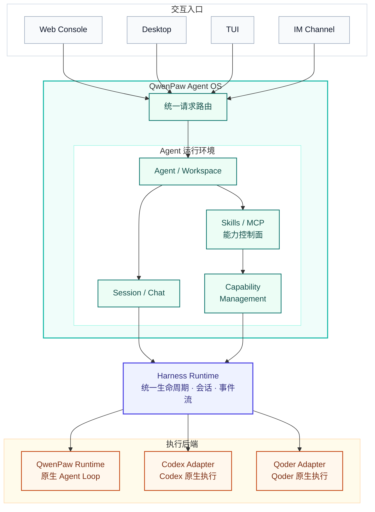
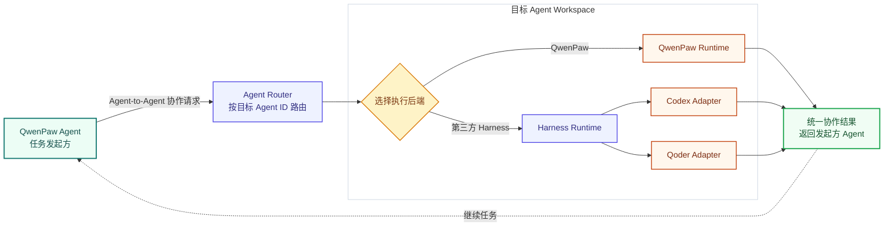
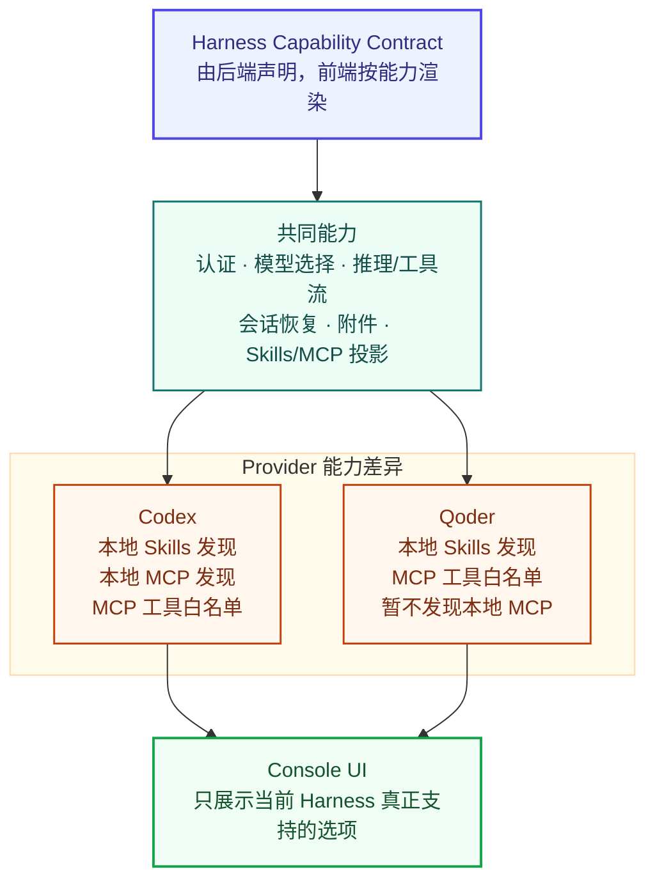
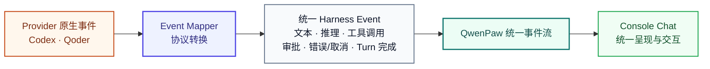
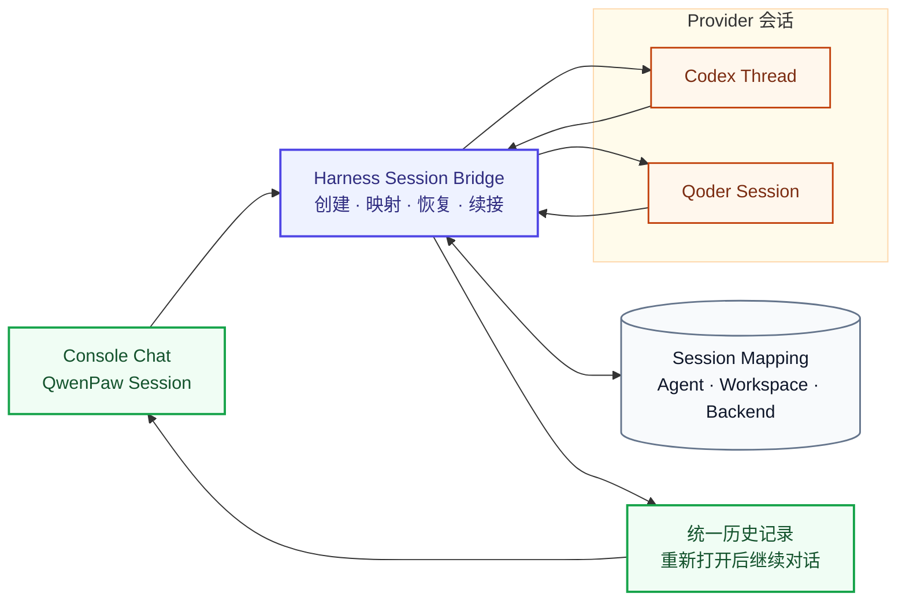
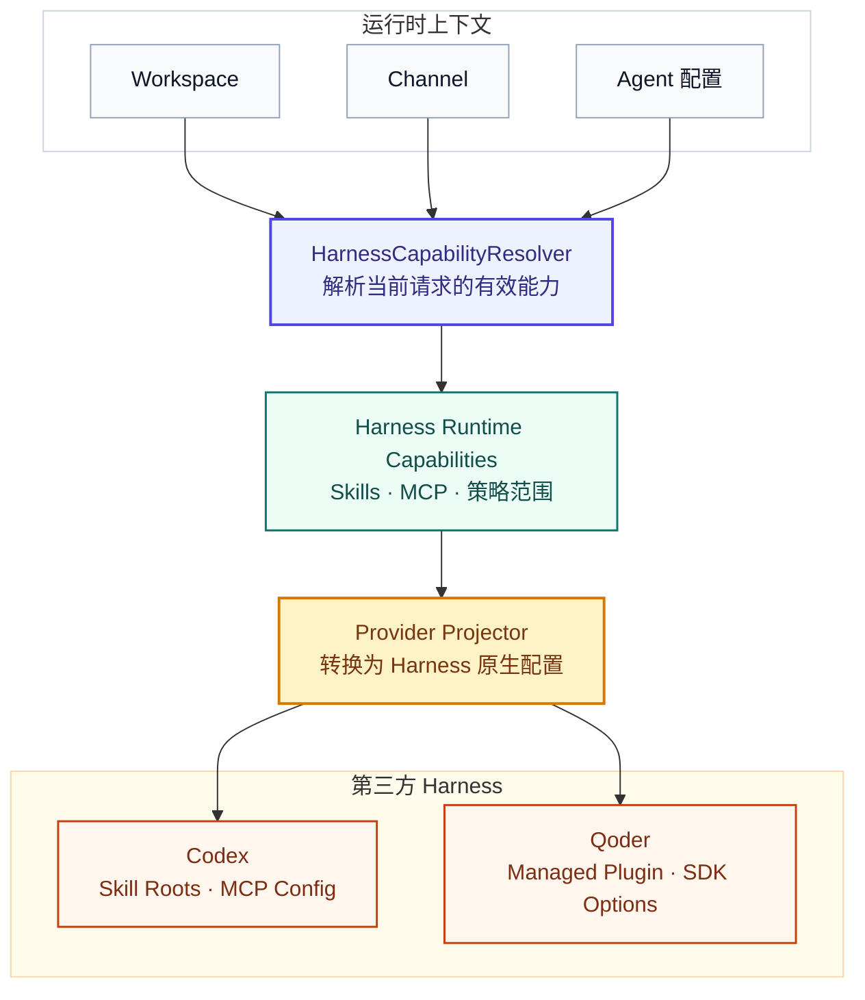
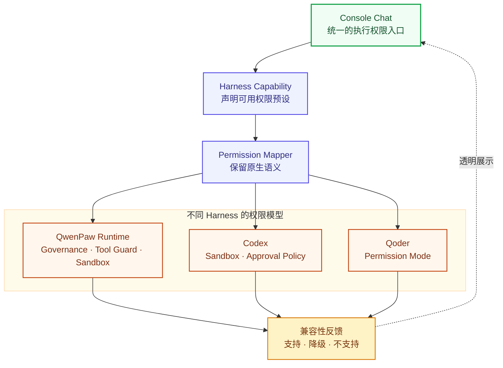
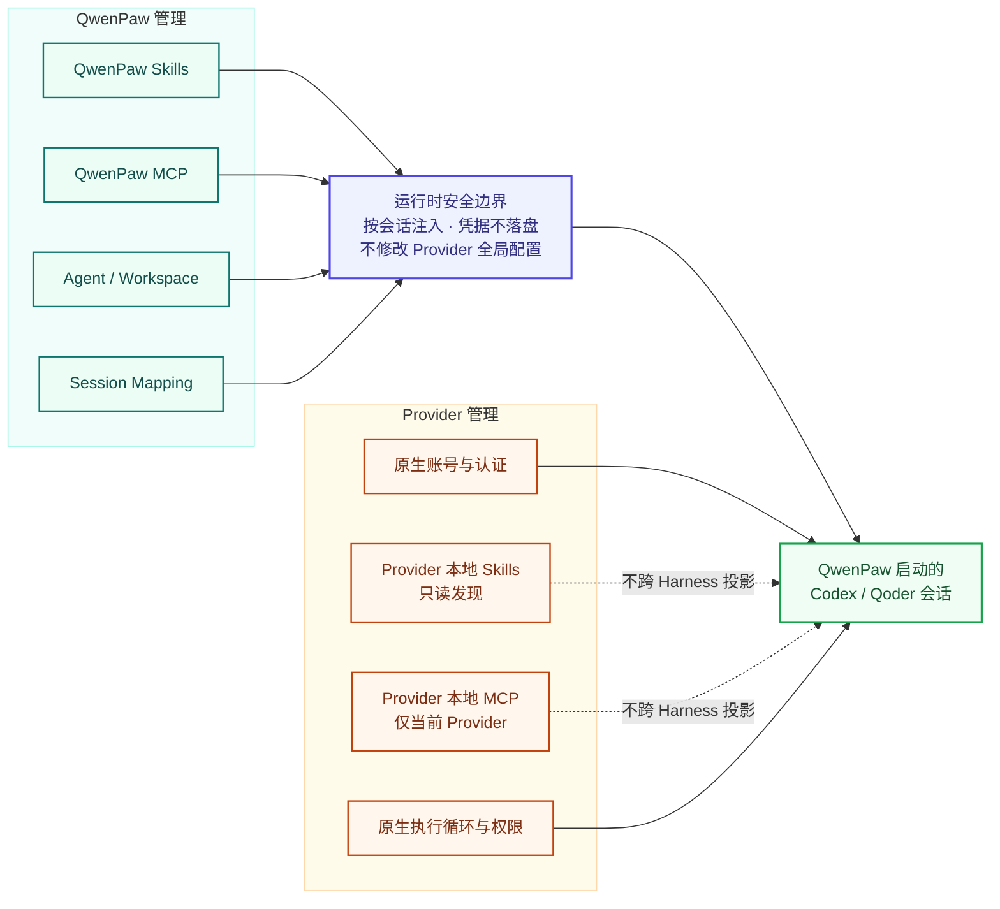

# 在 QwenPaw 里使用 Codex 和 Qoder：Agent OS 的跨 Harness 实践

QwenPaw 的起点，不是构建另一个聊天机器人，而是构建一个运行在用户自己环境中的 **Agent OS**。

模型决定 Agent 如何思考，但一个能够长期工作的 Agent，还需要自己的工作区、文件、会话、Skills、外部工具、权限边界和交互入口。QwenPaw 希望把这些部分组织成稳定、透明、可管理的运行环境，让 Agent 不只是存在于一次对话里，而是能够真正进入个人电脑和团队工作流。

但一个真正的 Agent OS，不应该只运行一种 Agent。

现在，除了 QwenPaw 原生 Agent 运行时，你还可以在 QwenPaw 中创建 **Codex** 或 **Qoder** Agent。它们继续使用各自原生的模型、推理循环、工具执行和权限机制，同时接入 QwenPaw 提供的 Agent 管理、工作区边界、聊天界面以及 Skills/MCP 能力控制面。

你既可以直接与这些第三方 Agent 对话，也可以让一个 QwenPaw Agent 主动调用它们：把代码实现交给 Codex，把独立复核交给 Qoder，再由 QwenPaw Agent 汇总结果并继续推进任务。

这意味着，你可以根据任务选择更合适的 Agent，而不必每换一种 Harness，就重新搭建一次工作环境。

---

## 第一部分：现在可以做什么

### 在 QwenPaw 中创建 Codex 或 Qoder Agent

在智能体管理页面创建 Agent 时，现在可以选择两类执行后端：

- **QwenPaw 原生智能体**：使用已配置的模型、Skills、工具、记忆和 QwenPaw Runtime；
- **第三方智能体**：使用已授权的外部 Agent Runtime，目前支持 Codex 和 Qoder。

选择第三方智能体后，QwenPaw 会检测本机可用的 Runtime。你可以使用自动检测结果，也可以手动指定 `codex`、`codex.exe`、`qodercli` 或 `qodercli.exe` 的完整路径。

对于 Codex，可以通过 ChatGPT OAuth、API Key 或已有的 Codex CLI 认证状态连接；对于 Qoder，则可以使用 Qoder 账户、PAT 或已有的 CLI 认证。认证在本机共享，但 Agent 的工作区、项目和会话仍然保持隔离。


_图 1：创建第三方 Agent，选择 Codex 或 Qoder，并完成 Runtime 检测与账号连接。_

保存后，这个 Codex 或 Qoder Agent 会和其他 QwenPaw Agent 一样出现在侧边栏中。你不需要打开另一个终端，也不需要离开 QwenPaw 的控制台。

### 在同一个聊天界面中使用不同 Harness

选择一个 Codex 或 Qoder Agent 后，就可以直接在 QwenPaw Chat 中发送任务。

例如，你可以让 Codex：

```text
阅读当前项目，定位用户登录偶发失败的原因，补充回归测试并修复问题。
```

也可以让 Qoder：

```text
分析这个前端项目的构建流程，找出首屏资源过大的原因并给出优化方案。
```

虽然底层运行的是不同 Harness，但用户仍然可以在统一界面中：

- 查看流式文本输出；
- 查看 Harness 提供的推理过程；
- 跟踪工具调用及其结果；
- 上传图片和其他附件；
- 处理执行审批；
- 中断当前任务；
- 重新打开并继续历史会话。


_图 2：Codex Agent 在 Console Chat 中调用 Web Search，并将执行过程和结果流式返回。_

这层体验很重要。跨 Harness 并不只是后端能够启动另一个进程，而是不同 Agent 的执行过程能够被带回同一个 Agent OS 中，继续使用统一的 Agent、会话和交互入口。

### 让 QwenPaw Agent 指挥 Codex 和 Qoder

跨 Harness 还有另一种使用方式：不是用户手动切换 Agent，而是让一个 QwenPaw Agent 根据任务主动调用第三方 Harness Agent。

为 QwenPaw Agent 启用“多智能体协作”能力后，它可以先查询当前系统中可用的 Agent，再向目标 Agent 发起协作请求。目标 Agent 可以是另一个 QwenPaw 原生 Agent，也可以是以 Codex 或 Qoder 为执行后端的第三方 Agent。

例如，可以创建三个职责不同的 Agent：

| Agent      | 执行后端        | 职责                         |
| ---------- | --------------- | ---------------------------- |
| 项目负责人 | QwenPaw Runtime | 理解需求、拆分任务并汇总结果 |
| 代码实现   | Codex           | 阅读项目、修改代码并运行测试 |
| 代码复核   | Qoder           | 独立检查实现、风险和遗漏     |

用户只需要对“项目负责人”说：

```text
修复登录模块的并发问题，并让代码复核 Agent 检查最终改动。
```

接下来，QwenPaw Agent 可以：

1. 查询可用 Agent，找到负责实现和复核的目标；
2. 把问题背景与验收要求发送给 Codex Agent；
3. 获取 Codex 的执行结果和会话标识；
4. 把改动交给 Qoder Agent 进行独立复核；
5. 根据复核意见继续追问或安排修复；
6. 汇总执行与复核结果，向用户返回最终答复。

简单请求可以由项目负责人实时等待目标 Agent 回复；耗时较长的实现、分析或批量任务则可以转为后台执行，不阻塞当前对话。后续再次调用同一个 Agent 时，还可以继续已有协作会话，不必重新解释整个任务。

整个过程都在 QwenPaw 内部完成。用户只需要在 Console Chat 中描述目标、查看进度并处理必要的审批，不需要进入终端。关键变化是：Codex 和 Qoder 不再只是两个可以手动切换的聊天对象，也可以成为 QwenPaw Agent 完成复杂任务时调度的专业执行单元。

### 按任务选择模型、推理强度和执行权限

不同 Harness 拥有自己的模型与执行选项。QwenPaw 不会把这些差异藏起来，而是在聊天工具栏中提供统一的设置位置。

对于支持模型发现的 Harness，你可以直接选择当前 Agent 使用的模型，并调整推理强度。相关设置属于当前 Agent，并从下一轮对话开始生效。

执行权限同样会根据 Harness 的原生能力展示。

Codex 当前提供的典型预设包括：

| 权限模式   | 适合场景                               |
| ---------- | -------------------------------------- |
| 只读       | 只分析文件，不进行修改                 |
| 变更前询问 | 允许工作区修改，越权操作前请求确认     |
| 工作区访问 | 可直接修改工作区，不对普通操作重复询问 |
| 完全访问   | 在可信工作区中进行不受限的本地执行     |

Qoder 当前提供的典型预设包括：

| 权限模式   | 适合场景                              |
| ---------- | ------------------------------------- |
| 仅规划     | 分析问题并制定方案，不修改文件        |
| 变更前询问 | 文件修改和命令执行前请求确认          |
| 接受编辑   | 允许文件编辑，同时保留其他安全检查    |
| 自动判断   | 由 Qoder 判断哪些安全操作可以直接执行 |
| 完全访问   | 在可信工作区中跳过权限检查            |


_图 3：在 Console Chat 中为 Codex Agent 选择模型和推理强度，设置从下一轮对话开始生效。_

QwenPaw 提供的是统一的管理入口，而不是用一套虚假的权限名称抹平所有差异。用户看到的仍然是每个 Harness 真正支持的能力。

### QwenPaw Skills 可以被第三方 Agent 继承

工作方式可以不同，但常用能力不应该每次重建。

对于 QwenPaw 管理的 Skills，系统会根据当前 Agent、工作区和频道计算本次会话真正启用的能力。当 Codex 或 Qoder 创建新会话时，这些 Skills 会通过 Harness 支持的原生方式注入。

例如，你可以在 QwenPaw 中启用一套团队代码审查 Skill，里面约定：

- 优先检查安全和数据一致性问题；
- 每条问题必须附带文件和行号；
- 区分阻塞问题与改进建议；
- 修改后必须运行指定测试。

随后，无论选择 Codex 还是 Qoder，新会话都可以获得这套由 QwenPaw 管理的工作规范，而不需要分别维护两份 Skill。

Skills 页面会按管理权分组：

- **QwenPaw 管理**：可以创建、编辑、启停和删除，并在运行时投影到支持的第三方 Agent；
- **第三方智能体技能**：从当前 Harness 发现，只读展示名称、描述、来源和作用范围。

Provider 自己的 Skills 仍然属于 Provider。它们不会被自动复制到其他 Harness，也不会伪装成 QwenPaw 管理的能力。


_图 4：Skills 页面区分 QwenPaw 管理的可编辑能力与第三方 Agent 提供的只读 Skills。_

### MCP 配置也可以跟随 Agent 进入不同 Harness

MCP 同样由统一控制面管理。

在 QwenPaw 中配置并启用的 MCP 服务，可以在创建 Codex 或 Qoder 会话时转换为对应 Harness 的原生配置。用户不需要再手动编辑多份配置文件，也不需要把同一份凭据复制到多个全局目录。

同时，QwenPaw 会明确区分能力来源：

| MCP 来源       | 管理方式                   | 作用范围                   |
| -------------- | -------------------------- | -------------------------- |
| QwenPaw 管理   | 可编辑、可启停             | 可投影到支持的第三方 Agent |
| Codex 本地配置 | 只读发现                   | 仅 Codex                   |
| Qoder 本地配置 | 取决于 Provider 的发现能力 | 仅 Qoder                   |

QwenPaw 管理的 MCP 是可共享能力；Provider 本地 MCP 则是该 Provider 的私有能力。两者可以在同一个页面中展示，但不会被混为一谈。


_图 5：MCP 页面区分 QwenPaw 统一管理的配置与 Codex 本地只读 MCP，并明确各自的作用范围。_

### 选择 Agent，不再重建整个工作环境

跨 Harness 带来的直接变化，可以概括为下表：

| 能力                      | QwenPaw 原生 | Codex          | Qoder          |
| ------------------------- | ------------ | -------------- | -------------- |
| QwenPaw Chat              | 支持         | 支持           | 支持           |
| 独立 Agent 工作区         | 支持         | 支持           | 支持           |
| 模型选择                  | 支持         | 支持           | 支持           |
| 推理过程展示              | 支持         | 支持           | 支持           |
| 工具调用展示              | 支持         | 支持           | 支持           |
| 会话恢复                  | 支持         | 支持           | 支持           |
| QwenPaw Skills            | 原生使用     | 运行时继承     | 运行时继承     |
| QwenPaw MCP               | 原生使用     | 运行时继承     | 运行时继承     |
| 执行权限                  | QwenPaw 治理 | Codex 原生策略 | Qoder 原生策略 |
| 被其他 QwenPaw Agent 调用 | 支持         | 支持           | 支持           |

用户仍然可以根据任务选择不同 Agent，但不必为每一种 Agent 重新寻找入口、建立工作区和配置常用能力。

---

## 第二部分：进阶——跨 Harness 是如何实现的

### 为什么 Agent OS 必须支持多种 Harness

QwenPaw Agent OS 管理的是 Agent 的运行环境。

在这个环境中，Workspace 提供隔离边界；Skills 和 MCP 提供能力；Session 保存交互状态；Governance 和 Sandbox 约束资源访问；Web、桌面端、TUI、CLI 和聊天频道则提供不同入口。

Harness 解决的是另一个问题：**Agent 如何思考和执行。**

它负责组织上下文、驱动模型、调用工具、处理审批、管理执行循环并输出事件。QwenPaw 原生 Runtime、Codex 和 Qoder 都可以承担这个角色，但它们拥有不同的模型接口、会话协议、工具事件和权限系统。

如果 Agent OS 与其中一种 Harness 永久绑定，它最终仍然只是一个拥有大量外围功能的 Agent 应用。要成为真正的运行环境，QwenPaw 需要将自己的资源和控制面与具体执行内核解耦。

因此，跨 Harness 的目标并不是把多个 Agent 放进同一个菜单，而是：

> 让 Agent OS 提供稳定的运行环境，让不同 Harness 保留各自的执行优势。

### 整体架构：Agent OS 在上，Harness 作为执行后端

跨 Harness 之后，一次请求大致经过以下层次：



用户请求首先进入 QwenPaw 的统一入口，并被路由到目标 Agent 的 Workspace。Workspace 根据 Agent 配置判断应该使用 QwenPaw 原生 Runtime，还是交给第三方 Harness Runtime。

对于第三方 Harness，请求会继续进入对应 Adapter。Adapter 不只是启动进程，还需要负责认证状态、模型发现、会话、附件、命令、事件映射、能力投影和错误处理。

这样，上层 Chat 和 Workspace 不需要在每个业务入口中分别实现 Codex、Qoder 逻辑。未来接入新的 Harness 时，也可以继续复用同一套上层流程。

### 不只是人调用 Harness，Agent 也可以调用 Harness

当用户在界面中选择 Codex 或 Qoder 时，请求会从 Chat 直接进入目标 Agent 的 Workspace。多智能体协作复用了同一条 Workspace 路由，只是请求的发起者变成了另一个 Agent。



系统会根据目标 Agent ID 将协作请求发送给对应 Agent。目标 Workspace 加载自己的 Agent 配置：如果后端是 `qwenpaw`，请求进入原生 Runtime；如果后端是 `codex` 或 `qoder`，请求进入 Harness Runtime 和对应 Adapter。

调用方不需要理解目标 Agent 使用的是哪一种 Harness。它只需要根据 Agent 的名称、描述和能力选择合适的协作者，并通过统一的 Agent-to-Agent 协议发送任务。

对于简单咨询，调用方可以实时等待回复；对于耗时任务，则可以提交后台任务，继续处理其他工作并在完成后获取结果。通过复用协作会话，两个 Agent 之间还可以保持多轮上下文。

跨 Session 的审批会保留根会话信息。第三方 Harness 在执行过程中需要用户确认时，审批可以回到最初发起任务的交互上下文。

这一层让 QwenPaw 的多智能体协作从“多个相同 Runtime 之间互相通信”，扩展为“一个 Agent OS 调度多种智能执行内核”。

### 用能力声明替代 Provider 硬编码

不同 Harness 支持的能力并不完全相同。例如，有些 Harness 支持模型发现，有些支持推理强度，有些能够发现本地 Skills，但未必提供稳定的 MCP 查询接口。

因此，每个 Harness 都会声明自己的能力，包括：

- 是否支持认证；
- 是否支持模型选择与推理强度；
- 是否输出推理流和工具流；
- 是否支持会话恢复和附件；
- 是否支持 QwenPaw Skills/MCP 投影；
- 是否能够发现 Provider 本地 Skills/MCP；
- 是否支持 MCP 工具白名单；
- 支持哪些命令和执行权限预设。

前端和 Workspace 根据能力声明工作，而不是看到 `codex` 或 `qoder` 就进入不同的硬编码分支。

这既避免了所有 Harness 被压缩成最低公分母，也让不支持的能力能够被明确显示，而不是静默失效。



### 统一事件流：让不同 Harness 说同一种语言

Codex 与 Qoder 的流式事件协议不同。它们对文本、推理、工具调用、审批和错误都有自己的表达方式，但 QwenPaw Chat 不能为每种 Harness 重新实现一套消息系统。

Adapter 因此会将 Provider 原生事件映射成统一的 Harness Event：



QwenPaw 再把这些事件转换为现有的流式消息协议，发送到 Chat、桌面端或其他入口。

统一的不是 Agent 内部如何思考，而是 Agent OS 如何观察和呈现执行过程。

### 会话桥接：同时维护两套 Session 身份

第三方 Harness 通常拥有自己的 Session 或 Thread 标识，QwenPaw 也有用于聊天、历史记录和频道路由的 Session。

Harness Session Bridge 负责维护两者的关系：

- 为新的 QwenPaw Session 创建 Provider Session；
- 保存 QwenPaw Session 与 Provider Session 的映射；
- 重新打开聊天时恢复 Provider 历史；
- 在后续 Turn 中续接原来的 Provider Session；
- 将取消和审批路由到正确的执行实例；
- 隔离不同 Agent、Workspace 和 Session 的状态。

这使得用户可以从 QwenPaw 的会话列表重新进入一次 Codex 或 Qoder 对话，而不是每次都从一个全新的外部进程开始。



### Skills 与 MCP：统一语义，原生投影

QwenPaw 继续作为 Skills 和 MCP 的统一控制面，但不会要求所有 Harness 使用完全相同的配置格式。

在创建第三方 Harness 会话前，`HarnessCapabilityResolver` 会根据 Workspace、频道和当前配置解析有效能力：



Resolver 返回的是与 Provider 无关的运行时能力模型。每个 Adapter 再把它转换成 Harness 原生配置。

#### Codex：直接注入 Skill Roots 和 MCP 配置

Codex app-server 支持设置额外的 Skill Roots。QwenPaw 可以直接把有效 Skill 目录交给 Codex：

- 不复制 Skill 文件；
- 不写入工作区的 `.agents/skills`；
- 不修改用户的全局 Codex 配置；
- 根据能力指纹隔离不同的 Runtime 能力集合。

MCP 则在启动 Codex app-server 时通过会话配置注入。只有由 QwenPaw 启动的 Codex 进程能够获得这些能力，用户独立打开 Codex 时不会看到 QwenPaw 的运行时注入。

#### Qoder：转换成受管理的本地 Plugin

Qoder 的 Skill 接口能够限制允许调用的名称，但不能直接指定任意 Skill 搜索目录。因此，QwenPaw 会根据当前能力生成一个受管理的本地 Plugin：

```text
<workspace>/.qwenpaw/harness/qoder/skills/<fingerprint>/
  .qoder-plugin/plugin.json
  skills/
    <skill-name>/SKILL.md
```

生成过程中使用文件复制而不是软链接，以保持 Windows、Linux 和 macOS 的一致性。随后，QwenPaw 通过 Qoder SDK 的 Plugin 与 Skill Allowlist 将能力注入会话。

QwenPaw MCP 则通过 Qoder Agent Options 传递给 Qoder SDK，同样不会写入用户的全局 Qoder 配置。

这种设计的关键不是让 Codex 和 Qoder 的底层实现变得一样，而是：

> 公共层统一能力语义，Adapter 负责尊重 Harness 的原生接入方式。

### 权限不是强行统一，而是映射与透明展示

QwenPaw 原生 Runtime、Codex 和 Qoder 拥有不同的权限模型：

- QwenPaw 原生 Runtime 使用 Governance、Tool Guard 和 Sandbox；
- Codex 使用 Sandbox 与 Approval Policy 的组合；
- Qoder 使用自己的 Permission Mode。

这些模型无法在不损失语义的情况下被压缩成一个简单开关。因此，QwenPaw 采用两层设计：

1. 在统一位置展示和选择执行权限；
2. 将选择结果转换为 Harness 的原生设置。

如果某个 Harness 不支持特定策略粒度，QwenPaw 会通过 Capability 明确展示限制，而不会暗示策略已经完整生效。

Agent OS 的统一，不是隐藏差异，而是让差异在同一个控制面中清晰、可见、可选择。



### 能力归属与安全边界

跨 Harness 并不意味着 QwenPaw 接管 Provider 的所有配置。系统始终保留清晰的能力归属。

QwenPaw 管理：

- Agent 和 Workspace；
- QwenPaw Skills；
- QwenPaw MCP；
- Harness 后端选择和能力展示；
- 统一 Chat 入口与事件流；
- QwenPaw Session 与 Provider Session 的映射。

Provider 管理：

- Provider 账号与原生认证；
- Provider 本地 Skills；
- Provider 本地 MCP；
- Provider 自己的执行循环；
- Provider 原生权限和能力限制。

同时，运行时投影遵循以下边界：

- 不修改 `~/.codex/config.toml`、`~/.qoder` 等用户全局配置；
- QwenPaw 能力只注入由 QwenPaw 启动的 Provider 会话；
- Provider 本地能力默认只读，不自动复制到其他 Harness；
- MCP 明文凭据不写入 `agent.json`、Session 文件或日志；
- 能力指纹不包含明文秘密；
- 配置变化主要从新会话开始生效；
- 不追求不同 Harness 之间虚假的完全等价。



### 从一种 Runtime，走向多种智能内核

跨 Harness 最直观的结果，是用户可以在 QwenPaw 中使用 Codex 和 Qoder，并让 QwenPaw 管理的 Skills 与 MCP 跟随 Agent 进入新的执行环境。

但它更重要的意义，是验证了 Agent OS 的另一层结构：

- 上层入口不必绑定特定模型；
- Workspace 不必绑定单一 Agent Loop；
- 能力控制面可以服务多种执行后端；
- QwenPaw Agent 可以按任务调用和调度不同 Harness；
- 专业 Harness 可以保留自己的原生优势；
- 新 Harness 可以通过 Adapter 和 Capability 声明接入系统。

未来，不同 Harness 仍然会形成各自的专长。有的更擅长代码，有的更擅长研究，有的可能专注数据、设计或企业流程。

QwenPaw 不需要重新实现每一种 Agent，也不希望定义世界上唯一正确的 Agent。它更希望提供一个稳定的操作系统，让不同 Agent 都能找到自己的运行位置。

> Agent 可以不同，工作方式可以不同，但工作环境不必每次重建。

这就是 QwenPaw 从 Agent 走向 Agent OS，也从一种 Runtime 走向多种 Harness 的下一步。
