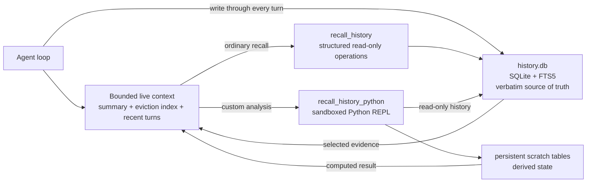
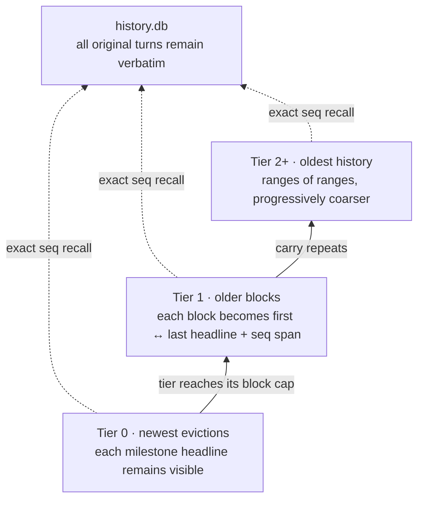

# Context as an Environment: Programmatic Context Management with QwenPaw Scroll

QwenPaw Scroll is designed for **long-context agentic tasks**. In these workloads, an agent must reason and act over a growing trajectory of user instructions, tool calls, tool results, failed attempts, decisions, and changing environment state. The central question is not only whether the model can recall an isolated fact, but how well it can maintain task state, recover relevant evidence, and continue reasoning and acting over very long contexts.

Context management for long-horizon agents is therefore an information-selection problem under a bounded inference budget. A common design injects relevant history directly into the prompt, then truncates or summarizes earlier content as the accumulated history approaches the context-window limit. This controls input size, but it also moves the retention decision to compaction time: the system must predict which details will remain useful before future queries are known.

Durable storage is far less costly than keeping history continuously visible to the model. QwenPaw Scroll therefore defines a different system boundary: the complete interaction history does not remain resident in the model context, but is externalized to durable storage backed by SQLite and full-text search. Structured retrieval tools and a sandboxed Python REPL then let the agent read, join, and compute over that record on demand.

Conversation history is therefore no longer represented as static text that remains resident in the prompt. It is organized as an **external history environment that can be queried and computed over**. The model context maintains only a bounded working set; the complete history remains outside the window while staying addressable, verifiable, and recomputable.

This report describes four parts of that design: how tool descriptions specify an executable retrieval contract, how headlines adjust representation granularity with temporal distance, how the eviction index retains a recoverable history map, and how continuation summaries constrain cumulative update error through layered validation.

## 1. The Context Window Is Working Memory, Not the Record

Live-context compaction, durable interaction history, and semantic memory are distinct system layers.

- **Compaction** controls the size of the model's current input.
- **Durable interaction history** preserves original events verbatim across turns and exposes them through addressable retrieval interfaces.
- **Semantic memory** derives entities, relationships, and abstractions from history or external sources for semantic recall and knowledge organization.

If a summary becomes the only retained representation of historical content, every compaction performs an irreversible information-selection step. A precise error, a rejected implementation, or the date on which a preference changed may appear secondary at compaction time but become decisive evidence in a later session.

Scroll therefore separates the live prompt from the durable record:



### A Simplified `conversation_history` Schema

Scroll stores different interaction-event types in one `conversation_history` table. The following is the logical view exposed to agent retrieval, rather than the complete SQL DDL:

| Field group | Key fields                                 | Purpose                                                                    |
| ----------- | ------------------------------------------ | -------------------------------------------------------------------------- |
| Addressing  | `seq`                                      | Provides a globally stable address for exact expansion and provenance      |
| Scope       | `session_id`, `agent_id`                   | Supports cross-session retrieval or explicit agent scoping                 |
| Event type  | `kind`, `role`, `name`                     | Distinguishes user/model turns from tool results and identifies tool names |
| Payload     | `content`, `blocks`                        | Preserves raw text and structured message blocks                           |
| Tool state  | `tool_call_id`, `tool_input`, `tool_state` | Restores tool invocations, inputs, and execution state                     |
| Navigation  | `headline`                                 | Supplies compact retrieval labels to the eviction index                    |
| Time        | `created_at`                               | Enables date filters, range retrieval, and update resolution               |
| Recovery    | `metadata`, `dedup_key`                    | Stores artifact pointers, recovery metadata, and idempotency keys          |

The `seq` field is the stable address connecting durable history, the eviction index, summary provenance, and exact recall. FTS5 indexes only `content`; scope, event-type, and time fields support structured filtering. The schema retains original events rather than facts selected at ingestion time, allowing the agent to select, join, and compute over historical evidence at query time.

The write path is append-oriented and persists across sessions. Keyword queries use FTS5 with BM25 ranking, with a slower `LIKE` fallback when FTS5 is unavailable. Under either retrieval backend, the live context can contract without affecting the integrity of the durable record.

## 2. Tool Descriptions as Retrieval Interfaces

Providing a retrieval function alone does not ensure correct use. The model must also know when recall is required, how to select an operation, how to scope a search, and how to interpret absence, pagination, and temporal filters.

QwenPaw encodes these constraints directly in the **tool description**. The description is not merely a capability label; it is an agent-facing interface specification covering capability boundaries, operation routing, result protocols, and failure semantics.

The structured `recall_history` description specifies five classes of information:

1. **Capability boundary.** The tool reads raw recorded turns, including content removed from the current session's live context and content from earlier sessions.
2. **Operation routing.** `expand` reads an exact `seq` span; `search` performs keyword and date retrieval; `recall_tool` restores a tool call and result; `days_between` performs deterministic calendar arithmetic. In our experiments, these standardized, high-frequency retrieval operations achieved higher retrieval accuracy through pre-defined structured APIs than through model-generated free-form code, while also reducing variation in argument construction, result parsing, and error handling. QwenPaw therefore uses structured APIs by default and reserves the sandboxed REPL for joins, aggregations, and other queries that cannot be specified effectively in advance.
3. **Query semantics.** Search uses retrieval terms rather than full questions, terms are conjunctive by default, uppercase `OR` broadens recall, and date filters can run independently of a text query.
4. **Completeness protocol.** Empty results explicitly indicate that no record satisfies the current conditions. Large results return an opaque cursor; the agent must continue with identical arguments and must not interpret a partial page as complete.
5. **Execution boundary.** Ordinary recall is bounded, parameterized, and read-only. Arbitrary SQL, cross-result joins, and programmatic analysis move to the advanced sandboxed Python tool.

The system prompt adds retrieval discipline around that interface: recall before guessing when a historical fact is no longer live; search alternate wording for exhaustive requests; deduplicate repeated mentions; and prefer the latest dated user evidence when a fact changed.

This creates a clear separation of responsibilities. The system prompt defines **retrieval policy**; the tool description defines the **operational contract**. Keeping interface semantics close to the tool improves capability selection without repeatedly injecting implementation details into unrelated turns.

### Layered retrieval: structured operations and programmable queries

Common historical queries do not require arbitrary code:

```python
# What happened on a specific source date?
recall_history(op="search", created_on="2026-05-14", k=20)

# Re-open an evicted interval from the in-context map.
recall_history(op="expand", lo=180, hi=184)

# Restore one large tool result.
recall_history(op="recall_tool", tool_call_id="call_abc")
```

Long-horizon tasks also produce queries that a fixed retriever cannot anticipate: counting every failed attempt before a decision, joining sales events against the lowest historical supplier quote, comparing preference updates across sessions, or computing a reusable derived table from historical records.

For these, QwenPaw exposes `recall_history_python`. The REPL receives an already-defined `ms` memory surface:

```python
sales = ms.search("sale", k=200, include_turn=False)
quotes = ms.search("price OR quote", k=200, include_turn=False)

# The agent can parse, join, group, rank, or write a bounded custom SQL query.
# Only printed output returns to the model context.
```

History is attached read-only; derived scratch tables are writable and persistent across otherwise stateless Python processes. Model-authored code runs inside QwenPaw's sandbox and fails closed when isolation is unavailable. Only an operator can explicitly enable the unsandboxed fallback for trusted local development.

The result is a CodeAct-style loop: retrieval is not limited to a pipeline fixed at design time; the agent can generate a retrieval program dynamically at query time.

## 3. Headlines Compress Along the Time Axis

A durable log provides recoverability, but the agent still needs a low-token index for locating historical spans outside the live window. QwenPaw asks the model to append a hidden retrieval headline after each substantive task response:

```text
⟦ model discovery | in progress: OpenAI done; next: fix DashScope | anchors: AllowlistFilter, registry.py ⟧
```

The model generates only the semantic content inside the brackets; it does not supply the address. After the turn is written to `history.db`, Scroll binds the headline to the stable `seq` assigned by the database. Once that turn leaves the live context, the eviction index renders it as:

```text
· seq 1842  ⟦ model discovery | in progress: OpenAI done; next: fix DashScope | anchors: AllowlistFilter, registry.py ⟧
```

The agent therefore sees both a semantic cue and its exact position in the original history. It can locate a checkpoint by headline, then pass its `seq` to `expand` to recover the corresponding turn; a collapsed block carries `seq lo-hi` for expanding the full span. Scroll creates this binding deterministically, so the model never has to generate or guess historical addresses.

The headline is neither a generic topic nor a summary of the whole conversation. It is a compact checkpoint for one turn:

- the stable task or success criterion;
- the latest verified state;
- a controlling decision, exact identifier, error, value, or artifact;
- the next unfinished action or blocker.

Its language distinguishes `completed`, `attempted`, `planned`, `failed`, `blocked`, `paused`, and `decided`. Compression must preserve the epistemic status of an event; a failed attempt cannot be represented as a completed result. When state changes, the headline retains the current effective value and marks the previous value as superseded when that distinction affects subsequent work.

The eviction index then uses **temporal distance as the compression axis**:



Each eviction adds a detailed block to Tier 0. When a tier reaches its cap, its newest block stays detailed while older blocks carry upward in collapsed form. A collapsed block keeps its sequence range and endpoint headlines. Recent history therefore retains finer representation granularity, while granularity decreases progressively with temporal distance.

The resulting loss applies to the **navigation view**, not to storage. An intermediate headline that is no longer displayed remains recoverable by expanding its retained `seq` span or searching the full log. The headline map locates evidence; SQLite restores the original content.

## 4. QwenPaw's Compression Pipeline

After the context threshold is reached, QwenPaw applies a graduated pipeline ordered by recovery cost and information risk:

1. **Persist before modifying the live context.** Every live turn must be durable. If persistence fails, QwenPaw refuses to evict content that cannot be recovered.
2. **Fold completed tool results first.** Under normal context pressure, older persisted tool outputs can be replaced in-context by recovery pointers. The active turn and the five newest tool results remain protected, and a replacement occurs only when it yields positive space savings.
3. **Evict a safe middle.** The manager keeps a bounded recent tail and the complete active turn, then moves an older completed middle out of the prompt. Tool-call/result pairing is repaired at the boundary.
4. **Update two complementary compressed views.** The deterministic eviction index preserves navigation; the continuation summary preserves current task semantics.
5. **Recover under hard-limit pressure.** If completed turns are not enough, QwenPaw may fold old active-turn tool results only after a successful model request has already consumed them. Pending calls, unread results, and the current user request remain protected. If safe recovery is impossible, it raises an explicit context-unfit error instead of silently resetting the session.

The eviction index and continuation summary deliberately have different jobs:

| Layer                | Purpose                         | Failure mode              | Recovery                                          |
| -------------------- | ------------------------------- | ------------------------- | ------------------------------------------------- |
| Raw log              | Verbatim evidence               | Storage growth            | Retention policy / archival                       |
| Eviction index       | Cheap temporal navigation       | Older map becomes coarse  | Expand or search the `seq` span                   |
| Continuation summary | Current task state              | Summary drift or omission | Validate, retain prior state, recall raw evidence |
| Recent tail          | Local conversational continuity | Bounded by window         | Evict only completed history                      |

## 5. Preventing Summary Snowballing

Recursive summary updates can accumulate error: an early omission or incorrect statement becomes input to the next update and may be reinforced across subsequent iterations. QwenPaw therefore defines the continuation summary as an **evidence-backed state cache**, never as the source of truth.

Several mechanisms limit drift:

- **Incremental update with conflict rules.** The previous summary is a baseline, but newly archived exact evidence wins when the two conflict; newer evidence wins when a fact changed over time.
- **Bounded, role-aware evidence.** User text and retrieval headlines receive priority. Tool results enter as limited previews and artifact pointers rather than unbounded payloads.
- **A fixed state schema.** The generated Markdown must contain `Active Task`, `Current State`, `Constraints`, `Decisions`, and `Open Work`, with one valid task status.
- **Provenance in code.** Summary items carry durable source spans. QwenPaw verifies that sequence endpoints still exist and that non-sequence pointers appeared in the supplied evidence.
- **Deterministic local quality checks.** The validator rejects malformed sections, missing sources, duplicate state items, possible secrets, invalid ranges, and identifiers that were not present in the evidence.
- **One repair attempt, then safe fallback.** A quality failure can trigger one repair prompt. Timeouts, provider failures, empty output, or a second invalid candidate preserve the previous valid summary instead of overwriting it.
- **No unsupported inheritance.** If the previous summary's durable source endpoints have expired, it is not silently reassigned to a newer range; QwenPaw drops that unsupported cache and builds fresh state from durable evidence.
- **Background-only semantics.** The injected summary explicitly cannot override the current live user request. Exact details must be recalled from history.

These safeguards do not make summarization lossless; they define its epistemic role. The summary maintains task continuity, while the raw log and recovery pointers remain authoritative. A future periodic source-backed rebase can further reduce error propagation across long update chains without changing the underlying architecture.

## 6. Integrating External Semantic Long-Term Memory

Externalized interaction history provides recoverability and computation at the episodic layer, but it does not constrain QwenPaw's higher-level memory architecture. QwenPaw separates episodic history from semantic memory, so external semantic long-term memory can still be integrated through adapters, including graph, vector, ontology, and hybrid backends.

The two memory layers serve different roles:

| Dimension                | Externalized interaction history                               | External semantic long-term memory                               |
| ------------------------ | -------------------------------------------------------------- | ---------------------------------------------------------------- |
| Primary substrate        | Verbatim interaction events                                    | Derived entities, relations, concepts, and embeddings            |
| Natural query            | Exact recall, temporal filtering, aggregation, arbitrary joins | Semantic similarity, graph traversal, ontology, hybrid retrieval |
| When structure is chosen | At query time through agent-authored code                      | During ingestion, indexing, and retrieval routing                |
| Best role                | Episodic source of truth and unanticipated computation         | Connected knowledge, abstraction, cross-source semantic recall   |

The two layers can operate together within one system. Semantic long-term memory supports knowledge abstraction, semantic recall, and relational inference; Scroll supplies the recoverable event substrate and original evidence beneath it. An agent can retrieve an entity, concept, or relationship from the semantic layer, verify the corresponding raw turn in SQLite, and continue computing from that evidence. QwenPaw can therefore support different long-term memory implementations without changing Scroll's durable-history and context-management mechanisms.

## 7. Evaluation

We evaluate QwenPaw Scroll with **Qwen 3.8 Max** as the backbone and a consistent **ReAct agent scaffold**. Under the corresponding evaluation settings, Scroll achieves state-of-the-art results on two long-context benchmarks:

| Benchmark  |     Score |
| ---------- | --------: |
| BEAM_10M   | **68.9%** |
| LOCA-bench | **57.3%** |

BEAM_10M evaluates long-term memory and reasoning over coherent histories of up to 10M tokens. LOCA-bench evaluates models and scaffolds in agentic environments with dynamically growing context, where agents must explore, use tools, and predict subsequent actions reliably. Together, the two results cover memory reasoning over very long histories and reasoning-and-acting performance over dynamic agent trajectories.

More detailed ablation studies, together with reproducible results and analysis, will be released in a future version.

## 8. Design Implications

The central change is not a better summary; it is a different system boundary between the model and its memory:

- the prompt is a working set;
- the log is the durable source of truth;
- the eviction index is a time-compressed map;
- the continuation summary is a guarded state cache;
- structured recall handles common reads;
- the sandboxed REPL turns unusual retrieval into executable computation.

As models improve at generating and inspecting code, the capability ceiling of this interface can rise without replacing the underlying record. History changes from passively injected context into an environment the agent can query and compute over. Scroll ultimately targets more than isolated fact retrieval: it supports a model's ability to reason, decide, and act over very long contexts.

### References

- [Recursive Language Models](https://arxiv.org/abs/2512.24601)
- [BEAM](https://arxiv.org/abs/2510.27246)
- [LOCA-bench](https://arxiv.org/abs/2602.07962)
