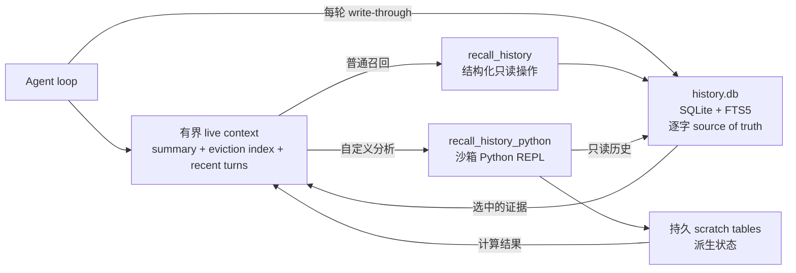
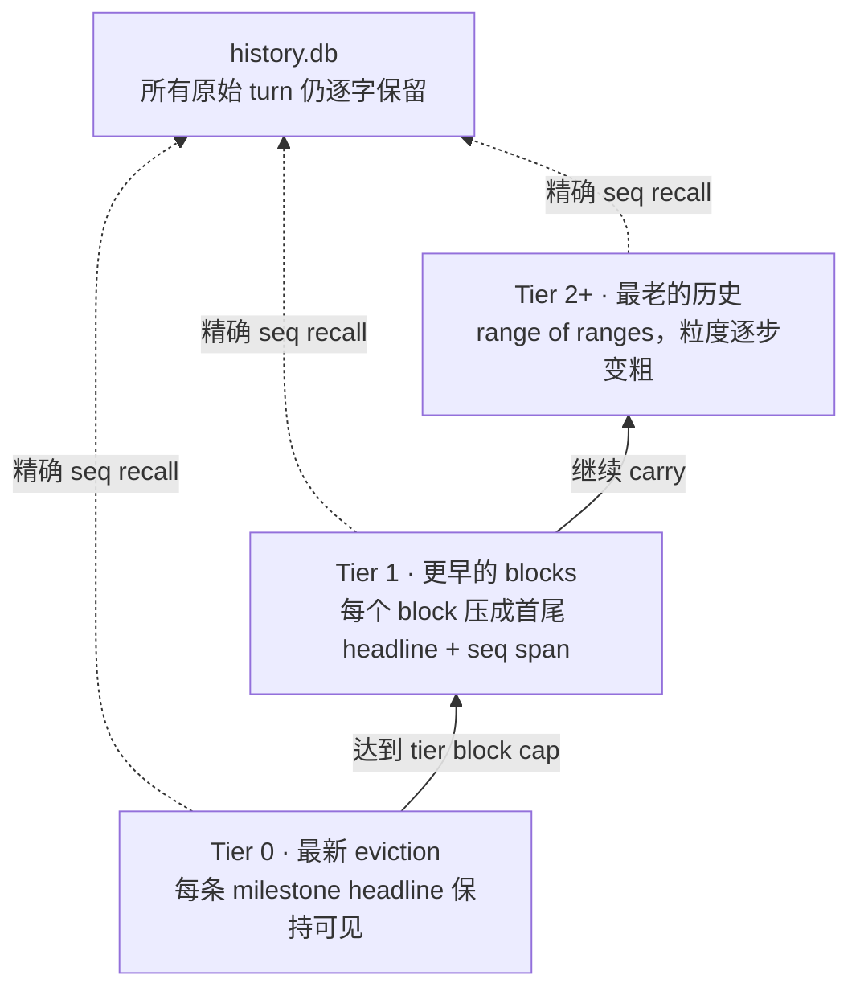

# 把上下文变成环境：QwenPaw Scroll 的程序化上下文管理

QwenPaw Scroll 面向的是 **long-context agentic tasks**。在这类任务中，Agent 需要在持续增长的 user instruction、tool call、tool result、失败尝试、决策与环境状态上连续推理并执行动作。核心问题不仅是能否从历史中 recall 某个事实，更是模型能否基于超长交互轨迹保持任务状态、恢复相关证据，并据此继续 reasoning and acting。

因此，长时程 Agent 的上下文管理，本质上是在有限推理预算下选择模型当前可见的信息。常见实现会把相关历史直接注入 prompt；当累计历史接近上下文窗口上限时，再截断或摘要较早的内容。这类方法能够控制输入规模，但也把信息保留决策提前到了压缩时刻：系统必须在未来查询尚未出现时，预测哪些细节值得长期保留。

持久化存储的成本远低于持续占用模型上下文。基于这一点，QwenPaw Scroll 采用不同的系统边界：完整交互历史无需常驻模型上下文，而是被外部化到 SQLite 与全文索引构成的持久化存储中；Agent 通过结构化检索工具和沙箱 Python REPL，按需读取、关联并计算历史记录。

在这一设计中，conversation history 不再作为静态文本常驻注入 prompt，而是被组织为一个**可查询、可计算的外部历史环境**。模型上下文只维护有界的 working set，完整历史位于窗口之外，并保持可寻址、可验证和可重新计算。

本文从这一问题设定出发，说明 QwenPaw Scroll 的几个核心机制：tool description 如何定义 Agent 可执行的 retrieval contract，headline 如何依据时间距离调整表示粒度，eviction index 如何保存可恢复的历史索引，以及 continuation summary 如何通过多层校验限制误差累积。

## 1. Context Window 是工作记忆，不是历史档案

Live-context compaction、durable interaction history 与 semantic memory 是三个不同的系统层次：

- **Compaction**：控制模型当前输入的规模；
- **Durable interaction history**：逐字保存跨轮次的原始事件，并提供可寻址的访问接口；
- **Semantic memory**：从历史或外部来源派生实体、关系与抽象表示，用于语义召回和知识组织。

如果 summary 成为历史内容唯一保留的表示，那么每次压缩都隐含了一次不可逆的信息选择：系统需要预先判断未来不会再依赖哪些细节。然而，一条精确报错、一个被否决的实现方案，或某项偏好发生变化的具体日期，都可能在后续 session 中成为关键证据。

因此，Scroll 把 live prompt 与 durable record 分开：



### `conversation_history` 的简化 Schema

Scroll 将不同类型的交互事件保存在同一张 `conversation_history` 表中。下表是面向 Agent retrieval 的逻辑视图，而不是完整 SQL DDL：

| 字段组     | 关键字段                                   | 作用                                                |
| ---------- | ------------------------------------------ | --------------------------------------------------- |
| Addressing | `seq`                                      | 提供全局稳定地址，用于精确展开与 provenance         |
| Scope      | `session_id`, `agent_id`                   | 支持跨 session 检索，也可以限定到指定 Agent         |
| Event type | `kind`, `role`, `name`                     | 区分 user/model turn 与 tool result，并标识工具名称 |
| Payload    | `content`, `blocks`                        | 保存原始文本与结构化 message block                  |
| Tool state | `tool_call_id`, `tool_input`, `tool_state` | 精确恢复工具调用、输入及执行状态                    |
| Navigation | `headline`                                 | 为 eviction index 提供紧凑的 retrieval label        |
| Time       | `created_at`                               | 支持日期过滤、时间范围检索和事实更新判断            |
| Recovery   | `metadata`, `dedup_key`                    | 保存 artifact pointer、恢复信息与幂等写入标识       |

其中，`seq` 是连接 durable history、eviction index、summary provenance 与精确 recall 的稳定地址。FTS5 只对 `content` 建立全文索引；scope、event type 与时间字段则用于结构化过滤。Schema 保留的是原始 event，而不是在写入阶段预先提取的“重要事实”，因此 Agent 可以在 query time 重新选择、关联和计算历史证据。

写入路径以追加为主，并跨 session 持久化。关键词查询使用 FTS5 的 BM25 排序；环境不支持 FTS5 时，则降级为较慢的 `LIKE` 扫描。无论采用哪种检索 backend，live context 都可以受控收缩，而 durable record 的完整性不受影响。

## 2. Tool Description 如何定义 Retrieval Interface

仅提供 retrieval function，并不能保证 Agent 正确调用它。模型还需要明确 recall 的触发条件、operation 的选择规则、搜索范围、查询语义，以及空结果、分页和时间过滤的解释方式。

QwenPaw 将这些约束直接编码在 **tool description** 中。这里的 description 不只是功能标签，而是面向 Agent 的接口规范：它同时描述 capability boundary、operation routing、result protocol 与 failure semantics。

`recall_history` 的 description 包含五类信息：

1. **Capability boundary。** 工具读取原始历史 turn，包括当前 session 中已经移出窗口的内容，以及过去 session 的记录。
2. **Operation routing。** `expand` 读取精确 `seq` 区间；`search` 处理关键词与日期检索；`recall_tool` 恢复某次工具调用及结果；`days_between` 执行确定性的日历运算。我们的实验观察到，对于这些高频且可以标准化的检索操作，预先封装的结构化 API 比每次由模型生成 free-form code 具有更高的 retrieval accuracy，同时减少了参数构造、结果解析和异常处理带来的不确定性。因此，QwenPaw 默认使用结构化 API，将沙箱 REPL 保留给 join、aggregation 和其他难以预先定义的查询。
3. **Query semantics。** 查询使用检索词而非完整问句；多个 term 默认采用合取语义；大写 `OR` 用于扩大召回范围；日期 filter 可以脱离文本 query 独立运行。
4. **Completeness protocol。** 空结果会被显式返回，代表当前条件下不存在匹配记录。较大结果通过 opaque cursor 分页；Agent 必须保持原参数继续读取，不能将 partial page 解释为完整结果。
5. **Execution boundary。** 常规 retrieval 采用有界、参数化、只读的操作；任意 SQL、跨结果关联和程序化分析由高级的沙箱化 Python 工具承担。

系统 prompt 再围绕这份接口补充 retrieval discipline：历史事实不在 live context 时先 recall 再回答；“列出全部/一共有多少”要更换关键词并扩大搜索；重复 mention 需要去重；事实发生变化时，以日期最新的 user evidence 为准。

这里形成了明确的职责拆分：system prompt 定义**检索策略**，tool description 定义**操作契约**。将接口语义放在 tool 附近，可以提高 capability selection 的准确性，同时避免在无关 turn 中重复注入工具细节。

### 分层检索：结构化操作与可编程查询

常见历史查询无需执行模型生成代码：

```python
# 某个来源日期发生了什么？
recall_history(op="search", created_on="2026-05-14", k=20)

# 从 in-context map 重新打开一个已驱逐区间。
recall_history(op="expand", lo=180, hi=184)

# 恢复某次 large tool output。
recall_history(op="recall_tool", tool_call_id="call_abc")
```

Long-horizon task 还会产生固定 retriever 难以预先覆盖的查询，例如：统计某项决定之前的全部失败尝试，将销售事件与历史最低供应商报价进行 join，比较一项偏好在多个 session 中的更新时间，或将一组历史记录计算成可复用的派生表。

这时，QwenPaw 会暴露 `recall_history_python`。REPL 中已经预先定义好 `ms` memory surface：

```python
sales = ms.search("sale", k=200, include_turn=False)
quotes = ms.search("price OR quote", k=200, include_turn=False)

# Agent 可以解析、join、group、rank，或者执行有界的自定义 SQL。
# 只有 print 出来的结果会回到模型上下文。
```

历史库以 read-only 方式 attach；派生 scratch table 可以写入，并能跨原本无状态的 Python process 保留。模型生成的代码在 QwenPaw Sandbox 中运行；隔离不可用时默认 fail closed，仅允许 operator 在可信本地开发场景中显式启用 unsandboxed fallback。

由此形成 CodeAct 风格的 loop：retrieval 不再局限于设计阶段确定的固定 pipeline，也可以由 Agent 在 query time 动态生成程序。

## 3. Headline：沿时间轴进行信息压缩

Durable log 保证历史可恢复，但 Agent 仍需要一个 token 开销较低的索引，用于定位已经移出窗口的历史区段。QwenPaw 会要求模型在每个包含实质任务信息的回复后，追加一条对用户隐藏的 retrieval headline：

```text
⟦ 模型发现修复｜进行中：OpenAI 已完成；下一步：修复 DashScope｜锚点：AllowlistFilter、registry.py ⟧
```

模型只生成括号内的语义内容，不自行填写地址。Turn 写入 `history.db` 后，Scroll 会把数据库分配的稳定 `seq` 与 headline 绑定；当该 turn 被移出 live context 时，它会在 eviction index 中呈现为：

```text
· seq 1842  ⟦ 模型发现修复｜进行中：OpenAI 已完成；下一步：修复 DashScope｜锚点：AllowlistFilter、registry.py ⟧
```

因此，Agent 看到的不只是一个语义提示，还包括它在原始历史中的确定位置。Agent 可以先根据 headline 找到相关 checkpoint，再以 `seq` 调用 `expand` 恢复对应 turn；折叠后的 block 则携带 `seq lo-hi`，用于展开整个区间。这一绑定由系统完成，避免模型生成或猜测历史地址。

Headline 既不是宽泛的话题标签，也不是整个历史区间的 summary，而是一个 turn 的紧凑 checkpoint：

- 稳定的任务名或成功标准；
- 本轮最新、已验证的状态；
- 控制后续行为的决定、精确 identifier、error、数值或 artifact；
- 尚未完成的下一步或 blocker。

它必须区分“已完成、尝试过、计划中、失败、阻塞、暂停、已决定”。压缩不能改变事件的认知状态，例如不能把失败尝试表示为完成结果。当状态随时间变化时，headline 保留当前有效值；如果新旧差异会影响后续动作，则明确标记旧值已经 superseded。

接下来，eviction index 以**时间距离作为表示压缩轴**：



每次 eviction 会在 Tier 0 增加一个保留完整 headline 的 block。当某一 tier 达到容量上限，新 block 保持详细，较早的 blocks 则 collapse 后向上一层 carry。Collapse 会保留整个 `seq` range，以及 block 的首尾 headline。因此，近期历史具有较细的表示粒度；随着时间距离增加，索引逐步转化为更粗粒度的区间表示。

这里有损的是**导航视图**，而不是底层存储。中间 headline 即使不再直接显示，仍可以通过保留的 `seq` span 展开，或在完整日志中搜索。Headline map 用于定位 evidence，SQLite 用于恢复原始内容。

## 4. QwenPaw 的分级压缩算法

达到 context threshold 后，QwenPaw 不会立即 summarize 整段对话，而是按照恢复成本与信息风险分级处理：

1. **先持久化，再调整 live context。** Live turn 必须先写入 durable store。如果写入失败，QwenPaw 会拒绝 eviction，避免生成指向不存在记录的 recovery pointer。
2. **优先折叠 completed tool result。** 在常规 context pressure 下，较早且已经持久化的工具输出可以在 context 中替换成恢复指针。完整 active turn 与最新五个 tool result 受到保护；仅当替换能够降低上下文占用时才执行。
3. **安全驱逐中间区段。** Manager 保留有界 recent tail 和完整 active turn，将更早的 completed middle 移出 prompt，并修复边界处的 tool-call/result pairing。
4. **更新两种互补的压缩视图。** 确定性的 eviction index 负责导航；continuation summary 负责当前任务语义。
5. **只在 hard limit 下回收 active turn。** 如果 completed turn 已经不足以释放空间，只会折叠那些已被一次成功 model request 消费过的旧 active-turn tool result。Pending call、未读结果和当前 user request 仍然受保护。如果再无安全恢复方式，系统抛出明确的 context-unfit error，而不是静默 `/new` 或清空 session。

Eviction index 与 continuation summary 刻意承担不同工作：

| Layer                | 作用           | 可能的退化               | 恢复方式                       |
| -------------------- | -------------- | ------------------------ | ------------------------------ |
| Raw log              | 逐字证据       | 存储持续增长             | Retention policy / archive     |
| Eviction index       | 低开销时间索引 | 旧 map 粒度变粗          | 展开或搜索 `seq` span          |
| Continuation summary | 当前任务状态   | Summary drift / omission | 校验、保留旧状态、恢复原始证据 |
| Recent tail          | 局部对话连续性 | 受窗口大小限制           | 只 eviction completed history  |

## 5. 多重 Summarization & Update 机制如何防止 Snowballing

递归更新 summary 容易产生误差累积：早期遗漏或错误会成为下一次 update 的输入，并在后续迭代中逐步固化。QwenPaw 因此把 continuation summary 定义为**由证据支撑的 state cache**，而不是 source of truth。

当前实现用多重机制限制 drift：

- **增量更新 + 冲突规则。** Previous summary 只是 baseline。它与本轮新归档的精确证据冲突时，以 source evidence 为准；事实随时间变化时，以较新的证据为准。
- **有界、role-aware 的输入。** User text 与 retrieval headline 优先；tool result 只提供有限 preview 与 artifact pointer，避免大规模工具输出占用任务状态的输入预算。
- **固定状态 schema。** 生成的 Markdown 必须包含 `Active Task`、`Current State`、`Constraints`、`Decisions` 和 `Open Work`，并提供一个合法 task status。
- **由代码管理 provenance。** 每个 summary item 带 durable source span。系统检查 seq endpoint 是否仍然存在，非 seq pointer 是否真的出现在输入证据中。
- **确定性的本地质量检查。** Validator 会拒绝 section 格式错误、缺少 source、重复状态、疑似 secret、非法 range，以及输入 evidence 中从未出现过的 identifier。
- **最多修复一次，然后安全降级。** Quality failure 可以触发一次 repair prompt。Timeout、provider failure、空输出，或第二次非法 candidate，都不会覆盖上一份有效 summary。
- **不继承已经失去依据的状态。** Previous summary 的 durable source endpoint 如果已经过期，QwenPaw 不会把它静默绑定到一个更新的范围，而是丢弃这份 unsupported cache，并从仍然持久化的证据重新构建状态。
- **明确的 background-only 语义。** 注入的 summary 不能覆盖当前 live user request；精确细节仍必须从 history recall。

这些 safeguard 不会使 summarization 成为无损过程，但会明确其证据角色：summary 用于维持任务连续性，raw log 与 recovery pointer 才是权威证据。未来还可以加入周期性的 source-backed rebase，进一步降低超长 update chain 中的误差传播，而不改变底层架构。

## 6. 仍然可以外接 Semantic Long-Term Memory

Externalized interaction history 解决的是 episodic layer 的可恢复性与可计算性，但它并不限定 QwenPaw 上层的 memory architecture。QwenPaw 将 episodic history 与 semantic memory 分层，因此仍然可以通过适配接口接入外部 semantic long-term memory，包括 graph、vector、ontology 或多种索引组合而成的 hybrid backend。

两层 memory 的职责不同：

| 维度           | Externalized interaction history               | External semantic long-term memory                    |
| -------------- | ---------------------------------------------- | ----------------------------------------------------- |
| 主要 substrate | 逐字交互事件                                   | 派生出的 entity、relation、concept 与 embedding       |
| 自然查询方式   | 精确 recall、时间 filter、aggregate、任意 join | 语义相似度、关系遍历、ontology query 与 hybrid recall |
| 结构何时确定   | Agent 在 query time 通过 code 临时决定         | ingestion、indexing 与 retrieval routing 阶段         |
| 最适合的角色   | Episodic source of truth 与未预见计算          | Connected knowledge、抽象与跨来源语义召回             |

两层可以在同一系统中协同工作。Semantic long-term memory 负责知识抽象、语义召回和关系推断；Scroll 在下层提供可恢复的 event substrate 与原始证据。Agent 可以先从 semantic layer 检索实体、概念或关系，再通过 SQLite 验证对应的原始 turn，并在此基础上继续计算。由此，QwenPaw 可以扩展不同的长期记忆实现，而无需改变 Scroll 的持久历史与 context management 机制。

## 7. Evaluation

我们使用 **Qwen 3.8 Max** 作为 backbone，并搭配一致的 **ReAct agent scaffold** 评估 QwenPaw Scroll。在对应的 evaluation settings 下，Scroll 在两个 long-context benchmark 上均取得了 state-of-the-art 结果：

| Benchmark  |     Score |
| ---------- | --------: |
| BEAM_10M   | **68.9%** |
| LOCA-bench | **57.3%** |

BEAM_10M 评估模型在最长 10M tokens 的连贯历史上进行长期记忆与推理的能力。LOCA-bench 则面向 context 持续增长的 agentic environment，评估模型与 scaffold 能否在探索环境、调用工具和预测后续动作的过程中保持可靠性。这两个结果分别覆盖超长历史上的 memory reasoning，以及动态 agent trajectory 上的 reasoning and acting。

更详细的 ablation studies 和可复现结果分析将在后续版本中发布。

## 8. Design Implications

该设计的核心并不是生成更好的 summary，而是重新定义模型与记忆之间的系统边界：

- prompt 是 working set；
- log 是 durable source of truth；
- eviction index 是沿时间压缩的 map；
- continuation summary 是带 safeguard 的 state cache；
- structured recall 处理常规读取；
- sandboxed REPL 把特殊 retrieval 变成可执行计算。

随着模型生成和检查代码的能力提升，这一接口的能力上限可以继续提高，而无需替换底层历史记录。History 因而从被动注入的上下文，转变为 Agent 可以主动查询和计算的环境。Scroll 最终服务的不是孤立的事实检索，而是模型在超长上下文之上持续 reasoning、决策与行动的能力。

### References

- [Recursive Language Models](https://arxiv.org/abs/2512.24601)
- [BEAM](https://arxiv.org/abs/2510.27246)
- [LOCA-bench](https://arxiv.org/abs/2602.07962)
