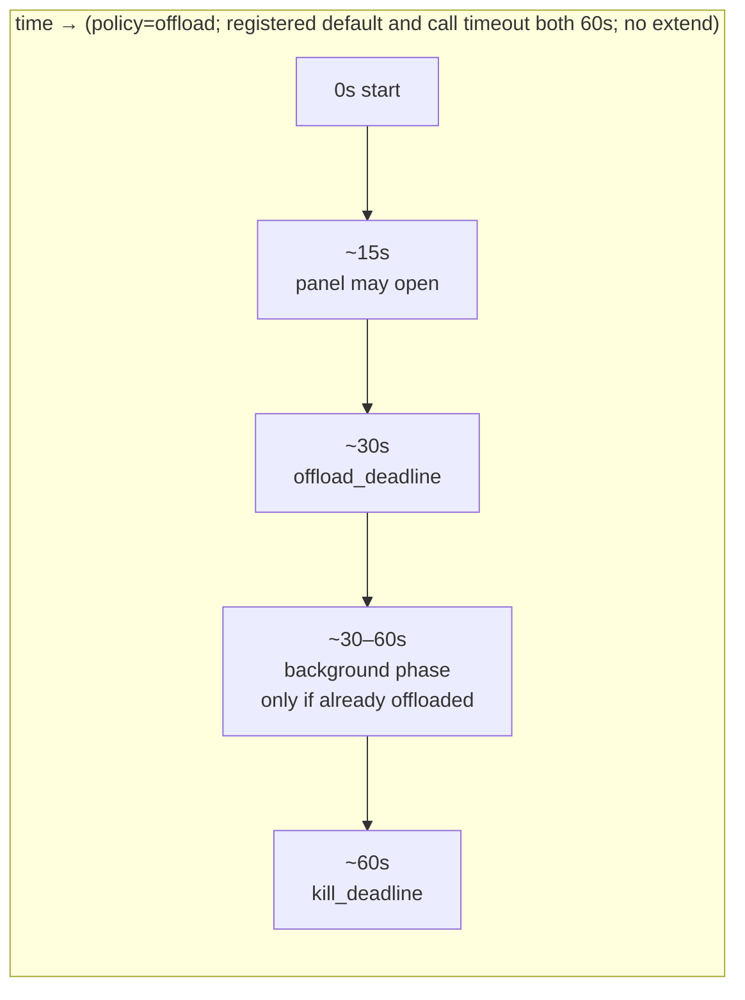
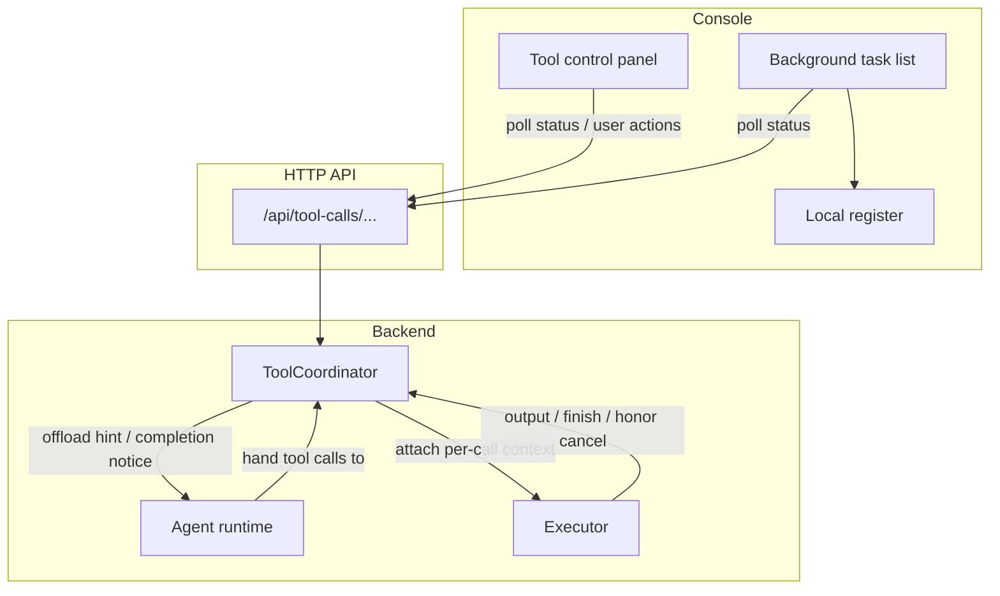
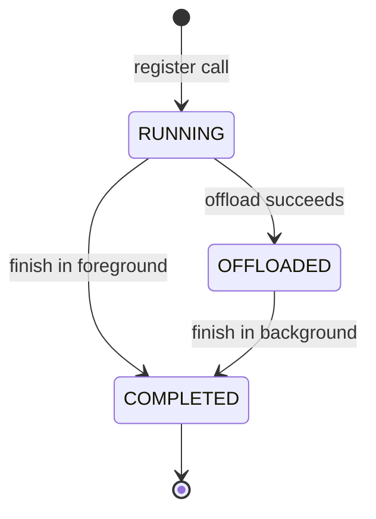
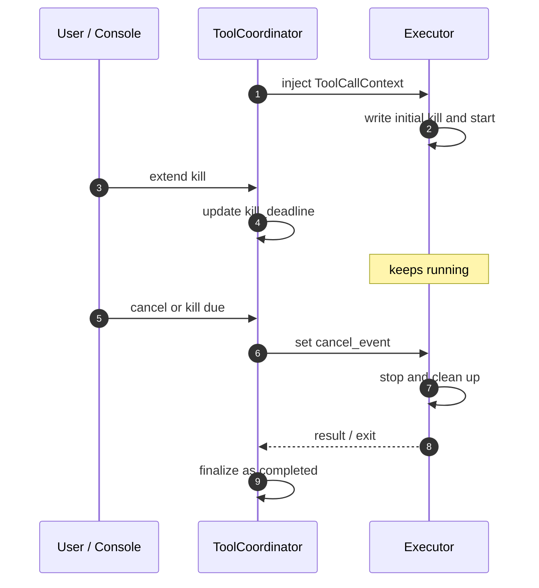
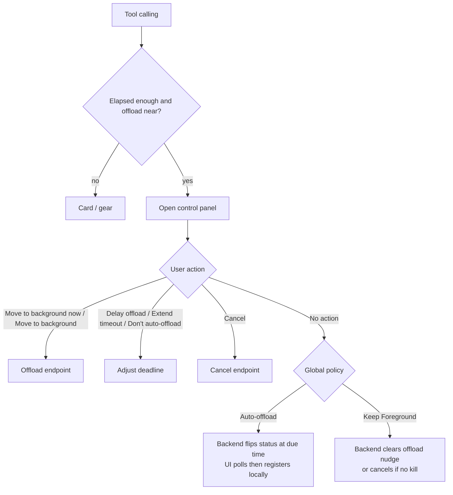

# Long Tools Without Blocking Chat: Dual-Deadline Tool Calls and Foreground Control in QwenPaw

When an Agent runs a long compile, a remote Agent conversation, or a shell command that may take minutes, freezing the whole chat on “waiting for the tool” quickly hurts UX: users cannot see progress, and they cannot decide whether to keep waiting or do something else first.

Worse, if a **single** timeout clock means both “leave the foreground?” and “kill the process?”, the two meanings collide—an offload moment can be mistaken for a hard cancel, and users have little room to intervene mid-flight.

QwenPaw therefore introduces a **dual-deadline** lifecycle for tool calls:

- **`offload_deadline`**: Should this call still occupy the chat foreground? Leaving that wait is **offload** (background)—the tool keeps running, but chat need not stay stuck.
- **`kill_deadline`**: the call’s **execution ceiling**. When it fires, `ToolCoordinator` starts cancel and wind-down (about 5 seconds of grace by default, then force-interrupt the background task if needed). Actually stopping processes/requests is each tool implementation’s job—not an instant SIGKILL when the clock rings.

Three roles collaborate around those deadlines: `ToolCoordinator` owns lifecycle and deadlines; each tool implementation (called Executor below) starts processes, issues HTTP requests, and actually stops work; Console (web UI) makes state visible and editable.

## 1. Why two deadlines

A long tool call raises two different questions:

| Question                   | What users care about          | What the system must provide                                     |
| -------------------------- | ------------------------------ | ---------------------------------------------------------------- |
| Should chat stay blocked?  | Can I do something else first? | Offload to background, or clearly keep waiting in the foreground |
| How long may the tool run? | Will it hang forever?          | Bounded timeout, cancel, and an extendable execution ceiling     |

Bound to one timer, “consider leaving the foreground” can be misread as “kill the process immediately.” With two independent deadlines, leave-foreground and the execution ceiling can fire and be adjusted separately. On top of that separation, the product also provides:

- a **global policy** for what happens when `offload_deadline` fires (auto-background vs keep waiting). The product default is **`keep_foreground`**—it does **not** auto-offload at that moment (it clears the offload nudge, or timeout-cancels with grace if kill is still missing). The policy lives in global `settings.json`, not per-Agent.
- temporary **user overrides**: move to background now, delay offload, extend execution timeout, or cancel execution.

## 2. Core idea: two deadlines, two meanings

### 2.1 What the timeline looks like

The diagram uses a typical **shell** call to build an order-of-magnitude feel. Assumptions (illustrative only, not the only configuration):

1. Global policy is auto-offload (`offload`);
2. Shell’s **registered default timeout** is **60 seconds**, and this call’s `timeout` argument is also **60 seconds**;
3. No one extends deadlines mid-flight.

Under those assumptions, the two deadlines land roughly here:

| Deadline           | Where the number comes from                                                                      | Approx. point in the diagram |
| ------------------ | ------------------------------------------------------------------------------------------------ | ---------------------------- |
| `offload_deadline` | Coordinator takes the tool’s **registered default timeout**, then multiplies by `0.5` (60 × 0.5) | ~30s                         |
| `kill_deadline`    | Executor writes it at real start from this call’s `timeout` (60)                                 | ~60s                         |

In real calls, the registered default and this call’s `timeout` can differ. For example, the registered default stays 60s (offload still ~30s) while the model passes `timeout=120`, so `kill_deadline` lands at 120s—when it is written and how it is adjusted are in §2.3. Tools with a longer registered default (e.g. `chat_with_agent` often 300s) shift the offload decision point by the same ratio (~150s).

Note: the diagram is only to show timing under auto-offload. The factory default policy is actually **`keep_foreground`**—without intervention there is no “30–60s background phase” as drawn. What happens when `offload_deadline` fires under each policy is in §2.2.



### 2.2 What each deadline means

First, what each one answers:

| Deadline           | Question it answers                                       |
| ------------------ | --------------------------------------------------------- |
| `offload_deadline` | Should this tool call keep occupying the chat foreground? |
| `kill_deadline`    | How long may this tool still run?                         |

At entry creation there is usually **only** `offload_deadline`; `kill_deadline` is written when the Executor actually starts the tool (§2.3). Built-in shell / chat paths normally write it; a custom tool that never registers one can leave it `None`.

#### When `offload_deadline` fires

Behavior depends on the **global policy** (and whether the user already asked to move to background).

**Policy = `offload` (auto-offload), or the user already requested offload**

Before offload, the system checks whether `kill_deadline` is usable (§5): if it is missing, or less than about 30s remains, and a timeout budget is available, it sets `kill_deadline` to `now + max(30s, budget)`.

1. Check passes → offload: the tool keeps running, chat stops waiting;
2. Check cannot pass → **timeout-cancel**: signal cancel and allow about 5 seconds for a cooperative exit (**grace** below)—not a silent failure.

**Policy = `keep_foreground` (product default)**

At due time the system does **not** auto-offload:

1. **`kill_deadline` is already present**: only dismiss the “should we background?” nudge; the tool keeps running in the **foreground** until it finishes on its own or hits `kill_deadline` later.
2. **`kill_deadline` is still missing**: clearing the nudge and waiting forever would be unbounded, so the same **timeout-cancel + grace** path runs. Calls that already started and registered kill rarely hit this branch; it mainly covers “not really started yet / never registered.”

#### When `kill_deadline` fires

Independent of policy: the Coordinator signals cancel (timeout reason), waits about **5 seconds of grace** for the task to exit cooperatively, then force-interrupts that background task **if it is still running**. How processes / HTTP / sandboxes actually stop is in §6.

Note: the control API also has `force=true` for an immediate forced cancel; **Console’s “Cancel” does not send `force` by default**—it still uses cooperative cancel + grace.

### 2.3 Written in stages, not split once up front

The two deadlines are not “halve the timeout once at create and write both.” They appear in stages:

1. **When the call is first registered**
   `ToolCoordinator` resolves a Coordinator-side timeout (`deadline_override` → per-agent → hook registered default → global; production usually sees the hook default, e.g. shell 60s, `chat_with_agent` 300s), and writes only **`offload_deadline` = budget × 0.5**. There is still no `kill_deadline`.

2. **When the tool actually starts**
   The tool implementation writes `kill_deadline` from **this call’s `timeout` argument**.
   The system requires `offload_deadline` to be earlier than `kill_deadline`. If the offload from step 1 is already too late, it is moved earlier to about `kill × 0.5`.

3. **Just before offload**
   If `kill_deadline` is still missing, or less than about 30s remains, `ToolCoordinator` resets it from the timeout budget:
   `kill_deadline = now + max(30s, budget)` (e.g. budget 60s with 5s left → 60s from now). Details in §5.

Each stage uses its own number:

```text
At registration: offload ≈ Coordinator-resolved timeout × 0.5
At tool start:   kill    ≈ this call’s timeout
Before offload:  if kill is missing or remaining < 30s,
                 may set to now + max(30s, budget)
```

## 3. Who owns a tool call’s life

A long tool call is handled by three roles:

| Role                                 | Where    | Responsibility                                                                                                       |
| ------------------------------------ | -------- | -------------------------------------------------------------------------------------------------------------------- |
| `ToolCoordinator`                    | Backend  | Registers the call, owns both deadlines and status, decides when to offload or cancel                                |
| Tool implementation (Executor below) | Backend  | The tool function itself: run commands or requests, write `kill_deadline` at start, and stop when cancel is signaled |
| Console                              | Frontend | Shows countdowns and controls, polls status over HTTP, and locally registers tasks that have offloaded               |

### 3.1 How the three connect

`ToolCoordinator` lives in process-level app services and is shared across Agents / Workspaces. When an Agent runs a tool, middleware hands the execution chain to the Coordinator to wrap: the Coordinator owns this call’s lifecycle, and the tool implementation actually runs the command or request.

Whether chat stays occupied by the call depends on its stage:

- `running`: the Agent is still waiting in the foreground for the tool;
- `offloaded`: the foreground has received the offload hint and continues; the tool keeps running under `kill_deadline`.

The tool implementation reads deadlines and cancel signals from a **per-call context** attached by the Coordinator (§3.2). Console polls `/api/tool-calls/...` and, after seeing `offloaded`, registers the background task locally. User actions to offload, extend, or cancel use the same API (§5).



### 3.2 Two layers for one call

`ToolCoordinator` keeps two layers of information for each tool call.

**Per-call context (`ToolCallContext`)** sits on the execution path for the Executor to read. It mainly holds:

- `offload_deadline` and `kill_deadline`;
- a cancel signal, set when a deadline fires or the user cancels;
- a deadlines-changed signal, so extend updates the remaining wait;
- markers such as `offload_reason` after leaving the foreground.

**Coordinator entry (`ToolCallEntry`)** stays inside the Coordinator for status queries, offload, and cancel. It mainly holds: current status (`running` / `offloaded` / `completed`), streamed output, the final result, and the handle of the task that continues after offload.

Executors typically write this call’s `timeout` into `kill_deadline` at start and watch the cancel signal while waiting (§6). Query, offload, extend, and cancel APIs locate the entry by `session_id` and `tool_call_id` (§5).

## 4. `ToolCoordinator`: state machine and event loop

For each tool call, `ToolCoordinator` does two jobs: mark how far the call has progressed, and wait for events that need a response. Status covers foreground wait, offloaded, and finished; the events cover stream output, cancel, deadline changes, and deadlines becoming due.

### 4.1 How state moves



There are only three external statuses: `running` (foreground wait), `offloaded` (backgrounded), and `completed` (finished). There is no separate “cancelled” status—after user cancel or timeout, the entry still becomes `completed`, with cancel-reason fields distinguishing success, timeout, and cancel. Diagrams often use caps such as `RUNNING`; APIs usually return lowercase strings such as `"running"`.

Status changes fall into two kinds:

**Offload (`running` → `offloaded`)**
Happens after confirming `kill_deadline` is usable. Under the auto policy it is triggered when `offload_deadline` fires; on a manual offload, the API runs the same check, then moves `offload_deadline` to now so the same offload logic applies. If the check fails, the manual request is refused; on the auto path, the call timeout-cancels instead. After offload, “should we leave the foreground?” due events are ignored; only the execution ceiling and cancel remain in play. The foreground immediately receives a tool result that steers the model to continue differently, while the tool itself keeps running in the background.

**Finish (`running` / `offloaded` → `completed`)**
When the tool succeeds, times out, or is cancelled by the user, status becomes `completed` and the final result is stored. Cancel and timeout do not get their own status names—they are different reasons for already being finished. If the call had been offloaded, completion also arrives as a system notification plus result content for a later ReAct turn.

### 4.2 Four events the loop waits for

While the tool is running, `ToolCoordinator` loops on four kinds of events and handles each in turn.

**Stream output** (`chunk` / `stream_closed`). Some tools hand back output fragments while still running, instead of returning everything only at the end. The Coordinator forwards each `chunk` to the foreground or buffers it; `stream_closed` means the output stream ended and there are no more fragments to read—not that the whole tool call is finished. The call may keep running, especially after offload.

**Cancel** (`cancelled`). A user cancel sets `cancel_event`, and the wait loop returns this event. The Coordinator gives the background task about **5 seconds** to exit cooperatively, then force-interrupts it if needed. Actually stopping processes or requests is the tool implementation’s job (§6).

**Deadline changed** (`deadline_changed`). Extending, clearing, or resetting `offload_deadline` / `kill_deadline` raises this event; the Coordinator restarts the wait with the new remaining time. Changing a clock does not itself offload or kill the process.

**Deadline due** (`deadline_reached` / `kill_deadline_reached`). The Coordinator waits until the earlier of `offload_deadline` and `kill_deadline`, then wakes as one of those two events; if both are due, `kill_deadline_reached` wins. On `kill_deadline` due, the handler sets `cancel_event` and enters cancel wind-down (same grace path as user cancel); a due `offload_deadline` offloads, keeps the foreground, or timeout-cancels according to global policy (§2.2).

## 5. Control APIs: how users and the system change the clocks

Clients such as Console talk to the Coordinator through `/api/tool-calls/{session_id}/{tool_call_id}/...` to query a call, move it to the background, extend a deadline, or cancel it. Entries are scoped by `session_id` and `tool_call_id`. The subsections below cover the common operations, then the limits around extend, clear, and offload.

### 5.1 Common operations

**Query status** (`GET .../{tool_call_id}`)
Returns the current status plus fields such as `offload_remaining`, `kill_remaining`, and `offload_reason`, which drive panel countdowns and the background-task list.

**Move to background** (`POST .../offload`)
After confirming `kill_deadline` is usable (§5.3), moves the call from `running` to `offloaded`. Policy-driven auto-offload does not use this endpoint; Console calls it only when the user clicks.

**Cancel** (`POST .../cancel`)
Sets the cancel signal and enters the wind-down in §4.2: about 5 seconds of cooperative exit, then force-interrupt the background task if needed. The body may also send `force=true` for a harder cancel; the Console panel does not send `force` by default and stays on cooperative cancel.

**Extend or adjust a deadline** (`POST .../extend-deadline`)
Body field `target` selects which clock to change:

- `target=offload` + `seconds`: push `offload_deadline` (Delay offload); `running` only;
- `target=offload` + `no_deadline=true`: clear `offload_deadline` (Don’t auto-offload); blocks automatic offload only—manual move-to-background remains available;
- `target=kill` + `seconds`: push `kill_deadline` (Extend timeout); works in foreground and background, subject to the tool’s internal cap (§5.2).

`kill_deadline` is usually written by the Executor from this call’s `timeout` at start (§2.3); afterward the API can push it later. Once a call is offloaded—or when a tool declares `max_internal_timeout_secs`—the execution ceiling cannot be cleared with `no_deadline`.

### 5.2 Cap on extending `kill_deadline`

If a tool declares `max_internal_timeout_secs` (mainly `execute_shell_command` and `chat_with_agent` today), an extended `kill_deadline` cannot pass `started_at + that cap`. The API therefore cannot promise more runtime than the Executor’s internal wait ceiling (the ~24h figure in §5.4).

### 5.3 Window check before offload

For both manual `POST .../offload` and policy-driven auto-offload, the Coordinator first confirms a usable `kill_deadline` remains:

1. `kill_deadline` exists and at least ~**30 seconds** remain → allow;
2. Otherwise, if a Coordinator-side timeout is available (same source as when computing `offload_deadline`, usually the tool’s registered default, e.g. shell 60s) → set
   `kill_deadline = now + max(30s, that timeout)`
   (e.g. registered default 60s with 5s left → 60s from now; total runtime may exceed the original call `timeout`);
3. Still no usable window → refuse manual offload; on the auto path, timeout-cancel and enter about 5 seconds of cooperative exit.

### 5.4 Two budgets, and the ~24h ceiling

`offload_deadline` and `kill_deadline` are taken from different budgets:

- **Leaving the foreground**: when the call is registered, the Coordinator writes `offload_deadline` as (resolved timeout × `0.5`), where the timeout is `deadline_override` → per-agent → hook registered default → global. Shell’s hook default is 60 seconds, so the decision point is about 30 seconds.
- **Hard run limit**: when the tool starts, it writes `kill_deadline` from this call’s `timeout`. If offload is already later than kill, offload is moved earlier to about `kill × 0.5`, so the foreground decision still precedes the hard stop.

For shell with registered default 60 and call `timeout=300`, offload is about 30 seconds and kill about 300 seconds.

The panel countdown comes from the Coordinator’s `kill_deadline`. When shell runs a command or `chat_with_agent` issues a request, each path also passes a timeout into its execution channel: shell to the sandbox, chat to the HTTP client. If that value were frozen to this call’s `timeout` (say 60 seconds), later extending kill to 120 seconds would not help—the sandbox or HTTP client would still end at second 60.

So when the Coordinator already owns the call, that channel timeout is set to about **24 hours**: a high ceiling on the channel, not a replacement for the panel kill. Stopping still happens when the Coordinator signals cancel at `kill_deadline` or on user cancel; the tool implementation then stops the process or closes the connection. Extending kill also cannot pass `started_at + 24 hours` (`max_internal_timeout_secs`, §5.2), so the API does not promise more than the channel can actually wait.

## 6. How tool implementations listen to the Coordinator

Executor here means each tool’s own execution path: it runs the command or request and stops it when needed. It shares the same `ToolCallContext` as the Coordinator: deadlines and the cancel signal live on that context, and the tool reads them while work is in flight.

### 6.1 Shared Context is authoritative

On the context, stopping mainly involves `kill_deadline` and `cancel_event`. At start, the tool writes this call’s `timeout` into `kill_deadline`. While waiting for a result, common paths (shell, `chat_with_agent`, and similar) listen only to `cancel_event`. When `kill_deadline` is due, the Coordinator notices and sets `cancel_event`; the tool implementation then stops the process or closes the connection. Extending runtime only pushes `kill_deadline` later, which delays when the Coordinator signals cancel.

A few paths (such as ACP) reread `kill_deadline` each loop and stop from the latest deadline directly. Cancel reasons (user cancel, timeout, and so on) return to the model with distinct copy so it can tell retry from a change of plan.

### 6.2 Division of labor

| Role                | Responsibility                                                                         |
| ------------------- | -------------------------------------------------------------------------------------- |
| Coordinator         | Maintain deadlines; set `cancel_event` on due/cancel                                   |
| Tool implementation | Run the tool; listen for cancel or reread `kill_deadline`; stop the process or request |



### 6.3 Two common listening patterns

Built-in tools mostly follow the context in one of two ways:

1. **Cooperative wait**: race task completion against `cancel_event` (e.g. `cancellable_wait`). Extends work because cancel arrives later. Shell (including sandbox) and `chat_with_agent` use this path; how the channel timeout is raised is in §5.4.
2. **Loop reread**: each iteration reads the current `kill_deadline` from the context (e.g. ACP). After an extend, the next iteration sees the new deadline.

`grep_search`, `glob_search`, `ast_search`, and `desktop_screenshot` likewise respond to cancel via cooperative wait or an equivalent path. The `lsp` tool itself also uses cooperative wait; Coordinator-side 20s hook defaults are registered under names such as `lsp_definition` and `lsp_references`.

### 6.4 Representative paths

| Path                 | How it listens                                                                                       | What stop does                                                          |
| -------------------- | ---------------------------------------------------------------------------------------------------- | ----------------------------------------------------------------------- |
| Host shell (Unix)    | Cooperative wait around process I/O                                                                  | Abort the wait and reclaim the child process                            |
| Host shell (Windows) | Write kill first; when the Coordinator owns the call, sync wait has no wall-clock timeout of its own | Bridge `cancel_event` to a local stop signal, then end the process tree |
| Sandbox shell        | Cooperative wait; channel timeout in §5.4                                                            | On cancel, reclaim the sandbox                                          |
| `chat_with_agent`    | Cooperative wait on async HTTP collect                                                               | On cancel, end this collect                                             |
| ACP                  | Write kill at start; reread `kill_deadline` each loop                                                | End the external turn on due or cancel                                  |

Sandbox **environment setup** can take a while. During that phase, any existing `offload_deadline` and `kill_deadline` are temporarily pushed out (about 180 seconds), then shifted by the setup elapsed time when setup finishes, and only then is `kill_deadline` written (or rewritten) from the command `timeout`—so setup does not consume the whole command budget.

## 7. Frontend controls

Tool-call control in Console shows up mainly in three places: the global policy in settings, the control panel on the tool card, and the background task list beside the chat input.

### 7.1 Control flow

While a long tool runs, Console polls `GET /api/tool-calls/{session}/{id}` for status and remaining time. After gating, the tool-card control panel can open; from there the user may move the call to the background, adjust a deadline, or cancel.

Under auto-offload, the backend rewrites status when the deadline fires; the frontend registers a background task locally after a poll sees `offloaded` (or a completion that records an offload reason). A manual move-to-background click calls the offload endpoint. Extend, clear auto-offload, and cancel use the corresponding deadline and cancel endpoints.



### 7.2 Default policy

The global policy decides what happens when `offload_deadline` fires. It lives in `settings.json` and is not per-Agent. The sidebar entry is **Tool Offload** (Chinese nav: **工具后台策略**); the page title is **Tool Background Execution** / **工具后台执行策略**, with two choices:

- **Keep Foreground** (product default): do not auto-offload at due time; the tool keeps running in the foreground;
- **Auto Offload to Background**: the backend moves the call to the background at due time so the Agent can continue other work.

Mid-flight, the control panel can still override for this call—for example by moving to background manually, or by clearing automatic offload for this run.


### 7.3 Tool-card control panel

While a long tool runs, the panel shows countdowns and actions that depend on the current global policy. Failed actions get distinguishable feedback.

Under **Auto Offload to Background**, and still inside the decision window, common actions in order are **Move to background now**, **Don't auto-offload**, **Delay offload**, **Extend timeout**, and **Cancel**. **Don't auto-offload** only clears the automatic `offload_deadline`; the user can still click **Move to background now**.


Under **Keep Foreground**, or after auto-offload has already been cleared, common actions are **Move to background**, **Extend timeout**, and **Cancel**.


The panel can also open automatically when offload is near: an offload countdown is still live, remaining time is about 30 seconds or less, and enough foreground time has elapsed (about 15 seconds versus half the initial offload window—whichever is smaller). The gear on the tool card always opens the panel manually.

Expanding the tool card also shows dual remaining times in the **Runtime** block: `offload_remaining` (until the offload decision) and `timeout:` (tied to `kill_deadline`). Those clocks remain visible on the card when the control panel is closed.


### 7.4 Background task list

Beside the chat input, a tab strip places **Background tasks** next to the message queue. Only calls that have actually moved to the background are registered—typically after a poll sees `offloaded`, or after the user manually moves a call to the background. Calls still waiting in the foreground do not appear here. The list is scoped to the current session; switching sessions shows only that session’s background tasks.

Each entry shows the tool name and duration: running rows show **Running** plus elapsed time; cancelled rows show **Cancelled** plus total duration; finished rows show total duration. If the tool supports streaming, the row can expand while running to show live chunks (tool-stream subscription; polling is a fallback for status wind-down). Non-streaming tools often show no output until they finish, then the final result is available. Per-item actions include cancelling a running task and removing a finished entry. The header also offers **Cancel all** (cancel every running task in this session) and **Clear all** (cancel running tasks, then empty the session list).


## 8. Takeaways

QwenPaw’s tool-call lifecycle is shaped by `offload_deadline` and `kill_deadline`: the former decides when to leave the chat foreground; the latter bounds runtime and starts a bounded wind-down when due. The two clocks are written in stages—offload when the call is registered, kill when the tool actually starts. Offload is budgeted by the Coordinator from the resolved tool-side timeout; kill is written by the tool implementation from this call’s `timeout`.

`ToolCoordinator` maintains status and deadlines and signals cancel on due or user cancel; tool implementations listen for that signal on common paths and stop the process or request; Console exposes global policy, the control panel, and the background task list for countdowns, in-flight adjustments, and tracking after offload. The global policy defaults to Keep Foreground and can be set to Auto Offload to Background; a single call can also be moved, extended, or cancelled by hand.
