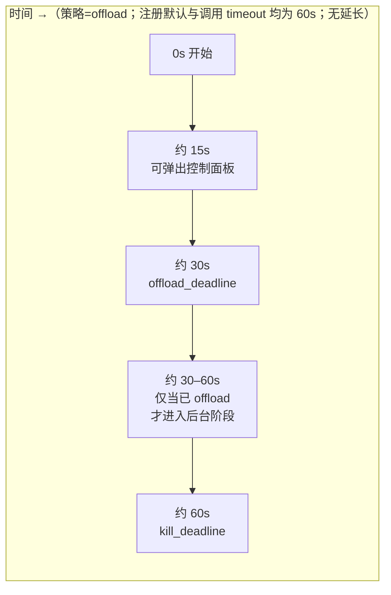
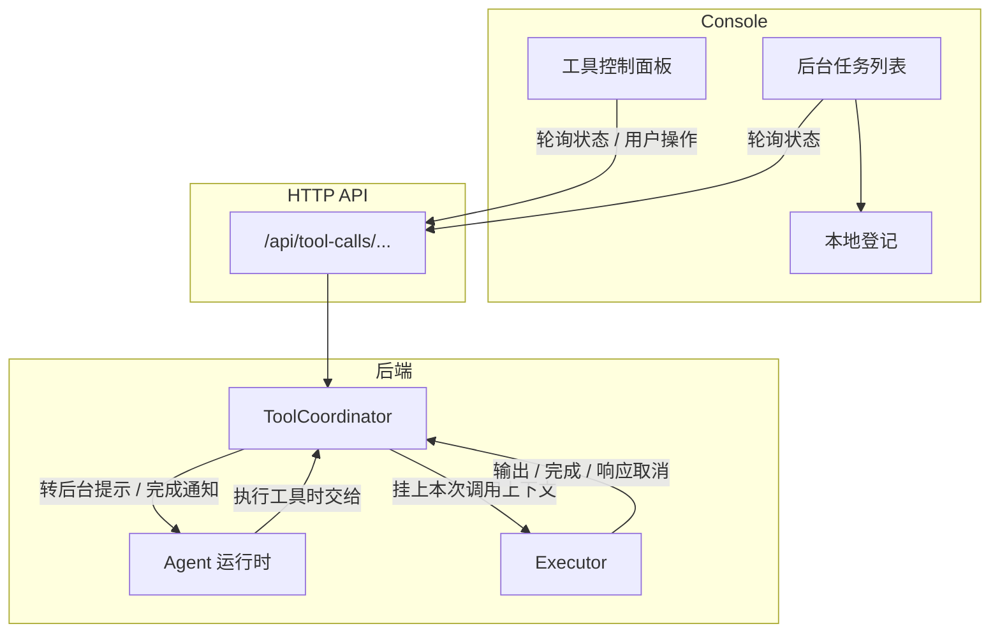
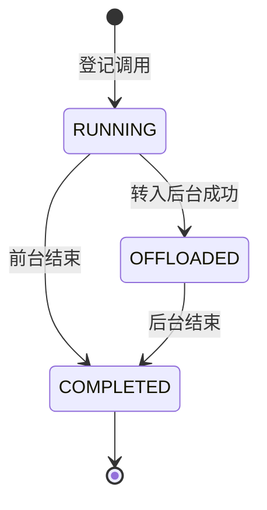
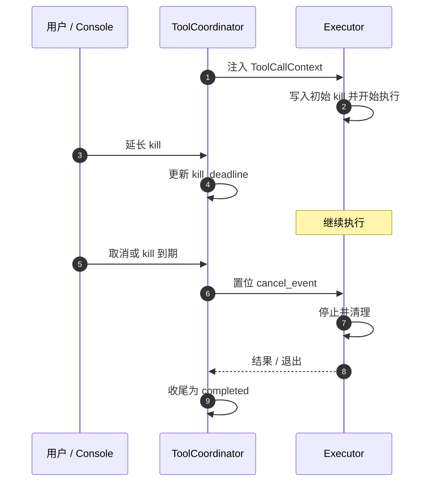
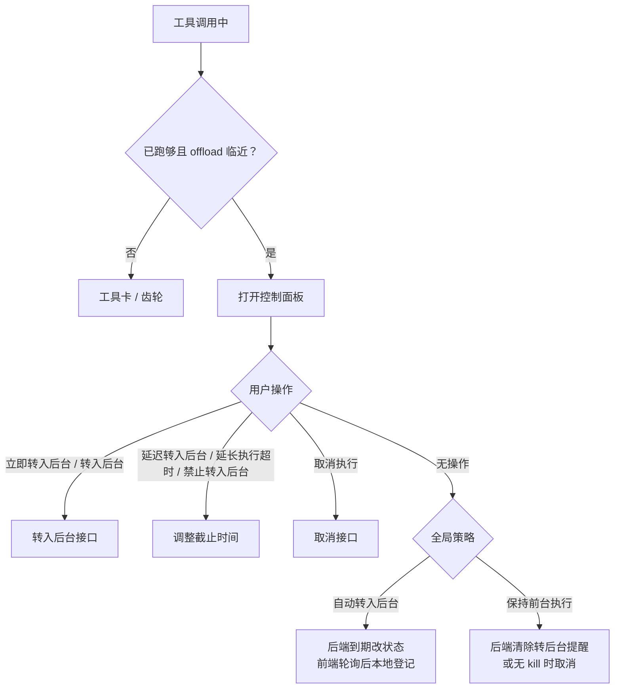

# 让长工具不再卡住对话：QwenPaw 双 Deadline 工具调用与前台控制

当 Agent 执行长编译、远程 Agent 对话，或一条会跑很久的 shell 命令时，整段对话如果一直卡在「等待工具返回」，体验会立刻变差：用户看不到进展，也很难决定是继续等，还是先去做别的事。

更麻烦的是：若只用**一个**超时时钟同时表达「该不该离开前台」和「该不该杀掉进程」，两套语义会互相踩踏——本该转入后台的时刻，可能被误当成硬取消；用户也难以在中途参与决策。

QwenPaw 因此为工具调用引入**双 Deadline（双截止时间）**：

- **`offload_deadline`**：对话前台还要不要被这次调用占住？可以离开前台时称为转入后台（offload）——工具继续跑，对话不必一直卡住。
- **`kill_deadline`**：这次调用的**执行上限**。到点后 `ToolCoordinator` 发起取消并进入收尾（默认约 5 秒协作窗口，再必要时强制打断后台 task）；进程/请求的真正停止由 Executor 落实，而不是时钟一响立刻 SIGKILL。

围绕这两套截止时间，有三个协作角色：`ToolCoordinator`（工具调用协调器）维护生命周期与截止时间；各工具实现（下文称 Executor）拉起进程、发起 HTTP 请求，并在需要时真正停止；Console（网页控制台）让用户看见状态并参与决策。

## 1. 为什么需要两套截止时间

长工具调用里，用户其实在关心两件不同的事：

| 问题                 | 用户关心的事         | 系统需要提供的能力                   |
| -------------------- | -------------------- | ------------------------------------ |
| 对话还要不要被占住？ | 能不能先去做别的事？ | 转入后台，或明确「继续前台等待」     |
| 工具最多还能跑多久？ | 会不会永远挂着？     | 有界超时、手动取消、可延长的执行上限 |

把它们绑在**同一个**计时器上，系统本想提示「可以考虑转后台了」，执行层却可能理解成「立刻杀掉进程」。拆成两套独立截止时间后，「离开前台」与「执行上限」才能分别到期、分别调整。产品在此之上还提供：

- **全局策略**：在 `offload_deadline` 到期时默认转后台，或默认继续前台等待。产品默认是 **`keep_foreground`**——到期时**不会**自动转入后台（只会清除转后台提醒，或在尚无 kill 时按超时取消 + grace）。策略写在全局 `settings.json`，不是某个 Agent 私有配置。
- **用户临时覆盖**：立即转入后台、延迟转入后台、延长执行超时，或取消执行。

## 2. 核心思想：两套截止时间，两种语义

### 2.1 时间轴长什么样

下图用一次典型的 **shell** 调用建立时间感。约定如下（仅为示意，不是唯一配置）：

1. 全局策略为「自动转入后台」（`offload`）；
2. shell 在工具注册时的默认超时是 **60 秒**，本次调用参数里的 `timeout` 也是 **60 秒**；
3. 运行中途没有人为延长截止时间。

在这种约定下，两套截止时间大致落在：

| 截止时间           | 数字怎么来                                                   | 图中大致落点 |
| ------------------ | ------------------------------------------------------------ | ------------ |
| `offload_deadline` | Coordinator 取工具**注册默认超时**，再乘 `0.5`（60 × 0.5）   | 约 30s       |
| `kill_deadline`    | Executor 在工具真正启动时，按本次调用的 `timeout` 写入（60） | 约 60s       |

真实调用里，注册默认超时与本次 `timeout` 可以不同。例如注册默认仍是 60s（offload 仍约 30s），而模型传入 `timeout=120`，则 `kill_deadline` 落在 120s——何时写入、如何调整见 §2.3。注册默认更长的工具（如 `chat_with_agent` 多为 300s）会把 offload 决策点按同一比例后移（约 150s）。

注意：上图是为了展示「自动转入后台」时的时间落点；产品出厂默认策略其实是 **`keep_foreground`（保持前台）**——无人干预时不会出现图中「30–60s 后台阶段」。两种策略在 `offload_deadline` 到期时的具体分支见 §2.2。



### 2.2 两个 Deadline 分别做什么

先分清各自管什么：

| 截止时间           | 回答的问题                               |
| ------------------ | ---------------------------------------- |
| `offload_deadline` | 对话前台还要不要继续被这次工具调用占住？ |
| `kill_deadline`    | 这次工具调用最多还能跑到什么时候？       |

创建调用时通常**只有** `offload_deadline`；`kill_deadline` 要等 Executor 真正开始跑工具时才写入（§2.3）。内置 shell / chat 一般都会写；自定义工具若从不登记，就会一直是 `None`。

#### `offload_deadline` 到期时

看**全局策略**（以及用户是否已经点了「转入后台」）。

**策略 = `offload`（自动转入后台），或用户已请求转入后台**

转入后台前，系统会先检查 `kill_deadline` 是否够用（细节见 §5）：没有、或剩余不足约 30 秒时，若能拿到超时预算，就把 `kill_deadline` 设为「现在 + max(30s, 预算)」。

1. 检查通过 → 转入后台：工具继续跑，对话不再干等；
2. 检查无法通过 → **超时取消**：发出取消信号，并给约 5 秒协作退出窗口（下文称 **grace**），不会静默失败。

**策略 = `keep_foreground`（保持前台，产品默认）**

到期时**不会**自动转入后台：

1. **已有 `kill_deadline`**：只关掉「是否转入后台」的提醒，工具继续在**前台**跑，直到它自己结束，或碰到后面的 `kill_deadline`。
2. **还没有 `kill_deadline`**：若仍只清提醒、继续干等，可能永远等下去，因此同样走**超时取消 + grace**。正常已启动并登记过 kill 的调用一般不会走到这里；这条分支主要覆盖「尚未真正开始 / 从未登记」的情况。

#### `kill_deadline` 到期时

与策略无关：Coordinator 发出取消信号（超时原因），默认约 **5 秒 grace** 等任务协作退出；**若仍未结束**再强制打断该后台 task。进程 / HTTP / 沙箱如何真正停下，见 §6。

补充：控制 API 另有 `force=true` 可立刻强制取消；**Console 面板上的「取消执行」默认不传 `force`**，仍走协作取消 + grace。

### 2.3 分阶段写入，而不是一开始就拆成两半

两套截止时间不是「创建调用时各算一半、一次写齐」。它们按阶段陆续出现：

1. **刚登记这次调用时**
   `ToolCoordinator` 先解析 Coordinator 侧超时（`deadline_override` → per-agent → hook 注册默认 → 全局；生产主路径多见 hook 默认，如 shell 60s、`chat_with_agent` 300s），只写入 **`offload_deadline` = 预算 × 0.5**。此时还没有 `kill_deadline`。

2. **工具真正开始跑时**
   工具实现按**本次调用的 `timeout` 参数**写入 `kill_deadline`。
   系统要求 `offload_deadline` 早于 `kill_deadline`。若第 1 步算出的 offload 已经太晚，就把它提前到大约 `kill × 0.5`。

3. **即将转入后台时**
   若仍没有 `kill_deadline`，或剩余不足约 30 秒，`ToolCoordinator` 会用超时预算重新设定：
   `kill_deadline = 现在 + max(30s, 预算)`（例如预算 60s、只剩 5s → 从现在起再给 60s）。详见 §5。

各阶段用到的数字可以概括为：

```text
登记调用时：offload ≈ Coordinator 侧解析超时 × 0.5
工具启动时：kill  ≈ 本次调用的 timeout
转后台前：  若缺 kill 或剩余 < 30s，可设为「现在 + max(30s, 预算)」
```

## 3. 谁在管工具调用的一生

一次长工具调用由三个角色协作：

| 角色                        | 位置 | 职责                                                                               |
| --------------------------- | ---- | ---------------------------------------------------------------------------------- |
| `ToolCoordinator`           | 后端 | 登记调用、维护两套截止时间与状态，决定何时转后台、何时取消                         |
| 工具实现（下文称 Executor） | 后端 | 各工具函数本身：跑命令或发请求，启动时写入 `kill_deadline`，并在收到取消信号时停下 |
| Console                     | 前端 | 展示倒计时与操作入口，经 HTTP 轮询状态，并在本地登记已转后台的任务                 |

### 3.1 三者如何接在一起

`ToolCoordinator` 挂在进程级应用服务上，跨 Agent / Workspace 共用。Agent 执行工具时，经中间件把执行链交给 Coordinator 包装：Coordinator 接管本次调用的生命周期，工具实现负责真正跑命令或发请求。

对话是否被这次调用占住，取决于当前阶段：

- `running`：Agent 仍在前台等待工具返回；
- `offloaded`：前台已拿到「转入后台」提示并继续对话，工具在后台继续跑，仍受 `kill_deadline` 约束。

工具实现通过 Coordinator 挂在执行环境上的**本次调用上下文**读取截止时间与取消信号（§3.2）。Console 经 `/api/tool-calls/...` 轮询状态；观察到 `offloaded` 后在本地登记后台任务。用户点击转入后台、延长或取消时，也走同一套接口（§5）。



### 3.2 一次调用里的两层信息

`ToolCoordinator` 为每一次工具调用保存两层信息。

**调用上下文（`ToolCallContext`）**挂在执行路径上，供 Executor 读取，主要包括：

- `offload_deadline` 与 `kill_deadline`；
- 取消信号：截止时间到期或用户取消时置位；
- 截止时间变更通知：用户延长后，等待中的逻辑应使用新的剩余时间；
- 转入后台等相关标记（如 `offload_reason`）。

**调用登记项（`ToolCallEntry`）**留在 Coordinator 内部，供查询状态、转入后台与取消使用，主要包括：当前状态（`running` / `offloaded` / `completed`）、流式输出、最终结果，以及转入后台后继续运行的任务句柄。

Executor 通常在启动时把本次 `timeout` 写入 `kill_deadline`，并在等待结果时同时监听取消信号（§6）。查询、转入后台、延长、取消等接口通过 `session_id` 与 `tool_call_id` 定位登记项（§5）。

## 4. `ToolCoordinator`：状态机与事件循环

`ToolCoordinator` 对每次工具调用做两件事：用状态标出当前走到哪一步，以及在运行期间等待并处理事件。状态只有前台等待、已转后台、已结束这几档；等待的事件包括流式输出、取消、截止时间被改动，以及截止时间到期。

### 4.1 状态怎么走



对外可见的状态只有三种：`running`（前台等待）、`offloaded`（已转后台）、`completed`（已结束）。没有单独的「已取消」状态——用户取消或超时后，登记项同样落到 `completed`，再用取消原因等字段区分是成功结束、超时还是被取消。图示里常见大写写法（如 `RUNNING`），接口返回一般是小写字符串（如 `"running"`）。

状态迁移可以分成两类：

**转入后台（`running` → `offloaded`）**
在确认 `kill_deadline` 可用后发生。自动策略下由 `offload_deadline` 到期触发；用户手动转入后台时，接口先做同样的检查，再把 `offload_deadline` 拨到当前时刻，从而复用同一套转入逻辑。检查失败时，手动请求会被拒绝；若是自动转入路径，则改为超时取消。转入后台之后，不再处理「该不该转后台」的到期，只继续响应执行上限与取消。此时前台会立刻收到相应的工具结果，提示模型换一种方式继续；工具本身仍在后台跑。

**结束（`running` / `offloaded` → `completed`）**
工具正常跑完、超时，或被用户取消后，状态都会变为 `completed`，并收存最终结果。也就是说，取消和超时不会进入单独的状态名，而是作为已结束时的不同原因。若调用曾转入后台，完成后还会以系统通知加上结果内容的形式进入后续 ReAct 推理，供 Agent 接着使用。

### 4.2 运行期间等待的四类事件

工具还在跑时，`ToolCoordinator` 会循环等待并处理下面四类事件。

**流式输出**（`chunk` / `stream_closed`）。部分工具会在执行过程中陆续交出输出片段，而不是等全部结束后再一次性返回。Coordinator 收到 `chunk` 后交给前台展示，或先缓存起来；收到 `stream_closed` 表示输出流结束，暂时没有更多片段可读，但并不等于整个工具调用已经结束——调用仍可能继续，尤其是转入后台之后。

**取消**（`cancelled`）。用户点击取消时置位 `cancel_event`，等待循环以该类事件返回。Coordinator 先给后台任务大约 **5 秒** 协作退出；若仍未结束，再强制打断该任务。进程或请求如何真正停下，由工具实现落实（§6）。

**截止时间被改动**（`deadline_changed`）。用户延长、清除或重设 `offload_deadline` / `kill_deadline` 时会触发该事件；Coordinator 按新的剩余时间重新等待。改时钟本身不会立刻转入后台或杀掉进程。

**截止时间到期**（`deadline_reached` / `kill_deadline_reached`）。Coordinator 会等到 `offload_deadline` 与 `kill_deadline` 中较早的那一个，醒来后分别对应上述两种事件；若同时到期，优先按 `kill_deadline_reached` 处理。`kill_deadline` 到期时，handler 置位 `cancel_event` 并进入取消收尾（与用户取消共用后续 grace）；`offload_deadline` 到期则按全局策略转入后台、保持前台，或超时取消（§2.2）。

## 5. 控制 API：用户与系统如何改时钟

Console 等客户端通过 `/api/tool-calls/{session_id}/{tool_call_id}/...` 查询一次调用的状态，并在中途转入后台、延长截止时间或取消执行。接口按 `session_id` 与 `tool_call_id` 定位登记项。下面先看常见操作，再说明延长、清除与转入后台时的边界。

### 5.1 常见操作

**查询状态**（`GET .../{tool_call_id}`）
返回当前状态，以及 `offload_remaining`、`kill_remaining`、`offload_reason` 等字段，供面板倒计时与后台任务列表使用。

**转入后台**（`POST .../offload`）
在检查 `kill_deadline` 可用（见 §5.3）之后，把调用从 `running` 推入 `offloaded`。自动策略下的到期转入不走这条接口；Console 只在用户手动点击时调用它。

**取消执行**（`POST .../cancel`）
置位取消信号，进入 §4.2 所述收尾：先约 5 秒协作退出，仍未结束再强制打断后台任务。请求体还可带 `force=true` 做更强硬的取消；Console 面板默认不传 `force`，仍走协作取消。

**延长或调整截止时间**（`POST .../extend-deadline`）
用 body 里的 `target` 区分改哪一只钟：

- `target=offload` + `seconds`：推迟 `offload_deadline`（「延迟转入后台」），仅 `running` 时有效；
- `target=offload` + `no_deadline=true`：清除 `offload_deadline`（「禁止转入后台」），只取消自动转入，仍可手动点转入后台；
- `target=kill` + `seconds`：推迟 `kill_deadline`（「延长执行超时」），前台与后台都可用，但受工具内部上限约束（§5.2）。

`kill_deadline` 通常在工具启动时由 Executor 按本次 `timeout` 写入（§2.3）；之后用户可通过上述接口把它推迟。已经转入后台的调用，以及声明了 `max_internal_timeout_secs` 的工具，不能靠 `no_deadline` 清掉执行上限。

### 5.2 延长 `kill_deadline` 的上限

若工具声明了 `max_internal_timeout_secs`（当前主要是 `execute_shell_command`、`chat_with_agent`），延长后的 `kill_deadline` 不能超过「开始时间 + 该上限」。这样 API 承诺的可跑时长，不会超出 Executor 内部等待天花板（与 §5.4 的约 24 小时上限对应）。

### 5.3 转入后台前的窗口检查

无论是手动 `POST .../offload`，还是策略触发的自动转入，Coordinator 都会先确认后台仍有一段可用的 `kill_deadline`：

1. 已有 `kill_deadline`，且剩余不少于约 **30 秒** → 直接允许；
2. 否则，若能解析到 Coordinator 侧超时（与算 `offload_deadline` 时同源，常见为工具注册默认超时，例如 shell 60s）→ 设为
   `kill_deadline = 现在 + max(30s, 该超时)`
   （例如注册默认 60s、只剩 5s → 从现在起再给 60s；总运行时间可能超过最初的调用 `timeout`）；
3. 仍得不到可用窗口 → 手动转入被拒绝；自动转入则改为超时取消，并进入约 5 秒协作退出。

### 5.4 两套数字来源，以及约 24 小时上限

`offload_deadline` 与 `kill_deadline` 取自不同预算：

- **转入后台**：登记调用时，Coordinator 用已解析的超时（`deadline_override` → per-agent → hook 注册默认 → 全局）乘 `0.5` 写入 `offload_deadline`。shell 的 hook 默认是 60 秒，因此决策点大约在 30 秒。
- **执行上限**：工具启动时，按本次调用的 `timeout` 写入 `kill_deadline`。若此时 offload 已晚于 kill，会把 offload 提前到大约 `kill × 0.5`，使「是否离开前台」仍早于硬停。

以 shell 为例：注册默认 60、调用 `timeout=300` 时，offload 约在 30 秒，kill 约在 300 秒。

面板上的倒计时来自 Coordinator 的 `kill_deadline`。但 shell 跑命令、`chat_with_agent` 发请求时，各自还会再带一个超时参数给执行通道：shell 传给沙箱，chat 传给 HTTP 客户端。这个参数一旦写死成「本次 `timeout`」（比如 60 秒），用户后来把 kill 延到 120 秒也救不了——沙箱或 HTTP 会在第 60 秒自己结束。

因此在协调器已接管这次调用时，上述参数会写成约 **24 小时**，只作通道侧上限，不代替面板上的 kill。真正该停的时候，仍由 Coordinator 在 `kill_deadline` 到期或用户取消时发取消信号，工具实现再停进程或关掉连接。延长 kill 时，API 也不允许超过「开始时间 + 24 小时」（`max_internal_timeout_secs`，见 §5.2），以免承诺超出通道实际能等到的时间。

## 6. 工具实现如何「听」Coordinator

这里的 Executor 指各工具自己的执行路径：负责真正跑命令、发请求，并在需要时停下。它与 Coordinator 共享同一次调用的 `ToolCallContext`：截止时间与取消信号写在 Context 上，工具在执行过程中读取并响应。

### 6.1 以共享 Context 为准

Context 上与停止相关的主要是 `kill_deadline` 和 `cancel_event`。工具启动时把本次 `timeout` 写入 `kill_deadline`；等待结果时，常见路径（shell、`chat_with_agent` 等）只监听 `cancel_event`。`kill_deadline` 到期由 Coordinator 发现并置位 `cancel_event`，工具实现再停进程或关连接。用户延长执行时，只是把 `kill_deadline` 往后推，从而推迟 Coordinator 发取消的时刻。

少数路径（如 ACP）会在循环里重读 `kill_deadline`，直接按最新截止时间决定是否结束。取消原因（用户取消、超时等）会以不同文案回到模型侧，便于区分该重试还是换策略。

### 6.2 分工

| 角色        | 职责                                                         |
| ----------- | ------------------------------------------------------------ |
| Coordinator | 维护截止时间；到点或用户取消时置位 `cancel_event`            |
| 工具实现    | 执行工具；监听取消或重读最新 `kill_deadline`；停下进程或请求 |



### 6.3 两种常见监听方式

内置工具大致用两种方式跟着 Context 走：

1. **协作等待**：同时等「任务完成」与 `cancel_event`（如 `cancellable_wait`）。延长之所以生效，是因为 cancel 会更晚才到来。shell（含沙箱）与 `chat_with_agent` 走这条路；通道侧超时如何抬高，见 §5.4。
2. **循环重读**：每轮从 Context 读取当前的 `kill_deadline`（如 ACP）。延长后，下一轮就会看到新的截止时间。

`grep_search`、`glob_search`、`ast_search`、`desktop_screenshot` 等同样按协作等待或等价方式响应取消。`lsp` 工具本身也走协作等待；Coordinator 侧 20s 的 hook 默认超时注册在 `lsp_definition`、`lsp_references` 等名称上。

### 6.4 代表性路径

| 路径                  | 监听方式                                          | 停止时做什么                                     |
| --------------------- | ------------------------------------------------- | ------------------------------------------------ |
| Host shell（Unix）    | 协作等待包住进程通信                              | 打断等待，并回收子进程                           |
| Host shell（Windows） | 先写入 kill；协调器已接管时同步等待不自带墙钟超时 | 把 `cancel_event` 转到本地停止信号，再结束进程树 |
| Sandbox shell         | 协作等待；通道超时见 §5.4                         | 取消后回收沙箱环境                               |
| `chat_with_agent`     | 协作等待异步 HTTP 收集                            | 取消后结束本次收集                               |
| ACP                   | 启动时写入 kill，循环重读 `kill_deadline`         | 到期或取消时结束外部轮次                         |

沙箱在**准备环境**时可能较久。这段时间里，已有的 `offload_deadline` 与 `kill_deadline` 都会先临时顺延（约 180 秒），准备结束后再按实际耗时拨回，然后才按命令的 `timeout` 写入（或重写）`kill_deadline`，避免准备阶段占掉整段命令预算。

## 7. 前端控制

工具调用的控制机制在 Console 里主要落在三处：设置中的全局策略、工具卡上的控制面板，以及输入区旁的后台任务列表。

### 7.1 控制流程

长工具运行时，Console 轮询 `GET /api/tool-calls/{session}/{id}` 获取状态与剩余时间。满足门槛后可打开工具卡上的控制面板；用户可在此转入后台、调整截止时间或取消执行。

策略为自动转入后台时，到期后由后端改写状态；前端轮询到 `offloaded`（或带有转入后台原因的完成）后再在本地登记后台任务。用户手动点转入后台时，则调用转入后台接口。延长、禁止自动转入与取消，分别走对应的截止时间与取消接口。



### 7.2 配置默认策略

全局策略决定 `offload_deadline` 到期时的默认行为，写在 `settings.json`，不是按 Agent 单独配置。侧栏入口为 **工具后台策略**（英文导航 **Tool Offload**），页内标题为 **工具后台执行策略** / **Tool Background Execution**，可选：

- **保持前台执行**（产品默认）：到期后不自动转入后台，工具继续在前台跑；
- **自动转入后台**：到期后由后端转入后台，Agent 可继续其他工作。

运行中仍可通过控制面板临时覆盖，例如手动转入后台，或禁止本次自动转入。


### 7.3 工具卡控制面板

长工具运行中，面板展示倒计时，并按当前全局策略给出不同操作。操作失败时，界面给出可区分的提示。

策略为**自动转入后台**、且仍处在决策窗口时，常见按钮顺序为：**立即转入后台**、**禁止转入后台**、**延迟转入后台**、**延长执行超时**、**取消执行**。「禁止转入后台」只清掉自动转入用的 `offload_deadline`；用户仍可手动点「立即转入后台」。


策略为**保持前台执行**、或已禁止自动转入时，常见为：**转入后台**、**延长执行超时**、**取消执行**。


面板可在临近转入后台时自动打开：仍有 offload 倒计时、剩余大约不超过 30 秒，且前台已跑过最短观察期（约 15 秒与初始 offload 窗口一半取较小值）。工具卡上的齿轮可随时手动打开面板。

展开工具卡后，**Runtime** 区块还会展示双剩余时间：`offload_remaining`（距转入后台决策）与 `timeout:`（对应 `kill_deadline`）。控制面板未打开时，也可从卡片上看到这两套时钟。


### 7.4 后台任务列表

对话输入区旁有一组 tab，其中 **后台任务** 与消息队列并列。只有确认已转入后台的调用才会登记进来——通常是轮询到 `offloaded`，或用户手动点转入后台之后；仍在前台等待的调用不会出现在这里。列表按当前会话隔离，切换会话只看到该会话的后台任务。

每条任务展示工具名与耗时：运行中显示「运行中」及已运行时长；取消显示「已取消」及总耗时；正常结束显示总耗时。若工具支持流式输出，运行中可展开查看实时片段（经工具流订阅；状态收尾必要时回退为轮询）；不支持流式的工具在结束前往往暂无输出，完成后可查看最终结果。单条操作包括：对运行中任务取消执行，对已结束条目移除。列表顶部还提供 **全部取消**（取消当前会话全部运行中任务）与 **全部清除**（先取消运行中任务，再清空本会话列表）。


## 8. 总结

QwenPaw 的工具调用生命周期由 `offload_deadline` 与 `kill_deadline` 共同刻画：前者决定何时离开对话前台，后者约束最长运行时间，并在到期后进入有界收尾。两套时钟分阶段写入——登记调用时先落 offload，工具真正开跑时再写入 kill。offload 的预算由 Coordinator 按工具侧解析超时得出，kill 由工具实现按本次调用的 `timeout` 写入。

`ToolCoordinator` 维护状态与截止时间，到期或用户取消时发出取消信号；工具实现在常见路径上监听该信号并停下进程或请求；Console 通过全局策略、控制面板与后台任务列表展示倒计时，支持运行中调整，并在转入后台后继续跟踪任务。全局策略默认为保持前台执行，亦可配置为自动转入后台；单次调用上还可手动转入、延长与取消。
