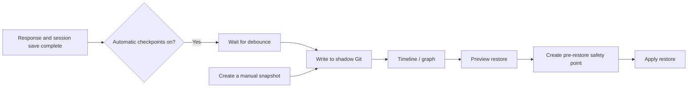

# Magic Commands

Magic commands are special instructions prefixed with `/` that let you **directly control conversation state** without waiting for the AI to interpret your intent.

---

## Conversation Management Commands

Commands for controlling conversation context.

| Command    | Wait   | Continuation State  | Long-term Memory   | Response Content           |
| ---------- | ------ | ------------------- | ------------------ | -------------------------- |
| `/compact` | ⏳ Yes | 📦 Update as needed | ✅ Background save | ✅ Compaction result       |
| `/new`     | ⚡ No  | 🗑️ Clear            | ✅ Background save | ✅ New conversation prompt |
| `/clear`   | ⚡ No  | 🗑️ Clear            | ❌ No save         | ✅ History cleared prompt  |

---

### /compact - Compress Current Conversation

Manually trigger context compaction (**requires waiting**). Under Scroll, eligible older turns are archived while the configured recent tail and active turn remain live. If turns are archived, the continuation summary is updated. Long-term-memory saving can also run in the background when enabled.

```
/compact
```

Optionally, add a one-shot instruction to guide which supported information the continuation summary should prioritize:

```
/compact keep requirements, decisions, and pending tasks; remove debug logs and tool-call details
```

**Example response:**

```
**Compact Complete!**

- Messages archived: 12
- Continuation summary: available via `/compact_str`
- Older turns remain recoverable through Scroll history
```

> 💡 `/compact` requests compaction immediately, but still protects the configured recent tail and active turn.
> 💡 The extra instruction only applies to this manual `/compact` run. Auto-compaction behavior is unchanged.

---

### /new - Clear Context and Save Memory

**Immediately clear the current context** and start a fresh conversation. History is saved to long-term memory in the background.

```
/new
```

**Example response:**

```
**New Conversation Started!**

- Summary task started in background
- Ready for new conversation
```

---

### /clear - Clear Context (Without Saving Memory)

**Immediately clear the current context**, including message history and compressed summaries. Nothing is saved to long-term memory.

```
/clear
```

**Example response:**

```
**History Cleared!**

- Compressed summary reset
- Memory is now empty
```

> ⚠️ **Warning**: `/clear` is **irreversible**! Unlike `/new`, cleared content will not be saved.

---

## Checkpoint Commands

**State checkpoints** maintain a local, restorable history for the current Agent workspace. You can restore an earlier conversation state and optionally restore long-term memory or selected workspace files with it.

> Console: **Agent → Checkpoints**
> Chat: send `/checkpoint`

Checkpoints are designed for frequent saves and quick rollbacks. They are not full-instance backups and never rewrite your project's own Git history. To migrate an instance or preserve global settings and secrets, use [Backup & Restore](./backup).

| Command                                       | Description                                       |
| --------------------------------------------- | ------------------------------------------------- |
| `/checkpoint`                                 | Show checkpoint command help                      |
| `/checkpoint auto [on\|off]`                  | View or change automatic checkpoint status        |
| `/checkpoint snapshot [name]`                 | Create a named snapshot                           |
| `/checkpoint timeline [--limit=N] [--all]`    | View checkpoint history                           |
| `/checkpoint restore <target> [options]`      | Preview or apply a restore                        |
| `/checkpoint gc [--all-sessions] [--compact]` | Preview or clean up old checkpoints               |
| `/checkpoint reset --confirm`                 | Reset checkpoint history and settings to defaults |

---

### When to use checkpoints

| Scenario                                             | Recommended action                           |
| ---------------------------------------------------- | -------------------------------------------- |
| Before a risky conversation or tool operation        | Create a named snapshot                      |
| Return to an earlier conversation state              | Restore the conversation only                |
| Roll back `MEMORY.md` and `memory/` as well          | Restore with memory included                 |
| The Agent accidentally changed a few workspace files | Preview the diff and select only those files |
| Automatic checkpoints consume too much disk space    | Preview and run garbage collection           |

> 💡 Create a **named snapshot** at important milestones. Named snapshots are not removed by automatic garbage collection and make better long-term anchors than timeline numbers.

---

### How it works

Every workspace has an independent shadow Git repository:

```text
<workspace>/checkpoints/
├─ shadow.git/   # Checkpoint objects and refs
├─ heads.json    # Current checkpoint for each session
└─ config.toml   # Automatic-save, retention, and safety settings
```

The shadow repository is completely separate from a project `.git/`. It never creates project branches or commits and never modifies the project's index. Git automatically deduplicates identical objects, so consecutive checkpoints normally add only changed data.



Logical parent metadata records the relationship between checkpoints, allowing the Console to display branching history. If you restore an older checkpoint and continue working, a new branch grows from that point without deleting later checkpoints.

---

### Checkpoint types

| Type                                       | Created by                                                                                         | Retention                          |
| ------------------------------------------ | -------------------------------------------------------------------------------------------------- | ---------------------------------- |
| **Automatic checkpoint** (auto)            | Created in the background after a successful non-command response when automatic saves are enabled | Cleaned according to count and age |
| **Named snapshot** (snapshot)              | Click **Create snapshot** in the Console or run `/checkpoint snapshot`                             | Never removed by automatic GC      |
| **Pre-restore safety point** (pre-restore) | Created automatically before every applied restore                                                 | Kept for 7 days by default         |

**HEAD** in the timeline marks the checkpoint currently selected for a session. It is a state marker, not a fourth checkpoint type, and garbage collection never deletes a session HEAD.

---

### Enable automatic checkpoints

Automatic checkpoints are disabled by default. Turn on **Automatic checkpoints** on the Console's Checkpoints page, or use:

```text
/checkpoint auto           # Show current status
/checkpoint auto on        # Enable
/checkpoint auto off       # Disable
```

Once enabled, QwenPaw creates an automatic checkpoint when all of the following are true:

1. The Agent response completed successfully.
2. The current session was saved successfully.
3. The user input was not a command beginning with `/`.
4. The debounce interval since this session's last automatic checkpoint has elapsed; the default is 1.5 seconds.

Creation runs in the background. If several responses finish close together, debouncing coalesces them to avoid redundant checkpoints.

---

### Create a named snapshot

In the Console, click **Create snapshot** and enter a name. You can also run:

```text
/checkpoint snapshot before-refactor
/checkpoint snapshot "before release"
```

If you omit the name, QwenPaw generates one. Names are normalized into safe ref names; when a session already has the same name, QwenPaw appends a numeric suffix.

---

### View the timeline

The Console provides graph and list views with type, session, and text filters. In chat, use:

```text
/checkpoint timeline
/checkpoint timeline --limit=50
/checkpoint timeline --all
```

- The default view shows the current session's latest 20 records.
- `--limit=N` changes the result count; the default maximum is 200.
- `--all` displays checkpoints from every session in the workspace; without it, only the current session is shown.

A restore target can be:

| Form            | Example           | Meaning                                                                                    |
| --------------- | ----------------- | ------------------------------------------------------------------------------------------ |
| Timeline number | `#3` or `3`       | The third row in the current-session output; the number can change as the timeline changes |
| Snapshot name   | `before-refactor` | A named snapshot in the current session                                                    |
| Commit SHA      | `1a2b3c4`         | A SHA prefix of at least 7 characters                                                      |

> 💡 If you need to reuse a target later, copy its SHA or create a named snapshot instead of relying on a timeline number.

---

### Restore a checkpoint

#### Restore scopes

Every restore includes the **current conversation**. Other scopes must be enabled explicitly:

| Scope                | Default  | Restored content                                              |
| -------------------- | -------- | ------------------------------------------------------------- |
| Current conversation | Included | The current session file and Agent conversation state         |
| Long-term memory     | Excluded | `MEMORY.md` and `memory/`                                     |
| Workspace files      | Excluded | Ordinary workspace files explicitly selected from the preview |

Memory restore does not roll back derived ReMe indexes, caches, digests, resource directories, or `history.db`. Those runtime data remain current and can be regenerated by the system when needed.

#### Restore from the Console

1. Open **Agent → Checkpoints**.
2. Select a checkpoint in the graph or list and click **Restore**.
3. Choose whether to include long-term memory and workspace files.
4. Click **Preview** and inspect everything that would be overwritten, created, or deleted.
5. If workspace files are included, select only the paths you intend to restore.
6. Confirm the restore. The Console applies the exact commit returned by the preview, so a timeline update cannot silently change the target.
7. Refresh the conversation page to load the restored session state.

#### Restore from chat

Restore the conversation only:

```text
/checkpoint restore #3 --dry-run
/checkpoint restore #3 --confirm
```

Restore long-term memory as well:

```text
/checkpoint restore before-refactor --include-memory --dry-run
/checkpoint restore before-refactor --include-memory --confirm
```

Workspace-file restore is always a two-step operation. Preview the candidate changes first:

```text
/checkpoint restore 1a2b3c4 --include-files --dry-run
```

Then explicitly list the paths to apply:

```text
/checkpoint restore 1a2b3c4 --include-files --files README.md "notes/plan v2.md" --confirm
```

You can combine memory and file restore:

```text
/checkpoint restore 1a2b3c4 --include-memory --include-files --files README.md src/example.py --confirm
```

`--files` can be repeated and accepts comma-separated values. Quote paths containing spaces. Every path must be workspace-relative; absolute paths and `..` are rejected.

> ⚠️ If a selected file does not exist in the target checkpoint, restoring it **deletes the current file**. The preview labels these operations as deletions—review each one before confirming.

#### What if I only enter a target?

This command does not modify anything:

```text
/checkpoint restore #3
```

QwenPaw returns the corresponding preview and confirmation commands. `--dry-run` and `--confirm` are mutually exclusive, and an applied restore always requires explicit `--confirm`.

---

### Restore safety

Checkpoint restore uses several layers of protection:

1. **Preview first**: `--dry-run` computes changes without writing to the workspace.
2. **Pin the target**: the Console applies the exact commit SHA returned by the preview.
3. **Pause internal writers**: an applied restore pauses cooperating internal schedulers and waits for tracked Agent tasks.
4. **Create a safety point**: QwenPaw creates a pre-restore checkpoint before changing anything.
5. **Roll back on failure**: if applying the restore fails, QwenPaw attempts to restore changed paths and the session HEAD.

If internal tasks do not finish before the safety timeout, the restore is cancelled instead of forcing an overwrite. Wait for the tasks to finish, then preview and restore again.

> ⚠️ Internal coordination cannot pause external editors, scripts, or other processes. Avoid external writes to the same workspace during restore. If files change after a preview, cancel and preview again.

A restore can only use checkpoints accessible to the current session. Other sessions may be visible in the Console, but cannot be used to overwrite the wrong session identity.

---

### Clean up old checkpoints

The default retention policy is:

| Object                    | Default policy                                                                           |
| ------------------------- | ---------------------------------------------------------------------------------------- |
| Automatic checkpoints     | Keep the newest 20 per session, or records younger than 7 days                           |
| Pre-restore safety points | Keep for 7 days                                                                          |
| Named snapshots           | Excluded from GC; removed when their session is deleted or the checkpoint store is reset |
| Session HEAD              | Always keep                                                                              |

The automatic-checkpoint count and age rules use OR semantics: a checkpoint is kept if it is among the newest 20 or is less than 7 days old.

The Console lets you preview normal cleanup or **thorough compaction** before confirming. Chat commands:

```text
/checkpoint gc --dry-run
/checkpoint gc --confirm
/checkpoint gc --all-sessions --dry-run
/checkpoint gc --all-sessions --confirm
/checkpoint gc --compact --dry-run
/checkpoint gc --compact --confirm
```

- GC handles the current session by default; `--all-sessions` handles every session in the workspace.
- `--compact` removes every non-HEAD automatic checkpoint. Named snapshots remain, and pre-restore points still follow their age policy.
- Without `--dry-run` or `--confirm`, the command only displays confirmation instructions.

---

### Stored content and boundaries

Checkpoints store conversation state, memory source files, and ordinary workspace content needed for restore, while excluding runtime state that should not be rolled back.

| Category                              | Behavior                                                                                              |
| ------------------------------------- | ----------------------------------------------------------------------------------------------------- |
| `sessions/`                           | Stored and handled by conversation restore                                                            |
| `MEMORY.md`, `memory/`                | Stored and restored only when memory is included                                                      |
| Ordinary workspace files              | Stored and restored only after explicit selection                                                     |
| Project `.git/`                       | Excluded; project history is never modified                                                           |
| `checkpoints/`                        | Excluded so the shadow repository never snapshots itself                                              |
| Credentials and runtime configuration | Excluded, including `credentials.yaml`, `agent.json`, and `access_control.json`                       |
| QwenPaw runtime state                 | Excluded, including `history.db`, cron state, caches, derived memory indexes, media, and tool results |
| Persona and runtime skill files       | Excluded, including `AGENTS.md`, `SOUL.md`, and `skills/`                                             |
| Development artifacts                 | Excluded, including `.venv/`, `node_modules/`, `dist/`, `build/`, logs, and Python caches             |

Checkpoints use their own exclusion rules; a workspace `.gitignore` does not narrow the checkpoint boundary. Binary files and line endings are stored byte-for-byte, and the shadow repository disables Git filters that could rewrite content.

> ⚠️ Ordinary workspace files can still contain sensitive information you created. Checkpoints stay inside the local workspace, so protect `<workspace>/checkpoints/` as you would the workspace itself.

---

### Configuration

The configuration file is created at `<workspace>/checkpoints/config.toml`:

```toml
[gc]
gc_keep_count = 20
gc_keep_days = 7
pre_restore_retention_days = 7

[auto]
enabled = false
debounce_seconds = 1.5

[timeline]
default_limit = 20
max_limit = 200

[display]
query_preview_chars = 120

[safety]
include_memory_quiesce_timeout = 30.0
```

| Setting                          | Meaning                                                     |
| -------------------------------- | ----------------------------------------------------------- |
| `gc_keep_count`                  | Number of newest automatic checkpoints retained per session |
| `gc_keep_days`                   | Age-based retention for automatic checkpoints               |
| `pre_restore_retention_days`     | Retention for pre-restore safety points                     |
| `enabled`                        | Whether automatic checkpoints are enabled                   |
| `debounce_seconds`               | Per-session debounce interval for automatic checkpoints     |
| `default_limit` / `max_limit`    | Default and maximum timeline result counts                  |
| `query_preview_chars`            | Maximum user-query preview length in the timeline           |
| `include_memory_quiesce_timeout` | Maximum seconds to wait for internal tasks before restore   |

The Console can edit the three GC retention settings directly. Edit the TOML file for the other advanced settings. Invalid or out-of-range values fall back to safe defaults.

---

### Reset checkpoints

Reset deletes all checkpoint history for the current workspace and reinitializes the shadow repository:

```text
/checkpoint reset --confirm
```

Automatic checkpoints return to the disabled state after reset. Reset does not delete the current conversation, long-term memory, or ordinary workspace files, but removed checkpoint history can no longer be recovered through QwenPaw.

---

### Checkpoints vs. backups vs. project Git

| Capability                   | State checkpoints       | Backup & Restore                                    | Project Git            |
| ---------------------------- | ----------------------- | --------------------------------------------------- | ---------------------- |
| Primary purpose              | Frequent state rollback | Migration and disaster recovery                     | Source version control |
| Scope                        | One Agent workspace     | Agents, global config, skill pool, optional secrets | Project-tracked files  |
| Conversation state           | Yes                     | Yes                                                 | Usually no             |
| Selective file restore       | Yes                     | By backup module                                    | Yes                    |
| Rewrites project Git history | No                      | No                                                  | Yes                    |
| Portable archive             | No                      | Yes                                                 | Depends on a remote    |

The three tools complement each other: use checkpoints for everyday rollback, project Git for code, and backups before upgrades or for cross-device migration.

---

### FAQ

#### Why does QwenPaw say Git is missing?

Checkpoints require Git on the local machine. Install it from [git-scm.com](https://git-scm.com/downloads), verify that `git` works in a terminal, and restart QwenPaw.

#### Why does the conversation page still show the old state after restore?

The page may still hold the pre-restore session in memory. Refresh the conversation page or reopen the session to load the restored state.

#### Why is a file missing from the restore candidates?

Unchanged files are not listed. Conversation, memory, and QwenPaw runtime files are also excluded from ordinary file candidates because dedicated restore flows handle them or they are intentionally not restorable.

#### Can I return to the state from before a restore?

Yes. Every applied restore creates a pre-restore safety point first. It is kept for 7 days by default and can be found and previewed in the timeline.

#### Will the checkpoint store grow forever?

Git deduplicates identical content, and automatic GC removes old refs according to the retention policy. You should still review storage statistics periodically and run cleanup after inspecting its preview.

---

## Conversation Debugging Commands

Commands for viewing and managing conversation history.

| Command             | Response Content              |
| ------------------- | ----------------------------- |
| `/history`          | 📋 Message list + Token stats |
| `/message`          | 📄 Specified message details  |
| `/compact_str`      | 📝 Compressed summary content |
| `/summarize_status` | 📊 Summary task status        |
| `/dump_history`     | 📁 Exported history file path |
| `/load_history`     | ✅ History load result        |

---

### /history - View Current Conversation History

Display a list of all uncompressed messages in the current conversation, along with detailed **context usage information**.

```
/history
```

**Example response:**

```
**Conversation History**

- Total messages: 3
- Estimated tokens: 1256
- Max input length: 128000
- Context usage: 0.98%
- Compressed summary tokens: 128

[1] **user** (text_tokens=42)
    content: [text(tokens=42)]
    preview: Write me a Python function...

[2] **assistant** (text_tokens=256)
    content: [text(tokens=256)]
    preview: Sure, let me write a function for you...

[3] **user** (text_tokens=28)
    content: [text(tokens=28)]
    preview: Can you add error handling?

---

- Use /message <index> to view full message content
- Use /compact_str to view full compact summary
```

> 💡 **Tip**: Use `/history` frequently to monitor your context usage.
>
> When `Context usage` approaches 75%, the conversation is about to trigger auto-`compact`.
>
> If context exceeds the maximum limit, please report the model and `/history` logs to the community, then use `/compact` or `/new` to manage context.
>
> Token calculation logic: [ReMeInMemoryMemory implementation](https://github.com/agentscope-ai/ReMe/blob/v0.3.0.6b2/reme/memory/file_based/reme_in_memory_memory.py#L122).

---

### /message - View Single Message

View detailed content of a specific message by index.

```
/message <index>
```

**Parameters:**

- `index` - Message index number (starting from 1)

**Example:**

```
/message 1
```

**Output:**

```
**Message 1/3**

- **Timestamp:** 2024-01-15 10:30:00
- **Name:** user
- **Role:** user
- **Content:**
Write me a Python function that implements quicksort
```

---

### /compact_str - View Compressed Summary

Display the current continuation summary under Scroll. This is the compact task state used for continuity, not the full archived transcript or the internal retrieval index. Native compatibility mode continues to show its compressed summary.

```
/compact_str
```

**Example response (when summary exists):**

```
**Continuation Summary**

## Active Task
Build a user authentication system.
Status: in_progress

## Current State
- Login endpoint implementation completed.
```

**Example response (when no summary):**

```
**No Continuation Summary**

- Scroll has not generated a continuation summary yet
- Use `/compact` or wait for auto-compaction
- Archived turns remain recoverable through Scroll history
```

---

### /summarize_status - View Summary Task Status

Display the running status of all background summary tasks, including task ID, start time, and execution results.

```
/summarize_status
```

**Example response:**

```
**Summary Task Status**

- **task-001**
  - Start: 2024-01-15 10:30:00
  - Status: completed
  - Result: User requested help building a user authentication system...
- **task-002**
  - Start: 2024-01-15 10:35:00
  - Status: failed
  - Error: Summary generation timeout
```

> 💡 Using `/compact` or `/new` automatically starts a summary task in the background. Use this command to check its execution status.

---

### /dump_history - Export Conversation History

Save current conversation history (including compressed summary) to a JSONL file for debugging and backup.

```
/dump_history
```

**Example response:**

```
**History Dumped!**

- Messages saved: 15
- Has summary: True
- File: `/path/to/workspace/debug_history.jsonl`
```

> 💡 **Tip**: The exported file can be used with `/load_history` to restore conversation history, or for debugging analysis.

---

### /load_history - Load Conversation History

Load conversation history from a JSONL file into current memory. **Existing memory will be cleared first**.

```
/load_history
```

**Example response:**

```
**History Loaded!**

- Messages loaded: 15
- Has summary: True
- File: `/path/to/workspace/debug_history.jsonl`
- Memory cleared before loading
```

**Notes:**

- File source: Loaded from `debug_history.jsonl` in the workspace directory
- Maximum load: 10,000 messages
- If the first message in the file contains a compressed summary marker, the summary will be restored automatically
- Current memory is **cleared before loading** — make sure to backup important content

> ⚠️ **Warning**: `/load_history` clears current memory before loading. Existing conversation will be lost!

---

## Skill Chat Commands

These commands let you inspect skill status in chat and force the agent to use
a specific skill.

- `/skills` lists skills available in the current channel in a compact format.
- `/<skill_name>` shows detailed information for that skill, including its
  description and local path.
- `/<skill_name> <input>` forces the agent to use `skill_name` to solve the
  input, usually a task.
- `/[skill_name]` is also supported as an alternate form.

Notes:

- `skill_name` must match the skill command name shown in `/skills`.
- These slash commands only work for skills that are enabled and routed to the
  current channel.

---

## Model Management Commands

Commands for managing and switching AI models. These commands execute directly without going through the Agent.

| Command                          | Description                                      | Chat |
| -------------------------------- | ------------------------------------------------ | ---- |
| `/model`                         | Show current active model                        | ✅   |
| `/model -h` or `/model help`     | Show help information                            | ✅   |
| `/model list`                    | List all available models                        | ✅   |
| `/model <provider>:<model>`      | Switch to specified model                        | ✅   |
| `/model reset`                   | Reset to global default model                    | ✅   |
| `/model info <provider>:<model>` | Show detailed information about a specific model | ✅   |

---

### /model - Show Current Model

Display the currently active model for this agent.

**Usage:**

```
/model
```

**Example response:**

```
**Current Model**

Provider: `openai`
Model: `gpt-4o` ✓

Use `/model list` to see all available models.
```

---

### /model -h or /model help - Show Help

Display help information for all `/model` commands.

**Usage:**

```
/model -h
/model --help
/model help
```

**Example response:**

```
**Model Management Commands**

Manage and switch AI models for the current agent.

**Available Commands:**

`/model` - Show current active model
`/model list` - List all available models
`/model <provider>:<model>` - Switch to specified model
`/model reset` - Reset to global default model
`/model info <provider>:<model>` - Show model information
`/model help` or `/model -h` - Show this help message

**Examples:**

`/model` - Show current model
`/model list` - List all models
`/model openai:gpt-4o` - Switch to GPT-4o
`/model reset` - Reset to global default
`/model info openai:gpt-4o` - Show GPT-4o information

**Capability Indicators:**

🖼️ - Supports image input
🎥 - Supports video input
```

---

### /model list - List All Models

Display all configured providers and their available models. The currently active model is marked with **[ACTIVE]**.

**Usage:**

```
/model list
```

**Example response:**

```
**Available Models**

**OpenAI** (`openai`)
  - `gpt-4o` 🖼️ **[ACTIVE]**
  - `gpt-4o-mini` 🖼️
  - `gpt-3.5-turbo`
  - `my-custom-model` *(user-added)*

**Anthropic** (`anthropic`)
  - `claude-3-5-sonnet-20241022`
  - `claude-3-opus-20240229`

**Google** (`gemini`)
  - `gemini-2.0-flash-exp` 🖼️🎥

---
Total: 3 provider(s), 8 model(s)

Use `/model <provider>:<model>` to switch models.
Example: `/model openai:gpt-4o`
```

**Indicators:**

- 🖼️ - Supports image input
- 🎥 - Supports video input
- _(user-added)_ - User-added model (via `qwenpaw models add-model` command)

---

### /model <provider>:<model> - Switch Model

Switch the current agent to use a different model.

**Usage:**

```
/model <provider>:<model>
```

**Examples:**

```
/model openai:gpt-4o
/model anthropic:claude-3-5-sonnet-20241022
/model gemini:gemini-2.0-flash-exp
```

**Example response:**

```
**Model Switched**

Provider: `anthropic`
Model: `claude-3-5-sonnet-20241022`

The new model will be used for subsequent messages.
```

> 💡 **Tip**: Model changes only affect the current agent. Other agents continue using their configured models.

---

### /model reset - Reset to Global Default

Reset the current agent's model to the global default model configured in the web UI.

**Usage:**

```
/model reset
```

**Example response:**

```
**Model Reset**

Agent model has been reset to global default:

Provider: `openai`
Model: `gpt-4o`

The global default model will be used for subsequent messages.
```

> 💡 **Tip**: Use this command to revert agent-specific model overrides.

---

### /model info - Show Model Information

Display detailed information about a specific model, including capabilities and current status.

**Usage:**

```
/model info <provider>:<model>
```

**Examples:**

```
/model info openai:gpt-4o
/model info anthropic:claude-3-5-sonnet-20241022
```

**Example response:**

```
**Model Information**

**Provider:** `openai` (OpenAI)
**Model ID:** `gpt-4o`
**Model Name:** GPT-4o
**Capabilities:** 🖼️ Image, 🎨 Multimodal
**Probe Source:** documentation

**Status:** ✓ Currently active

---
Use `/model openai:gpt-4o` to switch to this model.
```

---

## System Control Commands

Commands for controlling and monitoring QwenPaw's runtime status. These commands execute directly without going through the Agent.

Send `/daemon <subcommand>` or short names (e.g., `/status`) in chat, or run `qwenpaw daemon <subcommand>` from the terminal.

| Command                             | Description                                                                               | Chat | Terminal |
| ----------------------------------- | ----------------------------------------------------------------------------------------- | ---- | -------- |
| `/stop`                             | Immediately terminate the running task in current session                                 | ✅   | ❌       |
| `/stop session=<session_id>`        | Terminate task in specified session                                                       | ✅   | ❌       |
| `/daemon status` or `/status`       | Show runtime status (config, working directory, memory service)                           | ✅   | ✅       |
| `/daemon restart` or `/restart`     | Zero-downtime reload (chat); prints instructions (terminal)                               | ✅   | ✅       |
| `/daemon reload-config`             | Re-read and validate configuration file                                                   | ✅   | ✅       |
| `/daemon version`                   | Version number, working directory, and log path                                           | ✅   | ✅       |
| `/daemon logs` or `/daemon logs 50` | View last N lines of log (default 100, max 2000, from `qwenpaw.log` in working directory) | ✅   | ✅       |
| `/approval approve [request_id]`    | Approve pending tool execution (or queue head if no ID)                                   | ✅   | ❌       |
| `/approval deny [request_id]`       | Deny pending tool execution with optional reason                                          | ✅   | ❌       |
| `/approval list`                    | List all pending approval requests                                                        | ✅   | ❌       |
| `/approval cancel <request_id>`     | Cancel a specific approval request                                                        | ✅   | ❌       |
| `/approve`                          | Shorthand for `/approval approve`                                                         | ✅   | ❌       |
| `/deny`                             | Shorthand for `/approval deny`                                                            | ✅   | ❌       |

---

### /stop - Stop Task

Immediately terminate the task currently executing in the session. Highest priority command that processes concurrently even when tasks are running.

**Usage:**

```
/stop                       # Stop current session's task
/stop session=<session_id>  # Stop task in specified session
```

> ⚠️ **Warning**: `/stop` immediately terminates the task, which may result in partial data loss.

---

### /daemon status or /status - View Runtime Status

Display current runtime status, including configuration, working directory, and memory service status.

**Usage:**

```
/status                    # In chat
qwenpaw daemon status        # From terminal
```

---

### /daemon restart or /restart - Zero-Downtime Reload

When used in chat, performs zero-downtime reload: reloads channels, cron, and MCP configurations without interrupting the process. Useful for applying channel or MCP configuration changes.

**Usage:**

```
/restart                   # In chat
qwenpaw daemon restart       # From terminal (prints instructions only)
```

> 💡 **Tip**: After modifying channel or MCP configuration, use `/daemon reload-config` first to verify correctness, then use `/daemon restart` to apply changes.

---

### /daemon reload-config - Reload Configuration File

Re-read and validate the configuration file, but does not reload runtime components (channels, cron, MCP). Useful for verifying configuration file changes.

**Usage:**

```
/daemon reload-config           # In chat
qwenpaw daemon reload-config      # From terminal
```

---

### /daemon version - Version Information

Display QwenPaw version number, working directory path, and log file path.

**Usage:**

```
/daemon version            # In chat
qwenpaw daemon version       # From terminal
```

---

### /daemon logs - View Logs

View the last N lines of `qwenpaw.log` in the working directory. Default 100 lines, maximum 2000 lines.

**Usage:**

```
/daemon logs               # Default 100 lines
/daemon logs 50            # Specify 50 lines
qwenpaw daemon logs -n 200   # From terminal, specify 200 lines
```

> 💡 **Tip**: For large log files, this command only reads the last 512KB from the end of the file to ensure fast response times.

---

### /approval - Tool Execution Approval Commands

Manage tool guard approval requests. When `approval_level` is set to `STRICT` or `SMART`, tools with CRITICAL or HIGH findings enter a pending-approval flow. Use these commands to approve, deny, list, or cancel requests.

**Usage:**

```
/approval approve [request_id]           # Approve specific request or queue head
/approval deny [request_id] [reason]     # Deny with optional reason
/approval list                           # List pending approvals (current session)
/approval list --all                     # List all pending approvals (all sessions)
/approval cancel <request_id>            # Cancel a specific request
```

**Shorthands:**

```
/approve                                 # Same as /approval approve
/approve <request_id>                    # Same as /approval approve <request_id>
/deny                                    # Same as /approval deny
/deny <request_id> <reason>              # Same as /approval deny <request_id> <reason>
```

> `/approval list` shows pending approvals for the current session (including child sessions). Use `--all` or `-a` to see all sessions for this agent.

---

### Terminal Usage

All daemon commands support terminal usage (except `/stop` and `/approval` which only work in chat):

```bash
qwenpaw daemon status
qwenpaw daemon restart
qwenpaw daemon reload-config
qwenpaw daemon version
qwenpaw daemon logs -n 50
```

**Multi-agent support:** All terminal commands support the `--agent-id` parameter (defaults to `default`).

```bash
qwenpaw daemon status --agent-id abc123
qwenpaw daemon version --agent-id abc123
```

---

## Goal Mode — Persistent Goal Loop

Set an objective, and the Agent works autonomously across multiple turns until it is done. Suitable for any clear-objective task.

```
/goal <task description>
```

For a full guide, see [Loop Engineering](./loop-engineering).

---

## Mission Mode — Multi-Agent Autonomous Execution

Decompose large tasks into user stories and complete them through a **master → worker → verifier** pipeline with context isolation.

```
/mission <task description>
/mission <task> --max-iterations 30 --verify "pytest tests/"
/mission status             # check progress
/mission list               # list all missions
```

For a full guide, see [Loop Engineering](./loop-engineering).

---

## Proactive Mode - Proactive Notification Mode

Proactive Mode is an intelligent feature that allows the AI agent to actively analyze the user's current session context and screen activities after detecting that the user has been inactive for a prolonged period, and provide relevant assistance and information.

### Core Features

- 🤖 **Intelligent Detection**: Monitors session activity status and triggers when inactivity is detected for a set period
- 🧠 **Context Analysis**: Analyzes user's conversation history and current screen content to identify potential needs
- 🔍 **Goal Extraction**: Extracts topics that the user may be focusing on from conversation history
- 💬 **Proactive Response**: Generates helpful and relevant proactive messages based on analysis results

### Important Notice

**Please be aware of the following risks before enabling this mode:**

- **Tool Protection Bypass**: In this mode, the Agent **bypasses standard tool protection mechanisms**. This means the Agent has higher system privileges and execution freedom.
- **Privacy and Environment Access**: The Agent **reads historical session memory** to understand context and **may take screenshots** to obtain current runtime environment information. Please ensure use in a trusted environment and protect sensitive information.
- This mode is **disabled by default**. It only takes effect when actively enabled by the user and can be disabled after being turned on.

### Basic Usage

#### Enable Proactive Mode

```bash
/proactive
/proactive on
/proactive <minutes>
```

**Example:**

```bash
/proactive      # Default 30 minutes, trigger proactive notification after 30 minutes of inactivity
/proactive on   # Same as above, default 30 minutes
/proactive 60   # Trigger proactive notification after 60 minutes
```

#### Disable Proactive Mode

```bash
/proactive off
```

### How It Works

1. **Monitoring Phase**: Continuously monitors user activity, recording the last activity timestamp
2. **Analysis Phase**: When inactivity exceeding the set time is detected, analyzes recent conversation history
3. **Task Extraction**: Identifies topics the user may be concerned about
4. **Query Execution**: Uses tools like browser, file reading, command execution to obtain relevant information
5. **Response Generation**: Generates friendly and relevant proactive assistance information

#### Context Awareness

- Focuses only on user-initiated messages, ignoring system messages
- Avoids repeatedly sending proactive messages on the same topics
- Prioritizes frequent and recently mentioned topics

### Important Notes

1. **Resource Consumption**: Enables regular context analysis after activation, which may increase computational resource usage
2. **Distraction Control**: If the user does not respond to proactive messages, no consecutive proactive messages will be sent
3. **Model Dependency**: Function effectiveness depends on the AI model capability used; multimodal-enabled models can better utilize screen analysis features

### Typical Use Cases

- New information acquisition during research processes
- Supplementary knowledge provision during learning processes

---
