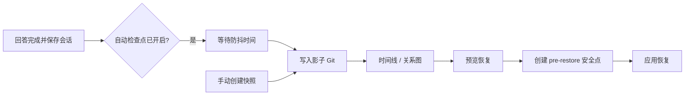

# 魔法命令

魔法命令是一组以 `/` 开头的特殊指令，让你可以**直接控制对话状态**，而不需要等 AI 理解你的意图。

---

## 对话管理命令

控制对话上下文的命令。

| 命令       | 需要等待 | Continuation State | 长期记忆    | 返回内容          |
| ---------- | -------- | ------------------ | ----------- | ----------------- |
| `/compact` | ⏳ 是    | 📦 按需更新        | ✅ 后台保存 | ✅ 本次压缩结果   |
| `/new`     | ⚡ 否    | 🗑️ 清空            | ✅ 后台保存 | ✅ 新对话开始提示 |
| `/clear`   | ⚡ 否    | 🗑️ 清空            | ❌ 不保存   | ✅ 历史清空提示   |

---

### /compact - 压缩当前对话

手动触发上下文压缩（**需要等待**）。在 Scroll 下，符合条件的较早轮次会被归档，同时近期尾部和活动轮次仍保留在 live context 中。发生归档时会更新 continuation summary；启用长期记忆后，还可以在后台执行相应的保存任务。

```
/compact
```

也可以补充一条仅对本次压缩有效的说明，指导 continuation summary 优先保留哪些有证据支持的信息：

```
/compact 保留需求、决策和待办，去掉调试日志和工具调用细节
```

**返回示例：**

```
**Compact Complete!**

- Messages archived: 12
- Continuation summary: available via `/compact_str`
- Older turns remain recoverable through Scroll history
```

> 💡 `/compact` 会立即请求压缩，但仍会保护配置指定的近期尾部和活动轮次。
> 💡 额外说明只作用于这一次手动 `/compact`，不会改变自动压缩行为。

---

### /new - 清空上下文并保存记忆

**立即清空当前上下文**，开始全新对话。后台同时保存历史到长期记忆。

```
/new
```

**返回示例：**

```
**New Conversation Started!**

- Summary task started in background
- Ready for new conversation
```

---

### /clear - 清空上下文（不保存记忆）

**立即清空当前上下文**，包括消息历史和压缩摘要。**不会**保存到长期记忆。

```
/clear
```

**返回示例：**

```
**History Cleared!**

- Compressed summary reset
- Memory is now empty
```

> ⚠️ **警告**：`/clear` 是**不可逆**的！与 `/new` 不同，清除的内容不会被保存。

---

## 状态检查点命令

**状态检查点**为当前 Agent 工作区保存一条可回退的本地历史。你可以恢复某次对话状态，并按需同时恢复长期记忆或指定的工作区文件。

> 控制台入口：**Agent → 检查点**
> 对话入口：发送 `/checkpoint`

检查点适合频繁保存和快速回退，但它不是整机备份，也不会改写项目自身的 Git 历史。需要迁移实例、保存全局配置或密钥时，请使用[备份与恢复](./backup)。

| 命令                                          | 说明                           |
| --------------------------------------------- | ------------------------------ |
| `/checkpoint`                                 | 查看检查点命令帮助             |
| `/checkpoint auto [on\|off]`                  | 查看或切换自动检查点状态       |
| `/checkpoint snapshot [名称]`                 | 创建命名快照                   |
| `/checkpoint timeline [--limit=N] [--all]`    | 查看检查点历史                 |
| `/checkpoint restore <目标> [选项]`           | 预览或执行恢复                 |
| `/checkpoint gc [--all-sessions] [--compact]` | 预览或清理旧检查点             |
| `/checkpoint reset --confirm`                 | 重置检查点历史和配置为默认状态 |

---

### 适合什么场景

| 场景                                       | 推荐操作                         |
| ------------------------------------------ | -------------------------------- |
| 尝试一段高风险对话或工具操作前             | 创建命名快照                     |
| 想回到较早的对话状态                       | 只恢复会话                       |
| 希望连同 `MEMORY.md` 和 `memory/` 一起回退 | 恢复会话并包含记忆               |
| Agent 意外改坏了工作区中的少量文件         | 预览差异后，只选择需要恢复的文件 |
| 自动检查点较多、占用磁盘空间               | 预览并执行垃圾回收               |

> 💡 建议在关键节点创建**命名快照**。命名快照不会被自动垃圾回收删除，比时间线编号更适合作为长期锚点。

---

### 工作原理

每个工作区都有一套独立的影子 Git 仓库，位于：

```text
<workspace>/checkpoints/
├─ shadow.git/   # 检查点对象和引用
├─ heads.json    # 各会话当前所处的检查点
└─ config.toml   # 自动保存、保留策略和安全参数
```

影子仓库与工作区中的项目 `.git/` 完全分离，不会创建项目分支、提交或修改项目索引。相同内容由 Git 对象自动去重，因此连续检查点通常只新增发生变化的数据。



检查点之间的关系由逻辑父节点记录，因此控制台可以显示分支式历史。恢复到旧节点后继续工作，会从该节点形成新的历史分支，而不是删除后面的检查点。

---

### 检查点类型

| 类型                            | 产生方式                                              | 保留规则             |
| ------------------------------- | ----------------------------------------------------- | -------------------- |
| **自动检查点**（auto）          | 开启自动保存后，在非命令回答成功保存时后台创建        | 按数量和天数自动清理 |
| **命名快照**（snapshot）        | 在控制台点击“创建快照”，或执行 `/checkpoint snapshot` | 不参与自动清理       |
| **恢复前安全点**（pre-restore） | 每次真正执行恢复前自动创建                            | 默认保留 7 天        |

时间线中的 **HEAD** 表示当前会话目前指向的检查点。它是一种状态标记，不是第四种检查点；垃圾回收不会删除会话 HEAD。

---

### 开启自动检查点

自动检查点默认关闭。你可以在控制台的“检查点”页面打开**自动检查点**，也可以在对话中使用：

```text
/checkpoint auto           # 查看当前状态
/checkpoint auto on        # 开启
/checkpoint auto off       # 关闭
```

开启后，QwenPaw 会在以下条件都满足时创建自动检查点：

1. Agent 的回答已成功完成；
2. 当前会话已成功保存；
3. 用户输入不是以 `/` 开头的命令；
4. 距离本会话上次自动检查点已超过防抖时间，默认 1.5 秒。

创建工作在后台执行。短时间内连续完成多个回答时，防抖机制会将它们合并，减少重复检查点。

---

### 创建命名快照

在控制台点击右上角的**创建快照**，填写名称后即可保存。也可以在对话中执行：

```text
/checkpoint snapshot before-refactor
/checkpoint snapshot "发布前状态"
```

如果省略名称，QwenPaw 会自动生成一个名称。快照名称会被规范化为安全的引用名；同一会话中出现重名时，系统会自动追加数字后缀。

---

### 查看时间线

控制台支持关系图和列表视图，并可按类型、会话或关键词筛选。对话中可使用：

```text
/checkpoint timeline
/checkpoint timeline --limit=50
/checkpoint timeline --all
```

- 默认显示当前会话最近 20 条记录。
- `--limit=N` 调整返回数量，最大值默认是 200。
- `--all` 显示此工作区中所有会话的检查点；不加时只显示当前会话。

恢复目标可以写成：

| 写法       | 示例              | 说明                                              |
| ---------- | ----------------- | ------------------------------------------------- |
| 时间线编号 | `#3` 或 `3`       | 当前会话输出中的第 3 条；时间线变化后编号可能改变 |
| 快照名称   | `before-refactor` | 当前会话中的命名快照                              |
| 提交 SHA   | `1a2b3c4`         | 至少 7 位的 SHA 前缀                              |

> 💡 需要稍后再次使用同一个目标时，优先复制 SHA 或使用命名快照，不要长期依赖时间线编号。

---

### 恢复检查点

#### 恢复范围

每次恢复都包含**当前会话**，其他范围必须显式开启：

| 范围       | 默认   | 恢复内容                                 |
| ---------- | ------ | ---------------------------------------- |
| 当前会话   | 包含   | 当前会话的 session 文件和 Agent 对话状态 |
| 长期记忆   | 不包含 | `MEMORY.md` 和 `memory/`                 |
| 工作区文件 | 不包含 | 预览中明确选中的普通工作区文件           |

长期记忆恢复不包括 ReMe 的派生索引、缓存、digest、资源目录或 `history.db`。这些运行时数据保持当前状态，并可在需要时由系统重新生成。

#### 在控制台恢复

1. 打开 **Agent → 检查点**。
2. 在关系图或列表中选择目标检查点，点击**恢复**。
3. 选择是否包含长期记忆和工作区文件。
4. 点击**预览**，确认将被覆盖、创建或删除的内容。
5. 如果包含工作区文件，只勾选确实需要恢复的路径。
6. 确认恢复。执行时使用的是预览返回的精确提交，不会因为时间线更新而换成另一个目标。
7. 恢复会话后刷新对话页面，以加载恢复后的状态。

#### 在对话中恢复

只恢复会话：

```text
/checkpoint restore #3 --dry-run
/checkpoint restore #3 --confirm
```

同时恢复长期记忆：

```text
/checkpoint restore before-refactor --include-memory --dry-run
/checkpoint restore before-refactor --include-memory --confirm
```

恢复工作区文件必须分两步。先查看候选差异：

```text
/checkpoint restore 1a2b3c4 --include-files --dry-run
```

再明确列出要应用的路径：

```text
/checkpoint restore 1a2b3c4 --include-files --files README.md "notes/plan v2.md" --confirm
```

也可以同时包含长期记忆：

```text
/checkpoint restore 1a2b3c4 --include-memory --include-files --files README.md src/example.py --confirm
```

`--files` 支持重复使用和逗号分隔。包含空格的路径必须加引号。路径必须是工作区内的相对路径，不能使用绝对路径或 `..`。

> ⚠️ 如果选中的文件在目标检查点中不存在，恢复会**删除当前文件**。预览会把这类操作标记为删除，请在确认前逐项检查。

#### 只输入恢复目标会发生什么

下面的命令不会直接修改任何内容：

```text
/checkpoint restore #3
```

QwenPaw 会返回预览和确认命令。`--dry-run` 与 `--confirm` 互斥；真正恢复必须显式使用 `--confirm`。

---

### 恢复安全机制

检查点恢复包含多层保护：

1. **先预览**：`--dry-run` 只计算变化，不写入工作区。
2. **固定目标**：控制台执行恢复时使用预览得到的精确提交 SHA。
3. **暂停内部写入**：执行恢复时暂停可协作的内部调度，并等待已跟踪的 Agent 任务结束。
4. **创建安全点**：修改任何内容前自动保存 pre-restore 检查点。
5. **失败回滚**：应用过程中出错时，QwenPaw 会尝试恢复已修改的路径和会话 HEAD。

如果内部任务在安全超时时间内没有结束，本次恢复会取消，不会强行覆盖。待任务完成后重新预览并恢复即可。

> ⚠️ 内部锁无法暂停外部编辑器、脚本或其他进程。恢复期间请不要让外部程序继续修改同一工作区；如果预览后文件又发生变化，建议取消并重新预览。

恢复只允许使用当前会话可访问的检查点。不同会话的历史可以在控制台中查看，但不能借此覆盖错误的会话身份。

---

### 清理旧检查点

默认保留策略如下：

| 对象         | 默认策略                                          |
| ------------ | ------------------------------------------------- |
| 自动检查点   | 每个会话保留最新 20 条，或保留 7 天内的记录       |
| 恢复前安全点 | 保留 7 天                                         |
| 命名快照     | 不参与 GC；删除所属会话或重置检查点存储时一并删除 |
| 会话 HEAD    | 始终保留                                          |

自动检查点的数量和天数条件是“或”的关系：位于最新 20 条之内，或者创建时间不足 7 天，都会继续保留。

在控制台中可以先预览普通清理或**彻底压缩**，确认后再执行。命令行用法：

```text
/checkpoint gc --dry-run
/checkpoint gc --confirm
/checkpoint gc --all-sessions --dry-run
/checkpoint gc --all-sessions --confirm
/checkpoint gc --compact --dry-run
/checkpoint gc --compact --confirm
```

- 默认只处理当前会话；`--all-sessions` 处理此工作区的全部会话。
- `--compact` 会删除所有非 HEAD 的自动检查点；命名快照仍然保留，恢复前安全点仍按保留天数处理。
- 不带 `--dry-run` 或 `--confirm` 时，只显示确认说明。

---

### 保存内容与边界

检查点会保存恢复所需的会话、记忆源文件和普通工作区内容，同时排除不应回退的运行时状态。

| 类别                   | 行为                                                                        |
| ---------------------- | --------------------------------------------------------------------------- |
| `sessions/`            | 保存；由“会话恢复”处理                                                      |
| `MEMORY.md`、`memory/` | 保存；仅在选择“包含记忆”时恢复                                              |
| 普通工作区文件         | 保存；仅在预览后明确选择时恢复                                              |
| 项目 `.git/`           | 排除，不修改项目历史                                                        |
| `checkpoints/`         | 排除，避免影子仓库保存自身                                                  |
| 凭据和运行时配置       | 排除，例如 `credentials.yaml`、`agent.json`、`access_control.json`          |
| QwenPaw 运行时状态     | 排除，例如 `history.db`、cron 状态、缓存、派生记忆索引、媒体和工具结果      |
| 人设与技能运行文件     | 排除，例如 `AGENTS.md`、`SOUL.md`、`skills/`                                |
| 开发产物               | 排除，例如 `.venv/`、`node_modules/`、`dist/`、`build/`、日志和 Python 缓存 |

检查点使用自己的排除规则，工作区 `.gitignore` 不会缩小检查点范围。二进制文件和换行符按字节保存，影子仓库也会关闭可能改写内容的 Git 过滤器。

> ⚠️ 普通工作区文件可能包含你自行保存的敏感信息。检查点存储在本机工作区内，请像保护工作区本身一样保护 `<workspace>/checkpoints/`。

---

### 配置

配置文件位于 `<workspace>/checkpoints/config.toml`，首次使用时自动创建：

```toml
[gc]
gc_keep_count = 20
gc_keep_days = 7
pre_restore_retention_days = 7

[auto]
enabled = false
debounce_seconds = 1.5

[timeline]
default_limit = 20
max_limit = 200

[display]
query_preview_chars = 120

[safety]
include_memory_quiesce_timeout = 30.0
```

| 配置项                           | 说明                               |
| -------------------------------- | ---------------------------------- |
| `gc_keep_count`                  | 每个会话按数量保留的最新自动检查点 |
| `gc_keep_days`                   | 自动检查点按时间保留的天数         |
| `pre_restore_retention_days`     | 恢复前安全点的保留天数             |
| `enabled`                        | 是否启用自动检查点                 |
| `debounce_seconds`               | 同一会话自动检查点的防抖时间       |
| `default_limit` / `max_limit`    | 时间线默认和最大返回数量           |
| `query_preview_chars`            | 时间线中用户输入摘要的最大字符数   |
| `include_memory_quiesce_timeout` | 恢复前等待内部任务结束的最长秒数   |

控制台可以直接修改三项垃圾回收保留参数；其他高级参数可编辑此 TOML 文件。无效或超出范围的值会回退到安全默认值。

---

### 重置检查点

重置会删除当前工作区的全部检查点历史并重新初始化影子仓库：

```text
/checkpoint reset --confirm
```

重置后自动检查点会恢复为关闭状态。此操作不会删除当前会话、长期记忆或普通工作区文件，但删除的检查点历史无法再通过 QwenPaw 恢复。

---

### 与备份和项目 Git 的区别

| 能力              | 状态检查点        | 备份与恢复                        | 项目 Git       |
| ----------------- | ----------------- | --------------------------------- | -------------- |
| 主要用途          | 高频状态回退      | 整体迁移和灾难恢复                | 源代码版本管理 |
| 范围              | 单个 Agent 工作区 | Agent、全局配置、技能池、可选密钥 | 项目已跟踪文件 |
| 对话状态          | 支持              | 支持                              | 通常不支持     |
| 选择性文件恢复    | 支持              | 以备份模块为单位                  | 支持           |
| 修改项目 Git 历史 | 否                | 否                                | 是             |
| 可移植归档        | 否                | 是                                | 取决于远端仓库 |

实际使用时，三者可以互补：用检查点处理日常回退，用项目 Git 管理代码，用备份完成升级前保护或跨设备迁移。

---

### 常见问题

#### 为什么提示找不到 Git？

检查点依赖本机 Git。请从 [git-scm.com](https://git-scm.com/downloads) 安装 Git，确认终端中可以执行 `git`，然后重启 QwenPaw。

#### 为什么恢复成功后，对话页面还是旧内容？

页面可能仍持有恢复前的会话状态。刷新对话页面或重新打开会话即可加载恢复后的内容。

#### 为什么某些文件没有出现在恢复候选中？

没有变化的文件不会出现。会话、记忆和 QwenPaw 运行时文件也不会作为普通文件候选，它们分别由专用恢复流程处理或被明确排除。

#### 恢复后还能回到恢复前吗？

可以。每次真正恢复前都会创建 pre-restore 安全点。它默认保留 7 天，可在时间线中找到并再次预览。

#### 检查点会越来越大吗？

Git 会对相同内容去重，自动垃圾回收也会按保留策略删除旧引用。仍建议定期查看控制台中的统计信息，并在确认预览结果后执行清理。

---

## 对话调试命令

查看和管理对话历史的命令。

| 命令                | 返回内容                 |
| ------------------- | ------------------------ |
| `/history`          | 📋 消息列表 + Token 统计 |
| `/message`          | 📄 指定消息详情          |
| `/compact_str`      | 📝 压缩摘要内容          |
| `/summarize_status` | 📊 摘要任务状态          |
| `/dump_history`     | 📁 历史导出文件路径      |
| `/load_history`     | ✅ 历史加载结果          |

---

### /history - 查看当前对话历史

显示当前对话中所有未压缩的消息列表，以及详细的**上下文占用情况**。

```
/history
```

**返回示例：**

```
**Conversation History**

- Total messages: 3
- Estimated tokens: 1256
- Max input length: 128000
- Context usage: 0.98%
- Compressed summary tokens: 128

[1] **user** (text_tokens=42)
    content: [text(tokens=42)]
    preview: 帮我写一个 Python 函数...

[2] **assistant** (text_tokens=256)
    content: [text(tokens=256)]
    preview: 好的，我来帮你写一个函数...

[3] **user** (text_tokens=28)
    content: [text(tokens=28)]
    preview: 能不能加上错误处理？

---

- Use /message <index> to view full message content
- Use /compact_str to view full compact summary
```

> 💡 **提示**：建议多使用 `/history` 命令了解当前上下文占用情况。
>
> 当 `Context usage` 接近 75% 时，对话即将触发自动 `compact`。
>
> 如果出现上下文超过最大上限的情况，请向社区反馈对应的模型和 `/history` 日志，然后主动使用 `/compact` 或 `/new` 来管理上下文。
>
> Token计算逻辑详见 [ReMeInMemoryMemory 实现](https://github.com/agentscope-ai/ReMe/blob/v0.3.0.6b2/reme/memory/file_based/reme_in_memory_memory.py#L122)。

---

### /message - 查看单条消息

查看当前对话中指定索引的消息详细内容。

```
/message <index>
```

**参数：**

- `index` - 消息索引号（从 1 开始）

**示例：**

```
/message 1
```

**输出：**

```
**Message 1/3**

- **Timestamp:** 2024-01-15 10:30:00
- **Name:** user
- **Role:** user
- **Content:**
帮我写一个 Python 函数，实现快速排序算法
```

---

### /compact_str - 查看压缩摘要

在 Scroll 下显示当前 continuation summary。它是用于延续任务的紧凑状态，不是完整归档原文或内部检索索引。Native 兼容模式仍显示其 compressed summary。

```
/compact_str
```

**返回示例（有摘要时）：**

```
**Continuation Summary**

## Active Task
构建用户认证系统。
Status: in_progress

## Current State
- 登录接口已经完成。
```

**返回示例（无摘要时）：**

```
**No Continuation Summary**

- Scroll has not generated a continuation summary yet
- Use `/compact` or wait for auto-compaction
- Archived turns remain recoverable through Scroll history
```

---

### /summarize_status - 查看摘要任务状态

显示所有后台摘要任务的运行状态，包括任务 ID、开始时间和执行结果。

```
/summarize_status
```

**返回示例：**

```
**Summary Task Status**

- **task-001**
  - Start: 2024-01-15 10:30:00
  - Status: completed
  - Result: 用户请求帮助构建用户认证系统...
- **task-002**
  - Start: 2024-01-15 10:35:00
  - Status: failed
  - Error: Summary generation timeout
```

> 💡 使用 `/compact` 或 `/new` 时会自动在后台启动摘要任务，可通过此命令查看其执行情况。

---

### /dump_history - 导出对话历史

将当前对话历史（包括压缩摘要）保存到 JSONL 文件，便于调试和备份。

```
/dump_history
```

**返回示例：**

```
**History Dumped!**

- Messages saved: 15
- Has summary: True
- File: `/path/to/workspace/debug_history.jsonl`
```

> 💡 **提示**：导出的文件可用于 `/load_history` 恢复对话历史，也可用于调试分析。

---

### /load_history - 加载对话历史

从 JSONL 文件加载对话历史到当前内存，**会先清空现有内存**。

```
/load_history
```

**返回示例：**

```
**History Loaded!**

- Messages loaded: 15
- Has summary: True
- File: `/path/to/workspace/debug_history.jsonl`
- Memory cleared before loading
```

**注意事项：**

- 文件来源：从工作目录下的 `debug_history.jsonl` 加载
- 最大加载：10000 条消息
- 如果文件第一条消息包含压缩摘要标记，会自动恢复压缩摘要
- 加载前会**清空当前内存**，请确保已备份重要内容

> ⚠️ **警告**：`/load_history` 会清空当前内存后再加载，现有对话将丢失！

---

## Skill 聊天命令

提供以下命令，在聊天中可以访问 skill 状态，并强制 Agent 使用某个
skill。

- `/skills` 会以精简格式列出当前频道可用的 skill。
- `/<skill_name>` 会显示该 skill 的详细信息，包括 description 和本地
  path。
- `/<skill_name> <input>` 会使 Agent 强制调用 `skill_name`，解决 input
  （通常是个任务）。
- `/[skill_name]` 也支持以上操作，可作为另一种写法。

说明：

- `skill_name` 以 `/skills` 里显示的技能命令名为准。
- 这些斜杠命令只对当前频道中已启用且路由到该频道的 skill 生效。

---

## 模型管理命令

管理和切换 AI 模型的命令，无需通过 Agent 理解意图，直接执行。

| 命令                             | 说明                   | 对话 |
| -------------------------------- | ---------------------- | ---- |
| `/model`                         | 显示当前使用的模型     | ✅   |
| `/model -h` 或 `/model help`     | 显示帮助信息           | ✅   |
| `/model list`                    | 列出所有可用模型       | ✅   |
| `/model <provider>:<model>`      | 切换到指定模型         | ✅   |
| `/model reset`                   | 重置为全局默认模型     | ✅   |
| `/model info <provider>:<model>` | 显示指定模型的详细信息 | ✅   |

---

### `/model` - 显示当前模型

显示当前 Agent 正在使用的模型。

**用法：**

```
/model
```

**返回示例：**

```
**Current Model**

Provider: `openai`
Model: `gpt-4o` ✓

Use `/model list` to see all available models.
```

---

### `/model -h` 或 `/model help` - 显示帮助

显示所有 `/model` 命令的帮助信息。

**用法：**

```
/model -h
/model --help
/model help
```

**返回示例：**

```
**Model Management Commands**

Manage and switch AI models for the current agent.

**Available Commands:**

`/model` - Show current active model
`/model list` - List all available models
`/model <provider>:<model>` - Switch to specified model
`/model reset` - Reset to global default model
`/model info <provider>:<model>` - Show model information
`/model help` or `/model -h` - Show this help message

**Examples:**

`/model` - Show current model
`/model list` - List all models
`/model openai:gpt-4o` - Switch to GPT-4o
`/model reset` - Reset to global default
`/model info openai:gpt-4o` - Show GPT-4o information

**Capability Indicators:**

🖼️ - Supports image input
🎥 - Supports video input
```

---

### `/model list` - 列出所有模型

显示所有已配置的 Provider 及其可用模型。当前激活的模型会标记为 **[ACTIVE]**。

**用法：**

```
/model list
```

**返回示例：**

```
**Available Models**

**OpenAI** (`openai`)
  - `gpt-4o` 🖼️ **[ACTIVE]**
  - `gpt-4o-mini` 🖼️
  - `gpt-3.5-turbo`
  - `my-custom-model` *(user-added)*

**Anthropic** (`anthropic`)
  - `claude-3-5-sonnet-20241022`
  - `claude-3-opus-20240229`

**Google** (`gemini`)
  - `gemini-2.0-flash-exp` 🖼️🎥

---
Total: 3 provider(s), 8 model(s)

Use `/model <provider>:<model>` to switch models.
Example: `/model openai:gpt-4o`
```

**标识说明：**

- 🖼️ - 支持图片输入
- 🎥 - 支持视频输入
- _(user-added)_ - 用户手动添加的模型（通过 `qwenpaw models add-model` 命令）

---

### `/model <provider>:<model>` - 切换模型

将当前 Agent 切换到使用不同的模型。

**用法：**

```
/model <provider>:<model>
```

**示例：**

```
/model openai:gpt-4o
/model anthropic:claude-3-5-sonnet-20241022
/model gemini:gemini-2.0-flash-exp
```

**返回示例：**

```
**Model Switched**

Provider: `anthropic`
Model: `claude-3-5-sonnet-20241022`

The new model will be used for subsequent messages.
```

> 💡 **提示**：模型切换只影响当前 Agent，其他 Agent 继续使用各自配置的模型。

---

### `/model reset` - 重置为全局默认模型

将当前 Agent 的模型重置为在 Web UI 中配置的全局默认模型。

**用法：**

```
/model reset
```

**返回示例：**

```
**Model Reset**

Agent model has been reset to global default:

Provider: `openai`
Model: `gpt-4o`

The global default model will be used for subsequent messages.
```

> 💡 **提示**：使用此命令可以撤销 Agent 级别的模型覆盖设置。

---

### `/model info` - 显示模型信息

显示指定模型的详细信息，包括能力和当前状态。

**用法：**

```
/model info <provider>:<model>
```

**示例：**

```
/model info openai:gpt-4o
/model info anthropic:claude-3-5-sonnet-20241022
```

**返回示例：**

```
**Model Information**

**Provider:** `openai` (OpenAI)
**Model ID:** `gpt-4o`
**Model Name:** GPT-4o
**Capabilities:** 🖼️ Image, 🎨 Multimodal
**Probe Source:** documentation

**Status:** ✓ Currently active

---
Use `/model openai:gpt-4o` to switch to this model.
```

---

## 系统控制命令

控制和监控 QwenPaw 运行状态的命令，无需通过 Agent 理解意图，直接执行。

可在对话中发送 `/daemon <子命令>` 或短名（如 `/status`），也可在终端执行 `qwenpaw daemon <子命令>`。

| 命令                                | 说明                                                                         | 对话 | 终端 |
| ----------------------------------- | ---------------------------------------------------------------------------- | ---- | ---- |
| `/stop`                             | 立即终止当前会话的运行中任务                                                 | ✅   | ❌   |
| `/stop session=<session_id>`        | 终止指定会话的任务                                                           | ✅   | ❌   |
| `/daemon status` 或 `/status`       | 查看运行状态（配置、工作目录、记忆服务）                                     | ✅   | ✅   |
| `/daemon restart` 或 `/restart`     | 零停机重载（对话中）；终端中打印说明                                         | ✅   | ✅   |
| `/daemon reload-config`             | 重新读取并校验配置文件                                                       | ✅   | ✅   |
| `/daemon version`                   | 版本号、工作目录与日志路径                                                   | ✅   | ✅   |
| `/daemon logs` 或 `/daemon logs 50` | 查看最近 N 行日志（默认 100 行，最大 2000 行，来自工作目录下 `qwenpaw.log`） | ✅   | ✅   |
| `/approval approve [request_id]`    | 批准待审的工具调用（无 ID 则批准队首）                                       | ✅   | ❌   |
| `/approval deny [request_id]`       | 拒绝待审的工具调用，可附理由                                                 | ✅   | ❌   |
| `/approval list`                    | 列出所有待审批请求                                                           | ✅   | ❌   |
| `/approval cancel <request_id>`     | 取消指定审批请求                                                             | ✅   | ❌   |
| `/approve`                          | `/approval approve` 的快捷方式                                               | ✅   | ❌   |
| `/deny`                             | `/approval deny` 的快捷方式                                                  | ✅   | ❌   |

---

### `/stop` - 停止任务

立即终止当前会话中正在执行的任务。优先级最高，即使有任务正在执行也能并发处理。

**用法：**

```
/stop                       # 停止当前会话的任务
/stop session=<session_id>  # 停止指定会话的任务
```

> ⚠️ **警告**：`/stop` 会立即终止任务，可能导致部分结果丢失。

---

### `/daemon status` 或 `/status` - 查看运行状态

显示当前运行状态，包括配置加载情况、工作目录、记忆服务状态等。

**用法：**

```
/status                    # 在对话中
qwenpaw daemon status        # 在终端
```

---

### `/daemon restart` 或 `/restart` - 零停机重载

在对话中使用时，执行零停机重载：重新加载 channels、cron、MCP 配置，但不中断进程。适用于修改频道、MCP 配置后使其生效。

**用法：**

```
/restart                   # 在对话中
qwenpaw daemon restart       # 在终端（仅打印说明）
```

> 💡 **提示**：修改频道或 MCP 配置后，先用 `/daemon reload-config` 验证配置正确性，再用 `/daemon restart` 使其生效。

---

### `/daemon reload-config` - 重载配置文件

重新读取配置文件并校验语法，但不重载运行时组件（channels、cron、MCP）。适用于验证配置文件修改是否正确。

**用法：**

```
/daemon reload-config           # 在对话中
qwenpaw daemon reload-config      # 在终端
```

---

### `/daemon version` - 版本信息

显示 QwenPaw 版本号、工作目录路径、日志文件路径。

**用法：**

```
/daemon version            # 在对话中
qwenpaw daemon version       # 在终端
```

---

### `/daemon logs` - 查看日志

查看工作目录下 `qwenpaw.log` 的最近 N 行日志。默认 100 行，最大 2000 行。

**用法：**

```
/daemon logs               # 默认 100 行
/daemon logs 50            # 指定 50 行
qwenpaw daemon logs -n 200   # 在终端指定 200 行
```

> 💡 **提示**：日志文件较大时，此命令只读取文件末尾最多 512KB 内容，确保响应速度。

---

### `/approval` - 工具执行审批命令

管理工具审批请求。当 `approval_level` 设为 `STRICT` 或 `SMART` 时，存在 CRITICAL 或 HIGH 级别发现的工具调用会进入待审批队列，使用这些命令进行批准、拒绝、列表查看或取消操作。

**用法：**

```
/approval approve [request_id]           # 批准指定请求或队首请求
/approval deny [request_id] [reason]     # 拒绝并附理由
/approval list                           # 列出当前会话的待审批项
/approval list --all                     # 列出所有会话的待审批项
/approval cancel <request_id>            # 取消指定请求
```

**快捷方式：**

```
/approve                                 # 等同于 /approval approve
/approve <request_id>                    # 等同于 /approval approve <request_id>
/deny                                    # 等同于 /approval deny
/deny <request_id> <reason>              # 等同于 /approval deny <request_id> <reason>
```

> `/approval list` 显示当前会话（含子会话）的待审批项。使用 `--all` 或 `-a` 查看该 Agent 所有会话的待审批项。

---

### 终端使用

所有 daemon 命令都支持在终端中使用（除 `/stop` 和 `/approval` 仅在对话中有效）：

```bash
qwenpaw daemon status
qwenpaw daemon restart
qwenpaw daemon reload-config
qwenpaw daemon version
qwenpaw daemon logs -n 50
```

**多智能体支持：** 所有终端命令都支持 `--agent-id` 参数（默认为 `default`）。

```bash
qwenpaw daemon status --agent-id abc123
qwenpaw daemon version --agent-id abc123
```

---

## Goal 模式 — 持续目标循环

设定一个目标，Agent 自主工作多个回合直到完成。适用于任何目标明确的持续任务。

```
/goal <任务描述>
```

完整指南请参阅 [循环工程](./loop-engineering)。

---

## Mission 模式 — 多 Agent 自主执行

将大型任务拆解为多个用户故事，通过 **master → worker → verifier** 流水线自动完成，上下文隔离防止信息腐烂。

```
/mission <任务描述>
/mission <任务> --max-iterations 30 --verify "pytest tests/"
/mission status             # 查看进度
/mission list               # 列出所有 mission
```

完整指南请参阅 [循环工程](./loop-engineering)。

---

## Proactive Mode - 主动提醒模式

Proactive Mode（主动提醒模式）是一个智能化的功能，允许 AI 代理在检测到用户长时间未活动后，主动分析用户当前的会话上下文和屏幕活动，并提供相关的帮助和信息。

### 核心特性

- 🤖 **智能检测**：监控用户会话活动状态，当检测到设定时间内的无活动时触发
- 🧠 **上下文分析**：分析用户的对话历史和当前屏幕内容，识别潜在需求
- 🔍 **目标提取**：从对话历史中提取用户可能关注的高频或近期主题
- 💬 **主动响应**：基于分析结果，自动生成友好且相关的主动帮助信息

### 重要提示

**启用此模式前请务必知悉以下风险：**

- **工具防护绕过**：在此模式下，Agent会绕过标准的工具防护机制，Agent 拥有更高的系统权限和执行自由度
- **隐私与环境访问**：Agent会读取历史会话记忆以理解上下文，并可能进行截屏以获取当前的运行环境信息。请确保在可信环境中使用，并注意敏感信息的保护
- 本模式默认不启用，仅在用户主动开启时才生效，且可在开启后关闭

### 基本用法

#### 启用主动提醒模式

```bash
/proactive
/proactive on
/proactive <分钟数>
```

**示例：**

```bash
/proactive      # 默认30分钟后如果没有活动则触发主动提醒
/proactive on   # 同上，默认30分钟
/proactive 60   # 60分钟后触发主动提醒
```

#### 停用主动提醒模式

```bash
/proactive off
```

### 工作原理

1. **监控阶段**：持续监控用户活动，记录最后活动时间戳
2. **分析阶段**：当检测到超过设定的空闲时间后，分析最近的对话历史
3. **任务提取**：识别用户可能关心的主题和目标
4. **查询执行**：使用浏览器、文件读取、命令执行等工具获取相关信息
5. **响应生成**：生成友好且相关的主动帮助信息

#### 上下文感知

- 仅关注用户发起的消息，忽略系统消息
- 避免重复发送相同主题的主动提醒
- 优先处理高频和近期提到的主题

### 注意事项

1. **资源消耗**：启用后会定期分析上下文，可能增加计算资源使用
2. **干扰控制**：如果用户在收到主动消息后未回应，则不会连续发送新的主动消息
3. **模型依赖**：功能效果取决于所使用的AI模型能力，支持多媒体的模型能更好利用屏幕分析功能

### 典型应用场景

- 研究过程中的新信息获取
- 学习过程中的补充知识提供

---
