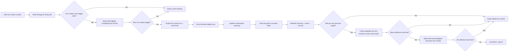

# Context Management

## Overview

QwenPaw's default context strategy is **scroll**: older turns are not summarized and discarded. They are written to a durable SQLite history store, evicted from the live model window when needed, and represented by a compact in-context index that can be expanded on demand.

Scroll is the user-facing default. Existing `strategy: "native"` configurations remain accepted for backward compatibility and fallback, but strategy switching is not exposed in the Console.

## The Three Memory Systems

QwenPaw organizes memory into three complementary systems, loosely mirroring human memory, each owned by a different subsystem:

| System              | What it is                                                                                                                               | Documented in                   |
| ------------------- | ---------------------------------------------------------------------------------------------------------------------------------------- | ------------------------------- |
| **Working memory**  | The live prompt window. Older turns evict into an expandable index plus a compact task-state summary; raw turns remain durable.          | [Context Management](./context) |
| **Episodic memory** | A durable, verbatim record of every turn across sessions, recalled on demand via `recall_history` (or the `recall_history_python` REPL). | [Context Management](./context) |
| **Semantic memory** | Distilled facts, preferences, and knowledge; ReMe consolidates daily notes into `digest/`, searched by `memory_search`.                  | [Long-term Memory](./memory)    |

Two of these — **working** and **episodic** memory — are implemented by the **scroll** context manager (`ScrollContextManager`). The third — **semantic** memory — is implemented by **ReMe**. They are deliberately orthogonal: scroll keeps raw history verbatim and uses a source-linked continuation summary only to route current task state, while ReMe distills reusable knowledge and never touches the live window or the verbatim history store.

> **This page covers working and episodic memory** — the scroll context manager. For semantic memory (the ReMe long-term backend), follow the links above.

## How Scroll Works



Key properties:

- **Durable first**: `ScrollContextManager` persists live turns to `{working_dir}/history.db` before any eviction.
- **Active turn protected**: the latest user request and its in-progress tool chain are never evicted mid-task. Only at the effective hard limit may old tool results already acknowledged by a successful model call fold to exact recall pointers; pending, unread, and the five newest results remain verbatim.
- **No lossy-summary dependency**: raw evicted content remains authoritative in `history.db` and the `EvictionIndex`. A continuation summary is only a compact task-state cache; a failed update preserves the previous valid summary and never blocks eviction.
- **Recallable raw history**: each index line carries a `seq` span. The agent can call `recall_history(op="expand", lo, hi)` to read the full original rows (or `ms.expand(lo, hi)` in the `recall_history_python` REPL).
- **Cross-session memory**: history rows include `session_id` and `agent_id`, so recall can search this agent's past sessions and, when explicitly widened, other agents in the same workspace.
- **Fallback-safe**: if scroll cannot be wired or its recall tools cannot run safely, QwenPaw falls back to native context management instead of evicting history that cannot be recalled.

Index tiers roll up only when they reach their 10-block capacity; pressure does not compact the index early. Scroll enters pre-trimming only when input is **strictly above** the automatic trigger (80% by default); input exactly at or below the trigger stops without folding tool results or evicting dialogue. Above the trigger, Scroll batch-folds every completed-turn tool result over 200 characters except those in the active turn and the five newest results globally, then recounts once. If the context is now at or below the trigger, it stops; otherwise it proceeds with normal eviction. After rebuilding, completed-result folding remains the final pressure valve above `max(trigger, reserve)`. If the input still exceeds the effective hard limit, Scroll batch-folds acknowledged old active-turn results and recounts once. Explicit `/compact` skips the pre-trim stage and performs the requested eviction.

## Storage Layout

| Path                                    | Default                                         | Purpose                                                                           |
| --------------------------------------- | ----------------------------------------------- | --------------------------------------------------------------------------------- |
| `{working_dir}/history.db`              | `scroll_config.db_filename = "history.db"`      | Main durable SQLite store. This is the source of truth for scroll recall.         |
| `{working_dir}/dialog/YYYY-MM-DD.jsonl` | opt-in                                          | Legacy JSONL archive of evicted turns when `scroll_config.offload_dialog = true`. |
| `{working_dir}/tool_results/`           | `tool_result_pruning_config.tool_results_cache` | File cache used by the legacy tiered tool-result pruning middleware.              |

`history.db` contains a `conversation_history` table with structured rows:

| Column                                          | Meaning                                                                     |
| ----------------------------------------------- | --------------------------------------------------------------------------- |
| `seq`                                           | Global autoincrement address used by the eviction index and recall helpers. |
| `session_id`, `agent_id`                        | Conversation and agent lineage.                                             |
| `kind`                                          | `model_turn`, `context_msg`, or `tool_result`.                              |
| `role`, `name`, `content`                       | Role/tool metadata and flattened searchable text.                           |
| `tool_call_id`, `tool_input`, `tool_state`      | Tool-call linkage and arguments/results state.                              |
| `headline`                                      | Optional model-written task-state milestone used as an index leaf.          |
| `blocks`, `metadata`, `created_at`, `dedup_key` | Full serialized blocks, metadata, timestamp, and idempotency key.           |

If SQLite FTS5 is available, QwenPaw also keeps a `conversation_history_fts` index over `content`. Without FTS5, recall search degrades to a slower `LIKE` scan.

## Working Memory

**Working memory** is the live prompt window — what the model can attend to right now. When it fills, scroll keeps it within budget by persisting and evicting older turns, then retaining a compact task-state summary and an expandable index. The summary never replaces the exact rows. Each substantive task turn also supplies a one-line **headline** for retrieval and navigation.

### Headlines

During normal replies, every substantive task turn appends one hidden retrieval headline after all tool calls have completed. A major or durable state change is not required:

```text
⟦ database migration | decided: use PostgreSQL for JSONB; MySQL superseded ⟧
```

- **Shape**: `task or topic | status: concrete outcome; next: concrete action | anchors: exact retrieval terms`. `next` and `anchors` are omitted when they add no value. Headlines normally use one sentence with two to four compact clauses and at most five high-value anchors; they do not repeat the reply, narrate reasoning, list every tool call, or stuff keywords. The 2,000-character limit remains only a compatibility ceiling.
- **How it's captured**: Scroll extracts the `⟦ … ⟧` line into the assistant turn's `headline` column and removes it from chat display. It remains verbatim in durable history.
- **What it's for**: the headline is a compact semantic checkpoint and navigation label, not the source of truth. Once the raw turn leaves the live window, it becomes the turn's `seq · ⟦ … ⟧` leaf in the eviction index; exact details remain recallable from `history.db`.
- **High-coverage labelling**: confirmations, attempts, rejected hypotheses, decisions, changes, verification results, failures, pauses, and blockers are labelled even when the overall task state is unchanged. Only pure social conversation, bare acknowledgements, and replies with no new task-relevant information omit the headline. An unlabelled span remains exactly recallable as `seq lo–hi · (no milestone)`; compaction does not make an extra model call to backfill it.

### Continuation Summary

Headlines label individual milestones; the continuation summary maintains the latest effective task state across many evicted turns. It is updated only when dialogue is actually evicted and contains five fixed sections: `Active Task`, `Current State`, `Constraints`, `Decisions`, and `Open Work`. Checkpoints and recovery anchors remain the eviction index's responsibility.

- **Separated responsibilities**: the summary maintains current task state. Code records one `covered_seq` range as provenance for the summary as a whole; it is not a per-item citation mechanism. The Eviction Index owns concrete `seq` navigation and recovery pointers.

- **Plain text generation**: the model is called normally with thinking disabled and asked for Markdown. Scroll never invokes `generate_structured_output`, JSON mode, or a response schema for this update.
- **Local parsing and deterministic rendering**: code parses the Markdown into JSON-safe internal state and renders the five sections itself. The model does not generate inline source links; code tracks one trusted archived seq range and states it separately in the background banner.
- **Single background envelope**: when both the continuation summary and eviction index are present, Scroll places them in one shared `<system-info>` block rather than emitting adjacent wrappers.
- **Role-aware bounded evidence**: evicted user text and headlines are budgeted first, so independent constraints and facts are not hidden by tool-heavy middle turns. Message times accompany this evidence: timezone-aware values are normalized to UTC, while naive local wall-clock values are explicitly marked `timezone=unspecified`; `seq` remains authoritative for ordering and recall. Remaining space is shared between assistant/tool-call context and bounded tool-result previews; complete results stay durable behind real `seq`, `tool_call_id`, artifact, and file pointers.
- **Two explicit summary modes**: `initial` creates the first state. Later evictions use `update` while the previous summary's durable sources remain valid, treating it as a baseline and reconciling it with the newly evicted span. Both modes use the same five-section Markdown protocol.
- **Deterministic quality guard**: code validates the exact section order and status, checks that the code-managed seq range exists, rejects exact duplicate state items, invented opaque identifiers, and likely secrets, and enforces the output limit. The checks deliberately avoid semantic guesses that would cause false rejection, and do not use a separate LLM judge.
- **Bounded generation with one conditional retry**: invalid first output is regenerated once with concise validation feedback. Generation and repair share one 60-second total budget rather than receiving 60 seconds each, and a timeout does not start a second call. A timeout or second validation failure retains a still-source-backed previous summary and marks it stale; an empty result never overwrites valid state.
- **Retention-aware rebuilding**: before each update, Scroll verifies the previous summary's `covered_seq` endpoints. If retention has purged either endpoint, that summary is no longer source-backed and is never reassigned to a newer seq range. Scroll discards it and runs `initial` from the newly persisted evidence, preventing all future updates from remaining permanently stale.
- **Secret-safe previews**: likely credential values are removed from bounded evidence before the summary model sees it; summaries keep only non-sensitive state and durable pointers.
- **Background-only semantics**: the injected prefix says the summary is background, not an active instruction, and that the current live user request always has priority.

### Live Context Layout

After eviction, the live context is rebuilt as:

```text
Continuation summary
  Current effective task state plus one code-managed provenance range.
  It is explicitly labeled background-only, never an active user instruction.

Eviction index (a synthetic placeholder message named "memory")
  A [context compressed] header, tiered headlines + seq spans, and instructions
  for recalling the original turns. Detailed in "Eviction Index" below.

Recent tail — always including the active turn
  The newest turns selected by AgentScope's pairing-safe split, plus the
  ACTIVE TURN: the latest real user request and everything after it, kept
  live in full even when the token-based split would have evicted it.
```

The split uses AgentScope's token accounting and pairing-safe compression helpers, so it preserves tool-call/tool-result alignment at the live-window boundary.

### Active-Turn Protection and the Pressure Pipeline

A long tool-running turn (a `/heartbeat` cron run, a multi-search task) can exceed the reserve budget by itself, and the token-based split would then evict the **current request** along with old history — leaving the model staring at an old message plus an index, and answering the wrong thing. Scroll therefore relieves automatic pressure in four escalating stages, each engaging only if the previous one wasn't enough:

1. **Pre-trim** — after durable persistence, Scroll batch-replaces every completed-turn tool result over 200 characters with an exact recall pointer, except for the complete active turn and the five newest tool results globally. It applies the whole batch before recounting once. Reaching at most the configured trigger stops the pipeline without dialogue eviction.
2. **Evict** — if pre-trimming cannot reach the trigger, finished turns before the active turn fold into the eviction index (the normal archival path). Explicit `/compact` starts here because the user requested eviction.
3. **Live fold** — still overflowing after eviction, remaining completed-turn tool results over 200 characters may be replaced **in place** with one-line recall stubs. The complete active turn and the five newest tool results remain visible:

   ```text
   [scroll folded] old tool result content cleared; recover with recall_history(op="recall_tool", tool_call_id='call_abc')
   ```

   The request text, tool calls, reasoning, active turn, and recent result tail stay verbatim under normal pressure. Every folded output is recoverable by its exact tool-call ID (it was persisted before folding, like everything else). `recall_tool` returns bounded pages; follow `next_cursor` when present. If it reports a saved full-output `file_path`, use `read_file` to read that artifact in bounded chunks. The stub points at the structured tool on purpose: it runs in-process without a sandbox, so the re-read works even on platforms where the Python REPL cannot run.

4. **Active-turn hard-limit fold** — Scroll reserves `min(4096, 5% of context_size)` tokens for the next model output. If the input still exceeds the resulting effective hard limit, it batch-replaces old active-turn tool results already included in a successful model request with exact `recall_tool` pointers, then recounts once. The current request, pending calls, unread results, and five newest results remain verbatim. A failed or interrupted model request never acknowledges its inputs. If the protected contents still cannot fit, Scroll raises `CONTEXT_UNFIT` instead of changing unread evidence, resetting the session, or retrying forever.

### Eviction Index

The eviction index is the heart of working memory: an in-context map of evicted history that keeps the live window small while staying expandable. It is tiered:

- **Tier 0** holds the most recently evicted blocks with the most detail.
- Older tiers collapse older blocks into endpoint spans.
- A tier rolls up only when it reaches its 10-block cap; context pressure never forces an early roll-up.
- Every line still carries a `seq` or `seq lo-hi` span, so collapsed history remains expandable from `history.db`.

Example shape:

```text
<system-info>
[context compressed] The turns below were evicted ...

Re-expand a span with the recall_history tool: recall_history(op="expand", lo, hi)

===== Tier 1 (older msgs) =====
  [seq 10-80]
    · seq 10-34  ⟦ chose SQLite history store - added recall tool ⟧
===== Tier 0 (recently compressed) =====
  [seq 81-96]
    · seq 84  ⟦ implemented context builder wiring ⟧
    · seq 93  ⟦ verified recall fallback behavior ⟧
</system-info>
```

Each `⟦ … ⟧` leaf in the index is a model-written task-state headline. The model should not answer from a headline alone. A headline is a checkpoint and pointer; the full evidence comes from `recall_history` (`expand` / `search`) or another recall helper.

## Episodic Memory

**Episodic memory** is the durable, verbatim record of everything the agent has said or done — written to `history.db` and recalled on demand, across every session. Nothing that working-memory eviction drops from the live window is lost; it stays here, exact and searchable. The sections below cover how to recall it, how oversized tool results are offloaded into it, and how older conversations are migrated into it on startup.

### Recall API

The recall API is the interface to episodic memory: it reads back the durable, verbatim history that working-memory eviction left behind. When scroll is active, QwenPaw injects two tools:

- **`recall_history`** — the structured front door for the common reads. Each call is a bound, read-only query executed in-process, so it needs no sandbox and no approval on any platform:

  ```text
  recall_history(op="expand", lo=81, hi=96)          # re-expand an indexed span
  recall_history(op="search", query="deployment decision", k=20)
  recall_history(op="recall_tool", tool_call_id="tool-call-id")
  ```

- **`recall_history_python`** — the sandboxed Python REPL for everything beyond those reads (listing sessions, custom SQL aggregation, scratch tables). The cell already defines `ms`, a `MemorySpace` object.

Common `ms` helpers in the REPL:

```python
# Re-expand an indexed span.
print(ms.expand(81, 96))

# Search this agent's durable history across sessions.
hits = ms.search("deployment decision", k=20)
for row in hits:
    print(row["seq"], row["session_id"], row["content"][:500])

# Read a specific tool call and result.
print(ms.recall_tool("tool-call-id"))

# Discover and read sessions.
print(ms.sessions())
print(ms.session("cron:nightly-report"))

# Workspace-wide discovery when explicitly needed.
print(ms.agents())
```

Recall is read-only for durable history: `history.db` is attached as SQLite schema `hist` in read-only mode. The model can write only to its scratch `main` database.

A failed cell is unmistakable: the observation leads with a `RECALL FAILED — the history was NOT read` banner, and an exit-0 cell that printed nothing says explicitly that silence is not evidence of an empty history — so an execution error can never be misread as "there is no such history".

Search (both `recall_history(op="search")` and `ms.search`) also never echoes the agent back at itself: the recall tool's own source/output rows are kept out of the results, and so is the current **active turn** (the latest user request and the reply being written) — otherwise a multi-round recall would top-k-match the previous round's quoted findings instead of the real history. Earlier evicted turns of the same session remain searchable, and `ms.expand` / `ms.recall_tool` stay unfiltered (verbatim replay is their point).

Security note: `recall_history_python` runs model-authored Python. It normally requires sandbox injection from the governance layer. (`recall_history` is unaffected: it never executes model-authored code, so it still runs when no sandbox backend is available or sandboxing is disabled. QwenPaw supports native Windows sandbox backends; WSL2 itself is not a prerequisite for sandboxing.) If no sandbox is available, the REPL fails closed unless both are true:

- environment variable `QWENPAW_ALLOW_UNSANDBOXED_RECALL` is truthy
- `running.light_context_config.scroll_config.allow_unsandboxed = true`

Unsandboxed recall executes arbitrary host Python as the agent user and should only be used in trusted local development.

### Tool Results

Tool results are handled by one mechanism:

| Mechanism                     | Default                                                                                   | What it does                                                                                                                                                                                                                                                                     |
| ----------------------------- | ----------------------------------------------------------------------------------------- | -------------------------------------------------------------------------------------------------------------------------------------------------------------------------------------------------------------------------------------------------------------------------------- |
| `ToolResultPruningMiddleware` | registered for every context strategy; controlled by `tool_result_pruning_config.enabled` | Prunes current and historical tool results by bytes, saves oversized raw output under `tool_results/`, and records block-scoped recovery metadata plus a `read_file` continuation hint. The background-completion path uses the same pruner when coordinator offload is enabled. |

Scroll no longer has a separate token-based tool-result cap. All live previews use `pruning_recent_msg_max_bytes`. At the automatic compression trigger, Scroll batch-replaces every eligible completed-turn result over 200 characters with an exact `recall_history` pointer, while preserving the active turn and five newest results, then recounts once. After eviction it can apply the same recovery-pointer fold to remaining completed results above the pressure target. Legacy tier settings are ignored by Scroll.

When unified pruning is enabled, QwenPaw makes AgentScope's built-in token-based tool-result cap non-binding. This prevents a second truncation pass from replacing the byte-bounded preview and discarding its block-scoped recovery metadata. If unified pruning is disabled, AgentScope's default cap remains active as a safety net.

`scroll_config.tool_output_token_cap` is accepted only so existing configuration files continue to load. It is ignored and an explicitly configured value produces a migration warning; replace it with `tool_result_pruning_config.pruning_recent_msg_max_bytes`, whose unit is bytes rather than model-estimated tokens. Disabling `tool_result_pruning_config.enabled` also disables Scroll's execution-time per-result bound.

### Session Migration (Backfill)

Conversations that predate scroll — or any chats already stored as `sessions/*.json` in the workspace — are backfilled into `history.db` automatically, so older history stays recallable through the episodic-memory tools.

- **When**: on app startup, for every agent whose `strategy` is `"scroll"`.
- **Source**: `{working_dir}/sessions/*.json` (including channel subdirectories). The original session files are never modified or deleted.
- **One-time per file**: a `sessions/.synced.json` manifest records what was imported, so later startups skip unchanged files. Re-imports are no-ops — a `UNIQUE` index deduplicates rows.
- **Retention-aware**: messages older than `scroll_config.history_retention_days` (default `30`) are skipped during import, matching the same-boot purge that trims `history.db` to the retention window. Set `history_retention_days` to `0` to keep — and import — everything.
- **Non-blocking**: if the backfill fails, startup continues; that agent simply won't have its old chats imported, while scroll keeps recording new turns normally.

> On the first startup, a one-time notice is logged while session files are imported, since a large backlog can take a moment. Later startups have a manifest and pass straight through.

## Configuration

Relevant configuration is under `running.light_context_config`:

The Console's **Workspace → Running Config → ReAct Agent** section exposes only the long-term memory backend; it does not show context-manager-backend or context-strategy selectors. Existing Native configurations remain loadable for backward compatibility and fallback, but Native is not presented as a user-selectable option. The Console's **Context Management** tab shows Scroll's detailed settings.

```json
{
  "running": {
    "light_context_config": {
      "strategy": "scroll",
      "dialog_path": "dialog",
      "context_compact_config": {
        "enabled": true,
        "compact_threshold_ratio": 0.8,
        "reserve_threshold_ratio": 0.1
      },
      "scroll_config": {
        "db_filename": "history.db",
        "repl_timeout_s": 300,
        "history_retention_days": 30,
        "allow_unsandboxed": false,
        "offload_dialog": false
      },
      "tool_result_pruning_config": {
        "enabled": true,
        "pruning_recent_msg_max_bytes": 50000,
        "offload_retention_days": 30,
        "tool_results_cache": "tool_results"
      }
    }
  }
}
```

The legacy `pruning_recent_n` and `pruning_old_msg_max_bytes` tier settings are ignored by Scroll.

Important fields:

| Field                                            | Default        | Meaning                                                                                                           |
| ------------------------------------------------ | -------------- | ----------------------------------------------------------------------------------------------------------------- |
| `strategy`                                       | `"scroll"`     | Selects Scroll's durable-history protocol. Legacy Native values are accepted only for compatibility and fallback. |
| `context_compact_config.compact_threshold_ratio` | `0.8`          | Trigger when model input reaches this fraction of context size.                                                   |
| `context_compact_config.reserve_threshold_ratio` | `0.1`          | Recent tail budget kept after eviction.                                                                           |
| `scroll_config.db_filename`                      | `"history.db"` | SQLite filename relative to the workspace.                                                                        |
| `scroll_config.tool_output_token_cap`            | `3000`         | Deprecated and ignored; explicit values log a warning. Use `pruning_recent_msg_max_bytes`.                        |
| `scroll_config.repl_timeout_s`                   | `300`          | Per-call timeout for `recall_history_python`.                                                                     |
| `scroll_config.history_retention_days`           | `30`           | Auto-purge rows older than this many days. Set `0` to keep forever.                                               |
| `scroll_config.offload_dialog`                   | `false`        | Also write legacy `dialog/*.jsonl` archive. `history.db` remains the source of truth.                             |

## Manual Compaction

`/compact` still exists. Under Scroll it forces eligible older turns into durable history while preserving the configured recent tail and active turn. When turns are actually archived, Scroll also updates the continuation summary. The command response reports what changed, but does not expose the internal eviction index, retrieval headlines, or continuation state in the chat transcript. Use `/compact_str` to inspect the current continuation summary; archived originals remain recoverable through Scroll history.

`/compact <hint>` supplies one-shot focus guidance to that compression only. The hint is secret-redacted and bounded; under Scroll it is not treated as evidence or persisted task state, and auto-compaction remains unchanged.

Typical result:

```text
✅ Compact Complete!

- Messages archived: 12
- Continuation summary: available via `/compact_str`
- Older turns remain recoverable through Scroll history
```

If no messages are eligible or the context is already small enough, there may be no new eviction.

Retrieval headlines and the synthetic `<system-info>` continuation block are model-facing context. The Console hides them both while streaming and when a saved chat is loaded, so they do not appear as assistant text or synthetic user messages.

## Legacy Compatibility

Existing configurations that already use the AgentScope-native path continue to load for backward compatibility and fallback. Native is not exposed as a Console option; Scroll is the documented user-facing context protocol.

## Visual Compact

> **Beta feature:** Visual Compact is disabled by default and remains under active development. It can reduce input tokens in long conversations, but model reading of text in images is not completely lossless and may affect answer quality. Try it on non-critical tasks first, then decide whether to keep it enabled based on your results.

Visual Compact turns eligible older, longer context into visual pages before a request is sent to the model. Recent conversation remains as text. Because an image can carry a large amount of dense text, this approach can significantly reduce token usage in long conversations.

It works alongside the existing context strategy and long-term memory. It does not delete chat history, rewrite stored conversations, or save the generated images to local storage.

QwenPaw only applies Visual Compact when the context is long enough and the visual replacement is expected to save tokens. Short requests or requests without a worthwhile saving are left unchanged.

### Model requirement

Visual Compact requires a **native multimodal model that accepts image input**, such as `qwen3.6-plus`. A multimodal provider, a model name that suggests vision support, or a compatibility layer that can transport images is not sufficient by itself.

Use the multimodal capability test in model settings to confirm that the selected model can actually read images. If QwenPaw cannot explicitly confirm image support, Visual Compact is skipped safely.

### Enable Visual Compact

1. Open the Agent's **Configuration** page.
2. Go to **Context Management** and expand **Visual Compact**.
3. Turn on **Enable Visual Compact**.
4. Choose a compression intensity. Start with **Low** unless token pressure is more important than visual readability.

| Intensity  | Behavior                                                                                                 |
| ---------- | -------------------------------------------------------------------------------------------------------- |
| **Low**    | Prioritizes readability and compresses less eligible content. Recommended as the default starting point. |
| **Medium** | Balances visual readability with greater token savings.                                                  |
| **High**   | Uses the densest pages and prioritizes token savings, with the highest recognition risk.                 |

Higher intensity does not necessarily produce better answers.

### Use cases & known drawbacks

Visual Compact is most useful for long-running conversations, tool-heavy tasks, and sessions where large tool outputs or older context create significant input-token pressure.

- **How to check**
  1. Set the `QWENPAW_LOG_LEVEL` environment variable to `debug`, then restart QwenPaw.
  2. After completing a long request, open `qwenpaw.log` in the working directory (or use `/daemon logs`) and search for `Visual Compact transform`.
  3. `applied=true` means visual compression was applied to that request. `estimated_saved_tokens` and `estimated_savings_pct` show the estimated number and percentage of tokens saved.
- **Keep in mind**
  - These values are calculated from local token and image-cost estimates. They are not exact usage or billing totals reported by the provider.
  - Actual savings vary with the context, selected intensity, and the model's image-token accounting. Provider-side benefits such as Prompt Cache are not included.

**Known drawbacks**

- A model may misread small text, numbers, identifiers, formatting, or uncommon characters and return a plausible but incorrect answer.
- Rendering visual pages consumes local CPU and memory and can add latency, especially the first time a long context is rendered.
- QwenPaw provides an exact-source recovery tool when visual compression is applied, but the model may not always call it or may search for the wrong evidence.

For tasks that require exact wording, such as checking an ID, hash, or version number, use **Low** intensity or disable Visual Compact.

If an exact value appears incorrect, ask the Agent to use `recover_visual_context` to re-read the original source before answering. If answer quality remains unstable, switch to **Low** intensity or disable the feature.

> **Acknowledgment:** The engineering implementation of Visual Compact was informed by [pxpipe](https://github.com/teamchong/pxpipe).
