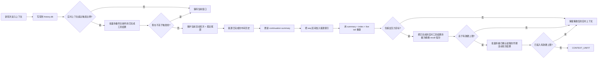

# 上下文管理（Context Management）

## 概述

QwenPaw 当前默认的上下文策略是 **scroll**：旧轮次不会被总结后丢弃，而是先写入持久化 SQLite 历史库；当模型窗口接近上限时，再把中间历史从实时上下文中驱逐出去，并用一条紧凑的上下文内索引表示。之后 Agent 可以按需把原始历史读回来。

Scroll 是面向用户的默认方案。已有的 `strategy: "native"` 配置仍会为向后兼容和安全降级而被接受，但控制台不再提供策略切换入口。

## 三种记忆系统

QwenPaw 把记忆组织为三套互补的系统——工作记忆（Working）、情景记忆（Episodic）和语义记忆（Semantic）——大致对应人类记忆，每套由不同子系统负责：

| 记忆系统     | 是什么                                                                                     | 文档                    |
| ------------ | ------------------------------------------------------------------------------------------ | ----------------------- |
| **工作记忆** | 实时提示词窗口。较早轮次驱逐后由可展开索引和紧凑的任务状态摘要表示；原始轮次持久保留。     | [上下文管理](./context) |
| **情景记忆** | 跨会话、逐字的持久记录，通过 `recall_history`（或 `recall_history_python` REPL）按需取回。 | [上下文管理](./context) |
| **语义记忆** | 提炼后的事实、偏好与知识；ReMe 把每日记忆沉淀进 `digest/`，用 `memory_search` 检索。       | [长期记忆](./memory)    |

其中 **工作记忆** 与 **情景记忆** 由 **scroll** 上下文管理器（`ScrollContextManager`）实现；**语义记忆** 由 **ReMe** 实现。三者刻意保持正交：scroll 逐字保留原始历史，只用带来源的 continuation summary 路由当前任务状态；ReMe 则提炼可复用知识、从不触碰实时窗口或逐字历史库。

> **本页讲的是工作记忆与情景记忆**——即 scroll 上下文管理器。语义记忆（ReMe 长期记忆后端）请通过上方链接查看。

## Scroll 工作方式



核心特性：

- **先持久化**：`ScrollContextManager` 在任何驱逐前，都会先把实时上下文写入 `{working_dir}/history.db`。
- **保护当前活动轮次**：最新的用户请求及其进行中的工具链绝不会在任务中途被驱逐。只有达到有效硬上限时，已经被一次成功模型调用确认读取的早期工具结果才可能折叠为精确 recall 指针；pending、未读和最新 5 条结果继续原样保留。
- **不依赖有损摘要**：被驱逐的原文仍以 `history.db` 和 `EvictionIndex` 为准。Continuation summary 只是紧凑的任务状态缓存；更新失败会保留上一份有效摘要，绝不阻塞驱逐。
- **可回溯原文**：索引中的每一行都带 `seq` 区间。Agent 可以调用 `recall_history(op="expand", lo, hi)` 读取完整原始记录（或在 `recall_history_python` REPL 中用 `ms.expand(lo, hi)`）。
- **跨会话历史**：历史行包含 `session_id` 和 `agent_id`，默认可检索当前 Agent 的所有历史会话；显式放宽时也能查询同一工作区内其他 Agent 的历史。
- **安全降级**：如果 scroll 无法构建，或 recall 工具无法安全运行，QwenPaw 会退回 native 上下文管理，避免把历史驱逐到无法读取的位置。

索引层级只会在达到 10 个 block 的容量时向上归并；压力不会提前压实索引。只有输入**严格超过**自动压缩触发线（默认 80%）时，Scroll 才会批量折叠所有超过 200 字符的已完成轮次工具结果；恰好位于或低于触发线时直接停止，不折叠工具结果，也不驱逐对话。预裁剪会完整保护活动轮次和全局最新 5 个工具结果。整批替换后只重新统计一次；如果已不高于触发线，则停止，否则继续正常驱逐。重建后，只有上下文仍高于 `max(trigger, reserve)` 时才启用已完成结果折叠作为最终泄压阀；如果输入仍高于有效硬上限，则批量折叠已确认读取的早期活动轮次结果并再统计一次。显式 `/compact` 会跳过预裁剪，执行用户要求的驱逐。

## 存储布局

| 路径                                    | 默认值                                          | 用途                                                            |
| --------------------------------------- | ----------------------------------------------- | --------------------------------------------------------------- |
| `{working_dir}/history.db`              | `scroll_config.db_filename = "history.db"`      | 主要持久化 SQLite 历史库，是 scroll recall 的真相来源。         |
| `{working_dir}/dialog/YYYY-MM-DD.jsonl` | 可选                                            | `scroll_config.offload_dialog = true` 时写入的旧版 JSONL 归档。 |
| `{working_dir}/tool_results/`           | `tool_result_pruning_config.tool_results_cache` | 旧版分层工具结果裁剪中间件使用的文件缓存。                      |

`history.db` 中的核心表是 `conversation_history`：

| 字段                                            | 含义                                                    |
| ----------------------------------------------- | ------------------------------------------------------- |
| `seq`                                           | 全局递增地址，驱逐索引和 recall helper 都用它定位历史。 |
| `session_id`, `agent_id`                        | 会话与 Agent 归属。                                     |
| `kind`                                          | `model_turn`、`context_msg` 或 `tool_result`。          |
| `role`, `name`, `content`                       | 角色/工具元数据以及可搜索的扁平文本。                   |
| `tool_call_id`, `tool_input`, `tool_state`      | 工具调用关联、参数和结果状态。                          |
| `headline`                                      | 模型写入的可选任务状态里程碑，用作驱逐索引叶子。        |
| `blocks`, `metadata`, `created_at`, `dedup_key` | 完整序列化块、元数据、时间戳和幂等键。                  |

如果当前 SQLite 支持 FTS5，QwenPaw 会维护 `conversation_history_fts` 全文索引；否则 `ms.search` 会降级为较慢的 `LIKE` 扫描。

## 工作记忆（Working Memory）

**工作记忆** 就是实时的提示词窗口——模型此刻能看到的内容。窗口写满时，scroll 先持久化并驱逐较早轮次，再保留一份紧凑的任务状态摘要和可展开索引；摘要永远不会替代精确原文。每个有实质任务信息的轮次还会为检索和导航提供一行 **headline（检索标题）**。

### Headlines（检索标题）

在正常回复中，每个有实质任务信息的轮次都会在所有工具调用完成后追加一行隐藏的检索 headline；不要求发生重大或持久的状态变化：

```text
⟦ 数据库迁移｜已决定：因 JSONB 采用 PostgreSQL，MySQL 已废弃 ⟧
```

- **结构**：`任务或主题｜状态：具体结果；下一步：具体动作｜锚点：精确检索词`。“下一步”和“锚点”没有增益时可以省略。headline 通常只写一句，由 2～4 个短分句组成，最多保留 5 个高价值锚点；不复述正文、不讲述推理过程、不罗列每次工具调用，也不堆砌关键词。2000 字符只作为兼容性上限。
- **怎么被收录**：Scroll 把 `⟦ … ⟧` 一行抽进 assistant 轮次的 `headline` 字段，并从聊天界面隐藏；持久历史仍原样保留。
- **作用**：headline 是紧凑的语义检查点和导航标签，不是真相来源。原始轮次被驱逐后，它会成为该轮的 `seq · ⟦ … ⟧` 索引叶子；精确细节仍从 `history.db` recall。
- **高覆盖打标**：确认、尝试、被排除的假设、决定、修改、验证结果、失败、暂停和 blocker，即使没有改变任务整体状态，也会生成 headline。只有纯社交闲聊、裸确认和完全没有新增任务相关信息的回复才省略。未打标区段仍以 `seq lo–hi · (no milestone)` 精确召回；压缩阶段不会额外调用模型补写。

### Continuation Summary

Headline 用来标记单个里程碑；continuation summary 则跨多个已驱逐轮次维护“当前仍有效”的任务状态。它只在真正发生对话驱逐时更新，固定包含 `Active Task`、`Current State`、`Constraints`、`Decisions` 和 `Open Work` 五段；checkpoint 与恢复锚点继续由 eviction index 负责。

- **职责分离**：summary 维护当前任务状态。代码只为整份 summary 记录一个 `covered_seq` 来源范围，它不是逐条事实的引用机制；具体的 `seq` 导航和恢复指针由 Eviction Index 负责。

- **普通文本生成**：模型通过关闭 thinking 的正常 chat completion 返回 Markdown；Scroll 不调用 `generate_structured_output`、JSON mode 或 response schema。
- **本地解析、确定性渲染**：代码把 Markdown 解析成 JSON-safe 内部状态，再自行渲染五个 section。模型不生成内联来源链接；代码维护一个可信的已归档 seq 范围，并在背景 banner 中单独说明。
- **单一背景 envelope**：continuation summary 与 eviction index 同时存在时，Scroll 会把两者放在同一个 `<system-info>` 块中，不输出首尾相接的两组 wrapper。
- **按角色分配的有界证据**：优先为已驱逐的 user 原文和 headline 分配预算，避免独立约束与事实被工具密集的中间轮遮住。消息时间会随证据提供：带时区的值统一转换为 UTC，缺少时区的本地墙钟时间明确标为 `timezone=unspecified`；排序和取回仍以 `seq` 为准。剩余空间由 assistant/tool-call 上下文与有界 tool-result preview 共享，完整结果仍通过真实 `seq`、`tool_call_id`、artifact、file 指针持久可取回。
- **两种显式 summary 模式**：`initial` 建立第一份状态；只要上一份 summary 的持久化来源仍然有效，之后的驱逐就使用 `update`，把它作为 baseline，与新驱逐区段协调。两种模式共用同一套五段 Markdown 协议。
- **确定性质量检查**：代码检查 section 顺序与 status、确认代码维护的 seq 范围真实存在，并拒绝完全重复的状态条目、凭空出现的 opaque identifier、疑似 secret 和超长输出；检查刻意避免容易误拒的语义推断，也不使用单独的 LLM judge。
- **有界生成与一次条件重试**：首次输出不合格时，会携带简短校验错误再生成一次；生成和 repair 共享 60 秒总预算，而不是每次各等待 60 秒。超时不会触发第二次调用。超时或第二次校验仍失败时，保留来源仍有效的上一份 summary 并标记 stale；空结果绝不覆盖有效状态。
- **遵循历史保留期**：每次更新前都会检查上一份 summary 的 `covered_seq` 端点。若 retention 已删除任一端点，该 summary 就不再被视为 source-backed，也不会被错误映射到新的 seq 范围；Scroll 会丢弃失效状态，并从本次新持久化的 evidence 重新执行 `initial`，避免更新永久卡在 stale 状态。
- **Secret-safe preview**：有界证据送入 summary 模型前会移除疑似 credential value；summary 只保留非敏感状态和持久指针。
- **只作背景**：注入前缀明确说明 summary 不是活动指令，当前 live user request 始终优先。

### 实时上下文结构

发生驱逐后，实时上下文会被重建为：

```text
Continuation summary（当前任务状态 + 代码维护的来源范围）
  保存当前有效任务状态；精确恢复指针由驱逐索引维护。
  明确标记为 background，不是新的用户指令。

驱逐索引（名为 "memory" 的合成占位消息，不是真实对话轮次）
  以 [context compressed] 开头，后面是分层的 headline、seq 区间，
  以及如何 recall 原文的说明。详见下文「驱逐索引」。

最近尾部——始终包含当前活动轮次
  由 AgentScope 的配对安全切分逻辑选出的最新轮次，外加「活动轮次」：
  最后一条真实用户请求及其之后的全部消息。即使按 token 切分本应把它
  驱逐，也会完整保留在实时窗口里。
```

切分使用 AgentScope 的 token 统计和配对安全压缩 helper，因此会尽量保持实时窗口边界上的 tool_call / tool_result 对齐。

### 活动轮次保护与泄压管线

一个长工具任务（`/heartbeat` 定时任务、多轮搜索）本身就可能超出保留预算，此时按 token 切分会把**当前请求**连同旧历史一起驱逐——模型只能看到一条旧消息和一份索引，然后答非所问。为此 scroll 对自动压力按四个阶段递进泄压，每一级只在上一级不够用时才启动：

1. **预裁剪**——完成持久化后，把所有超过 200 字符的已完成轮次工具结果批量替换为精确 recall 指针，但完整保护活动轮次和全局最新 5 个工具结果。整批替换完成后只重新统计一次；只要已不高于配置的触发线，就不再驱逐对话。
2. **驱逐**——预裁剪仍无法降到触发线时，把活动轮次之前的已完成轮次折叠进驱逐索引。显式 `/compact` 从这一步开始，因为用户明确要求归档。
3. **实时折叠**——驱逐后仍然超出时，把剩余且超过 200 字符的已完成轮次工具结果**原地**替换为一行 recall 指针。完整活动轮次和全局最新 5 个工具结果继续可见：

   ```text
   [scroll folded] old tool result content cleared; recover with recall_history(op="recall_tool", tool_call_id='call_abc')
   ```

   正常压力下，请求原文、工具调用、推理文本、完整活动轮次和最近结果尾部全部原样保留；每条被折叠的输出都和其他历史一样在折叠前已持久化，可以通过准确的 tool call ID 取回。`recall_tool` 使用有界分页；返回 `next_cursor` 时按该 cursor 继续。如果结果提供了完整输出的 `file_path`，再用 `read_file` 分段读取该 artifact。stub 特意指向结构化工具：它在进程内运行、不依赖沙箱，所以即使在 Python REPL 无法运行的平台上也能读回。

4. **活动轮次硬上限折叠**——Scroll 为下一次模型输出预留 `min(4096, context_size 的 5%)` 个 token。输入仍超过由此得到的有效硬上限时，会把已经进入一次成功模型调用的早期活动轮次工具结果批量替换为精确 `recall_tool` 指针，然后只重新统计一次。当前请求、pending call、未读结果和最新 5 条结果继续原样保留；失败或中断的模型请求不会确认其输入已读。这些受保护内容仍装不下时，Scroll 明确抛出 `CONTEXT_UNFIT`，不会修改未读证据、重置会话或无限重试。

### 驱逐索引

驱逐索引是工作记忆的核心：一份保留在上下文里的历史地图，让实时窗口保持精简，同时随时可展开。它采用分层结构：

- **Tier 0** 保存最近被驱逐的块，细节最多。
- 更老的 Tier 会把旧块折叠成端点区间。
- 每一行仍然带 `seq` 或 `seq lo-hi` 区间，因此即便折叠后也能从 `history.db` 展开原文。

示例形态：

```text
<system-info>
[context compressed] The turns below were evicted ...

Re-expand a span with the recall_history tool: recall_history(op="expand", lo, hi)

===== Tier 1 (older msgs) =====
  [seq 10-80]
    · seq 10-34  ⟦ chose SQLite history store - added recall tool ⟧
===== Tier 0 (recently compressed) =====
  [seq 81-96]
    · seq 84  ⟦ implemented context builder wiring ⟧
    · seq 93  ⟦ verified recall fallback behavior ⟧
</system-info>
```

索引里每个 `⟦ … ⟧` 叶子，都是模型写下的任务状态 headline。模型不应该只凭 headline 回答：headline 是检查点和指针；真正证据应来自 `recall_history`（`expand` / `search`）或其他 recall helper 返回的完整内容。

## 情景记忆（Episodic Memory）

**情景记忆** 是 Agent 说过、做过的一切的持久、逐字记录——写入 `history.db`，跨所有会话按需取回。工作记忆从实时窗口驱逐掉的内容不会丢失，都精确、可检索地留在这里。下面几节分别讲如何取回它、超长工具结果如何卸载进来，以及旧会话如何在启动时迁移进来。

### Recall API

Recall API 是情景记忆的接口：把工作记忆驱逐后留下的、持久且逐字的历史读回来。scroll 启用时，QwenPaw 会注入两个工具：

- **`recall_history`**——常规读取的结构化入口。每次调用都是参数绑定的只读查询，在进程内执行，因此在任何平台上都不需要沙箱、不需要审批：

  ```text
  recall_history(op="expand", lo=81, hi=96)          # 展开索引中的区间
  recall_history(op="search", query="deployment decision", k=20)
  recall_history(op="recall_tool", tool_call_id="tool-call-id")
  ```

- **`recall_history_python`**——沙箱化的 Python REPL，覆盖这三种读取之外的需求（列出会话、自写 SQL 聚合、scratch 表）。cell 中已经定义好 `ms`，它是一个 `MemorySpace` 对象。

REPL 中常用的 `ms` helper：

```python
# 展开索引中的区间。
print(ms.expand(81, 96))

# 搜索当前 Agent 跨会话的持久历史。
hits = ms.search("deployment decision", k=20)
for row in hits:
    print(row["seq"], row["session_id"], row["content"][:500])

# 读取某次工具调用及其结果。
print(ms.recall_tool("tool-call-id"))

# 发现并读取会话。
print(ms.sessions())
print(ms.session("cron:nightly-report"))

# 明确需要时查看工作区内 Agent。
print(ms.agents())
```

持久历史对 recall 是只读的：`history.db` 会以只读方式挂载为 SQLite schema `hist`。模型只能写自己的 scratch `main` 数据库。

失败的 cell 不会被误读：观察结果会以 `RECALL FAILED — the history was NOT read` 横幅开头；正常退出但什么都没打印的 cell 也会明确说明「无输出不代表历史为空」——执行错误永远不会被误认成「不存在这段历史」。

搜索（`recall_history(op="search")` 与 `ms.search` 皆然）也不会把 Agent 自己的回声搜回来：recall 工具自身的源码/输出行不会出现在结果里，当前**活动轮次**（最新的用户请求和正在写的回复）同样被排除——否则多轮 recall 时，top-k 会命中上一轮引用过的内容而不是真正的历史。本会话更早的已驱逐轮次仍然可搜；`ms.expand` / `ms.recall_tool` 不做过滤（逐字回放正是它们的用途）。

安全说明：`recall_history_python` 会运行模型生成的 Python。正常情况下，它需要治理层注入 sandbox 配置；如果没有 sandbox，它会默认拒绝执行。（`recall_history` 不受影响：它从不执行模型生成的代码，所以在没有可用沙箱后端或沙箱被禁用时仍能正常运行。QwenPaw 支持原生 Windows 沙箱后端，WSL2 本身不是启用沙箱的前提。）只有同时满足以下条件时才允许 REPL 非沙箱运行：

- 环境变量 `QWENPAW_ALLOW_UNSANDBOXED_RECALL` 为 truthy
- `running.light_context_config.scroll_config.allow_unsandboxed = true`

非沙箱 recall 等同于让模型以 Agent 用户身份执行任意宿主机 Python，仅适合可信本地开发。

### 工具结果

工具结果统一由一个机制处理：

| 机制                          | 默认状态                                                             | 作用                                                                                                                                                                                            |
| ----------------------------- | -------------------------------------------------------------------- | ----------------------------------------------------------------------------------------------------------------------------------------------------------------------------------------------- |
| `ToolResultPruningMiddleware` | 所有上下文策略下均注册，由 `tool_result_pruning_config.enabled` 控制 | 按字节裁剪当前和历史工具结果，把超大原始输出保存到 `tool_results/`，并记录按文本块隔离的恢复 metadata 与 `read_file` 续读提示；当 coordinator offload 启用时，后台完成路径也使用同一个 pruner。 |

scroll 不再有独立的 token 工具结果 cap。所有实时 preview 都使用 `pruning_recent_msg_max_bytes`。达到自动压缩触发线时，Scroll 会把所有超过 200 字符且符合条件的已完成轮次结果批量替换为精确 `recall_history` 指针，同时保护完整活动轮次和最新 5 个结果，然后只重新统计一次；驱逐后，如果实时上下文仍高于压力目标，也会用同样的恢复指针继续折叠剩余的已完成结果。旧版分层裁剪设置会被 Scroll 忽略。

启用统一 pruning 时，QwenPaw 会让 AgentScope 内置的 token 工具结果上限不再触发，避免已经按 bytes 裁剪的 preview 被二次截断并丢失按文本块隔离的恢复 metadata。关闭统一 pruning 时，AgentScope 的默认上限仍作为安全兜底保留。

`scroll_config.tool_output_token_cap` 仅为保证旧配置文件仍能加载而保留。该字段会被忽略；如果显式配置，将输出迁移 warning。请改用 `tool_result_pruning_config.pruning_recent_msg_max_bytes`，注意单位已从模型估算 token 改为 bytes。关闭 `tool_result_pruning_config.enabled` 也会同时关闭 scroll 的执行期单条工具结果上限。

### 历史迁移（旧会话回填）

早于 scroll 的对话——或工作区里已有的任何 `sessions/*.json` 会话——会被自动回填进 `history.db`，这样旧历史依然能被情景记忆工具取回。

- **时机**：应用启动时，对每个 `strategy` 为 `"scroll"` 的 Agent 执行。
- **来源**：`{working_dir}/sessions/*.json`（含渠道子目录）。原始会话文件不会被修改或删除。
- **逐文件一次性**：`sessions/.synced.json` 清单记录已导入的内容，之后的启动会跳过未变更的文件。重复导入是空操作——`UNIQUE` 索引会去重。
- **遵循保留期**：导入时会跳过早于 `scroll_config.history_retention_days`（默认 `30`）的消息，与同次启动把 `history.db` 裁剪到保留期的清理保持一致。把 `history_retention_days` 设为 `0` 可保留并导入全部历史。
- **不阻塞启动**：回填失败也不影响启动，该 Agent 只是没导入旧对话，scroll 仍会正常记录新轮次。

> 首次启动导入会话文件时会打印一次性提示，因为积压较多时可能需要一点时间；之后的启动有清单，会直接跳过。

## 配置

相关配置位于 `running.light_context_config`：

控制台“工作区 → 运行配置 → ReAct 智能体”只显示长期记忆管理后端，不显示上下文管理后端或上下文策略选择器。已有 Native 配置仍可为向后兼容和安全降级而加载，但 Native 不再作为用户可选项展示。控制台中的“上下文管理”页签展示 Scroll 的详细参数。

```json
{
  "running": {
    "light_context_config": {
      "strategy": "scroll",
      "dialog_path": "dialog",
      "context_compact_config": {
        "enabled": true,
        "compact_threshold_ratio": 0.8,
        "reserve_threshold_ratio": 0.1
      },
      "scroll_config": {
        "db_filename": "history.db",
        "repl_timeout_s": 300,
        "history_retention_days": 30,
        "allow_unsandboxed": false,
        "offload_dialog": false
      },
      "tool_result_pruning_config": {
        "enabled": true,
        "pruning_recent_msg_max_bytes": 50000,
        "offload_retention_days": 30,
        "tool_results_cache": "tool_results"
      }
    }
  }
}
```

旧版 `pruning_recent_n` 和 `pruning_old_msg_max_bytes` 分层设置会被 Scroll 忽略。

重要字段：

| 字段                                             | 默认值         | 含义                                                                              |
| ------------------------------------------------ | -------------- | --------------------------------------------------------------------------------- |
| `strategy`                                       | `"scroll"`     | 选择 Scroll 的持久历史协议；旧版 Native 值仅为兼容和安全降级而保留。              |
| `context_compact_config.compact_threshold_ratio` | `0.8`          | 模型输入达到上下文窗口该比例时触发。                                              |
| `context_compact_config.reserve_threshold_ratio` | `0.1`          | 驱逐后保留最近尾部的预算。                                                        |
| `scroll_config.db_filename`                      | `"history.db"` | 相对工作区的 SQLite 文件名。                                                      |
| `scroll_config.tool_output_token_cap`            | `3000`         | 已废弃且会被忽略；显式配置会输出 warning。请改用 `pruning_recent_msg_max_bytes`。 |
| `scroll_config.repl_timeout_s`                   | `300`          | `recall_history_python` 单次调用超时时间。                                        |
| `scroll_config.history_retention_days`           | `30`           | 自动清理早于该天数的历史行；设为 `0` 表示永久保留。                               |
| `scroll_config.offload_dialog`                   | `false`        | 是否额外写旧版 `dialog/*.jsonl` 归档；`history.db` 仍是真相来源。                 |

## 手动压缩

`/compact` 仍然存在。在 Scroll 策略下，它会把符合条件的较早轮次归档到持久历史，同时保留配置指定的近期尾部和活动轮次。真正归档轮次时，Scroll 也会更新 continuation summary。命令回复只报告本次发生的变化，不会在聊天记录中暴露内部驱逐索引、检索 headline 或 continuation state。可以使用 `/compact_str` 查看当前 continuation summary；归档原文仍可通过 Scroll 历史取回。

`/compact <hint>` 只为本次压缩提供取舍重点；hint 会先脱敏并限制长度，在 Scroll 下既不作为 evidence，也不持久化为任务状态，自动压缩行为不受影响。

典型返回：

```text
✅ Compact Complete!

- Messages archived: 12
- Continuation summary: available via `/compact_str`
- Older turns remain recoverable through Scroll history
```

如果没有可驱逐消息，或者上下文本来就足够小，可能不会产生新的驱逐。

检索 headline 和合成的 `<system-info>` continuation block 都属于模型侧上下文。控制台会在流式输出和已保存聊天加载时隐藏它们，因此不会显示成 assistant 文本或合成的 user 消息。

## 旧版兼容

已经使用 AgentScope 原生路径的配置仍可继续加载，用于向后兼容和安全降级。Native 不在控制台中作为选项展示；Scroll 是文档面向用户介绍的上下文协议。

## Visual Compact

> **Beta 功能：** Visual Compact 默认关闭，目前仍在持续迭代。它可以减少长会话的输入 Token，但模型读取图片中的文字并非完全无损，可能影响回答质量。建议先在非关键任务中试用，再根据实际效果决定是否长期启用。

Visual Compact 会在请求发送给模型前，把符合条件的较早、较长上下文转换成视觉页面；最近对话仍然保留为文本。由于图片可以承载大量密集文本，这种方式在长会话中可以显著节省 Token。

它可与现有上下文策略和长期记忆配合使用，不会删除聊天历史、改写已经存储的对话，也不会把生成的图片保存到本地。

QwenPaw 只会在上下文足够长，并且预计视觉替换确实能够节省 Token 时应用 Visual Compact。较短的请求或没有明显收益的请求会保持原样。

### 模型要求

Visual Compact 必须使用**原生支持图片输入的多模态模型**（如 `qwen3.6-plus`）。仅仅使用多模态 Provider、模型名称看起来支持视觉，或者兼容层能够传输图片，并不足以保证功能可用。

### 启用 Visual Compact

1. 打开 Agent 的**运行配置**页面。
2. 进入**上下文管理**，展开 **Visual Compact**。
3. 打开**启用 Visual Compact**开关。
4. 选择压缩强度。除非 Token 压力比视觉可读性更重要，否则建议从**低**开始。

| 强度   | 行为                                                           |
| ------ | -------------------------------------------------------------- |
| **低** | 优先保证可读性，压缩较少符合条件的内容，推荐作为默认起点。     |
| **中** | 在视觉可读性和更多 Token 节省之间取得平衡。                    |
| **高** | 使用最密集的页面并优先节省 Token，同时具有最高的识别错误风险。 |

更高的压缩强度不一定带来更好的回答。

### 适用场景 & 已知缺点

Visual Compact 更适合长时间持续的对话、频繁使用工具的任务，以及大量工具输出或较早上下文带来明显输入 Token 压力的会话。

- **如何查看**
  1. 将环境变量 `QWENPAW_LOG_LEVEL` 设为 `debug`，然后重启 QwenPaw。
  2. 完成一次较长的请求后，打开工作目录下的 `qwenpaw.log`（也可以使用 `/daemon logs`），搜索 `Visual Compact transform`。
  3. `applied=true` 表示本次请求实际应用了视觉压缩；`estimated_saved_tokens` 和 `estimated_savings_pct` 分别表示预计节省的 Token 数量和比例。
- **需要注意**
  - 这些数值根据本地 Token 与图片开销估算得出，不是 Provider 返回的精确用量或计费结果。
  - 实际收益会随上下文内容、所选强度和模型的图片计费方式变化，也不包含 Prompt Cache 等 Provider 侧优惠。

**已知缺点**

- 模型可能误读小号文字、数字、标识符、格式或罕见字符，并给出看似合理但实际错误的答案。
- 渲染视觉页面会占用本地 CPU 和内存，并可能增加等待时间，尤其是首次渲染较长上下文时。
- QwenPaw 会在应用视觉压缩时提供精确原文恢复工具，但模型不一定总会主动调用，也可能搜索了错误的证据。

对于依赖逐字准确内容的任务，例如核对 ID、哈希或版本号，建议使用**低**强度，或直接关闭 Visual Compact。

如果发现某个精确值可能有误，可以要求 Agent 使用 `recover_visual_context` 回读原文后再回答；如果回答质量仍不稳定，请切换到**低**强度或关闭该功能。

> **致谢：** Visual Compact 的工程实现参考了 [pxpipe](https://github.com/teamchong/pxpipe)。
