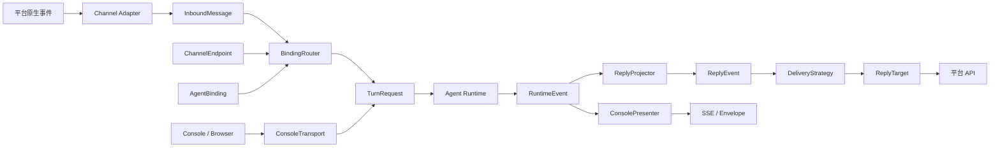
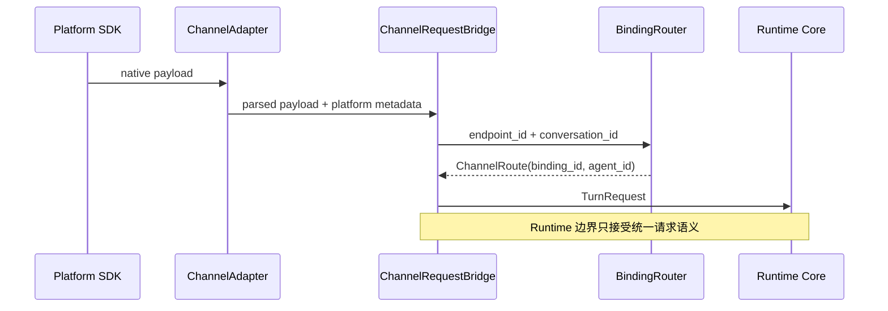
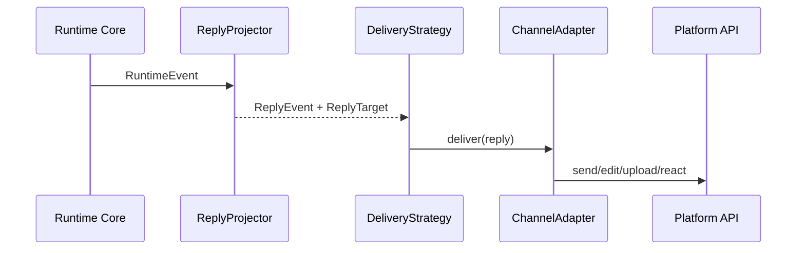
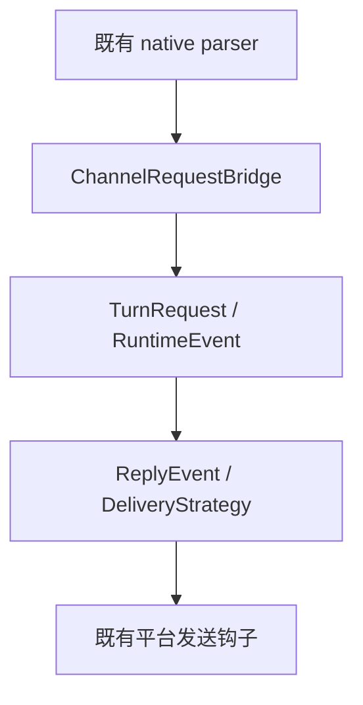

# QwenPaw Channel 与 Agent 架构重构方案 V2.0

## 1. 结论

Channel 不归属于 Agent，Agent 也不归属于 Channel。两者是独立资源，通过 `AgentBinding` 建立可校验、可替换的绑定关系。

- `ChannelEndpoint`：一个真实的外部账号或入口，拥有平台凭证和连接生命周期。
- `AgentBinding`：声明某个 Endpoint 当前路由到哪个 Agent，不保存平台凭证。
- `ChannelAdapter`：只解析平台原生消息并维护平台 API。
- `Runtime`：只处理 `TurnRequest` 和 `RuntimeEvent`，不知道 DingTalk、Console、SSE 等协议。
- `DeliveryStrategy`：把 `ReplyEvent` 投递到 Adapter 拥有的 `ReplyTarget`。
- `ConsoleTransport`：Web UI 的独立 Transport，不再冒充普通 Channel。

旧版 `agent.channels` 配置仍可使用，启动时会自动投影成 Endpoint 和 Binding。新配置使用根级 `channel_routing`，因此升级不改变已有对外行为。

## 2. 目标框架



核心依赖方向只有一个：

```text
transport/application -> domain <- runtime
```

`domain` 不依赖 FastAPI、SSE、AgentScope 或任何平台 SDK。Runtime 不导入 Channel 实现。

## 3. 入站链路



兼容期内，各平台已有的 native parser 和发送钩子保持不变。`ChannelRequestBridge` 是唯一旧请求到 `InboundMessage`、`ChannelRoute`、`TurnRequest` 的转换点，避免 18 个 Channel 重复理解核心协议。

核心请求原型：

```python
TurnRequest(
    turn_id="message-9",
    agent_id="sales",
    session_id="telegram:chat-42",
    user_id="user-7",
    messages=(...),
    source=RequestSource(
        kind="channel",
        endpoint_id="telegram:corp",
        binding_id="telegram:corp->sales",
    ),
    reply_target=ReplyTarget(...),
    context={...},
)
```

## 4. 出站链路



Runtime 的事件类别稳定为 turn started、agent event、message、completed、failed、cancelled。平台差异只存在于 DeliveryStrategy。BaseChannel 的普通回复循环和 TaskTracker 回复循环都经过同一 Delivery port，不再自行实现一套事件分类分支。

为了保证现有 Channel 和第三方插件不发生行为变化，`LegacyReplyAdapter` 被限制在应用边界。它不是新的业务协议，只是旧事件流的反腐层。

## 5. Console 的正确归属

Console 是浏览器 Transport，不是外部消息 Channel。

```text
src/qwenpaw/transports/console/
├── channel.py      # ConsoleTransport 生命周期和 Web 会话
├── envelope.py     # AgentScope Event -> Console Envelope 状态机
├── presenter.py    # RuntimeEvent -> Console 输出
└── sse.py          # SSE 编码和 headline 状态
```

Workspace 单独创建、启动和停止 ConsoleTransport。ChannelManager 只拥有 `surface="channel"` 的平台适配器；它可以查询外部 Transport 以兼容 Cron/主动发送，但不拥有其生命周期。

旧 import 路径保留为无逻辑的兼容别名，避免插件和现有调用方失效。

## 6. 配置归属与兼容策略

新权威配置位于根配置：

```json
{
  "channel_routing": {
    "endpoints": [
      {
        "endpoint_id": "telegram:corp",
        "channel_key": "telegram",
        "account_id": "corp",
        "enabled": true,
        "settings": {"bot_token": "***"}
      }
    ],
    "bindings": [
      {
        "binding_id": "telegram:corp->sales",
        "endpoint_id": "telegram:corp",
        "agent_id": "sales",
        "enabled": true,
        "priority": 0
      }
    ]
  }
}
```

校验规则：

1. Endpoint ID 和 Binding ID 全局唯一。
2. Binding 必须引用存在的 Endpoint。
3. 一个 Endpoint 同时只能有一个启用的 Binding，避免消息被静默分发给错误 Agent。
4. 一个 Agent 的同类多 Endpoint 需要创建独立 Adapter 实例，禁止把多个账号压进一个实例。
5. 当 `channel_routing` 为空时，自动把旧 `agent.channels` 投影为 `{channel}:{agent}` Endpoint 和 Binding。

API：

- `GET /api/config/channel-routing`
- `PUT /api/config/channel-routing`
- `GET /api/config/channels/catalog`

更新 Binding 后会热重载所有受影响 Agent。

## 7. 唯一 Catalog 与重复定义治理

`domain/channels/catalog.py` 是内置通信表面的唯一目录，集中维护：

- key、加载模块、实现类、配置类；
- channel/web surface；
- 排序；
- bot identity 字段；
- ACL 和 streaming 能力。

Registry、配置一致性检查、冲突检测、后端 API 和前端 Channel 排序/能力显示都从 Catalog 派生。

重复定义审计还发现 MCP 权限页遗漏了 `yuanbao` 和 `slack`。现已补齐，并增加跨 Python/TypeScript 的架构契约测试，保证 MCP Channel 值集合始终与 Catalog 完全一致。

下列分散列表保留是有意的：

- Doctor 的 probe/check 分支：每个平台的检测行为不同，不是注册目录。
- ChannelDrawer 的字段渲染和文档锚点：属于平台专有 UI，不表达 Channel 是否存在。
- CLI configurator 映射：值是不同交互函数，不是静态注册表。

## 8. 关键兼容边界



兼容层只允许存在于图的两端。架构测试禁止 Runtime 重新依赖 AgentResponse、ConsolePresenter、Envelope 或 SSE，并禁止新 Channel 文件扩大旧协议依赖。

## 9. 实施 Checklist

- [x] 建立测试基线和架构契约测试。
- [x] 引入 TurnRequest、RuntimeEvent 和 TurnStateAccumulator。
- [x] 建立 Endpoint、Binding、InboundMessage、ReplyTarget 模型。
- [x] 建立 BindingRouter、ReplyEvent、ChannelAdapter、DeliveryStrategy。
- [x] 建立唯一 Built-in Channel Catalog。
- [x] Registry、冲突身份字段、前端排序和能力从 Catalog 派生。
- [x] Console Envelope、SSE、Presenter 移出 Runtime/Channel。
- [x] ConsoleTransport 独立生命周期。
- [x] Runtime 原生接收 TurnRequest。
- [x] ChannelManager 注入统一请求桥，Console、Voice、SIP 旁路收口。
- [x] BaseChannel 普通和 TaskTracker 回复循环接入 DeliveryStrategy。
- [x] 增加根级 channel_routing 配置、校验和 API。
- [x] 保留旧配置投影、旧 import 和旧事件流兼容。
- [x] 增加 Python/TypeScript 重复定义一致性门禁。
- [x] 完成专项测试、静态检查、前端类型检查和构建验证。

## 10. 验收标准

- 旧 Channel 配置不迁移也能启动。
- Console Chat、SSE、取消、TaskTracker、Cron 主动发送接口保持兼容。
- Runtime 核心不含平台协议分支。
- Channel/Agent 可通过 Binding 独立替换。
- 新增 Channel 只需注册一次 Catalog，不能再手工同步多个静态列表。
- Python 单测、架构契约、pre-commit、前端 Vitest、TypeScript 和生产构建全部通过。

## 11. 实施分支与提交

分支：`codex/channel-runtime-v2-phase0-2`

本次重构按可回滚的小提交实施，覆盖领域模型、Console 拆分、路由、投递、配置和一致性治理。每个切片都先增加失败测试，再实现并执行专项回归。
