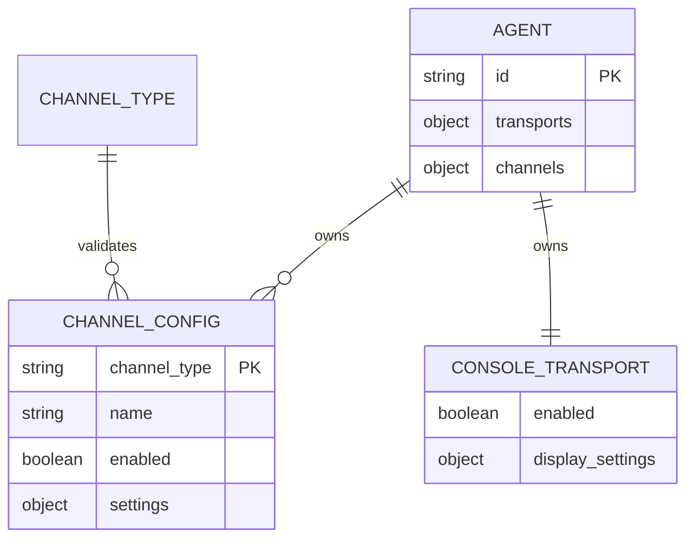
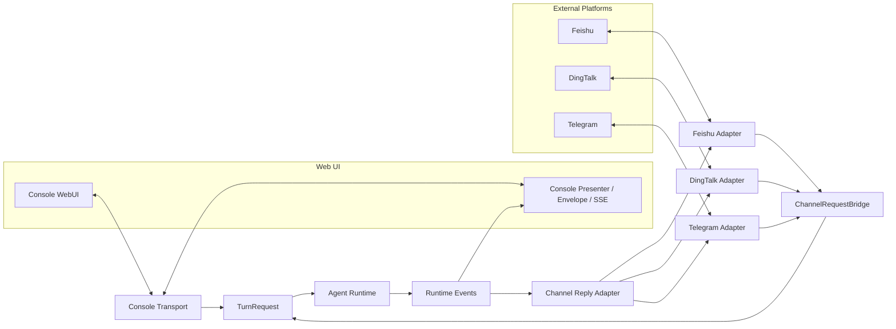
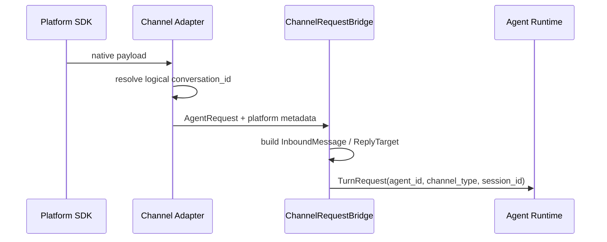
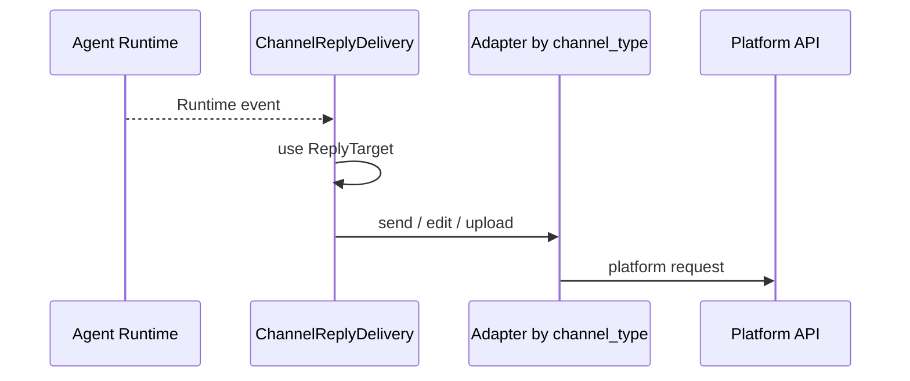
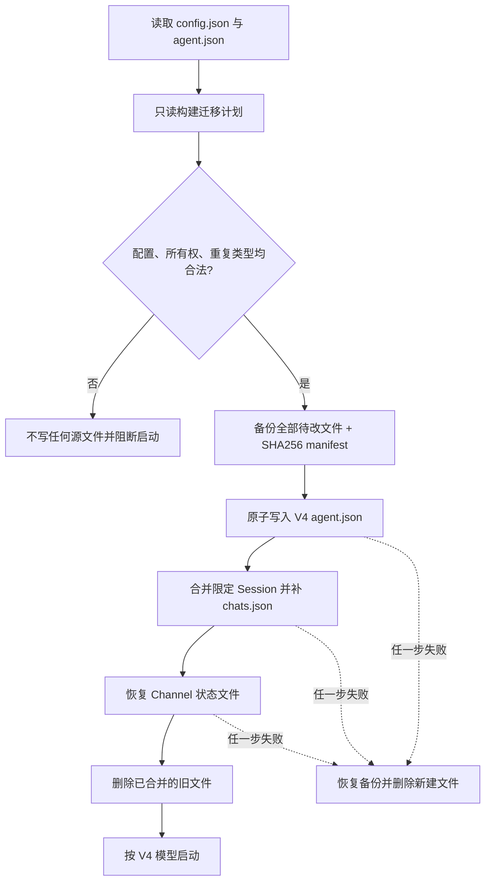

# QwenPaw Channel 与 Agent 架构重构方案 V4

> 最终决策：一个 Agent 可拥有多个不同类型的 Channel，但同一 Agent
> 下每种 Channel 类型最多一份配置；配置直接属于 Agent。不同 Agent
> 可分别配置同一种 Channel。Console 是 Web Transport，不是 Channel。

## 1. 实施 Checklist

- [x] 确认 Agent 与 Channel 的 1:N、按类型唯一关系。
- [x] 先写类型唯一性、API、运行时和迁移失败测试。
- [x] 将 Agent Channel 配置改为类型键控对象。
- [x] 删除 Endpoint、Binding、实例 ID 和运行时投影。
- [x] Console 从 Channel 中拆为 Agent-owned Transport。
- [x] 在 Channel 边界完成请求标准化，外部 Channel 不再转换 Console 协议。
- [x] 统一 Chat、Runtime、Usage、Checkpoint 使用的逻辑 Session ID。
- [x] 一次性迁移旧配置、分叉 Session、Chat 索引及 Channel 状态。
- [x] API、WebUI、CLI、Doctor、QR 和配置 watcher 切换到新模型。
- [x] 后端专项、集成、前端 Vitest 和 TypeScript 检查通过。
- [x] changed-files pre-commit 通过。
- [x] 全量 pytest 分组通过。
- [x] 同步钉钉方案文档并回读确认。

## 2. 最终所有权模型



约束如下：

- `Agent -> ChannelConfig` 是一对多。
- `(agent_id, channel_type)` 唯一，因此一个 Agent 不能保存两个 Feishu。
- Channel 配置不可跨 Agent 共享，也没有独立于 Agent 的生命周期。
- 不同 Agent 的工作区互相隔离，因此可各自保存一个 Feishu。
- 不存在持久化 `Endpoint`、`Binding`、`instance_id` 或兼容投影。

这与 Hermes Agent 的“Agent/运行体直接持有入口配置”思路一致，也符合
QwenPaw 当前产品交互。只有未来出现“同一账号动态绑定多个 Agent”的真实
业务需求时，才值得重新引入独立 Endpoint/Binding 图模型。

## 3. 目标框架



职责边界：

| 层 | 负责 | 不负责 |
| --- | --- | --- |
| Agent 配置 | Channel 所有权、启停、平台参数 | 网络连接与消息展示 |
| Channel Adapter | 平台鉴权、收发、媒体和原生事件 | Agent 选择、Console Envelope |
| ChannelRequestBridge | 将旧 `AgentRequest` 边界统一成 `TurnRequest` | 平台 API、持久化 |
| Agent Runtime | 执行逻辑并产生统一事件 | 平台协议和 Web 展示协议 |
| Console Transport | Web 会话入口 | 外部平台接入 |
| Console Presenter | AgentScope/Runtime Event 到 Envelope/SSE | 外部 Channel 消息转换 |

`envelope.py` 的语义明确属于 Console 展示边界。外部 Channel 只处理统一的
Runtime 事件与平台消息，不再重复实现 `AgentRequest/AgentResponse` 或
Console Envelope 转换。

## 4. 权威数据模型

每个 Agent 的 `agent.json` 是该 Agent Channel 配置的唯一事实来源：

```json
{
  "id": "sales",
  "name": "Sales",
  "channel_schema_version": 4,
  "transports": {
    "console": {
      "enabled": true,
      "show_thinking": true
    }
  },
  "channels": {
    "telegram": {
      "name": "Sales Bot",
      "enabled": true,
      "settings": {
        "bot_token": "***"
      }
    },
    "feishu": {
      "name": "Sales Feishu",
      "enabled": false,
      "settings": {
        "app_id": "***",
        "app_secret": "***"
      }
    }
  }
}
```

`channels` 使用 `dict[channel_type, AgentChannelConfig]`，唯一性由数据结构
本身保证，不依赖后置扫描。`AgentChannelConfig` 仍是 Pydantic `BaseModel`，
但它只承担稳定边界字段：

```python
class AgentChannelConfig(BaseModel):
    name: str
    enabled: bool = True
    settings: dict[str, Any] = Field(default_factory=dict)
```

这不是保留旧的巨大 `ChannelConfig`：

- Channel 类型是字典键，不在 value 中重复定义。
- `enabled` 只存在于公共层，禁止在 `settings` 重复。
- 内置 Channel 的 `settings` 由 Catalog 对应的具体 Pydantic 模型校验。
- 插件 Channel 可保留动态字段，核心配置层不反向依赖插件实现。
- `console` 被公共模型拒绝，只能存入 `transports.console`。

## 5. 运行链路与 Session 身份

### 5.1 入站



`session_id` 直接使用平台逻辑会话 ID，不再拼接 Channel 实例 ID。Chat 列表、
Session 文件、任务队列、Token Usage 与 Checkpoint 因而引用同一身份。

### 5.2 出站



由于同一 Agent 每种类型只有一个运行 Adapter，`ChannelManager` 以
`channel_type` 管理启动、健康检查和重启即可。`ReplyTarget` 保存
`channel_type + conversation_id + thread metadata`，不再暴露配置实例 ID。

## 6. API 与 WebUI 原型

```text
GET    /api/config/channels
POST   /api/config/channels
GET    /api/config/channels/{channel_type}
PUT    /api/config/channels/{channel_type}
DELETE /api/config/channels/{channel_type}

GET    /api/config/transports/console
PUT    /api/config/transports/console

GET    /api/config/channels/types
GET    /api/config/channels/catalog
GET    /api/config/channels/schemas
POST   /api/config/channels/{channel_type}/conflict-check
```

磁盘使用类型键控对象；列表 API 返回数组 DTO，便于前端排序。这只是边界
序列化，不是旧模型投影。POST 创建已存在类型时返回 422；PUT/DELETE 直接
以 `channel_type` 定位。

WebUI 行为：

- 已配置类型从“可添加”区域移除，所以同类型不能再次创建。
- 已启用和未启用区域均按 Channel 类型展示一张卡片。
- 保存响应立即更新本地状态，并以请求修订号避免旧 GET 覆盖新保存结果。
- 表单只显示“配置名称”，不再出现实例 ID 或实例概念。
- Console 卡片调用独立 Transport API。
- QR 授权按 Channel 类型读取当前 Agent 的唯一配置。

## 7. V4 一次性迁移

正常运行只读取 V4 模型；旧结构只在启动迁移器中出现。



迁移覆盖：

1. 旧类型字典转为 V4 类型键控公共配置，Console 移入 Transport。
2. V2 实例列表转为类型键控配置；同 Agent 同类型多份时拒绝迁移，避免
   静默丢配置。
3. 旧 `channel_routing.endpoints/bindings` 仅作为迁移输入，根据唯一 owner
   写入 Agent；无 owner、多 owner 或同类型冲突均失败。
4. 根级 `channels` 归属 active Agent；与 Agent 数据冲突时失败。
5. `instance_id:conversation_id` Session 合并回逻辑 Session，按消息 ID
   去重，并删除已合并限定文件。
6. 即使旧 `chats.json` 没有索引，也会从限定 Session 恢复会话条目。
7. V2 写入 `.channel_instances/<hash>/` 的飞书去重、钉钉 webhook 和元宝
   会话状态恢复到 Agent 工作区根目录。
8. 已经运行过不完整 V3 迁移的环境，会从强制生成的 V3 备份恢复旧实例
   标识并执行修复；修复依据实际残留文件，因此版本字段提前写入也不影响。
9. V4 备份位于 `migrations/channel-config-v4/`，迁移可回滚、可重复运行。
10. 成功后正常配置和运行时中不再保留 Endpoint、Binding 或实例兼容层。

## 8. 重复定义治理

`src/qwenpaw/domain/channels/catalog.py` 是内置 Channel 元数据唯一目录，集中
维护 key、模块、实现类、配置类、顺序和能力。Registry、配置校验、API
Catalog、冲突检测和前端排序均从 Catalog 派生，不再维护 `_BUILTIN_SPECS`
之类的平行列表。

持续禁止以下回归：

- 在根配置或 Console 中重复保存 Channel 凭证。
- 同时维护类型字段和可产生不一致的第二份 Channel ID。
- 在 Console 之外复制 Envelope/SSE 展示协议。
- 新增另一份内置 Channel key 静态集合。
- 在正常运行路径恢复 Endpoint/Binding 或旧配置读取。
- 使用运行时投影掩盖磁盘模型未迁移的问题。

## 9. 验收标准

- 一个 Agent 可同时配置多个不同类型 Channel，每种类型最多一份。
- 不同 Agent 可分别配置并运行同类型 Channel。
- WebUI 保存后立即显示，刷新后与磁盘数据一致。
- 外部 Channel 与 Console 对同一逻辑会话读取同一历史。
- Console Chat、SSE 和外部平台收发行为保持兼容。
- 旧配置只有完整备份和校验后才迁移，失败时全部恢复。
- 内置 Channel 只在 Catalog 注册一次。
- 后端专项、集成、全量 pytest、前端 Vitest、TypeScript 与 pre-commit
  全部通过。
- 按用户要求不执行 `npm run build`。

## 10. 当前验证记录

验证日期：2026-08-18。

- Channel/Config/Runtime/Router/CLI 专项：`503 passed`。
- Channel API 与多 Agent 集成：`23 passed`。
- 前端 Channel Vitest：`14 passed`。
- TypeScript：`tsc -b --noEmit` 通过。
- 全量单测：`6825 passed, 16 skipped`；分组结果分别为
  `2495/2`、`2435/11`、`1895/3`（passed/skipped）。
- changed-files pre-commit：全部通过。
- 真实飞书数据修复：逻辑历史 `20` 条与限定历史 `6` 条合并为 `26` 条，
  补回 1 个 Chat 索引，恢复飞书状态文件，并生成 V4 可恢复备份。
- 前端生产构建未执行。
- 钉钉“功能方案设计”文档已覆盖为 V4，并回读确认类型唯一性、Schema V4、
  V4 备份与“无同类型多实例”四项关键内容。

全量测试使用隔离的 `QWENPAW_WORKING_DIR`，避免连接或修改用户真实 MCP
和 Agent 配置。

## 11. 实施分支

`codex/channel-runtime-v2-phase0-2`
