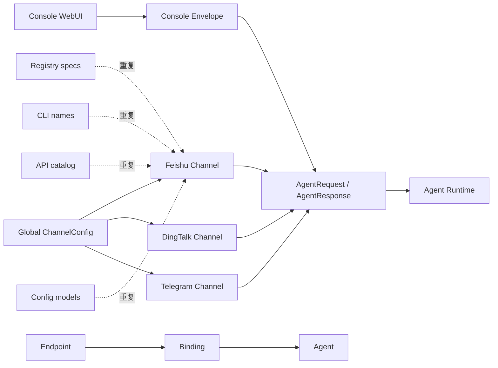
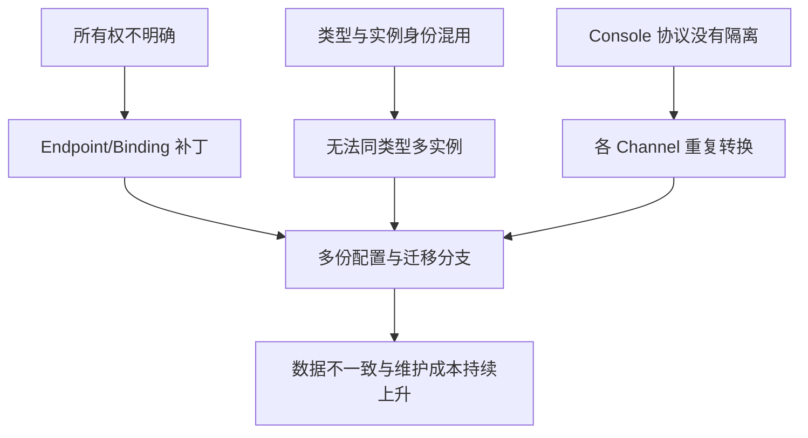
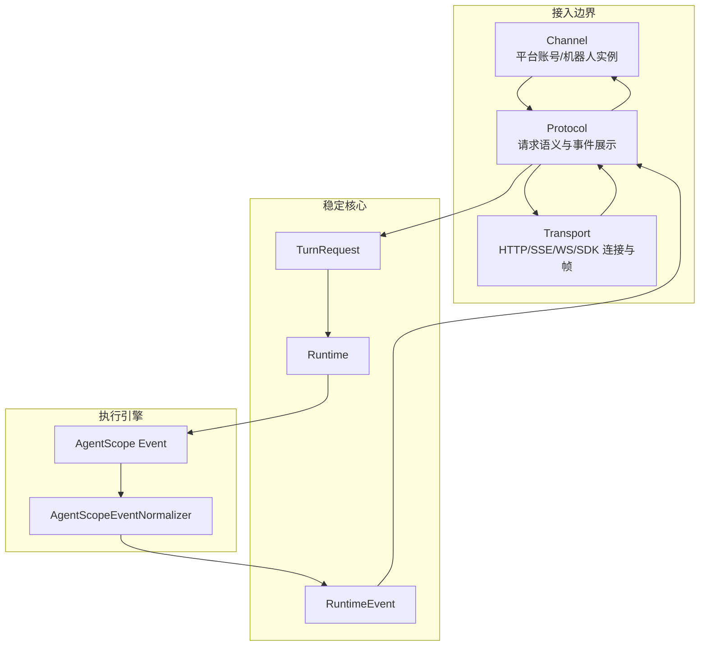
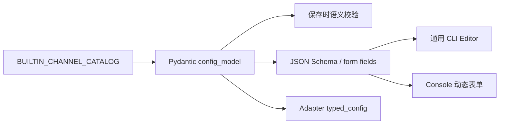
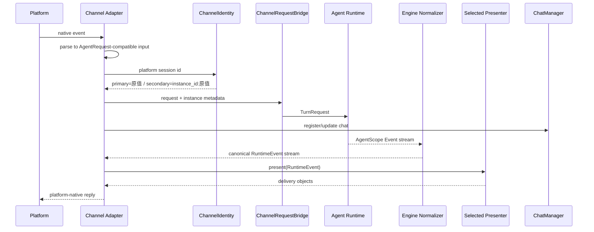
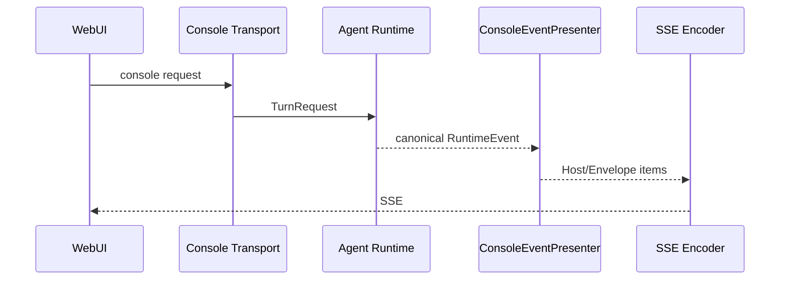
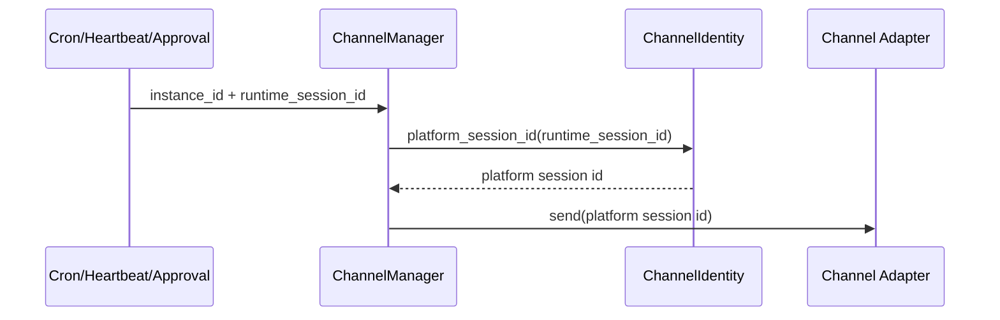

# QwenPaw Channel / Transport / Protocol 架构（最终版）

> 状态：已实施。本文是唯一有效设计；V4 及开发阶段迁移方案已废止。

## 0. 为什么必须重构

### 0.1 旧架构的问题

旧实现把“平台接入”“Agent 归属”“运行时请求”“Console 展示协议”放在
Channel 层交叉处理，形成了错误的依赖方向：



主要问题如下：

| 问题 | 旧表现 | 直接后果 |
|---|---|---|
| Channel 与 Agent 归属不清 | 全局 Channel、Endpoint、Binding、Agent 配置同时表达归属 | 多事实来源，启动和保存时互相覆盖 |
| Console 被当作普通 Channel | `Envelope` 位于 Channel 体系并定义 `AgentRequest/AgentResponse` 展示协议 | Console 的 UI 协议泄漏给所有外部 Channel |
| 平台转换与运行时协议耦合 | 每个 Adapter 都要构造旧请求并解析旧响应 | 重复转换代码多，新增 Channel 成本高 |
| `type` 同时承担类型和实例身份 | `feishu` 既用于选 Adapter，又用于队列、配置和会话寻址 | 同类型只能配置一份，扩展后发生会话和状态碰撞 |
| 配置模型职责过重 | 平台配置、启停、实例身份和运行时字段混在 flat dict/BaseModel 中 | API、落盘与运行时投影难以保持一致 |
| 内置 Channel 重复定义 | Registry、CLI、API、配置模型分别维护 key、类名、名称和能力 | 新增或改名容易漏改，产生“可展示但不可加载”等不一致 |
| 历史兼容散落 | Chat、Session、状态路径由各 Channel 自行拼接 | 修改实例模型时必须到处补迁移和兼容判断 |
| Console 与外部消息共用旧协议 | AgentScope Event 先转 Envelope/AgentResponse，再被平台转换 | 产生无业务价值的二次转换和协议耦合 |

### 0.2 根因

这些问题不是几个独立 bug，而是三个基础抽象缺失：

1. **缺少稳定所有权**：没有明确规定 `Agent -> Channel instance` 是配置聚合
   关系，导致用 Endpoint/Binding 做运行时补丁。
2. **缺少稳定身份**：没有区分 `channel_type` 与 `instance_id`，类型键被迫
   承担配置、路由、会话和状态的全部身份。
3. **缺少协议边界**：没有以 `TurnRequest/RuntimeEvent` 作为 Core 边界，
   Console 的 Envelope 协议被误当成通用 Agent 协议。

根因链路：



### 0.3 不重构的后果

- 每增加一种 Channel，都要同时修改 Registry、配置、API、CLI 和消息转换。
- 支持同类型第二个机器人时，只能继续堆 Endpoint/Binding 和特殊会话前缀。
- Console UI 协议一旦变化，所有外部 Channel 都可能被迫跟随修改。
- 多个版本进程共享配置时，缺少单一稳定格式，容易反复回写和损坏数据。
- 为兼容开发期临时格式而不断增加迁移分支，最终迁移代码比业务模型更复杂。

因此本次重构不是单纯增加“多 Channel 配置”，而是重新建立所有权、身份、
Core 协议和展示协议四条边界，从根源消除耦合与重复。

## 1. 最终决策

- Channel 配置归 Agent 所有，`agent.json` 是唯一事实来源。
- 一个 Agent 可以拥有多种 Channel，也可以拥有同类型的多个实例。
- 一个 Channel 实例只属于一个 Agent，不提供跨 Agent Binding。
- `channels` 对外和落盘始终是 dict，不改成 list。
- 每种 Channel 的首实例 ID 固定等于类型，例如 `feishu`。
- 后续实例使用 `feishu-{8位随机ID}`，不得改变首实例身份。
- Console 是 Web Transport，不是外部 Channel。
- AgentScope 只是 Engine 实现，不是 Runtime、Channel 或 Console 的协议。
- Runtime 只发布 QwenPaw canonical `RuntimeEvent`，不发布原生 Engine Event。
- Protocol 负责请求和事件语义；Transport 只负责连接与帧。
- 迁移只支持发布前最原始的 flat channels dict，不兼容开发阶段格式。

## 2. 总体架构



边界说明：

| 层 | 职责 | 不负责 |
|---|---|---|
| Agent 配置 | Channel 所有权、实例配置 | 平台协议转换 |
| Channel Adapter | 平台账号实例、原生收发、鉴权、会话目标 | Runtime、Console 展示协议 |
| Transport | HTTP/SSE/WebSocket/SDK 连接、帧序列化 | Agent/工具/消息语义 |
| Protocol | 原生请求转 `TurnRequest`，`RuntimeEvent` 转协议输出 | 网络连接、平台凭据 |
| ChannelRequestBridge | Channel 请求转 `TurnRequest` | 平台响应渲染 |
| Engine Normalizer | 一次性把 Engine 原生事件转为 canonical event | UI 或平台展示 |
| Agent Runtime | 统一编排并发布 `RuntimeEvent` | Engine Event、SSE、卡片格式 |
| Console Presenter | RuntimeEvent 转 Host/Envelope 对象 | SSE 字节编码、外部平台 API |

`transports/console/envelope.py` 的路径暂时保留，以兼容已有 import；它的输入已经
从 AgentScope Event 改为 canonical RuntimeEvent 语义，所有权属于 Console
Protocol。`ConsoleSseEncoder` 才是纯 Transport。外部 Channel 直接接收
RuntimeEvent，并在自己的应用边界选择 Presenter；不再解析 AgentScope Event。

### 2.1 强制依赖规则

```text
Engine Adapter ──> domain.turns <── Runtime
                         │
                         v
                  Protocol ports/registry
                    /              \
              Channel edge     Transport edge
```

- `domain.turns` 不得 import AgentScope、Console、Channel SDK。
- `runtime` 不得 import 具体 Presenter、Transport 或 Channel。
- `protocols` 不得 import AgentScope；A2A/AG-UI 只能消费 TurnRequest/RuntimeEvent。
- `transports` 不得解释 Agent 推理、工具调用等语义。
- Channel 可以在边界选择 Protocol，但 Runtime 不能反向选择 Channel。

这些规则由 `tests/unit/architecture/test_channel_transport_protocol_boundaries.py`
持续检查，避免重构后再次出现反向依赖。

### 2.2 Canonical RuntimeEvent

`RuntimeEventType.AGENT_EVENT + payload: Any` 已删除。事件按稳定语义分组：

```text
turn_started / turn_completed / turn_failed / turn_cancelled
reply_started / reply_completed
model_call_started / model_call_completed
content_started / content_delta / content_completed
tool_call_started / tool_call_delta / tool_call_completed
tool_result_started / tool_result_delta / tool_result_completed
interaction_required / interaction_result / limit_reached / custom
heartbeat / message
```

文本、reasoning、data 通过 `data.content_kind` 区分，而不是把 Engine 的类名暴露
给消费者。AgentScope 的全部 EventType 由一个 normalizer 覆盖；升级 AgentScope
新增事件时，覆盖测试会立即失败。

### 2.3 Protocol 扩展原型

```python
registry.register(
    ProtocolRegistration(
        key="agui",
        ingress_factory=AguiIngress,
        presenter_factory=lambda context: AguiPresenter(context),
        config_model=AguiProtocolConfig,
        capabilities={"resume": True},
    ),
)
```

`Runtime.present(request, presenter, context)` 只依赖 `TurnEventPresenter` 端口。
所以接入 A2A、AG-UI 或其他协议时，不修改 Runtime、AgentScope normalizer 和任何
Channel 实现；只增加 ingress、presenter、transport 组合与注册。

现有 Console registration 同时注册 `ConsoleTurnIngress` 和
`ConsoleEventPresenter`。Ingress 继续接受原 `AgentRequest` API 类型，在边界转成
`TurnRequest`，因此架构调整不要求 WebUI 修改请求/响应数据类型。

## 3. 配置与身份模型

```text
AgentProfileConfig
  ├── transports.console: ConsoleTransportConfig
  └── channels: dict[instance_id, AgentChannelConfig]
        ├── feishu
        │     ├── type = feishu
        │     └── settings = 主机器人凭据
        └── feishu-2f87b8f4
              ├── type = feishu
              └── settings = 第二个机器人凭据
```

稳定落盘格式：

```json
{
  "channel_schema_version": 5,
  "channels": {
    "feishu": {
      "type": "feishu",
      "name": "主飞书",
      "enabled": true,
      "settings": {}
    },
    "feishu-2f87b8f4": {
      "type": "feishu",
      "name": "客服飞书",
      "enabled": true,
      "settings": {}
    }
  }
}
```

`instance_id` 与 `type` 的职责不可混用：

- `type`：选择 Catalog、配置模型和 Adapter 类。
- `instance_id`：配置 CRUD、运行时寻址、队列、会话和状态隔离。

主实例不能在存在次实例时删除，也不允许把次实例自动提升为主实例，避免
历史会话静默切换到另一套机器人凭据。

## 4. 唯一 Channel Catalog

`BUILTIN_CHANNEL_CATALOG` 是内置 Channel 的唯一静态定义，集中描述：

- key、模块、Adapter 类、配置类；
- 展示名称与排序；
- channel/web surface；
- 是否必需、是否支持流式和访问控制；
- Bot 身份冲突字段。

Registry、CLI、配置 API 和类型目录都从 Catalog 派生。Registry 内的
`_BUILTIN_SPECS` 只是运行时投影，不再手工维护第二份定义。

### 4.1 配置模型也是唯一字段定义

内置 Channel 的配置字段从 Catalog 指向的 Pydantic `config_model` 派生，
不再在 CLI 中维护 `_ALL_CHANNEL_CONFIGURATORS`、`configure_feishu()` 等
逐平台函数，也不再维护单独的敏感字段名单：



CLI 的实例列表直接读取 `AgentProfileConfig.channels`，因此主实例和次实例均可
显示、编辑、删除和新增；保存统一经过 `ChannelConfigService`，不会绕过实例 ID、
主实例保护或配置校验。Console 由独立的 `ConsoleTransportConfig` 编辑器处理，
不再混入外部 Channel configurator。

### 4.2 插件 Channel 扩展契约

新插件通过 `PluginApi.register_channel(..., config_model=MyConfig)` 注册配置模型。
该模型同时驱动存储校验、CLI 和 Console schema；注册过程自动投影
`config_fields`，以保持现有 WebUI API 的响应类型不变。示例：

```python
class MyChannelConfig(BaseModel):
    endpoint: str
    api_token: str = ""
    retries: int = Field(default=3, ge=1)

api.register_channel(
    MyChannel,
    label="My Channel",
    config_model=MyChannelConfig,
)
```

旧插件只传 `config_fields` 的调用仍可运行，且原有位置参数顺序保持不变；但它
只能获得表单元数据和宽松 settings 保存。需要端到端类型校验的新插件必须使用
`config_model`，避免插件内部、WebUI 和 CLI 各维护一份字段定义。

## 5. 核心链路

### 5.1 外部 Channel 入站



### 5.2 Console/WebUI



Console 的语义展示转换只存在一份，SSE Encoder 不理解 RuntimeEvent。外部
内置 BaseChannel 通过独立的 `Workspace.stream_channel_events()` 端口接收 canonical
事件；ChannelManager 原有 `process` 回调继续返回旧展示对象，避免破坏直接调用
`_process` 的第三方插件。当前遗留 Channel send hook 通过集中式
`ReplyPresentationAdapter` 复用 Host Presenter，后续平台原生 Presenter 可以按
Channel 能力逐个替换，不再触碰 Runtime。

### 5.3 主动发送



次实例必须保存 `channel_instance_id`，主动发送不能仅按 `type` 选择 Adapter。

## 6. 历史兼容不变量

| 数据 | 首实例 | 新增实例 |
|---|---|---|
| 配置键 | `channel_type` | `channel_type-{8位ID}` |
| runtime session | 原值 | `instance_id:platform_session_id` |
| `chats.json.channel` | 保持类型 | 保持类型 |
| `chats.json.meta` | 无新增要求 | `channel_instance_id` |
| Session 目录 | 原路径 | 与首实例同类型目录 |
| Session 文件名 | 原命名 | 基于限定 runtime session |
| Channel 状态 | workspace 根目录 | `.channel_instances/{hash}` |

首实例沿用旧 ID，因此最原始数据升级不需要改写 `chats.json`、Session 文件名
或 Channel 状态文件。

## 7. 唯一支持的迁移

### 7.1 输入

只识别发布前最原始的 flat dict：

```json
{
  "channels": {
    "feishu": {
      "enabled": true,
      "app_id": "...",
      "app_secret": "..."
    }
  }
}
```

迁移规则：

1. dict key 继续作为首实例 ID 和 `type`。
2. `enabled` 提升到实例 envelope。
3. 其余配置进入 `settings`。
4. `console` 移入 `transports.console`。
5. 全局原始 `config.json.channels` 迁入 active Agent 后删除。
6. 写入前创建带校验和的备份；任何写入失败恢复全部源文件。
7. 不读取、不改写 `chats.json`、Session 和 Channel 状态文件。

### 7.2 明确不支持

以下均为开发阶段临时格式，不属于产品升级契约：

- `channels` list；
- 新旧 envelope 混合 dict；
- V2/V3/V4 schema 逐级升级；
- `channel_routing.endpoints/bindings` 投影；
- 从旧迁移备份恢复实例 ID；
- 嵌套 envelope、错误次实例 type 的运行时修复；
- 开发期 Session、Chat 索引或状态目录回迁。

遇到这些格式时迁移不得猜测或静默写入。开发环境应使用隔离的
`QWENPAW_WORKING_DIR` 或人工恢复到明确格式。

## 8. API 与 Console

API 实例结构保持对象语义：

```json
{
  "id": "feishu-2f87b8f4",
  "type": "feishu",
  "name": "客服飞书",
  "enabled": true,
  "settings": {}
}
```

- `POST /config/channels` 按 type 创建；首实例 ID 为 type，后续生成随机 ID。
- GET/PUT/DELETE、重启和健康检查全部按 `instance_id` 寻址。
- Console 使用 `id` 作为 React key、编辑目标和状态更新条件。
- 类型入口始终保留，允许继续创建同类型实例。
- Bot 身份冲突检查覆盖本 Agent 其他实例和其他 Agent。

## 9. 多进程与降级约束

不同版本的 QwenPaw 不得共享同一个 working directory。旧进程可能把稳定
instance envelope 回写成 flat map，形成产品不支持的 mixed 格式。

开发、Qoder、正式版必须设置独立的 `QWENPAW_WORKING_DIR`。这是运行环境
隔离要求，不通过迁移器持续修复多写者竞争。

## 10. 验收标准与状态

- [x] Agent 持有 `dict[instance_id, AgentChannelConfig]`
- [x] 同一 Agent 支持同类型多个 Channel 实例
- [x] 首实例 ID、Chat、Session 和状态路径保持历史兼容
- [x] 次实例队列、Session、Chat metadata 和状态隔离
- [x] API 与 Console 按实例 ID 寻址
- [x] AgentScope 协议从外部 Channel 链路中隔离；遗留 Host 转换集中在 Presenter
- [x] AgentScope Event 在 Engine 边界一次性规范化
- [x] 删除 `RuntimeEventType.AGENT_EVENT` 和原生 event payload 泄漏
- [x] Runtime 不再实例化或 import Console Presenter
- [x] Protocol ports、registration、可扩展 registry 已实现
- [x] Console Envelope 改为直接消费 canonical event 语义
- [x] Console Protocol 与 Envelope 不再 import AgentScope EventType
- [x] ChannelManager 直接接收 RuntimeEvent，在 Channel 边界选择 Presenter
- [x] ConsoleSseEncoder 满足纯 TransportEncoder 端口
- [x] RequestSource 接受开放 protocol/endpoint 标识，保留 kind 读取兼容
- [x] 内置 Channel 定义集中到 Catalog
- [x] Channel CLI 由 Catalog/config model 生成，删除逐平台 configurator
- [x] CLI 支持按 instance_id 编辑、新增和删除同类型实例
- [x] 插件 config model 同时驱动校验、CLI 和 Console schema
- [x] 旧插件 `config_fields` 与位置参数 API 保持兼容
- [x] 迁移器只接受最原始 flat dict
- [x] 删除开发阶段 list/routing/mixed/session 修复逻辑
- [x] Channel/Runtime/Protocol/Transport 定向回归：336 passed
- [x] 未执行 `npm run build`

关键实施提交：

- `c61788c6`：Channel 多实例兼容归属模型。
- `5bf4683b`：旧格式回写后的加载修复（后续已按最终迁移边界删除）。
- `35318c33`：迁移收敛为仅支持最原始 channels map。
