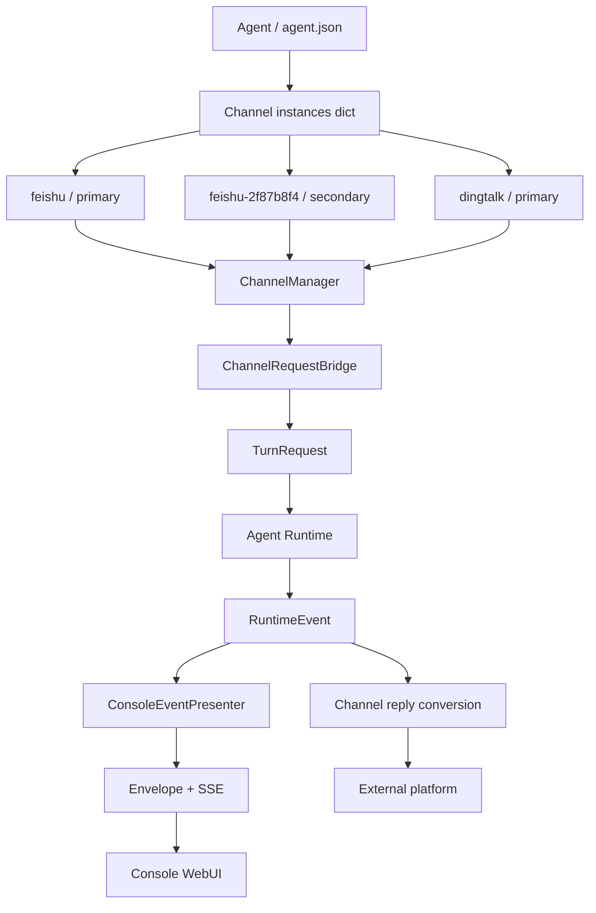
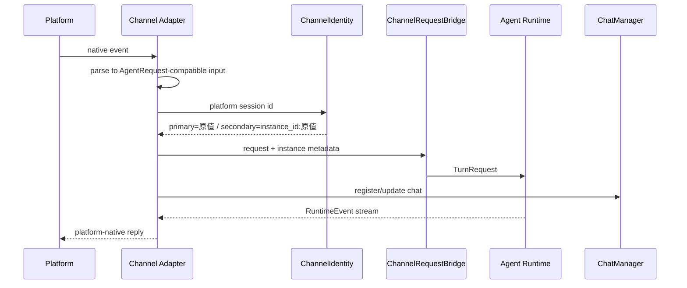
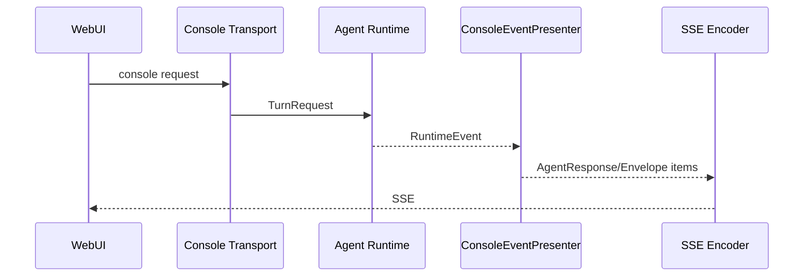
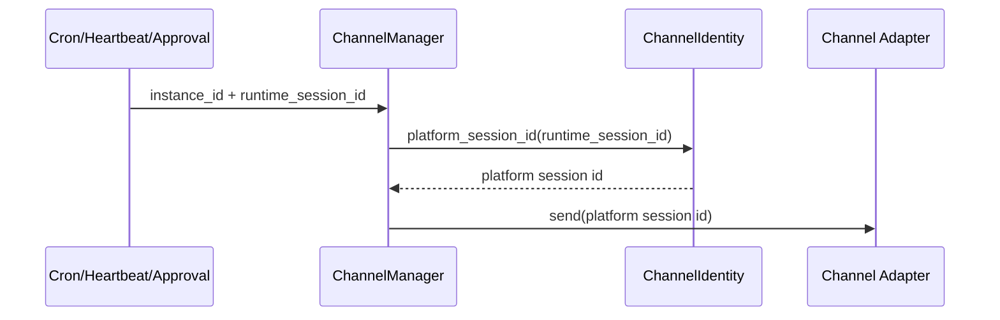

# QwenPaw Channel 与 Agent 架构重构方案（最终版）

> 状态：已实施。本文是唯一有效设计；V4 及开发阶段迁移方案已废止。

## 1. 最终决策

- Channel 配置归 Agent 所有，`agent.json` 是唯一事实来源。
- 一个 Agent 可以拥有多种 Channel，也可以拥有同类型的多个实例。
- 一个 Channel 实例只属于一个 Agent，不提供跨 Agent Binding。
- `channels` 对外和落盘始终是 dict，不改成 list。
- 每种 Channel 的首实例 ID 固定等于类型，例如 `feishu`。
- 后续实例使用 `feishu-{8位随机ID}`，不得改变首实例身份。
- Console 是 Web Transport，不是外部 Channel。
- 迁移只支持发布前最原始的 flat channels dict，不兼容开发阶段格式。

## 2. 总体架构



边界说明：

| 层 | 职责 | 不负责 |
|---|---|---|
| Agent 配置 | Channel 所有权、实例配置 | 平台协议转换 |
| Channel Adapter | 平台收发、鉴权、原生消息解析 | Console 展示协议 |
| ChannelRequestBridge | Channel 请求转 `TurnRequest` | 平台响应渲染 |
| Agent Runtime | 统一执行并产生 `RuntimeEvent` | SSE/卡片格式 |
| Console Presenter | RuntimeEvent 转 Envelope/SSE | 外部 Channel 消息转换 |

`Envelope` 保留在 `transports/console`，只服务 Console/WebUI。其他
Channel 不再为 Console 的 `AgentRequest/AgentResponse` 展示协议做重复转换。

## 3. 配置与身份模型

```text
AgentProfileConfig
  ├── transports.console: ConsoleTransportConfig
  └── channels: dict[instance_id, AgentChannelConfig]
        ├── feishu
        │     ├── type = feishu
        │     └── settings = 主机器人凭据
        └── feishu-2f87b8f4
              ├── type = feishu
              └── settings = 第二个机器人凭据
```

稳定落盘格式：

```json
{
  "channel_schema_version": 5,
  "channels": {
    "feishu": {
      "type": "feishu",
      "name": "主飞书",
      "enabled": true,
      "settings": {}
    },
    "feishu-2f87b8f4": {
      "type": "feishu",
      "name": "客服飞书",
      "enabled": true,
      "settings": {}
    }
  }
}
```

`instance_id` 与 `type` 的职责不可混用：

- `type`：选择 Catalog、配置模型和 Adapter 类。
- `instance_id`：配置 CRUD、运行时寻址、队列、会话和状态隔离。

主实例不能在存在次实例时删除，也不允许把次实例自动提升为主实例，避免
历史会话静默切换到另一套机器人凭据。

## 4. 唯一 Channel Catalog

`BUILTIN_CHANNEL_CATALOG` 是内置 Channel 的唯一静态定义，集中描述：

- key、模块、Adapter 类、配置类；
- 展示名称与排序；
- channel/web surface；
- 是否必需、是否支持流式和访问控制；
- Bot 身份冲突字段。

Registry、CLI、配置 API 和类型目录都从 Catalog 派生。Registry 内的
`_BUILTIN_SPECS` 只是运行时投影，不再手工维护第二份定义。

## 5. 核心链路

### 5.1 外部 Channel 入站



### 5.2 Console/WebUI



Console 的 Event 展示转换只存在一份。外部 Channel 直接消费 RuntimeEvent
并渲染平台消息，不依赖 Console Envelope。

### 5.3 主动发送



次实例必须保存 `channel_instance_id`，主动发送不能仅按 `type` 选择 Adapter。

## 6. 历史兼容不变量

| 数据 | 首实例 | 新增实例 |
|---|---|---|
| 配置键 | `channel_type` | `channel_type-{8位ID}` |
| runtime session | 原值 | `instance_id:platform_session_id` |
| `chats.json.channel` | 保持类型 | 保持类型 |
| `chats.json.meta` | 无新增要求 | `channel_instance_id` |
| Session 目录 | 原路径 | 与首实例同类型目录 |
| Session 文件名 | 原命名 | 基于限定 runtime session |
| Channel 状态 | workspace 根目录 | `.channel_instances/{hash}` |

首实例沿用旧 ID，因此最原始数据升级不需要改写 `chats.json`、Session 文件名
或 Channel 状态文件。

## 7. 唯一支持的迁移

### 7.1 输入

只识别发布前最原始的 flat dict：

```json
{
  "channels": {
    "feishu": {
      "enabled": true,
      "app_id": "...",
      "app_secret": "..."
    }
  }
}
```

迁移规则：

1. dict key 继续作为首实例 ID 和 `type`。
2. `enabled` 提升到实例 envelope。
3. 其余配置进入 `settings`。
4. `console` 移入 `transports.console`。
5. 全局原始 `config.json.channels` 迁入 active Agent 后删除。
6. 写入前创建带校验和的备份；任何写入失败恢复全部源文件。
7. 不读取、不改写 `chats.json`、Session 和 Channel 状态文件。

### 7.2 明确不支持

以下均为开发阶段临时格式，不属于产品升级契约：

- `channels` list；
- 新旧 envelope 混合 dict；
- V2/V3/V4 schema 逐级升级；
- `channel_routing.endpoints/bindings` 投影；
- 从旧迁移备份恢复实例 ID；
- 嵌套 envelope、错误次实例 type 的运行时修复；
- 开发期 Session、Chat 索引或状态目录回迁。

遇到这些格式时迁移不得猜测或静默写入。开发环境应使用隔离的
`QWENPAW_WORKING_DIR` 或人工恢复到明确格式。

## 8. API 与 Console

API 实例结构保持对象语义：

```json
{
  "id": "feishu-2f87b8f4",
  "type": "feishu",
  "name": "客服飞书",
  "enabled": true,
  "settings": {}
}
```

- `POST /config/channels` 按 type 创建；首实例 ID 为 type，后续生成随机 ID。
- GET/PUT/DELETE、重启和健康检查全部按 `instance_id` 寻址。
- Console 使用 `id` 作为 React key、编辑目标和状态更新条件。
- 类型入口始终保留，允许继续创建同类型实例。
- Bot 身份冲突检查覆盖本 Agent 其他实例和其他 Agent。

## 9. 多进程与降级约束

不同版本的 QwenPaw 不得共享同一个 working directory。旧进程可能把稳定
instance envelope 回写成 flat map，形成产品不支持的 mixed 格式。

开发、Qoder、正式版必须设置独立的 `QWENPAW_WORKING_DIR`。这是运行环境
隔离要求，不通过迁移器持续修复多写者竞争。

## 10. 验收标准与状态

- [x] Agent 持有 `dict[instance_id, AgentChannelConfig]`
- [x] 同一 Agent 支持同类型多个 Channel 实例
- [x] 首实例 ID、Chat、Session 和状态路径保持历史兼容
- [x] 次实例队列、Session、Chat metadata 和状态隔离
- [x] API 与 Console 按实例 ID 寻址
- [x] Console Envelope 从外部 Channel 转换链路中隔离
- [x] 内置 Channel 定义集中到 Catalog
- [x] 迁移器只接受最原始 flat dict
- [x] 删除开发阶段 list/routing/mixed/session 修复逻辑
- [x] 原始迁移、API、当前格式加载定向回归：48 passed
- [x] 未执行 `npm run build`

关键实施提交：

- `c61788c6`：Channel 多实例兼容归属模型。
- `5bf4683b`：旧格式回写后的加载修复（后续已按最终迁移边界删除）。
- `35318c33`：迁移收敛为仅支持最原始 channels map。
