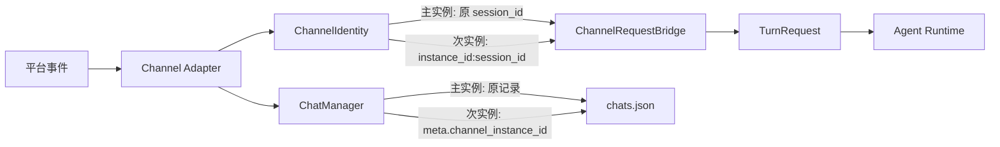
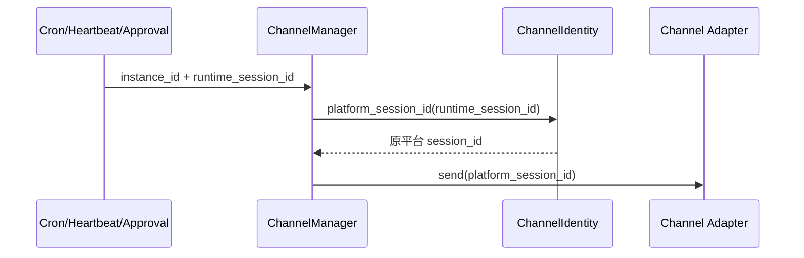

# QwenPaw Channel 与 Agent 架构重构方案 V5

## 1. 目标

V5 在 V4 的 Agent 归属模型上恢复同类型 Channel 多实例，同时保证每个 Agent、每种 Channel 的首实例完全兼容已有数据：

- 一个 Agent 可以拥有多种 Channel。
- 同一种 Channel 可以拥有多个配置实例。
- 每个配置实例只属于一个 Agent，不恢复跨 Agent 共享 Binding。
- 首实例继续使用现有 Channel 类型作为 ID。
- V4 升级不改写 `chats.json`、Session 文件名和 Channel 状态文件。
- 新增实例使用独立 ID、会话命名空间和状态目录。

## 2. 身份模型

```text
Agent
  └── channels: dict[instance_id, AgentChannelConfig]
        ├── feishu                 # 主实例，兼容历史
        │     └── type = feishu
        └── feishu-a81c3f          # 次实例，新增数据隔离
              └── type = feishu
```

配置原型：

```json
{
  "channel_schema_version": 5,
  "channels": {
    "feishu": {
      "type": "feishu",
      "name": "主飞书",
      "enabled": true,
      "settings": {}
    },
    "feishu-a81c3f": {
      "type": "feishu",
      "name": "客服飞书",
      "enabled": true,
      "settings": {}
    }
  }
}
```

`channel_type` 负责选择 Catalog、配置 Schema 和适配器类；`instance_id` 负责配置 CRUD、运行时寻址、队列隔离和主动发送。两者不得再次混用。

## 3. 兼容不变量

| 数据 | 主实例 `instance_id == type` | 次实例 |
|---|---|---|
| 配置键 | 保持 `feishu` | `feishu-{short_id}` |
| 平台会话 ID | `conversation_id` | `conversation_id` |
| 运行时会话 ID | 保持原值 | `instance_id:conversation_id` |
| `chats.json` 中 `channel` | 保持 `feishu` | 仍为 `feishu` |
| Chat `meta` | 不新增字段 | `channel_instance_id` |
| Session 目录 | 保持 `sessions/feishu` | 保持 `sessions/feishu` |
| Session 文件名 | 保持原命名 | 由限定后的运行时会话 ID 生成 |
| Channel 状态目录 | Agent workspace 根目录 | `.channel_instances/{sha256前16位}` |

主实例不能在仍有次实例时删除，也不允许自动把次实例提升成主实例。否则旧会话会静默绑定到另一套机器人凭据。

## 4. 核心链路

### 4.1 入站消息



适配器只解析平台协议。`ChannelRequestBridge` 负责把平台会话投影为运行时会话；Console Transport 不进入该转换链路。

### 4.2 主动发送



`last_dispatch.channel` 和 Cron target 对次实例保存 `instance_id`，因此主动发送不会误选主实例；真正交给平台适配器前再移除会话限定符。

## 5. 数据迁移

### 5.1 V4 → V5

只修改 `agent.json`：

1. `channel_schema_version` 从 4 改为 5。
2. 为每个现有配置增加 `type`，值等于原字典键。
3. 原字典键继续作为主实例 ID。

迁移不得读取后再重写以下文件：

- `chats.json`
- `sessions/**/*.json`
- `feishu_receive_ids.json`
- `dingtalk_session_webhooks.json`
- `yuanbao_sessions.json`

测试以迁移前后字节相等作为验收标准。

### 5.2 V2 多实例 → V5

按旧列表顺序处理每种 Channel：

1. 第一项变成主实例，配置键改为 `channel_type`。
2. 第一项旧实例 ID 只用于修复 V2 已限定的历史会话和状态。
3. 后续项保留旧实例 ID，不合并、不丢弃。
4. 后续项的限定 Session 和实例状态目录保持原样。
5. 若后续实例已有 Session 但没有 Chat 记录，迁移为其补充
   `instance_id:session_id` 索引，并写入 `meta.channel_instance_id`。
6. 迁移只增加次实例索引，不重写或删除次实例 Session 文件。

### 5.3 旧 Endpoint/Binding → V5

Binding 只用于一次性确定 Agent owner，迁移完成后删除：

- 某 Agent 某类型没有配置时，第一个 Endpoint 成为主实例。
- 后续 Endpoint 保留 `endpoint_id` 作为次实例 ID。
- 不再持久化 Endpoint/Binding 运行时投影。

## 6. API 与 Console

API 返回结构：

```json
{
  "id": "feishu-a81c3f",
  "type": "feishu",
  "name": "客服飞书",
  "enabled": true,
  "settings": {}
}
```

- `POST /config/channels` 按 `type` 创建实例；无主实例时 ID 为类型，否则生成次实例 ID。
- `GET/PUT/DELETE /config/channels/{instance_id}` 全部按实例寻址。
- 健康检查和重启也按实例 ID 寻址。
- Console 列表以 `id` 作为 React key 和更新条件，同类型配置不会相互覆盖。
- Channel 类型入口始终保留，用于继续新增同类型实例。
- Bot 身份冲突检查覆盖同一 Agent 的其他实例和其他 Agent。

## 7. 实施 checklist

- [x] 建立 `ChannelIdentity` 并定义主、次实例不变量
- [x] 增加 V4 → V5 历史文件零改写测试
- [x] 增加 V2 多实例保留测试
- [x] 增加 V2 次实例历史索引修复测试
- [x] 配置模型改为 `dict[instance_id, AgentChannelConfig]`
- [x] 后端 CRUD 改为实例寻址
- [x] ChannelManager 支持同类型多个适配器
- [x] 主实例状态路径保持不变，次实例状态隔离
- [x] 主实例 Session 保持不变，次实例 Session 限定
- [x] Console 状态更新从 `type` 改为 `id`
- [x] Console 保留同类型新增入口
- [x] 完成定向回归、类型检查和 pre-commit
- [x] 使用隔离数据执行 API/迁移 Happy Path
- [x] 同步钉钉功能方案设计文档

## 8. 验收标准

1. V4 Agent 启动后，原 Channel、Chat 和历史 Session 可直接使用。
2. 同一 Agent 可以创建、启动和分别编辑两个相同类型的 Channel。
3. 两个实例收到相同平台会话 ID 时，运行时会话、队列和状态互不覆盖。
4. 删除或更新一个次实例不影响同类型其他实例。
5. 重启、健康检查、Cron、Heartbeat 和审批回复均选择正确实例。
6. 不执行 `npm run build`；pytest、Vitest、TypeScript 检查和 pre-commit 全部通过。

## 9. 实施验证记录

- 后端完整 unit 基线：`6839 passed, 16 skipped`；最终迁移增量回归：
  `39 passed`。
- Channel API 集成回归：`11 passed`。
- Console 完整 Vitest：`1736 passed`，共 604 个 suite。
- TypeScript：`tsc -b --noEmit` 通过。
- pre-commit：变更文件全部通过。
- 真实 `~/.copaw` 中 7 个 Agent 已升级到 schema 5。
- 现有 Feishu 主实例 ID 仍为 `feishu`。
- V5 备份清单只含根配置和 Agent 配置，不含 `chats.json` 或 Session 文件。
