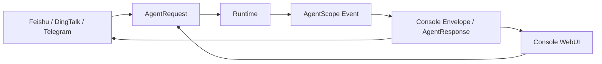
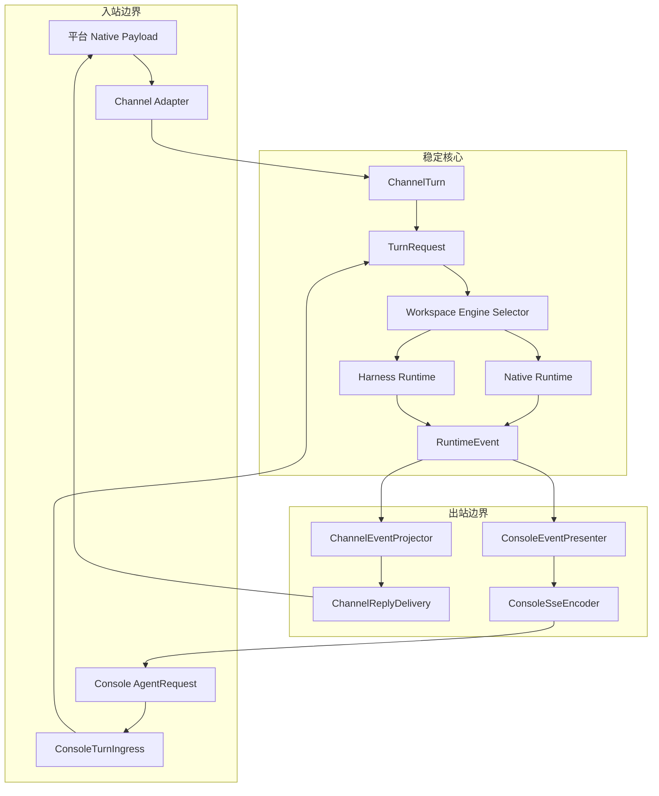
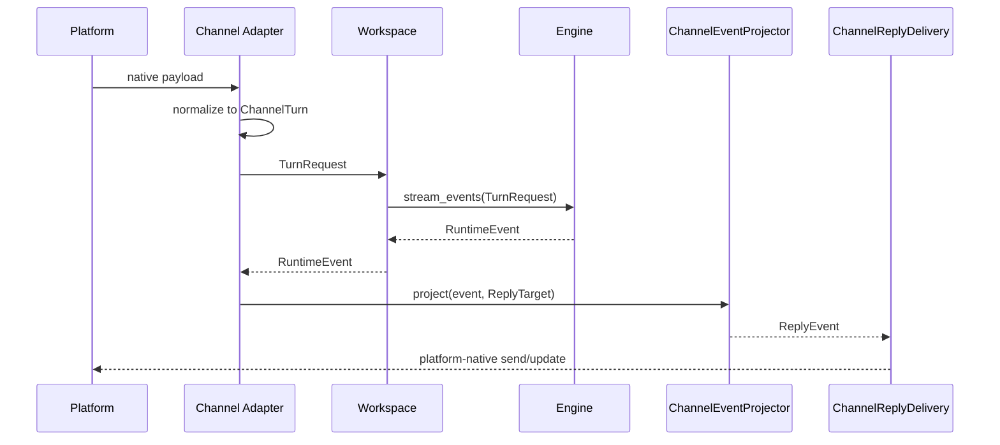
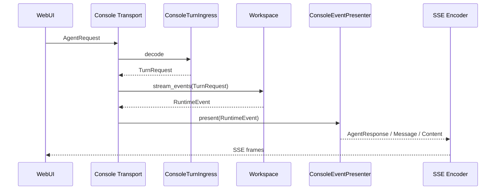
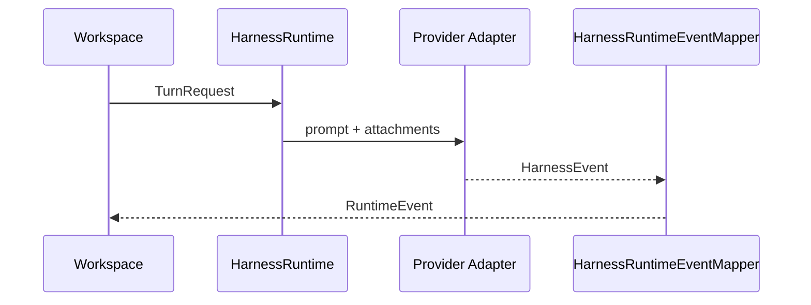
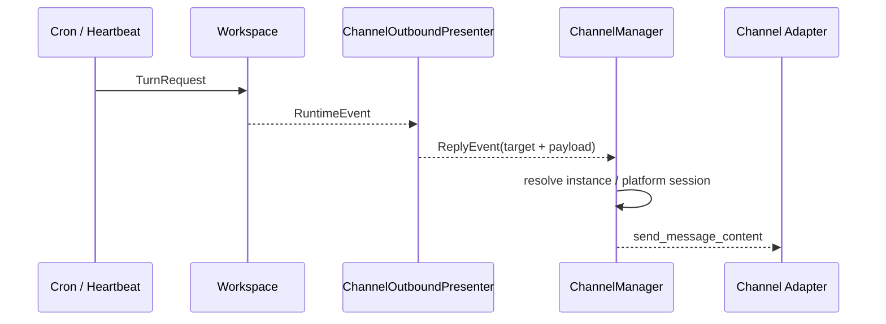

# QwenPaw Channel / Transport / Protocol 最终架构

> 状态：已实施。本文是当前唯一有效设计，旧版桥接、运行时投影和开发阶段迁移方案全部废止。

## 1. 为什么必须重构

旧架构没有把“平台接入、执行内核、Console 协议、网络传输”分开：外部 Channel
构造 Console 的 `AgentRequest`，Runtime 生成或理解 `AgentResponse`，Channel 再把
Console Envelope 翻译成平台消息。结果是一条消息被重复转换，多种 Channel 复制
同一套事件、SSE、工具调用和错误处理逻辑。



这不是局部实现问题，而是依赖方向错误：

| 旧问题 | 直接后果 |
|---|---|
| Console 被当成通用 Agent 协议 | WebUI 字段变化会影响所有外部 Channel |
| Channel、Runtime 都承担事件转换 | 同一语义存在多个 projector/adapter/encoder |
| Runtime 知道 Presenter、ReplyTarget 和 Transport | A2A、AG-UI 等新协议必须修改核心 |
| `TaskTracker` 缓存 SSE 字符串 | 事件无法被 WebSocket、Channel 或其他协议复用 |
| ChannelTurn 允许动态挂属性 | 钉钉卡片、企微 stream id 等隐式状态不可检查 |
| `RequestSource.kind` 等迁移别名长期保留 | 新旧模型同时存在，调用方永远无法收敛 |
| Channel Catalog、CLI、API 多处手写 | 插件新增配置容易出现展示、保存、加载不一致 |
| Channel 所有权和实例身份不明确 | Endpoint/Binding、类型键和 Agent 配置互相补丁 |

重构的业务出发点是：一个 Agent 可以稳定接入多个平台、同类型多个机器人，并且
Console、飞书、钉钉、A2A、AG-UI 都能复用同一执行链路。新增一个接入只实现自己的
边界，不修改 Runtime，也不复制其他 Channel 的协议代码。

## 2. 最终原则

1. `agent.json` 是 Channel 归属和配置的唯一事实来源。
2. Channel 是平台账号/机器人实例；Console 是 Protocol + Transport，不是 Channel。
3. Runtime 和所有 Engine 只接受 `TurnRequest`、只输出 `RuntimeEvent`。
4. Protocol 负责语义转换；Transport 只负责连接、帧和字节编码。
5. Channel 在自己的边界把 `RuntimeEvent` 投影成 `ReplyEvent` 并调用平台 SDK；主动
   推送也必须携带完整 `ReplyTarget`，禁止退化为裸 payload + 旁路寻址参数。
6. `AgentRequest/AgentResponse` 只属于现有 Console 公共 API，不进入 Channel 或 Runtime。
7. 首实例保持历史 ID；新增实例使用带随机后缀的 ID。
8. 只迁移发布前最原始的 flat `channels` dict，不兼容开发阶段中间格式。
9. 不保留旧字段 alias、兼容 re-export、反向 normalizer 或运行时投影。

## 3. 总体架构



### 3.1 层级职责

| 层 | 负责 | 禁止 |
|---|---|---|
| Channel Adapter | 平台 payload、鉴权、会话目标、平台发送 | `AgentRequest`、`AgentResponse`、SSE |
| Protocol | 外部语义与 `TurnRequest/RuntimeEvent` 的双向映射 | 网络连接、平台凭据、执行引擎 |
| Transport | HTTP/SSE/WS/SDK 连接与帧编码 | 推理、工具、Agent 生命周期语义 |
| Workspace | 校验 `TurnRequest`，选择 Native/Harness Engine | Protocol、Transport、平台 SDK、外部 API schema |
| Runtime/Engine | 执行一次 Turn，发布 canonical event | Console、Channel、Presenter、ReplyTarget |
| TaskTracker | 缓存和重放 `RuntimeEvent` 对象 | JSON、SSE 字符串、Console schema |

### 3.2 强制依赖规则

```text
Platform SDK -> ChannelTurn -> TurnRequest <- Protocol Ingress
                                  |
                                  v
                         Runtime / Harness Engine
                                  |
                                  v
                            RuntimeEvent
                          /              \
               Channel Projector     Protocol Presenter
```

- `domain.turns` 不 import AgentScope、Console 或平台 SDK。
- `runtime` 不 import `protocols`、`transports`、`domain.channels`。
- Harness 不创建 `AgentResponse`，也不先生成 Console 对象再反向转换。
- `app/channels` 不出现 `AgentRequest`、`AgentResponse`。
- Console Envelope 只存在于 `protocols/console`，Transport 单向依赖 Protocol，且没有
  Runtime 兼容 re-export。
- ConsoleTransport 不继承 `BaseChannel`，也不从 `app/channels` 反向取得实现；两者只
  组合 `app/inbound_debounce`、`app/turn_lifecycle` 与 `presentation` 公共服务。
- 以上规则由架构测试直接读取源码和文件存在性约束。

### 3.3 Workspace 是纯执行端口

`Workspace` 现在只有一个公开执行入口：

```python
async def stream_events(request: TurnRequest) -> AsyncIterator[RuntimeEvent]:
    ...
```

它不再提供 `stream_query()`、`stream_channel_events()`，也不再调用
`ConsoleTurnIngress` 或 `ConsoleEventPresenter`。传入非 `TurnRequest` 会立即抛出
`TypeError`，避免错误协议在核心中被静默兼容。

所有来源必须在进入 Workspace 前完成命令构造：

```text
Console AgentRequest --ConsoleTurnIngress--+
Platform payload -----ChannelTurn----------+--> TurnRequest --> Workspace
Cron -----------------TurnFactory----------+
Heartbeat ------------TurnFactory----------+
PawApp ----------------TurnFactory----------+
ACP -------------------TurnFactory----------+
Task CLI --------------TurnFactory----------+
```

所有输出也必须在离开 Workspace 后由调用方选择 Presenter。这样 Workspace 不会因
Console WebUI、A2A 或 AG-UI 的接入而发生变化。

## 4. 核心模型

### 4.1 ChannelTurn

`ChannelTurn` 是 Channel 应用层的一次入站消息：

```python
@dataclass(slots=True)
class ChannelTurn:
    session_id: str
    sender_id: str
    messages: Sequence[Any]
    channel_type: str
    metadata: dict[str, Any]
    message_id: str
    state: dict[str, Any]
```

`metadata` 是可进入 Core 的业务上下文；`state` 只保存 Channel 本地、单次处理所需
的可变状态，例如钉钉预创建卡片、企微 processing stream id。`slots=True` 禁止
通过 `request._xxx` 动态挂载隐式字段。

`ChannelTurn.to_request()` 一次性生成 immutable `InboundMessage`、`ReplyTarget` 和
`TurnRequest`。旧 `ChannelRequestBridge`、`request_adapter` 及字段 alias 已删除。

### 4.2 TurnRequest

Runtime 唯一接受的请求包含：`turn_id`、`agent_id`、`session_id`、`user_id`、
`messages`、`source`、`reply_target`、`context`。`RequestSource` 只使用明确的
`protocol/endpoint_id/channel_type`，不再接受或暴露 `kind`。

### 4.3 RuntimeEvent

Native Runtime 与第三方 Harness 共用以下稳定事件族：

```text
turn_started / turn_completed / turn_failed / turn_cancelled
reply_started / reply_completed
model_call_started / model_call_completed
content_started / content_delta / content_completed
tool_call_started / tool_call_delta / tool_call_completed
tool_result_started / tool_result_delta / tool_result_completed
interaction_required / interaction_result / limit_reached
heartbeat / message / custom
```

AgentScope 或第三方 Provider 的事件只能在各自 Engine 边界映射一次。Core 消费者
不依赖原生事件类，也不通过 `payload: Any` 偷渡引擎协议。

## 5. 三条完整链路

### 5.1 外部 Channel



### 5.2 Console WebUI



WebUI 的请求和响应数据类型保持不变，但这些类型只存在于 Console 边界。

### 5.3 第三方 Harness



旧链路“`HarnessEvent -> AgentResponse -> HarnessEventNormalizer -> RuntimeEvent`”已删除。
Harness Session 持久化直接消费 `TurnRequest + HarnessEvent`，不依赖 Console 响应。

### 5.4 内部应用来源

Cron、Heartbeat、PawApp、ACP 和 Task CLI 不再构造 `AgentRequest`。它们通过共享的
`create_turn_request/create_text_turn` 工厂生成 canonical command，并为 `source`
填写各自协议名。Cron/Heartbeat 的主动推送通过 `ChannelOutboundPresenter` 把
`RuntimeEvent` 投影为带完整目标的 `ReplyEvent`，再由
`ChannelManager.deliver_reply(ReplyEvent)` 投递；不再剥离成 `Message/Content` 后通过
`channel/user_id/session_id/meta` 五组旁路参数重新拼装目标。ACP 则直接把同一事件流
映射成 ACP update。内部来源不再伪装成 Console 客户端。



Session、ContextVar、Skill 环境和可观测性 Hook 也已统一读取
`TurnRequest.context` 与 `TurnRequest.source.channel_type`，不会再访问已删除的
`request_context/channel/channel_meta` 旧字段。

## 6. TaskEventEncoder 为什么删除

旧 `TaskEventEncoder` 在 Channel 基类中把对象编码为 `data: {...}\n\n`，导致
`TaskTracker` 同时承担事件存储和 SSE Transport 两种职责。它解决的是 Console
重连格式，却污染了所有 Channel。

现在：

- `TaskTracker` 缓存原始 `RuntimeEvent`，用 `ReplayBoundary` 表示重放边界；
- Channel 重连仍拿到相同领域事件；
- Console Router 最后一跳才编码 SSE；
- 将来 WebSocket、A2A、AG-UI 可复用同一重放数据。

因此不存在新的替代 Encoder；编码职责被移回真正需要它的 Transport。

## 6.1 胶水代码审计与收敛

本轮再次按完整调用链检查了“为了让两套模型勉强连通”的中间层，删除或改造如下：

| 胶水/问题 | 根因 | 最终处理 |
|---|---|---|
| `ControlContext.channel: BaseChannel` | Runtime 命令只需来源类型，却持有平台对象；Console 不在 ChannelManager 后会得到 `None` | 改为值对象 `channel_type`，`/stop`、`/skills` 不再反查 Channel |
| Runtime `_normalize(Any)` | Workspace 已完成 `TurnRequest` 门禁，Runtime 再包一层只隐藏类型 | `stream_events(TurnRequest)` 直接校验，删除空转 normalizer |
| `app/channels/console.ConsoleChannel` alias | Console 已是 Transport，兼容别名让类型关系继续失真 | 删除 alias 包与错误的 Channel contract |
| Console 继承 2000 行 Channel 基类 | 为复用 debounce、usage、renderer 而继承整个平台生命周期 | ConsoleTransport 改为独立类；公共能力提取为组合服务 |
| `RuntimeEvent -> ReplyEvent -> payload -> send_event(...)` | Presenter 丢失 target，Manager 再靠旁路参数重建 | `ReplyEvent` 端到端进入 `deliver_reply`，删除两级 `send_event` |
| Protocol Registry 仅供测试 | 生产 Console 直接 new ingress/presenter，扩展点是空壳 | ConsoleTransport 通过 registry 创建 ingress/presenter，删除 `create_default_presenter` |
| renderer/utils 位于 `app/channels` | Transport 与 Agent 为通用能力反向依赖 Channel 包 | 移到 `qwenpaw.presentation`，Channel 与 Transport 同向依赖 |
| Channel Registry 同时装载 ConsoleTransport | Registry 的类型约束与 Transport 生命周期冲突 | Registry 只装载 `surface=channel`；Console 由 Workspace service factory 管理 |

审计后的保留项不是胶水：`AgentScopeEventNormalizer` 是 Engine anti-corruption layer，
`ChannelEventProjector` 是 Channel Presenter，`ConsoleEventPresenter` 是 Console Protocol
Presenter，`ConsoleSseEncoder` 是 Transport 编码器。它们各自完成一次明确的边界映射，
没有把一种外部协议先转换成另一种外部协议。

## 7. Channel 配置、归属和实例身份

```text
AgentProfileConfig
  ├── transports.console: ConsoleTransportConfig
  └── channels: dict[instance_id, AgentChannelConfig]
        ├── feishu                 # 首实例，历史 ID
        └── feishu-2f87b8f4        # 后续实例
```

稳定落盘格式保持 dict，不改为 list：

```json
{
  "channel_schema_version": 5,
  "channels": {
    "feishu": {
      "type": "feishu",
      "name": "主飞书",
      "enabled": true,
      "settings": {}
    },
    "feishu-2f87b8f4": {
      "type": "feishu",
      "name": "客服飞书",
      "enabled": true,
      "settings": {}
    }
  }
}
```

- `type` 只选择 Catalog、配置模型和 Adapter。
- `instance_id` 用于 CRUD、运行时寻址、队列、会话和状态隔离。
- 一个 Channel 实例只属于一个 Agent；不再使用 Endpoint/Binding 表达归属。
- 首实例 ID 等于类型，保留原 Session、Chat 和状态关联。
- 次实例 runtime session 使用 `instance_id:platform_session_id`，避免碰撞。

## 8. 唯一 Catalog 与插件配置

`BUILTIN_CHANNEL_CATALOG` 是内置 Channel 的唯一静态定义，Registry、API、CLI、
WebUI schema 都从 Catalog 及其 `config_model` 派生。CLI 不再维护
`_ALL_CHANNEL_CONFIGURATORS` 或逐平台配置函数。

插件通过同一注册点提供配置模型：

```python
class MyChannelConfig(BaseModel):
    endpoint: str
    api_token: str = ""

api.register_channel(
    MyChannel,
    label="My Channel",
    config_model=MyChannelConfig,
)
```

一个模型同时驱动保存校验、CLI、Console schema 和 Adapter typed config，避免
插件内部、前端、CLI 各定义一次字段。

## 9. 数据迁移边界

只支持最原始格式：

```json
{"channels": {"feishu": {"enabled": true, "app_id": "..."}}}
```

迁移规则：

1. 原 dict key 保持为首实例 ID 和 `type`；
2. `enabled` 提升到实例 envelope，其余字段进入 `settings`；
3. `console` 移到 `transports.console`；
4. 全局原始配置迁入 active Agent，写入前创建可校验备份；
5. 不改写 `chats.json`、Session 文件名和首实例状态目录。

不支持 channels list、mixed envelope、V2/V3/V4 中间格式、
`channel_routing.endpoints/bindings` 或开发期备份推断。遇到这些格式应明确报错，
不能在启动时猜测并生成实例。

## 10. A2A / AG-UI 扩展方式

新协议只增加 ingress、presenter 和 transport 注册：

```python
registry.register(
    ProtocolRegistration(
        key="agui",
        ingress_factory=AguiIngress,
        presenter_factory=AguiPresenter,
        config_model=AguiProtocolConfig,
    ),
)
```

`AguiIngress -> TurnRequest`，`RuntimeEvent -> AguiPresenter`。不修改 Native Runtime、
Harness、任何 Channel 或 Console。A2A 任务状态、AG-UI 前端事件等协议特性在各自
Presenter 内表达，必要时通过 `custom` 事件扩展，不反向污染 Core 类型。

`ProtocolRegistry` 已是 ConsoleTransport 的生产组合根，不再是只被单元测试调用的
预留类；新增协议可复用相同的 factory contract。

## 11. 已删除的过期组件

- `runtime/channel_request_bridge.py`
- `runtime/request_adapter.py`
- `runtime/legacy_reply_adapter.py`
- `runtime/reply_projector.py`
- `runtime/envelope.py` 兼容 re-export
- `app/channels/reply_presentation.py`
- `app/task_event_encoder.py`
- `harnesses/streaming.py`
- Harness AgentResponse 反向 Normalizer
- `RequestSource.kind` alias
- ChannelTurn 动态私有属性
- `app/channels/console` 兼容 alias
- `MessageEndpointBase` 伪共享基类
- `ChannelManager.send_event` / `BaseChannel.send_event` 裸 payload 投递
- `protocols.builtins.create_default_presenter`
- Channel Registry 的 web/Transport surface 分支

## 12. 验收状态

- [x] Channel 源码零 `AgentRequest/AgentResponse`
- [x] Runtime 零 Protocol、Transport、Channel 依赖
- [x] Native/Harness Engine 统一输出 `RuntimeEvent`
- [x] Console API 请求/响应类型保持不变
- [x] TaskTracker 零 SSE/JSON 编码
- [x] Channel 局部状态显式化并由 slots 防回退
- [x] 首实例 ID、Chat、Session 和状态路径保持历史兼容
- [x] 同一 Agent 支持同类型多个 Channel 实例
- [x] 仅迁移最原始 flat channels dict
- [x] Catalog/config model 驱动 Registry、CLI、API 和插件 schema
- [x] Workspace 仅保留 `stream_events(TurnRequest)`，零 Console/Protocol 依赖
- [x] Cron/Heartbeat/PawApp/ACP/Task CLI 全部使用 canonical Turn Factory
- [x] Session/ContextVar/Skill/Observability Hook 全部读取 canonical 字段
- [x] pre-commit：AST、mypy、Black、flake8、pylint 全部通过
- [x] ConsoleTransport 零 BaseChannel 继承、零 `app.channels.base` 依赖
- [x] 主动推送使用带 ReplyTarget 的 canonical ReplyEvent 端到端投递
- [x] Protocol Registry 已接入生产 Console ingress/presenter 创建链路
- [x] 架构与高风险链路定向回归：2148 passed，2 skipped
- [x] 按要求未执行 `npm run build`
