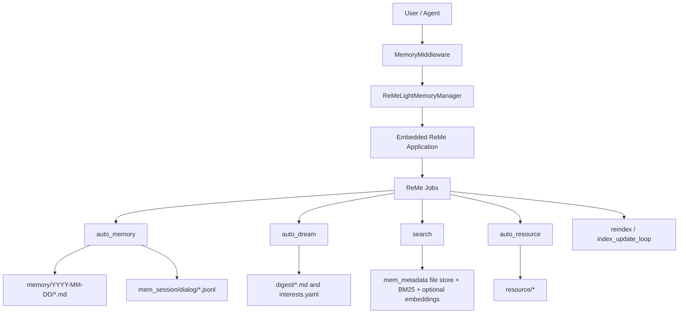
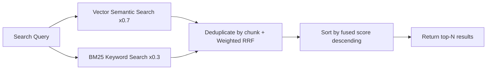

# Long-term Memory

**Long-term Memory** gives QwenPaw persistent memory across conversations. In the default backend, QwenPaw embeds the
ReMe application in-process and runs ReMe jobs to save conversation facts, build daily notes, extract digest memories,
watch resource files, and search the memory vault.

> The long-term memory mechanism is inspired by [OpenClaw](https://github.com/openclaw/openclaw) and implemented via **ReMeLight** from [ReMe](https://github.com/agentscope-ai/ReMe) — a file-based memory backend where working and long-term memory nodes are plain Markdown files that can be read, edited, and migrated directly.

ReMe's core goal is to grow a **self-evolving personal knowledge base** on the principle of _Memory as File, File as Memory_. Every working or long-term memory node is a plain Markdown file — readable, editable, traceable, portable, and maintained collaboratively by you and the agent — and at the same time indexable and linkable. Raw sources and derived system state use formats suited to their roles. The workspace organizes memory into four layers:

| Layer            | QwenPaw directory           | Role                                                          |
| ---------------- | --------------------------- | ------------------------------------------------------------- |
| Raw input        | `mem_session/`, `resource/` | Original conversations and external material kept as evidence |
| Working memory   | `memory/`                   | Daily notes: facts, decisions, and resource readings          |
| Long-term memory | `digest/`                   | Reusable knowledge nodes (`personal` / `procedure` / `wiki`)  |
| System state     | `mem_metadata/`             | Indexes, wikilink graph, catalogs — not hand-edited           |

Memory evolves through a **capture → index → consolidate → recall** loop: Auto-Memory / Auto-Resource capture daily notes, indexing keeps them searchable, Auto-Dream consolidates them into linked digest nodes, and search / proactive recall them. For the full narrative — including how Auto-Dream corroborates, refines, and corrects digest nodes and weaves the wikilink graph — see [Memory-Evolving & Proactive Interaction](./memory-evolving-and-proactive). The sections below cover the technical implementation and configuration.

---

## Architecture Overview



Long-term memory management includes the following capabilities:

| Capability             | Description                                                                                                      |
| ---------------------- | ---------------------------------------------------------------------------------------------------------------- |
| **Embedded ReMe app**  | QwenPaw starts ReMe in-process and injects the active QwenPaw model into ReMe's default LLM component            |
| **Auto-Memory**        | After a configurable number of user turns, ReMe extracts useful conversation facts into daily Markdown notes     |
| **Context compaction** | Before context compression, pending turns can be flushed into the same `auto_memory` pipeline                    |
| **Auto-Dream**         | A cron job extracts higher-level digest units and proactive-interest topics from recent daily notes              |
| **Hybrid Search**      | `memory_search` calls ReMe's `search` job, using BM25 plus optional vector search and reciprocal-rank fusion     |
| **Resource Memory**    | Files under `resource/` are cataloged and can be interpreted into source-linked daily notes                      |
| **Inbox Results**      | `auto_memory`, `auto_dream`, and `auto_resource` results are pushed to QwenPaw's inbox when they produce changes |

---

## Memory File Structure

Memories are stored as plain files under the agent workspace. ReMe's Markdown files are the readable source of memory,
while `mem_metadata/` stores search indexes, catalogs, graphs, and embedding caches.

```
{workspace}/
├── memory/                         ← Daily memory notes
│   └── 2026-06-29/
│       ├── project-plan.md          ← One note written/updated by auto_memory
│       └── index.md                 ← Day index generated from the day's notes
│
├── mem_session/
│   └── dialog/
│       └── <session_id>.jsonl       ← Sanitized conversation history used as note source
│
├── digest/                         ← Auto-Dream digest memory and interest topics
├── resource/                       ← External assets watched by auto_resource
└── mem_metadata/                   ← ReMe persistent indexes, graph, catalogs, and caches
    ├── file_store/
    │   └── file_chunks_default_v1.jsonl.zst
    ├── file_graph/
    │   └── default.jsonl.zst
    ├── file_catalog/
    │   ├── default.jsonl.zst
    │   ├── resource.jsonl.zst
    │   ├── digest.jsonl.zst
    │   └── dream.jsonl.zst
    ├── embedding_store/
    │   └── default_v1.npz
    └── keyword_index/
        └── bm25_default_<tokenizer>_<fingerprint>_v1.pkl
```

Under the default workspace layout, the full path is
`~/.qwenpaw/workspaces/{agent_id}/mem_metadata/`.
`file_store/file_chunks_default_v1.jsonl.zst` is the authoritative chunk store. Vectors are encoded as float16 in
the `_embedding_f16_b64` field of its compressed JSONL records, rather than in a separate vector-database directory.
`embedding_store/default_v1.npz` is the local embedding cache used when `enable_cache` is enabled; it is not the
authoritative index and may not appear until the cache is persisted. The tokenizer name and fingerprint in the actual
BM25 filename vary with configuration.

### memory/YYYY-MM-DD/\*.md (Daily Notes)

Daily notes are the default Auto-Memory output. ReMe writes one or more notes per day, keyed by the source conversation
session. Each note includes frontmatter such as `session_id` and `source_conversation`, so later updates can find and
modify the existing note instead of creating duplicates.

- **Location**: `{working_dir}/memory/YYYY-MM-DD/*.md`
- **Purpose**: Stores durable conversation facts, decisions, preferences, and work notes
- **Updates**: ReMe `auto_memory` creates or edits notes using ReMe file jobs such as `daily_write`, `read`, `edit`,
  `frontmatter_update`, and `write`
- **Index**: After each successful write, ReMe refreshes the day's `index.md`

### mem_session/dialog/\*.jsonl (Conversation Source)

Before extracting memory, ReMe saves the relevant messages into a session log. Tool-result blocks and base64 data blocks
are stripped so recalled memory or large media cannot be mistaken for user-provided facts in future extraction runs.

- **Location**: `{working_dir}/mem_session/dialog/<session_id>.jsonl` by default
- **Purpose**: Source traceability for daily notes
- **Linking**: Daily-note frontmatter links back to the source conversation with `[[mem_session/dialog/<session_id>.jsonl]]`

### digest/ (Dream Memory)

`digest/` is the long-term knowledge layer — the part of the knowledge base that actually evolves. Auto-Dream reads recent
daily notes, extracts reusable memory units, integrates each into a digest node, updates the dream catalog, and writes
user-interest topics for proactive use.

- **Location**: `{working_dir}/digest/`
- **Buckets**: `personal/` (user, team, and project identity, preferences, and conventions), `procedure/` (how-to
  workflows, runbooks, and reusable methods), and `wiki/` (definitions, principles, observations, and decision precedents)
- **Evolution, not append**: each unit is integrated with a `CREATE`, `CORROBORATE`, `REFINE`, or `CORRECT` action, so
  repeated facts are merged and strengthened rather than duplicated
- **Wikilink graph**: nodes carry source edges (`derived_from:: [[memory/<date>/<note>.md]]`) and relationship edges
  (`relates_to:: [[digest/...]]`) so digest memory stays traceable and connected; `memory_search` expands along these links
- **Updates**: ReMe `auto_dream`, usually triggered by `dream_cron`

### resource/ (Resource Memory)

Files placed under `resource/` are watched and cataloged. When supported files change, ReMe can interpret them into
source-linked daily notes via `auto_resource`.

- **Location**: `{working_dir}/resource/`
- **Supported default suffixes**: `md`, `txt`, `json`, `jsonl`, `csv`, `yaml`, `html`
- **Date assignment**: Files directly under `resource/` are assigned to the current date. Files under
  `resource/YYYY-MM-DD/` use that date and may be nested in additional subdirectories.
- **Output**: Creates or updates `memory/YYYY-MM-DD/<note>.md` and retains a `source_resource` link in its frontmatter
- **Inbox behavior**: Resource processing results are pushed to the inbox only when memory changed

```text
resource/report.txt                    # Assigned to the current date
resource/2026-07-14/report.txt         # Assigned to 2026-07-14
resource/2026-07-14/project/data.json  # Subdirectories are allowed below the date
```

> Auto Resource currently reads resources as UTF-8 text. Binary files such as PDF, Word, Excel, and images are not in
> the watched-suffix list and are not parsed automatically; convert them to one of the supported text formats first.
> The `yml` suffix is also not in the default allowlist; use `yaml`.

> For a complete walkthrough of Auto-Memory, Auto-Dream, Auto-Memory-Search, and Proactive, see [Memory-Evolving & Proactive Interaction](./memory-evolving-and-proactive). The sections below cover technical implementation details and configuration only.

---

## Searching Memory

The Agent has two ways to retrieve past memories:

| Method        | Tool            | Use Case                                                    | Example                                        |
| ------------- | --------------- | ----------------------------------------------------------- | ---------------------------------------------- |
| Hybrid search | `memory_search` | Unsure which file contains the info; fuzzy recall by intent | "Previous discussion about deployment process" |
| Direct read   | File tools      | Known specific date or file path; precise lookup            | Read `memory/2026-06-29/project-plan.md`       |

### Hybrid Search Explained

`memory_search` calls ReMe's `search` job. Search always tries keyword retrieval through BM25 and also runs vector
retrieval when an embedding model is configured. When both paths return results, ReMe fuses the ranked lists with
**Reciprocal Rank Fusion (RRF)**.

#### Vector Semantic Search

Maps text into a high-dimensional vector space and measures semantic distance via cosine similarity, capturing content
with similar meaning but different wording:

| Query                                   | Recalled Memory                                           | Why It Matches                                                  |
| --------------------------------------- | --------------------------------------------------------- | --------------------------------------------------------------- |
| "Database choice for the project"       | "Finally decided to replace MySQL with PostgreSQL"        | Semantically related: both discuss database technology choices  |
| "How to reduce unnecessary rebuilds"    | "Configured incremental compilation to avoid full builds" | Semantic equivalence: reduce rebuilds ≈ incremental compilation |
| "Performance issue discussed last time" | "Optimized P99 latency from 800ms to 200ms"               | Semantic association: performance issue ≈ latency optimization  |

However, vector search is weaker on **precise, high-signal tokens**, as embedding models tend to capture overall
semantics rather than exact matches of individual tokens.

#### BM25 Keyword Search

Based on term frequency statistics for substring matching, excellent for precise token hits, but weaker on semantic
understanding (synonyms, paraphrasing).

| Query                      | BM25 Hits                                      | BM25 Misses                                           |
| -------------------------- | ---------------------------------------------- | ----------------------------------------------------- |
| `handleWebSocketReconnect` | Memory fragments containing that function name | "WebSocket disconnection reconnection handling logic" |
| `ECONNREFUSED`             | Log entries containing that error code         | "Database connection refused"                         |

ReMe maintains a local BM25 index over indexed files. This gives reliable hits for exact identifiers, error codes,
filenames, and uncommon words even when embeddings are unavailable.

#### Hybrid Search Fusion

When both vector and BM25 return candidates, ReMe uses weighted RRF. The default vector weight is `0.7`; the remaining
`0.3` goes to keyword search.

1. **Expand candidate pool**: Multiply the desired result count by `candidate_multiplier` (default 3×, capped at 200);
   each path retrieves more candidates independently
2. **Independent ranking**: Vector and BM25 each return ranked result lists
3. **RRF merging**: Deduplicate by chunk id and add rank-based contributions:
   - Vector contribution: `0.7 / (60 + vector_rank)`
   - Keyword contribution: `0.3 / (60 + keyword_rank)`
   - Chunks found by both paths receive both contributions
4. **Sort and truncate**: Sort by `final_score` descending, return top-N results
5. **Link expansion**: Search can include nearby linked files to provide additional context

**Example**: Query `"handleWebSocketReconnect disconnection reconnect"`

| Memory Fragment                                                               | Vector Rank | BM25 Rank | Why It Ranks Well                                   |
| ----------------------------------------------------------------------------- | ----------- | --------- | --------------------------------------------------- |
| "handleWebSocketReconnect function handles WebSocket disconnection reconnect" | 2           | 1         | Strong semantic match plus exact keyword hit        |
| "Logic for automatic retry after network disconnection"                       | 1           | -         | Strong semantic match even without exact identifier |
| "Fixed null pointer exception in handleWebSocketReconnect"                    | -           | 2         | Exact identifier hit keeps it in the candidate set  |



> **Summary**: Using any single search method alone has blind spots. Hybrid search lets the two signals complement each
> other, delivering reliable recall whether you're asking in natural language or searching for exact terms.

### Verifying That Vector Search Is Working

Ask the Agent to call `memory_search` and return its tool result verbatim. Replace `xxx` with the query to test:

```text
Please call the memory_search tool and search for "xxx". Return the raw tool result exactly as-is,
including every separator line and all score, vector, and keyword fields. Do not summarize or rewrite the result.
```

To test semantic recall rather than keyword matching, first save a memory such as "My preferred commute is a
lightweight bicycle.", then search for "How does the user usually travel to work?". The sentences have no obvious
keyword overlap but are semantically related, making a vector hit easier to identify.

The scores below are illustrative:

**Only the vector branch has a hit:**

```text
========== memory/2026-07-23/commute.md:1-6 [score=0.8237] ==========
My preferred commute is a lightweight bicycle.
```

Here, `score` is the raw cosine-similarity score.

**Only the BM25 branch has a hit:**

```text
========== memory/2026-07-23/commute.md:1-6 [score=3.1842] ==========
My preferred commute is a lightweight bicycle.
```

Here, `score` is the raw BM25 score. When the output contains only `[score=...]`, the number alone does not strictly
identify which branch produced it; consider whether the query contains an exact keyword match or inspect the search
log described below.

**Hybrid retrieval, with candidates from both branches:**

```text
========== memory/2026-07-23/commute.md:1-6 [score=0.0164 vector=0.8237 keyword=3.1842] ==========
My preferred commute is a lightweight bicycle.

========== memory/2026-07-20/purchase.md:3-7 [score=0.0113 vector=0.7915 keyword=-] ==========
The user bought a lightweight two-wheeled vehicle.

========== memory/2026-07-18/maintenance.md:2-5 [score=0.0048 vector=- keyword=2.5176] ==========
Bicycle maintenance is scheduled for the weekend.
```

- `score`: the RRF-fused score
- `vector`: the raw vector cosine similarity; a numeric value directly confirms that the vector branch returned this result
- `keyword`: the raw BM25 score
- `-`: the corresponding branch did not retrieve this result

The search log contains `vector_hits=N keyword_hits=M`, which confirms how many candidates each branch returned.
The embedding health check also sends a `"ping"` test request and validates the returned vector dimension:

```text
[EMBEDDING HEALTH CHECK] name=default workspace_dir=<workspace> -> OK
```

`-> OK` means that the embedding provider is reachable and its output dimension matches the configuration. Failures
include the reason, for example:

```text
[EMBEDDING HEALTH CHECK] name=default workspace_dir=<workspace> -> FAIL timeout(5.0s)
[EMBEDDING HEALTH CHECK] name=default workspace_dir=<workspace> -> FAIL RuntimeError: embedding dimension mismatch: <actual> != <configured>
[EMBEDDING HEALTH CHECK] name=default workspace_dir=<workspace> -> FAIL <ExceptionType>: <message>
```

The health check runs while loading persisted chunks when vectors are missing and need to be backfilled. It may
therefore not be emitted on every startup when all stored chunks already contain valid vectors. In that case, a
numeric `vector=...` field in a search result remains direct evidence that the vector branch returned a hit.

---

## Backup & Restore

Backup & Restore is QwenPaw's backup and recovery capability, enabling safe saving and restoration of the entire agent environment for scenarios like version upgrades, cross-device migration, or undoing mistakes. Access: Console → Settings → Backup.

### Creating Backups

**Backup Storage**

All backups are saved as independent zip packages in `~/.qwenpaw/backups` (alongside the working directory `~/.qwenpaw`). Each backup contains `meta.json` metadata and packaged content files. The zip file is exported for easy migration. Note that backups do not include local model files; re-download is required for cross-device migration.

**Backup Scope**

- **Agent workspaces**: Selectable per Agent
- **Global settings**: `config.json` and other global configurations
- **Skill pool**: Shared skills directory
- **Secrets**: Model API Keys, environment variables, etc.

**Backup Modes**

- **Full backup**: One-click package of all the above content
- **Partial backup**: Backup selected modules and specific agent workspaces

### Restoring Backups

**Restore Modes**

- **Full restore**: Completely replaces the current instance with the backup — current content is deleted and replaced with backup content. Requires the backup to contain all modules (agent workspaces, global settings, skill pool, secrets).
- **Custom restore**: Restore by module or by Agent with fine-grained control. Local Agents not included in the restore scope remain unchanged.

**Pre-restore Prompt**

Before restoring, the system prompts to create a snapshot of the current state. If the restore goes wrong, you can roll back with one click.

**Notes**

- Backup files may contain sensitive credentials — store them safely and do not share with others
- Service restart is required after restore for new configuration to take effect

---

## Memory Configuration

### Configuration Structure

Memory configuration is located in `agent.json` under `running.reme_light_memory_config`:

| Field                    | Description                                                                                                                     | Default          |
| ------------------------ | ------------------------------------------------------------------------------------------------------------------------------- | ---------------- |
| `metadata_dir`           | ReMe persistent state directory for indexes, catalogs, graph data, and caches                                                   | `"mem_metadata"` |
| `session_dir`            | Directory for saved source conversations                                                                                        | `"mem_session"`  |
| `mem_session_dir`        | Directory for ReMe internal memory-agent sessions                                                                               | `"mem_agent"`    |
| `resource_dir`           | Directory watched by `auto_resource`                                                                                            | `"resource"`     |
| `daily_dir`              | Directory for daily memory notes                                                                                                | `"memory"`       |
| `digest_dir`             | Directory for dream/digest memory                                                                                               | `"digest"`       |
| `summarize_when_compact` | Whether pending turns are flushed to Auto-Memory before context compression                                                     | `true`           |
| `inbox_push_enabled`     | Whether `auto_memory`, `auto_dream`, and `auto_resource` job results are pushed to the QwenPaw inbox                            | `true`           |
| `auto_memory_interval`   | Auto-Memory every N user turns. `None` or `<= 0` disables periodic Auto-Memory                                                  | `5`              |
| `dream_cron_enabled`     | Whether the scheduled Auto-Dream job is enabled                                                                                 | `true`           |
| `dream_cron`             | Valid 5-field cron expression for Auto-Dream (required when enabled); scheduled runs start after a random delay of 0–60 seconds | `"0 23 * * *"`   |

### Rebuilding the Memory Search Index

Rebuilding is an explicit maintenance operation for repairing a damaged index or abnormal search results. It clears
and recreates the ReMe search index, so CPU and memory usage may increase significantly while it runs. The operation
is available only when the agent uses the ReMeLight memory backend and its memory manager is running.

In the Console, open the agent configuration, find **Long-term Memory**, and select **Rebuild Memory Index**. Review
the warning and confirm the operation. You can also call the synchronous maintenance API:

```http
POST /api/agents/{agentId}/memory/reindex
```

A successful rebuild returns `{"status":"completed"}`. Only one rebuild can run for an agent at a time; another
request returns HTTP `409`. The endpoint may also return `400` for a non-ReMeLight backend, `404` for an unknown
agent, `503` when ReMe is unavailable, or `500` when the rebuild job fails.

> `rebuild_memory_index_on_start` is no longer supported. Remove it from `agent.json`; use the Console action or API
> when an index rebuild is actually needed.

### Auto Memory Search Configuration

Configure in `running.reme_light_memory_config.auto_memory_search_config`:

When enabled, search results are injected into the current live context as a
completed `memory_search` interaction. They remain available to follow-up model
calls in the same tool loop until normal context management evicts them.

| Field         | Description                                              | Default |
| ------------- | -------------------------------------------------------- | ------- |
| `enabled`     | Whether to auto search memory on every conversation turn | `false` |
| `max_results` | Maximum results for auto memory search                   | `2`     |

### Embedding Configuration (Optional)

Embedding configuration for vector semantic search, located in `running.reme_light_memory_config.embedding_model_config`:

| Field              | Description                                                                                    | Default  |
| ------------------ | ---------------------------------------------------------------------------------------------- | -------- |
| `backend`          | Embedding backend type: `openai`, `dashscope`, `dashscope_multimodal`, `gemini`, `ollama`      | `openai` |
| `api_key`          | API key for the embedding provider. Required for OpenAI-compatible and Gemini backends         | ``       |
| `base_url`         | Optional custom API URL for OpenAI-compatible backends. For Ollama, this is passed as the host | ``       |
| `model_name`       | Embedding model name                                                                           | ``       |
| `dimensions`       | Embedding vector dimensions                                                                    | `1024`   |
| `enable_cache`     | Whether to enable Embedding cache                                                              | `true`   |
| `use_dimensions`   | Whether to pass dimensions parameter in API                                                    | `false`  |
| `max_cache_size`   | Maximum Embedding cache entries                                                                | `10000`  |
| `max_input_length` | Approximate character budget per Embedding request                                             | `8192`   |
| `max_batch_size`   | Maximum batch size for Embedding requests                                                      | `10`     |

> `use_dimensions` is for cases where some vLLM models don't support the dimensions parameter. Set to `false` to skip it.

Starting with ReMe 0.4.1.0, embedding input truncation uses a more conservative budget for token-dense CJK and other
full-width characters and reserves an additional safety margin. This prevents long Chinese memory entries from
exceeding the model context window and returning HTTP 400 with combinations such as Ollama and bge-m3.
`max_input_length` remains an approximate character budget rather than a strict token limit calculated by the model's
tokenizer. Reduce it further when using a model with a smaller context window.

Vector retrieval is enabled only when the selected backend has the minimum runnable configuration. These conditions are aligned with AgentScope credential requirements:

| Backend                                         | Enable condition                              | Credential mapping              |
| ----------------------------------------------- | --------------------------------------------- | ------------------------------- |
| `openai` / `dashscope` / `dashscope_multimodal` | Both `model_name` and `api_key` are non-empty | `api_key`; optional `base_url`  |
| `gemini`                                        | Both `model_name` and `api_key` are non-empty | `api_key`                       |
| `ollama`                                        | `model_name` is non-empty                     | optional `host` from `base_url` |

### Indexing Behavior

The embedded ReMe configuration uses a local file store with:

| Component        | Behavior                                                                                         |
| ---------------- | ------------------------------------------------------------------------------------------------ |
| File store       | Local ReMe file store under `mem_metadata/`                                                      |
| Keyword index    | BM25 keyword index enabled by default                                                            |
| Vector index     | Enabled only when `embedding_model_config` meets the enable condition for the selected `backend` |
| Watched dirs     | `daily_dir` and `digest_dir`                                                                     |
| Watched suffixes | `md`                                                                                             |

---

## Other Memory Backends

QwenPaw's memory system uses a pluggable backend architecture. In addition to the default ReMeLight (local file storage), you can switch to other backends via `memory_manager_backend`.

### ADBPG (AnalyticDB for PostgreSQL)

A long-term memory backend backed by a cloud vector database. It is suitable for scenarios that need cross-device sharing or large-scale semantic retrieval. QwenPaw connects through the ADBPG memory service REST API, so no additional database driver is required.

**Key features:**

- **Cross-session persistence** — Memories are stored in a cloud database, retained across restarts, and shareable across devices.
- **Server-side fact extraction** — Fact extraction is handled by the ADBPG memory service, with no extra client-side overhead.
- **REST API access** — Calls the ADBPG memory service over HTTP.
- **Graceful degradation** — When ADBPG is unreachable, the agent keeps running normally; only the long-term memory feature is temporarily disabled.

**How to configure:**

Open the agent's "Running Config" tab in the Console, locate the "Long-term Memory Management Backend" dropdown, choose `adbpg`, and fill in `REST Base URL` and `REST API Key` under the "ADBPG Long-term Memory" tab.


> ⚠️ Switching the backend does not support hot reload. After saving, restart QwenPaw for the change to take effect (the page also shows a yellow banner reminder).

> Migration note: ADBPG direct SQL mode has been removed. Old fields such as
> `api_mode: "sql"`, `host`, `port`, `user`, `password`, `dbname`, and LLM /
> Embedding settings are ignored; configure `rest_base_url` and `rest_api_key`
> instead, then restart QwenPaw.

| Field                       | Description                                                                              | Default                               |
| --------------------------- | ---------------------------------------------------------------------------------------- | ------------------------------------- |
| `rest_base_url`             | REST API URL of the ADBPG memory service                                                 | `""`                                  |
| `rest_api_key`              | Access key for the REST API                                                              | `""`                                  |
| `memory_isolation`          | Memory isolation mode: `true` for per-agent, `false` for shared                          | `true`                                |
| `search_timeout`            | Memory search timeout (seconds)                                                          | `10.0`                                |
| `auto_memory_search_config` | Auto memory search configuration; same shape as ReMe Light's `auto_memory_search_config` | `{"enabled": true, "max_results": 3}` |

**Configuration example:**

The full configuration can be written into `running.adbpg_memory_config` of `agent.json`:

```json
{
  "running": {
    "memory_manager_backend": "adbpg",
    "adbpg_memory_config": {
      "rest_base_url": "https://your-adbpg-memory-api.example.com",
      "rest_api_key": "your-rest-api-key",
      "memory_isolation": true,
      "search_timeout": 10.0,
      "auto_memory_search_config": {
        "enabled": true,
        "max_results": 3
      }
    }
  }
}
```

> 💡 When you fill these fields in the Console "Running Config" page, the framework writes them into `agent.json` automatically — no need to edit the file by hand.

---

## Related Pages

- [Memory-Evolving & Proactive Interaction](./memory-evolving-and-proactive) — Auto-Memory, Auto-Dream, Auto-Memory-Search, Proactive complete workflow
- [Introduction](./intro) — What this project can do
- [Console](./console) — Manage memory and configuration in the console
- [Skills](./skills) — Built-in and custom capabilities
- [Configuration & Working Directory](./config) — Working directory and config
