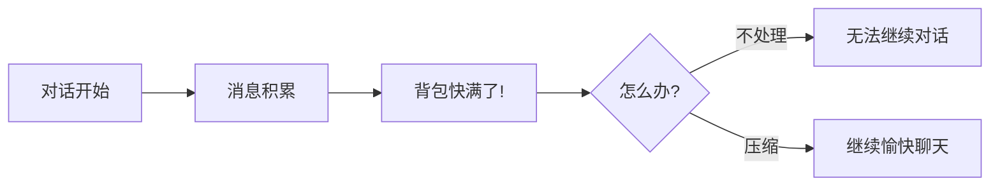
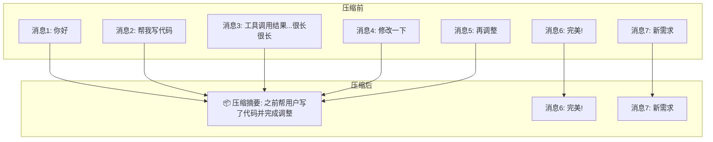
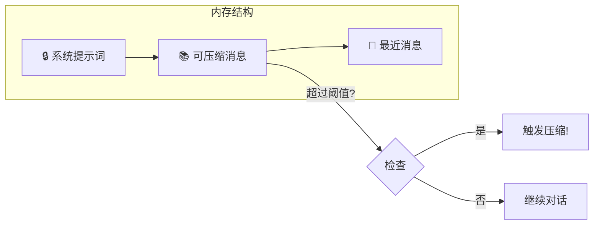
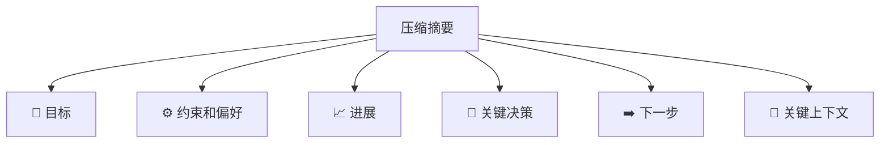

# 压缩（Compaction）

## 背景：为什么需要压缩？

想象一下，LLM 的上下文窗口就像一个**有限容量的背包** 🎒。每次对话、每个工具调用的结果都会往背包里放东西。随着对话的进行，背包越来越满...



当背包满了会发生什么？

- 🚫 **对话中断** - 无法继续交流
- 📉 **质量下降** - AI 开始"健忘"
- ❌ **API 报错** - 直接罢工

**压缩机制**就是帮你"整理背包"的魔法 ✨ —— 把旧的物品打包成一个小盒子（摘要），腾出空间放新东西！

## 什么是压缩？

压缩就像写**会议纪要**：把冗长的讨论浓缩成关键要点，同时保留最近的讨论内容不变。



压缩后，后续请求使用：

- 📦 **压缩摘要**（代替旧消息）
- 💬 **最近消息**（保持原样）

压缩摘要会持久化保存，不用担心丢失！

🔗 [ReMe实现](https://github.com/agentscope-ai/ReMe/blob/v0.3.0.0b5/reme/memory/file_based/fb_compactor.py)

## 配置

### 环境变量

| 环境变量                           | 默认值   | 说明                                         |
| ---------------------------------- | -------- | -------------------------------------------- |
| `COPAW_MEMORY_COMPACT_THRESHOLD`   | `100000` | 触发自动压缩的 token 阈值（背包容量警戒线）  |
| `COPAW_MEMORY_COMPACT_KEEP_RECENT` | `5`      | 压缩后保留的最近消息数（保持新鲜的对话数量） |

## 何时触发压缩？

CoPaw 提供两种压缩方式：**自动挡**和**手动挡** 🚗

### 1. 🤖 自动压缩（接近上下文阈值时）

CoPaw 就像一个贴心的管家，每次对话前都会检查"背包"还剩多少空间。当可压缩消息的 token 数超过阈值时，自动帮你整理！

**内存结构图解：**



| 区域              | 说明              | 处理方式                            |
| ----------------- | ----------------- | ----------------------------------- |
| 🔒 **系统提示词** | AI 的"人设说明书" | 始终保留，不压缩                    |
| 📚 **可压缩消息** | 历史对话记录      | 计算 token，超阈值时压缩成摘要      |
| 💬 **最近消息**   | 最近 N 条对话     | 保留原样（N 由 `KEEP_RECENT` 配置） |

### 2. 🎮 手动压缩（/compact 命令）

有时候你想主动"清理背包"？没问题！发送魔法咒语：

```
/compact
```

执行后你会看到类似这样的返回：

```
**Compact Complete!**

- Messages compacted: 12
**Compressed Summary:**
<压缩摘要内容>
- Summary task started in background
```

返回内容说明：

- 📊 **Messages compacted** - 压缩了多少条消息
- 📝 **Compressed Summary** - 生成的摘要内容
- ⏳ **Summary task** - 后台还会启动一个任务将摘要存入长期记忆

## 压缩内容：摘要里有什么？

压缩生成的摘要就像一份**项目交接文档**，包含所有继续工作所需的关键信息：



| 部分              | 内容                   | 举例                                    |
| ----------------- | ---------------------- | --------------------------------------- |
| 🎯 **目标**       | 用户想要完成什么       | "构建一个用户登录系统"                  |
| ⚙️ **约束和偏好** | 用户提到的要求         | "使用 TypeScript，不要用任何框架"       |
| 📈 **进展**       | 完成/进行中/阻塞的任务 | "登录接口已完成，注册接口进行中"        |
| 🔑 **关键决策**   | 做出的决策及原因       | "选择 JWT 而非 Session，因为需要无状态" |
| ➡️ **下一步**     | 接下来要做什么         | "实现密码重置功能"                      |
| 📌 **关键上下文** | 继续工作所需的数据     | "主文件在 src/auth.ts"                  |

> 💡 **小贴士**：压缩会保留确切的文件路径、函数名称和错误消息，确保 AI 不会"失忆"，上下文无缝衔接！
