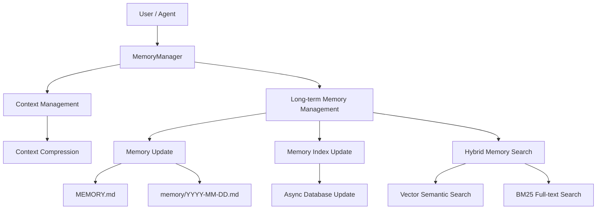
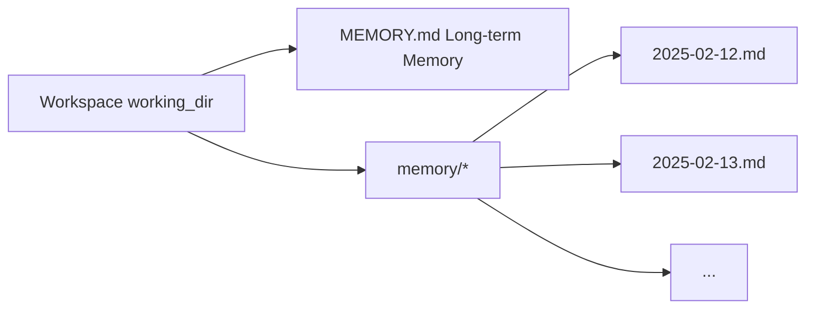

# Memory

**Memory** gives CoPAW persistent memory across conversations: it automatically manages the context window and writes key information to files for long-term storage.

The memory system provides two core capabilities:

- **Context Management** — Automatically compresses conversations into concise summaries before the context window overflows
- **Long-term Memory Management** — Writes key information to Markdown files via file tools, with semantic search for recall at any time

> The memory design is inspired by the [OpenClaw](https://github.com/openclaw/openclaw) memory architecture and implemented by [ReMe](https://github.com/agentscope-ai/ReMe).

---

## Architecture Overview



Long-term memory management includes the following capabilities:

| Capability             | Description                                                                                                        |
| ---------------------- | ------------------------------------------------------------------------------------------------------------------ |
| **Memory Persistence** | Writes key information to Markdown files via file tools (`read` / `write` / `edit`); files are the source of truth |
| **File Watching**      | Monitors file changes via `watchfile`, asynchronously updating the local database (semantic index & vector index)  |
| **Semantic Search**    | Recalls relevant memories by semantics using vector embeddings + BM25 hybrid search                                |
| **File Reading**       | Reads the corresponding Memory Markdown files directly via file tools, loading on demand to keep the context lean  |

---

## Memory File Structure

Memories are stored as plain Markdown files, operated directly by the Agent via file tools. The default workspace uses a two-level structure:



### MEMORY.md (Long-term Memory, Optional)

Stores long-lasting, rarely changing key information.

- **Location**: `{working_dir}/MEMORY.md`
- **Purpose**: Stores decisions, preferences, and persistent facts
- **Updates**: Written by the Agent via `write` / `edit` file tools

### memory/YYYY-MM-DD.md (Daily Log)

One page per day, appended with the day's work and interactions.

- **Location**: `{working_dir}/memory/YYYY-MM-DD.md`
- **Purpose**: Records daily notes and runtime context
- **Updates**: Appended by the Agent via `write` / `edit` file tools; automatically triggered when conversations become too long and need summarization

### When to Write Memory?

| Information Type                         | Write Target              | Method                            | Example                                                                                                     |
| ---------------------------------------- | ------------------------- | --------------------------------- | ----------------------------------------------------------------------------------------------------------- |
| Decisions, preferences, persistent facts | `MEMORY.md`               | `write` / `edit` tools            | "Project uses Python 3.12", "Prefers pytest framework"                                                      |
| Daily notes, runtime context             | `memory/YYYY-MM-DD.md`    | `write` / `edit` tools            | "Fixed login bug today", "Deployed v2.1"                                                                    |
| Auto-summary on context overflow         | `memory/YYYY-MM-DD.md`    | Auto-triggered (`summary_memory`) | When context tokens exceed the threshold, the system automatically writes a conversation summary to the log |
| User says "remember this"                | Write to file immediately | `write` tool                      | Do not only save in memory!                                                                                 |

---

## Memory Configuration

### LLM Configuration

The Memory Manager's LLM parameters are consistent with the global configuration, automatically reading the active LLM config (`api_key`, `base_url`, `model`) from `providers.json`. The language of memory-related prompts also follows the `agents.language` field in `config.json` (`zh` = Chinese, otherwise English).

### Embedding Configuration

Configure the Embedding service via the following environment variables for vector semantic search:

| Environment Variable      | Description                                            | Default                                              |
| ------------------------- | ------------------------------------------------------ | ---------------------------------------------------- |
| `EMBEDDING_API_KEY`       | API Key for the Embedding service                      | (empty; vector search is disabled if not configured) |
| `EMBEDDING_BASE_URL`      | URL of the Embedding service                           | `https://dashscope.aliyuncs.com/compatible-mode/v1`  |
| `EMBEDDING_MODEL_NAME`    | Embedding model name                                   | `text-embedding-v4`                                  |
| `EMBEDDING_DIMENSIONS`    | Vector dimensions for initializing the vector database | `1024`                                               |
| `EMBEDDING_CACHE_ENABLED` | Whether to enable Embedding cache                      | `true`                                               |

### Search Mode Configuration

| Environment Variable | Description                             | Default |
| -------------------- | --------------------------------------- | ------- |
| `FTS_ENABLED`        | Whether to enable BM25 full-text search | `true`  |

**Search mode behavior:**

| Vector Search (`EMBEDDING_API_KEY` configured) | Full-text Search (`FTS_ENABLED=true`) |                      Actual Search Mode                       |
| :--------------------------------------------: | :-----------------------------------: | :-----------------------------------------------------------: |
|                       ✅                       |                  ✅                   |    Vector + BM25 hybrid search (recommended, best results)    |
|                       ✅                       |                  ❌                   |                  Vector semantic search only                  |
|                       ❌                       |                  ✅                   |  BM25 full-text search only (poor results in some scenarios)  |
|                       ❌                       |                  ❌                   | ⚠️ **Not allowed** — at least one search mode must be enabled |

> **Recommended**: Configure `EMBEDDING_API_KEY` and keep `FTS_ENABLED=true` to use Vector + BM25 hybrid search for optimal recall.

### Underlying Database

Configure the memory storage backend via the `MEMORY_STORE_BACKEND` environment variable:

| Environment Variable   | Description                                                    | Default |
| ---------------------- | -------------------------------------------------------------- | ------- |
| `MEMORY_STORE_BACKEND` | Memory storage backend: `auto`, `local`, `chroma`, or `sqlite` | `auto`  |

**Storage backend options:**

| Backend  | Description                                                                                     |
| -------- | ----------------------------------------------------------------------------------------------- |
| `auto`   | Auto-select: uses `local` on Windows, `chroma` on other systems                                 |
| `local`  | Local file storage, no extra dependencies, best compatibility                                   |
| `chroma` | Chroma vector database, supports efficient vector retrieval; may core dump on some Windows envs |
| `sqlite` | SQLite database + vector extension; may freeze or crash on macOS 14 and below                   |

> **Recommended**: Use the default `auto` mode, which automatically selects the most stable backend for your platform.

---

## Searching Memory

The Agent has two ways to retrieve past memories:

| Method          | Tool            | Use Case                                                    | Example                                        |
| --------------- | --------------- | ----------------------------------------------------------- | ---------------------------------------------- |
| Semantic search | `memory_search` | Unsure which file contains the info; fuzzy recall by intent | "Previous discussion about deployment process" |
| Direct read     | `read_file`     | Known specific date or file path; precise lookup            | Read `memory/2025-02-13.md`                    |

---

## Hybrid Search Explained

Memory search uses **Vector + BM25 hybrid search** by default. The two search methods complement each other's strengths.

### Vector Semantic Search

Maps text into a high-dimensional vector space and measures semantic distance via cosine similarity, capturing content with similar meaning but different wording:

| Query                                   | Recalled Memory                                           | Why It Matches                                                  |
| --------------------------------------- | --------------------------------------------------------- | --------------------------------------------------------------- |
| "Database choice for the project"       | "Finally decided to replace MySQL with PostgreSQL"        | Semantically related: both discuss database technology choices  |
| "How to reduce unnecessary rebuilds"    | "Configured incremental compilation to avoid full builds" | Semantic equivalence: reduce rebuilds ≈ incremental compilation |
| "Performance issue discussed last time" | "Optimized P99 latency from 800ms to 200ms"               | Semantic association: performance issue ≈ latency optimization  |

However, vector search is weaker on **precise, high-signal tokens**, as embedding models tend to capture overall semantics rather than exact matches of individual tokens.

### BM25 Full-text Search

Based on term frequency statistics for substring matching, excellent for precise token hits, but weaker on semantic understanding (synonyms, paraphrasing).

| Query                      | BM25 Hits                                      | BM25 Misses                                           |
| -------------------------- | ---------------------------------------------- | ----------------------------------------------------- |
| `handleWebSocketReconnect` | Memory fragments containing that function name | "WebSocket disconnection reconnection handling logic" |
| `ECONNREFUSED`             | Log entries containing that error code         | "Database connection refused"                         |

**Scoring logic**: Splits the query into terms, counts the hit ratio of each term in the target text, and awards a bonus for complete phrase matches:

```
base_score = hit_terms / total_query_terms           # range [0, 1]
phrase_bonus = 0.2 (only when multi-word query matches the complete phrase)
score = min(1.0, base_score + phrase_bonus)           # capped at 1.0
```

Example: Query `"database connection timeout"` hits a passage containing only "database" and "timeout" → `base_score = 2/3 ≈ 0.67`, no complete phrase match → `score = 0.67`

> To handle ChromaDB's case-sensitive `$contains` behavior, the search automatically generates multiple case variants for each term (original, lowercase, capitalized, uppercase) to improve recall.

### Hybrid Search Fusion

Uses both vector and BM25 recall signals simultaneously, performing **weighted fusion** on results (default vector weight `0.7`, BM25 weight `0.3`):

1. **Expand candidate pool**: Multiply the desired result count by `candidate_multiplier` (default 3×, capped at 200); each path retrieves more candidates independently
2. **Independent scoring**: Vector and BM25 each return scored result lists
3. **Weighted merging**: Deduplicate and fuse by chunk's unique identifier (`path + start_line + end_line`)
   - Recalled by vector only → `final_score = vector_score × 0.7`
   - Recalled by BM25 only → `final_score = bm25_score × 0.3`
   - **Recalled by both** → `final_score = vector_score × 0.7 + bm25_score × 0.3`
4. **Sort and truncate**: Sort by `final_score` descending, return top-N results

**Example**: Query `"handleWebSocketReconnect disconnection reconnect"`

| Memory Fragment                                                               | Vector Score | BM25 Score | Fused Score                    | Rank |
| ----------------------------------------------------------------------------- | ------------ | ---------- | ------------------------------ | ---- |
| "handleWebSocketReconnect function handles WebSocket disconnection reconnect" | 0.85         | 1.0        | 0.85×0.7 + 1.0×0.3 = **0.895** | 1    |
| "Logic for automatic retry after network disconnection"                       | 0.78         | 0.0        | 0.78×0.7 = **0.546**           | 2    |
| "Fixed null pointer exception in handleWebSocketReconnect"                    | 0.40         | 0.5        | 0.40×0.7 + 0.5×0.3 = **0.430** | 3    |


> **Summary**: Using any single search method alone has blind spots. Hybrid search lets the two signals complement each other, delivering reliable recall whether you're asking in natural language or searching for exact terms.

---

## Related Pages

- [Introduction](./intro.en.md) — What this project can do
- [Console](./console.en.md) — Manage memory and configuration in the console
- [Skills](./skills.en.md) — Built-in and custom capabilities
- [Configuration & Working Directory](./config.en.md) — Working directory and config
