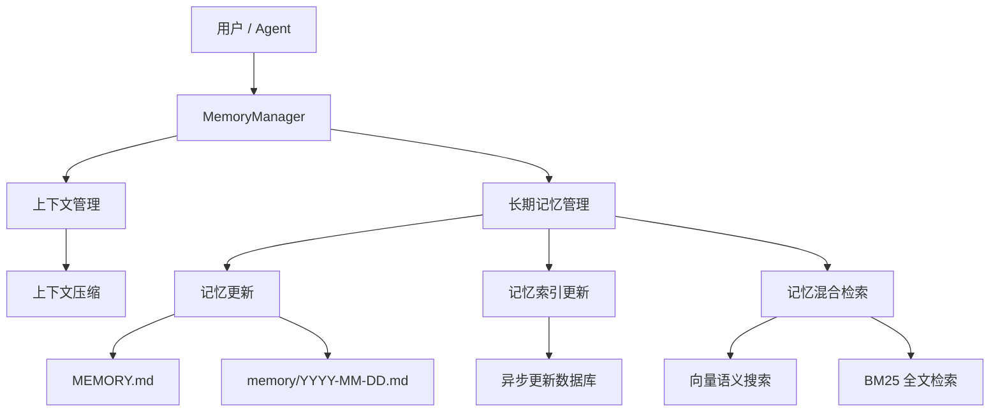
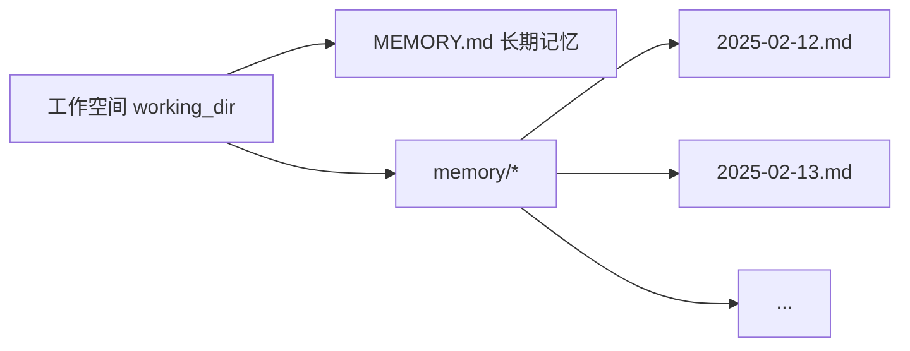
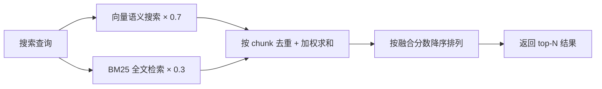

# 记忆

**记忆** 让 CoPAW 拥有跨对话的持久记忆能力：自动管理上下文窗口，并将关键信息写入文件长期保存。

记忆系统提供两大核心能力：

- **上下文管理** — 在上下文窗口溢出前，自动将对话压缩为精华摘要
- **长期记忆管理** — 通过文件工具将关键信息写入 Markdown 文件，配合语义检索随时召回

> 记忆设计受 [OpenClaw](https://github.com/openclaw/openclaw) 记忆架构启发。

---

## 架构概览



🔗 [ReMe代码实现] (https://github.com/agentscope-ai/ReMe/blob/v0.3.0.0b5/reme/memory/file_based/fb_summarizer.py)。

长期记忆管理包含以下能力：

| 能力           | 说明                                                                                    |
| -------------- | --------------------------------------------------------------------------------------- |
| **记忆持久化** | 通过文件工具（`read` / `write` / `edit`）将关键信息写入 Markdown 文件，文件即真实数据源 |
| **文件监控**   | 通过 `watchfile` 监控文件改动，异步更新本地数据库（语义索引 & 向量索引）                |
| **语义搜索**   | 通过向量嵌入 + BM25 混合检索，按语义召回相关记忆                                        |
| **文件读取**   | 直接通过文件工具读取对应的 Memory Markdown 文件，按需加载保持上下文精简                 |

---

## 记忆文件结构

记忆采用纯 Markdown 文件存储，Agent 通过文件工具直接操作。默认工作空间使用两层结构：



### MEMORY.md（长期记忆，可选）

存放长期有效、极少变动的关键信息。

- **位置**：`{working_dir}/MEMORY.md`
- **用途**：存储决策、偏好、持久性事实
- **更新**：Agent 通过 `write` / `edit` 文件工具写入

### memory/YYYY-MM-DD.md（每日日志）

每天一页，追加写入，记录当天的工作与交互。

- **位置**：`{working_dir}/memory/YYYY-MM-DD.md`
- **用途**：记录日常笔记和运行上下文
- **更新**：Agent 通过 `write` / `edit` 文件工具追加写入，对话过长需要进行总结时自动触发

### 何时写入记忆？

| 信息类型             | 写入目标               | 操作方式                     | 示例                                                |
| -------------------- | ---------------------- | ---------------------------- | --------------------------------------------------- |
| 决策、偏好、持久事实 | `MEMORY.md`            | `write` / `edit` 工具        | "项目使用 Python 3.12"、"偏好 pytest 框架"          |
| 日常笔记、运行上下文 | `memory/YYYY-MM-DD.md` | `write` / `edit` 工具        | "今天修复了登录 Bug"、"部署了 v2.1"                 |
| 上下文溢出自动摘要   | `memory/YYYY-MM-DD.md` | 自动触发（`summary_memory`） | 上下文 token 超过阈值时，系统自动将对话摘要写入日志 |
| 用户说"记住这个"     | 立即写入文件           | `write` 工具                 | 不要仅保存在内存中！                                |

---

## 记忆配置

### LLM 配置

记忆管理器的 LLM 参数与全局配置保持一致，自动从 `providers.json` 中读取当前激活的 LLM 配置（`api_key`、`base_url`、`model`）。记忆相关 Prompt 的语言也与全局 `config.json` 中 `agents.language` 字段保持一致（`zh` = 中文，其他 = 英文）。

### Embedding（向量嵌入）配置

通过以下环境变量配置 Embedding 服务，用于语义向量搜索：

| 环境变量                  | 说明                           | 默认值                                              |
| ------------------------- | ------------------------------ | --------------------------------------------------- |
| `EMBEDDING_API_KEY`       | Embedding 服务的 API Key       | （空，不配置则禁用向量搜索）                        |
| `EMBEDDING_BASE_URL`      | Embedding 服务的 URL           | `https://dashscope.aliyuncs.com/compatible-mode/v1` |
| `EMBEDDING_MODEL_NAME`    | Embedding 模型名称             | `text-embedding-v4`                                 |
| `EMBEDDING_DIMENSIONS`    | 向量维度，用于初始化向量数据库 | `1024`                                              |
| `EMBEDDING_CACHE_ENABLED` | 是否启用 Embedding 缓存        | `true`                                              |

### 检索模式配置

| 环境变量      | 说明                   | 默认值 |
| ------------- | ---------------------- | ------ |
| `FTS_ENABLED` | 是否启用 BM25 全文检索 | `true` |

**检索模式行为说明：**

| 向量搜索（`EMBEDDING_API_KEY` 已配置） | 全文检索（`FTS_ENABLED=true`） |               实际检索模式               |
| :------------------------------------: | :----------------------------: | :--------------------------------------: |
|                   ✅                   |               ✅               |  向量 + BM25 混合检索（推荐，效果最佳）  |
|                   ✅                   |               ❌               |              仅向量语义搜索              |
|                   ❌                   |               ✅               |   仅 BM25 全文检索（部分场景效果较差）   |
|                   ❌                   |               ❌               | ⚠️ **不允许** — 必须至少启用一种检索方式 |

> **推荐**：配置 `EMBEDDING_API_KEY` 并保持 `FTS_ENABLED=true`，使用向量 + BM25 混合检索以获得最佳召回效果。

### 底层数据库

通过 `MEMORY_STORE_BACKEND` 环境变量配置记忆存储后端：

| 环境变量               | 说明                                                   | 默认值 |
| ---------------------- | ------------------------------------------------------ | ------ |
| `MEMORY_STORE_BACKEND` | 记忆存储后端，可选 `auto`、`local`、`chroma`、`sqlite` | `auto` |

**存储后端说明：**

| 后端     | 说明                                                                         |
| -------- | ---------------------------------------------------------------------------- |
| `auto`   | 自动选择：Windows 使用 `local`，其他系统使用 `chroma`                        |
| `local`  | 本地文件存储，无需额外依赖，兼容性最好                                       |
| `chroma` | Chroma 向量数据库，支持高效向量检索；在某些 Windows 环境下可能出现 core dump |
| `sqlite` | SQLite 数据库 + 向量扩展；在 macOS 14 及更低版本上存在卡死和闪退问题         |

> **推荐**：使用默认的 `auto` 模式，系统会根据平台自动选择最稳定的后端。

🔗 [ReMe 存储后端实现](https://github.com/agentscope-ai/ReMe/blob/v0.3.0.0b5/reme/core/file_store/base_file_store.py)

---

## 搜索记忆

Agent 有两种方式找回过去的记忆：

| 方式     | 工具            | 适用场景                           | 示例                        |
| -------- | --------------- | ---------------------------------- | --------------------------- |
| 语义搜索 | `memory_search` | 不确定记在哪个文件，按意图模糊召回 | "之前关于部署流程的讨论"    |
| 直接读取 | `read_file`     | 已知具体日期或文件路径，精确查阅   | 读取 `memory/2025-02-13.md` |

---

## 混合检索原理

记忆搜索默认采用**向量 + BM25 混合检索**，两种检索方式各有所长，互为补充。

### 向量语义搜索

将文本映射到高维向量空间，通过余弦相似度衡量语义距离，能捕捉意义相近但措辞不同的内容：

| 查询                   | 能召回的记忆                       | 为什么能命中                     |
| ---------------------- | ---------------------------------- | -------------------------------- |
| "项目的数据库选型"     | "最终决定用 PostgreSQL 替换 MySQL" | 语义相关：都在讨论数据库技术选择 |
| "怎么减少不必要的重建" | "配置了增量编译避免全量构建"       | 语义等价：减少重建 ≈ 增量编译    |
| "上次讨论的性能问题"   | "P99 延迟从 800ms 优化到 200ms"    | 语义关联：性能问题 ≈ 延迟优化    |

但向量搜索对**精确、高信号的 token** 表现较弱，因为嵌入模型倾向于捕捉整体语义而非单个 token 的精确匹配。

### BM25 全文检索

基于词频统计进行子串匹配，对精确 token 命中效果极佳，但在语义理解（同义词、改写）方面较弱。

| 查询                       | BM25 能命中            | BM25 会漏掉                    |
| -------------------------- | ---------------------- | ------------------------------ |
| `handleWebSocketReconnect` | 包含该函数名的记忆片段 | "WebSocket 断线重连的处理逻辑" |
| `ECONNREFUSED`             | 包含该错误码的日志记录 | "数据库连接被拒绝"             |

**打分逻辑**：将查询拆分为词，统计每个词在目标文本中的命中比例，并为完整短语匹配提供加分：

```
base_score = 命中词数 / 查询总词数           # 范围 [0, 1]
phrase_bonus = 0.2（仅当多词查询且完整短语匹配时）
score = min(1.0, base_score + phrase_bonus)  # 上限 1.0
```

示例：查询 `"数据库 连接 超时"` 命中一段只包含 "数据库" 和 "超时" 的文本 → `base_score = 2/3 ≈ 0.67`，无完整短语匹配 → `score = 0.67`

> 为了处理 ChromaDB `$contains` 的大小写敏感问题，检索时会自动生成每个词的多种大小写变体（原文、小写、首字母大写、全大写），提高召回率。

### 混合检索融合

同时使用向量和 BM25 两路召回信号，对结果进行**加权融合**（默认向量权重 `0.7`，BM25 权重 `0.3`）：

1. **扩大候选池**：将最终需要的结果数乘以 `candidate_multiplier`（默认 3 倍，上限 200），两路分别检索更多候选
2. **独立打分**：向量和 BM25 各自返回带分数的结果列表
3. **加权合并**：按 chunk 的唯一标识（`path + start_line + end_line`）去重融合
   - 仅被向量召回 → `final_score = vector_score × 0.7`
   - 仅被 BM25 召回 → `final_score = bm25_score × 0.3`
   - **两路都召回** → `final_score = vector_score × 0.7 + bm25_score × 0.3`
4. **排序截断**：按 `final_score` 降序排列，返回 top-N 结果

**示例**：查询 `"handleWebSocketReconnect 断线重连"`

| 记忆片段                                               | 向量分数 | BM25 分数 | 融合分数                       | 排序 |
| ------------------------------------------------------ | -------- | --------- | ------------------------------ | ---- |
| "handleWebSocketReconnect 函数负责 WebSocket 断线重连" | 0.85     | 1.0       | 0.85×0.7 + 1.0×0.3 = **0.895** | 1    |
| "网络断开后自动重试连接的逻辑"                         | 0.78     | 0.0       | 0.78×0.7 = **0.546**           | 2    |
| "修复了 handleWebSocketReconnect 的空指针异常"         | 0.40     | 0.5       | 0.40×0.7 + 0.5×0.3 = **0.430** | 3    |



> **总结**：单独使用任何一种检索方式都存在盲区。混合检索让两种信号互补，无论是「自然语言提问」还是「精确查找」，都能获得可靠的召回结果。

---

## 相关页面

- [项目介绍](./intro.zh.md) — 这个项目可以做什么
- [控制台](./console.zh.md) — 在控制台管理记忆与配置
- [Skills](./skills.zh.md) — 内置与自定义能力
- [配置与工作目录](./config.zh.md) — 工作目录与 config
